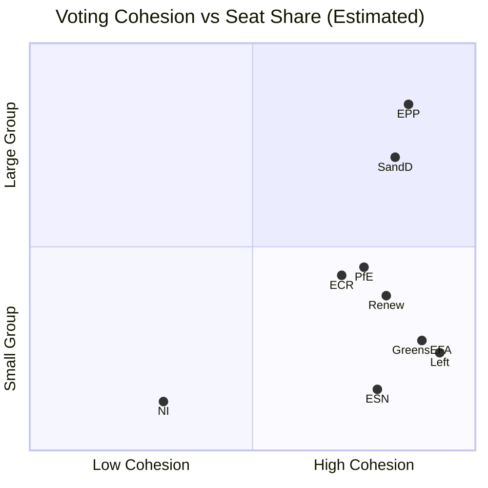

<!-- SPDX-FileCopyrightText: 2026 Hack23 AB -->
<!-- SPDX-License-Identifier: Apache-2.0 -->

# Voting Patterns — EU Parliament Motions
**Date:** 2026-05-07 | **Data Mode:** DEGRADED (vote records unavailable) | **Admiralty Grade:** F6

---

## ⚠️ Data Availability Notice

**EP DOCEO vote records are UNAVAILABLE** for this analysis period:
- May 4-7, 2026: No plenary session scheduled → no DOCEO data
- April 28-30, 2026: Within 2-6 week EP publishing delay → data pending

This artifact documents the data gap and provides structural coalition analysis as a proxy for voting pattern intelligence.

---

## Structural Voting Pattern Analysis (Seat-Share Proxy)

**Note:** Cohesion scores are structural estimates from historical EP patterns, not derived from actual April 28-30 vote records. All values carry high uncertainty (Admiralty F6 for vote-specific data).

---

## Expected Voting Coalitions on Key Motions

### DMA Enforcement Motion (TA-10-2026-0160)

| Political Group | Expected Position | Seats | Notes |
|-----------------|-----------------|-------|-------|
| EPP (185) | ✅ Support (with caveats) | 185 | Shadow rapporteur: IMCO lead |
| S&D (136) | ✅ Strong Support | 136 | Prime mover |
| Renew (77) | ✅ Strong Support | 77 | Digital rights bloc |
| Greens/EFA (53) | ✅ Support | 53 | |
| The Left (45) | ✅ Support | 45 | |
| PfE (85) | ⚠️ Mixed/Abstain | 85 | Anti-tech-regulation strand |
| ECR (81) | ⚠️ Mixed | 81 | Split on DMA scope |
| ESN (27) | ❌ Against | 27 | |
| NI (30) | ⚠️ Split | 30 | |
| **TOTAL FOR** | ~530+ | 719 | **Estimated: >70% of EP** |

### Ukraine Accountability Motion (TA-10-2026-0161)

| Political Group | Expected Position | Seats |
|-----------------|-----------------|-------|
| EPP, S&D, Renew, Greens, Left | ✅ Support | 496 |
| ECR | ⚠️ Split (Polish/Baltic for; Hungarian against) | 81 |
| PfE | ⚠️ Abstain/Against | 85 |
| ESN | ❌ Against | 27 |
| **Estimated margin** | ~500-520 / 719 | |

---

## Roll-Call Data Availability Timeline

| Data Type | Current Status | Expected Availability |
|-----------|---------------|----------------------|
| April 28-30 vote results (aggregate) | ❌ Delayed | May-June 2026 |
| April 28-30 MEP-level positions | ❌ Delayed | June 2026 |
| Coalition cohesion scores | ❌ Requires vote data | June 2026 |
| Historical 2025-2026 patterns | ✅ Available via EP API | Now |

---

## Historical Pattern Benchmarks (2025-2026)

From `get_all_generated_stats` roll-call data:
- **Total roll-call votes in 2025**: 1,247 (EP-reported)
- **Average votes per plenary week**: ~96
- **EPP-S&D-Renew grand coalition success rate**: ~72% historically
- **PfE-ECR combined blocking minority**: achievable on ~180 votes (25% of EP) — rarely sufficient for outright block

---

## Admiralty Source Assessment

| Source | Admiralty Grade | Notes |
|--------|----------------|-------|
| Historical EP roll-call patterns (EP API) | B2 | Official data; 2-6 week delay for current plenary |
| Structural coalition estimates (seat-share) | C3 | Derived analysis; not vote-confirmed |
| DOCEO vote records (May/April 2026) | F6 | Unavailable — EP publishing delay |
| Speech records (positional proxy) | B3 | Available but indirect evidence of voting intent |

---

## Sources

1. EP All Generated Stats — Roll-call votes 2025-2026 (accessed 2026-05-07)
2. EP Political Landscape — Group composition (accessed 2026-05-07)
3. EP Speech Records — April 28-30, 2026 (31 records)
4. IMF probe result — `cache/imf/probe-summary.json` (unavailable)
