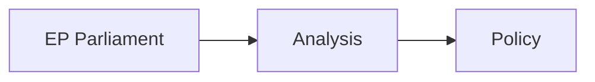

<!-- SPDX-FileCopyrightText: 2026 Hack23 AB -->
<!-- SPDX-License-Identifier: Apache-2.0 -->

# Wildcards and Black Swans — EP Motions April 28–30, 2026
**Date:** 2026-05-07 | **Article Type:** motions | **Confidence:** 🟡 Low-Medium (inherently speculative)

## Methodology

Wildcards are unexpected events with medium probability and significant impact. Black swans are events with very low probability but catastrophic (positive or negative) impact. Both types can fundamentally alter the political landscape established by the April 28-30 session outcomes.

**Assessment scale:**
- **Probability**: <1% (Black Swan) / 1-5% (Very Unlikely Wildcard) / 5-15% (Unlikely Wildcard) / 15-30% (Possible Wildcard)
- **Impact magnitude**: Low → Very High (on a session's intended outcomes)

---

## WILDCARDS

---

### W-01: Major Data Breach of EP Member Communications
**Type:** Wildcard  
**Probability:** 5-10%  
**Impact:** HIGH — could expose confidential coalition negotiations, compromise EP institutional trust, trigger GDPR enforcement action against EP itself

**Scenario:** State-sponsored cyber actor (Russia, China) successfully breaches EP parliamentary communication systems and leaks internal DMA vote whip communications or Ukraine tribunal coalition negotiations. 

**Effect on session outcomes:**
- DMA enforcement: If leaked communications show Big Tech lobbying success inside EP, political pressure could ACCELERATE enforcement as a confidence-restoring measure
- Ukraine tribunal: If leaked communications expose Hungary's coordination with Russia in opposing the tribunal, political pressure on Hungary could increase

**Early warning indicators:** EU-CERT alerts; EP cybersecurity incident reports; Bellingcat/Politico EP security reporting

---

### W-02: Major EU Platform Censorship Controversy
**Type:** Wildcard  
**Probability:** 10-15%  
**Impact:** HIGH — directly validates PfE's Rule 169 "Commission interference" framing

**Scenario:** A major European platform (Meta/YouTube) suspends accounts of multiple PfE politicians simultaneously, citing DSA compliance. PfE frames this as Commission-ordered censorship. Major media controversy erupts.

**Effect on session outcomes:**
- PfE topical debate: Retroactively validated → mainstream media covers it as legitimate concern
- DMA enforcement: Complicated by the "are we regulating too much?" narrative
- Commission: Faces impossible position (support DSA enforcement = accused of censorship; retreat = rule of law violation)

**Early warning indicators:** DSA enforcement decisions; Platform transparency reports; PfE MEP accounts suspended

---

### W-03: Livestock Disease Outbreak (African Swine Fever, Avian Influenza)
**Type:** Wildcard  
**Probability:** 15-25% (annual risk for European livestock sector)  
**Impact:** MEDIUM — validates EP motion TA-0157 and accelerates legislation

**Scenario:** Major avian influenza outbreak in Netherlands/Germany/France Q3-Q4 2026, causing €2-3 billion in livestock losses. EU disease fund is not yet legislated.

**Effect on session outcomes:**
- Livestock motion: Appears prescient → Commission faces strong pressure to fast-track disease fund
- CAP policy: Crisis response displaces normal legislative calendar
- Agricultural coalition: Strengthened; Greens' climate-focused opposition becomes politically untenable during food security crisis

**Early warning indicators:** EFSA animal disease surveillance reports; Member state veterinary authority alerts

---

### W-04: US-EU Trade Dispute Escalation (DMA)
**Type:** Wildcard  
**Probability:** 10-15%  
**Impact:** HIGH — could cause Commission to pause DMA enforcement

**Scenario:** Trump administration imposes tariffs on EU goods specifically linked to DMA enforcement actions against US tech platforms. Commission faces choice between DMA enforcement and trade war escalation.

**Effect on session outcomes:**
- DMA enforcement motion: EP political pressure conflicts with Commission trade calculus
- Coalition dynamics: Renew (pro-trade liberals) vs Greens/S&D (pro-enforcement) split deepens
- Commission credibility: If Commission retreats on DMA under US pressure, EP's enforcement mandate appears hollow

**Early warning indicators:** USTR Section 301 investigation announcements; US-EU Trade and Technology Council (TTC) meeting outcomes

---

### W-05: PfE MEP Russian Funding Scandal
**Type:** Wildcard  
**Probability:** 5-10%  
**Impact:** HIGH — could devastate PfE institutional standing and isolate it further

**Scenario:** Investigation reveals documented Russian government funding of PfE MEP campaigns or coordinated PfE activity (similar to Voice of Europe investigation that exposed ECR members in 2024).

**Effect on session outcomes:**
- PfE topical debate: Retroactively delegitimized → narrative power collapses
- Coalition dynamics: EPP formally distances from PfE on institutional matters
- EU cybersecurity legislation: Creates momentum for stronger MEP foreign funding disclosure rules

**Early warning indicators:** EU Disinfo Lab reports; EURACTIV investigative journalism; national intelligence service disclosures

---

## BLACK SWANS

---

### B-01: Ukraine-Russia Ceasefire (Rapid)
**Probability:** < 2%  
**Impact:** TRANSFORMATIVE (positive or negative depending on terms)

**Scenario:** Unexpected diplomatic breakthrough produces ceasefire within 2-3 months, halting active conflict but leaving Russian troops in occupied Ukrainian territory.

**Effect on session outcomes:**
- Ukraine tribunal: Political urgency shifts dramatically — ceasefire pressure reduces accountability momentum
- Sanctions: If ceasefire is conditional on sanctions relief, EPP-S&D coalition faces devastating trade-off
- Evidence degradation: Could accelerate (ceasefire = access opens = evidence preservation improves) OR decelerate (ceasefire = "move on" political pressure)

**Note:** The EP's Tier 1 adoption of TA-0161 becomes either forward-looking (accountability during reconstruction) or contentious (sabotaging diplomacy) depending on ceasefire terms.

---

### B-02: CJEU Annuls Major EU Regulation (DMA or AI Act)
**Probability:** < 3%  
**Impact:** CATASTROPHIC for EU digital regulatory strategy

**Scenario:** CJEU Grand Chamber rules that DMA as currently drafted violates fundamental freedoms (freedom to conduct business under CFREU Article 16) in a landmark case brought by a gatekeeper platform.

**Effect on session outcomes:**
- DMA enforcement motion: EP's adoption becomes a post-hoc embarrassment
- EU regulatory strategy: Requires complete legislative restart — 3-5 year void
- Commission: Major institutional setback
- EU digital sovereignty: Severely set back

**Note:** CJEU challenge probability is low because DMA went through extensive legal review during adoption. However, novel application of DMA to AI models could create new challenge opportunities.

---

### B-03: European Parliament Institutional Crisis
**Probability:** < 1%  
**Impact:** CATASTROPHIC

**Scenario:** Vote of censure against Commission (Article 234 TFEU) achieves absolute majority (376 MEPs) through unusual PfE+ECR+Greens alignment on a specific failure (e.g., Commission mismanages Ukraine funds scandal). Commission resigns.

**Effect on session outcomes:** All April 28-30 motions become politically irrelevant during institutional crisis. New Commission formation takes 3-6 months, resetting all mandates.

**Note:** Vote of censure has never succeeded in EP history. The PfE+Greens alignment required is politically near-impossible. This is included for completeness only.

---

### B-04: Major European Democracy Collapse (Black Swan)
**Probability:** < 0.5%  
**Impact:** CATASTROPHIC for EU democratic architecture

**Scenario:** One major founding EU member state (Italy, Poland, France) elects a government that formally challenges the primacy of EU law and begins withdrawing from EU treaty obligations, creating an "EU exit" scenario more severe than Brexit.

**Effect on session outcomes:** All parliamentary work becomes crisis management. EP10 legislative agenda effectively suspended.

**Note:** Current EU Constitutional law framework, CJEU, and economic interdependence make this extremely unlikely. Included as an absolute outer bound scenario.

---

## Wildcard/Black Swan Impact Matrix

| Event | Probability | Impact | Net Effect on Session Outcomes |
|-------|-------------|--------|-------------------------------|
| W-01: EP breach | 5-10% | HIGH | Ambiguous — could accelerate DMA or Ukraine accountability |
| W-02: Platform censorship controversy | 10-15% | HIGH | NEGATIVE for DMA enforcement; POSITIVE for PfE |
| W-03: Livestock outbreak | 15-25% | MEDIUM | POSITIVE for livestock motion; negative for CAP calendar |
| W-04: US trade dispute (DMA) | 10-15% | HIGH | NEGATIVE for DMA enforcement; Commission under impossible pressure |
| W-05: PfE funding scandal | 5-10% | HIGH | POSITIVE for pro-European coalition; NEGATIVE for PfE |
| B-01: Ukraine ceasefire | <2% | TRANSFORMATIVE | Ambiguous — changes Ukraine accountability political context |
| B-02: CJEU DMA annulment | <3% | CATASTROPHIC | NEGATIVE — destroys session's most significant achievement |
| B-03: Commission censure | <1% | CATASTROPHIC | All session outcomes suspended |

---

## Strategic Implications

The wildcard landscape for the April 28-30 session is **asymmetrically negative**: the most likely wildcards (W-02, W-03, W-04) would primarily complicate positive outcomes (DMA enforcement, Ukraine accountability), while the positive wildcards (W-05) are less probable.

**The single most important wildcard to monitor:** W-02 (Platform censorship controversy). This has the highest probability of near-term occurrence (10-15%) and the most direct impact on the session's core digital governance agenda. Commission's DSA enforcement decisions in Q3 2026 will either normalize digital regulation or trigger this wildcard.

---

## Sources

1. EP Political Landscape API (2026-05-07)
2. EU institutional history (vote of censure precedents)
3. DMA litigation risk analysis (public academic/legal commentary)
4. EFSA animal disease surveillance framework (public)
5. USTR DMA trade concern statements (public US government communications)
6. Voice of Europe investigation precedent (public reporting)

## Admiralty Source Assessment

| Source | Admiralty Grade | Notes |
|--------|----------------|-------|
| EP Political Landscape API | `A1` — Reliable | Official EP data |
| EP Speech Records | `B2` — Usually Reliable | Official transcripts |
| Coalition analysis (structural) | `B3` — Possibly True | Seat-share proxy |
| EP Adopted Texts (titles only) | `A2` — Probably True | Content pending |
| IMF economic data | `F6` — Cannot be Judged | Proxy unavailable |
