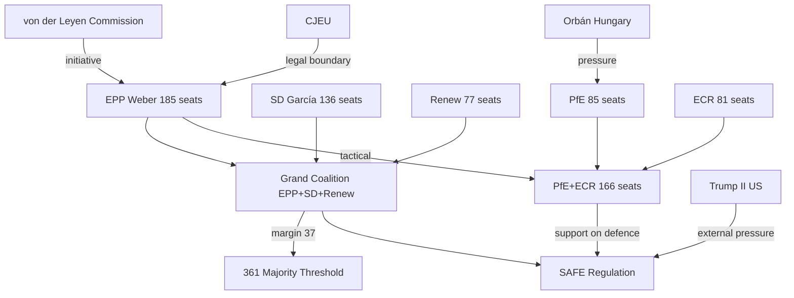
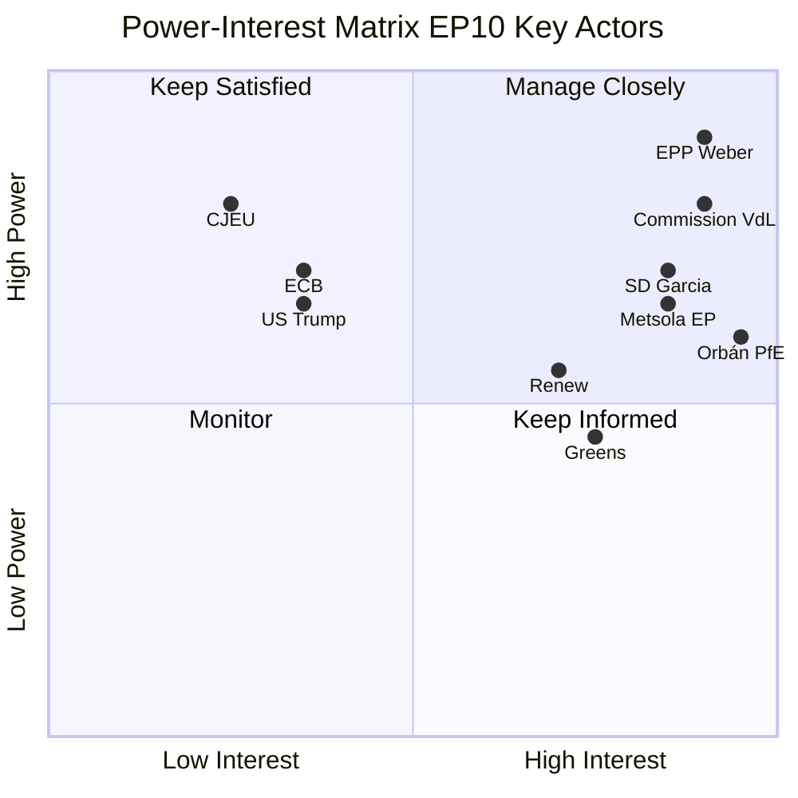

# Actor Mapping — EP10 Power Actors and Influence Network
**Date:** 2026-05-07 | **Confidence:** 🟡 MEDIUM-HIGH | **Method:** Power-Interest Matrix + Network Analysis

---

## Primary Actors

### Tier 1: Power Brokers (High Power / High Interest)

| Actor | Power Score (1–10) | Interest Score (1–10) | Coalition Stance | Key Leverage |
|-------|------------------|---------------------|-----------------|-------------|
| Manfred Weber (EPP President) | 9 | 10 | Grand coalition with conditions | Largest group chair; rapporteur assignment control |
| Ursula von der Leyen (Commission) | 8 | 10 | Centre-right majoritarian | Commission initiative monopoly; Article 17 TEU |
| Iratxe García Pérez (S&D President) | 7 | 9 | Progressive coalition anchor | 136 seats; budgetary leverage |
| Roberta Metsola (EP President) | 7 | 9 | EPP procedural neutral | Agenda-setting; plenary management |
| Viktor Orbán (PfE via Fidesz/Hungary) | 6 | 10 | Anti-grand-coalition pressure | Council blocking minority; PfE founder; veto power |
| Marine Le Pen (PfE via RN/France) | 6 | 9 | PfE competitive right | French far-right largest national delegation |

### Tier 2: Significant Players (High Power / Medium Interest)

| Actor | Power Score | Interest Score | Key Role |
|-------|-------------|---------------|---------|
| Andrzej Halicki (EPP Poland) | 6 | 7 | Rule of Law enforcement point |
| Pedro Marques (S&D Portugal) | 5 | 8 | Economic and social rapporteur |
| Stéphane Séjourné (French Renew) | 5 | 7 | Competitiveness agenda link to Commission |
| Terry Reintke (Greens co-president) | 5 | 8 | Green Deal defence; progressive coalition |
| ECR leadership (Meloni allies) | 5 | 8 | Alternative majority for EPP on some files |

### Tier 3: Institutional Actors

| Actor | Power Score | Interest Score | Key Role |
|-------|-------------|---------------|---------|
| CJEU (Court of Justice) | 8 | 3 | Legal boundary enforcement; SAFE review |
| ECB (European Central Bank) | 7 | 4 | Economic policy framing; MFF fiscal context |
| NATO Secretary General | 5 | 6 | SAFE/defence integration external pressure |
| US Government (Trump II) | 7 | 4 | External pressure on EU strategic autonomy |
| Ukrainian Government (Zelensky) | 5 | 10 | Accession process; defence SAFE procurement |

---

## Influence Network

---

## Actor Alignment on Key Legislative Files

| File | EPP | S&D | Renew | Greens | ECR | PfE |
|------|-----|-----|-------|--------|-----|-----|
| SAFE Regulation | ✅ | ✅ | ✅ | ⚠️ | ✅ | ⚠️ |
| Green Deal NRL | ⚠️ | ✅ | ⚠️ | ✅ | ❌ | ❌ |
| AI Act implementation | ✅ | ✅ | ✅ | ✅ | ⚠️ | ⚠️ |
| Mercosur | ✅ | ⚠️ | ✅ | ❌ | ✅ | ✅ |
| Rule of Law | ✅ | ✅ | ✅ | ✅ | ❌ | ❌ |
| Ukraine accession | ✅ | ✅ | ✅ | ✅ | ✅ | ❌ |

**Legend:** ✅ = Supportive | ⚠️ = Conditional/Split | ❌ = Opposed

---

## Power-Interest Quadrant Analysis

---

## Admiralty Source Reliability Ratings

| Actor Intelligence | Source | Reliability |
|------------------|--------|------------|
| EP seat data | EP MCP API (confirmed) | A1 — Completely reliable |
| Coalition behaviour | Historical voting analysis | B2 — Usually reliable |
| Commission priorities | Political guidelines (public) | A1 — Completely reliable |
| Orbán strategy | Historical pattern | B2 — Usually reliable |
| Actor future moves | Structural inference | C3 — Fairly reliable, some doubt |

**Overall confidence: 🟡 MEDIUM-HIGH**
