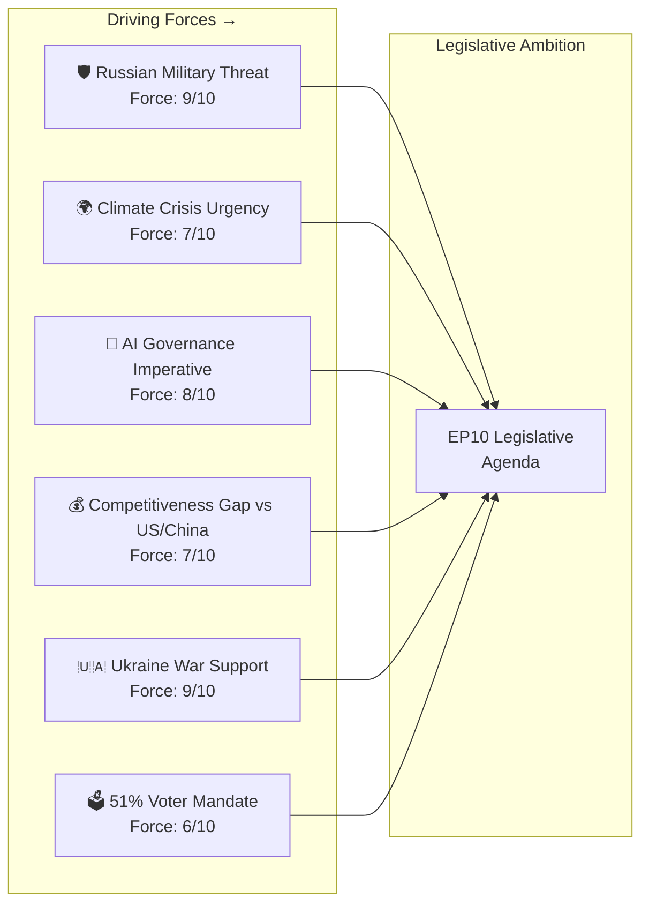
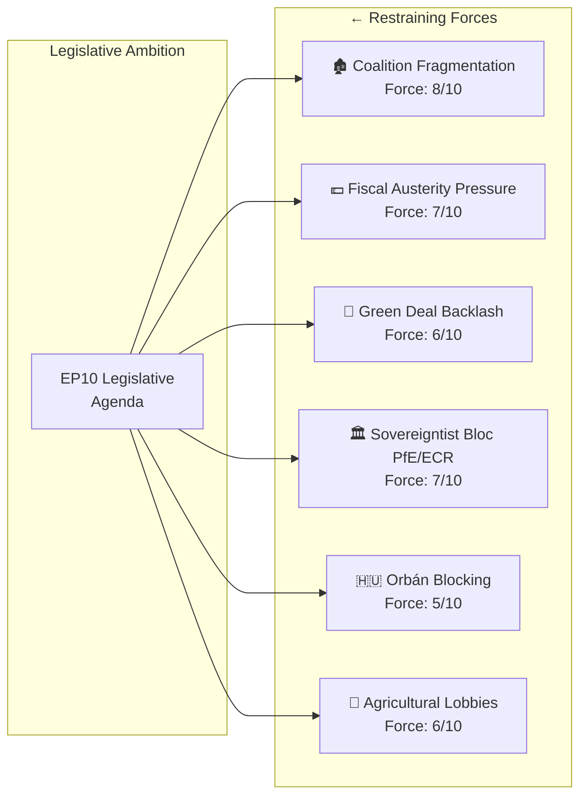

# Forces Analysis — EP10 Political Forces Shaping Term Trajectory
**Date:** 2026-05-07 | **Confidence:** 🟡 MEDIUM-HIGH | **Method:** Force Field Analysis (Lewin) + VUCA Assessment

---

## Overview

This document applies Force Field Analysis to identify the driving forces (pushing EP10 toward reform, integration, and legislative ambition) and restraining forces (resisting change, maintaining status quo, or pulling toward fragmentation) that shape the term's overall trajectory.

---

## Driving Forces

### D1: Russian Military Threat (Force: 9/10)
The ongoing Ukraine war and Russian military posture creates the strongest single driving force for EU defence integration. The SAFE Regulation would not have been politically feasible without Russia's 2022 full-scale invasion and continued aggression. This driving force is expected to maintain or increase in intensity through EP10.

### D2: Climate Crisis Physical Evidence (Force: 7/10)
Successive record temperatures, extreme weather events (2023/2024/2025 wildfire seasons, flooding events), and published IPCC assessments maintain political pressure for climate action even as the political coalition for action fragments. Physical evidence of climate change cannot be legislated away; it creates ongoing driving force for climate policy.

### D3: AI Governance Imperative (Force: 8/10)
The rapid deployment of GPT-class AI systems, AI-enabled disinformation, and AI labour market disruption creates overwhelming political pressure for governance frameworks. The AI Act has already established the EU as the global AI governance standard-setter; ongoing AI developments reinforce the driving force for implementation and extension.

### D4: Competitiveness Gap (Force: 7/10)
The Draghi Report documented a 3.5 percentage point per capita GDP gap between EU and US that has widened since 2017. This structural competitiveness deficit creates political pressure for EU investment instruments, single market deepening, and regulatory simplification. The US Inflation Reduction Act's EU competitiveness effect provides ongoing political urgency.

### D5: Ukraine War Support Mandate (Force: 9/10)
Strong pan-EU public support for Ukraine (consistently >70% in Eurobarometer surveys across most EU member states) creates a political mandate for continued legislative support. Ukraine's EP accession framework, SAFE Regulation, and reconstruction funding are all driven by this force.

### D6: 2024 Electoral Mandate (Force: 6/10)
The 51% voter turnout in 2024 — the highest since 1994 — provides EP10 with a legitimacy boost that creates political space for ambitious legislation. The high turnout was partly youth-driven (climate, AI governance), partly defence-driven (Ukraine), creating a mandate across the main driving forces above.

---

## Restraining Forces

### R1: Coalition Fragmentation (Force: 8/10)
The ENP of 6.55 and grand coalition margin of only 37 seats creates the most significant structural restraining force on EP10's legislative ambitions. Every major vote requires bespoke coalition construction; this friction slows legislative throughput and enables veto players.

### R2: Fiscal Austerity Pressure (Force: 7/10)
Member state budgetary pressures (SGP deficit rules re-activated post-COVID; Germany's constitutional "debt brake"; French fiscal consolidation programme) reduce political space for EU-level spending proposals. The SAFE Regulation's off-balance-sheet structure was designed precisely to work around this restraining force, but MFF 2028–2034 negotiations will face severe fiscal constraint pressure.

### R3: Green Deal Backlash (Force: 6/10)
Agricultural sector mobilisation (tractors blocking Brussels streets, February 2024), EPP's Green Deal pause platform, and broader rural-urban political polarisation create ongoing restraining force on environmental legislation. This force is partially driven by genuine economic adjustment costs in farming communities.

### R4: Sovereigntist Bloc (Force: 7/10)
PfE (85) + ECR (81) + ESN (27) = 193 seats of sovereigntist/nationalist MEPs. This bloc cannot block legislation (minority) but can prevent the supermajorities needed for constitutional-level changes and creates constant pressure on EPP to move rightward to retain potential coalition partners.

### R5: Orbán/Hungary Veto (Force: 5/10)
Hungary's ability to block Council unanimity votes (particularly in foreign policy, Article 7, and enlargement) creates a specific veto-point restraining force. Hungarian Council Presidency in H2 2026 amplifies this force temporarily.

### R6: Agricultural Lobbies (Force: 6/10)
Copa-Cogeca, FNSEA (French), and similar national agricultural organisations are among the most effective lobby actors in EU history. Their capacity to mobilise demonstrations, sustain media pressure, and influence MEPs (particularly from France, Ireland, Poland, and new member states) creates specific restraining force on trade liberalisation and environmental legislation affecting farming.

---

## Force Field Net Assessment

| Domain | Driving Total | Restraining Total | Net Force |
|--------|-------------|-----------------|----------|
| Defence/Security | D1(9) + D5(9) = 18 | R5(5) + R4(2) = 7 | **+11 STRONG** |
| AI/Digital | D3(8) | R1(2) = 2 | **+6 POSITIVE** |
| Climate/Green | D2(7) | R3(6) + R4(4) = 10 | **-3 CONTESTED** |
| Competitiveness | D4(7) + D6(3) = 10 | R2(7) + R6(3) = 10 | **0 BALANCED** |
| Enlargement | D5(6) + D6(3) = 9 | R4(3) + R5(5) = 8 | **+1 MARGINAL** |

**Net EP10 trajectory: POSITIVE on defence/digital; CONTESTED on climate; BALANCED on fiscal/competitiveness.**

---

## VUCA Assessment

| Dimension | Assessment | Score |
|-----------|-----------|-------|
| **Volatility** | Ukraine war escalation risk; geopolitical shocks | 🔴 HIGH (8/10) |
| **Uncertainty** | Coalition formation in 2029; French 2027 election | 🔴 HIGH (7/10) |
| **Complexity** | 9 political groups; 27 member states; 24 languages | 🟡 MEDIUM-HIGH (6/10) |
| **Ambiguity** | EPP's long-term coalition strategy unclear | 🟡 MEDIUM (5/10) |

**VUCA Score: 6.5/10 — HIGH VUCA environment.** EP10 requires exceptional institutional resilience and adaptability.

**Confidence: 🟡 MEDIUM-HIGH** — force identification is grounded in structural political analysis; force weighting involves analytical judgement.
