# Impact Matrix — EP10 Legislative Decisions and Downstream Consequences
**Date:** 2026-05-07 | **Confidence:** 🟡 MEDIUM-HIGH | **Method:** Impact Chain Analysis

---

## Overview

This impact matrix maps EP10's most significant legislative decisions to their downstream consequences across social, economic, geopolitical, and institutional dimensions. It provides the analytical chain from legislative action to real-world impact.

---

## Impact Matrix

```mermaid
graph TD
    A[SAFE Regulation Adoption] --> B1[EU Joint Defence Procurement]
    A --> B2[EU Strategic Autonomy Signal]
    B1 --> C1[Defence Industry Scale Economies]
    B1 --> C2[Reduced NATO Dependency]
    B2 --> C3[Geopolitical Actor Status]
    B2 --> C4[US-EU Relationship Recalibration]

    E[AI Act Implementation] --> F1[High-Risk AI Governance]
    E --> F2[GPAI Model Obligations]
    F1 --> G1[EU AI Trust Premium]
    F1 --> G2[Innovation-Safety Trade-off]
    F2 --> G3[US BigTech Compliance Cost]
    F2 --> G4[Brussels Effect Global Standard]

    H[Green Deal Partial Rollback] --> I1[ETS/CBAM Maintained]
    H --> I2[NRL/Biodiversity Delayed]
    I1 --> J1[Carbon Price Signal Preserved]
    I2 --> J2[2030 Biodiversity Target Missed]
    I2 --> J3[Rural Political Appeasement]

    K[Ukraine Accession Framework] --> L1[2030 Accession Target Set]
    K --> L2[EP10 Constitutional Reform Mandate]
    L1 --> M1[EU Enlarges to 28 Members]
    L1 --> M2[Defence Integration Accelerated]
    L2 --> M3[Treaty Convention Process EP11]
```

---

## Impact Chains by Policy Domain

### Chain 1: SAFE Regulation (Defence)

**Trigger:** SAFE adopted H1 2027 (base case)

| Stage | Action | Impact | Timeframe |
|-------|--------|--------|----------|
| L1 | SAFE adopted | EU joint procurement authority established | 2027 |
| E1 | €150B procurement programme launched | EU defence industrial base consolidated | 2027–2030 |
| E2 | EU-only procurement rules | US defence contractors excluded from SAFE funds | 2028 |
| E3 | Common equipment standards | NATO interoperability improvements | 2029+ |
| E4 | EU strategic autonomy demonstrated | US strategic decoupling risk reduced | 2030+ |

**Social impact:** EU defence jobs concentrated in France, Germany, Spain, Italy, Sweden — high-skill manufacturing employment boost. Poland, Baltic states feel more secure — public confidence in EU increases.

**Economic impact:** €150B over 4 years represents ~0.3% EU GDP additional defence investment. Multiplier effect: EU defence industry value-added estimated at €100–180B over term.

**Geopolitical impact:** SAFE's adoption signals EU as a genuine defence actor to Russia, China, and the US. Potential for EU to be recognised as a third NATO pillar alongside US and European-national contributions.

### Chain 2: AI Act Implementation

**Trigger:** AI Act high-risk provisions apply from August 2026; GPAI model obligations from August 2025 (already active)

| Stage | Action | Impact | Timeframe |
|-------|--------|--------|----------|
| L1 | High-risk AI systems require conformity assessment | EU market access conditional on safety | 2026 |
| E1 | EU AI Office enforces GPAI obligations | OpenAI, Anthropic, Google face EU compliance costs | 2025–2027 |
| E2 | Non-EU jurisdictions adopt similar standards | Brussels Effect: Global AI governance convergence | 2027–2030 |
| E3 | EU AI innovators benefit from trust premium | B2B AI procurement preference for EU-certified systems | 2028+ |
| E4 | Biometric surveillance restrictions enforced | Civil liberties protection in EU vs. China divergence | 2026+ |

**Innovation risk:** If AI Act compliance costs are excessive, EU AI startups may relocate to less-regulated jurisdictions. Risk mitigation: Regulatory sandboxes for startups (provided in AI Act) and SME exemptions.

### Chain 3: Green Deal Partial Rollback

**Trigger:** EPP succeeds in delaying/softening Nature Restoration Law (2026), Farm-to-Fork review (2027)

| Stage | Action | Impact | Timeframe |
|-------|--------|--------|----------|
| L1 | NRL implementation delayed | Biodiversity targets missed; 2030 goals unachievable | 2026 |
| E1 | Farm-to-Fork pesticide targets softened | Short-term agricultural sector economic relief | 2027 |
| E2 | 2030 biodiversity targets missed | IPCC downgrade of EU's climate credibility | 2031 |
| E3 | Physical climate impacts continue | More extreme weather, agricultural disruption | 2030+ |
| E4 | Green political backlash | Greens campaign on "betrayal"; Greens recovery in EP11 | 2029 |

**Economic impact:** Short-term: agricultural sector benefits from reduced compliance costs (estimated €5–8B/year saved). Long-term: accelerating physical climate damages estimated at €170–240B/year for EU by 2050 (OECD 2023 estimate) — the rollback imposes long-term economic costs far exceeding short-term regulatory savings.

---

## Cross-Impact Matrix: EP10 Decisions

| Decision | SAFE | AI Act | Green Deal | Ukraine | MFF 2028 |
|---------|------|--------|-----------|---------|---------|
| **SAFE** | — | Neutral | Diverts attention | Enables | Requires fiscal space |
| **AI Act** | Neutral | — | Supports digital economy | Neutral | Modest cost |
| **Green Deal rollback** | Neutral | Neutral | — | Reduces credibility | Fiscal savings |
| **Ukraine accession** | Accelerates | Neutral | Extends to Ukraine | — | Major budget impact |
| **MFF 2028** | Required | Supports | Contested | Finances | — |

**Key interaction:** Ukraine accession drives the MFF 2028–2034 debate. An EP that adopts an ambitious Ukraine accession framework (with 2030 target) will face a substantially larger MFF budget demand — creating a fiscal-political chain reaction that dominates EP10's second half.

---

## Confidence Assessment

**Confidence: 🟡 MEDIUM-HIGH** for impact chain identification; **🟡 MEDIUM** for quantified impacts.

Economic impact estimates are derived from published Commission impact assessments, OECD reports, and academic analyses — all public domain. Long-term estimates carry high uncertainty.

**Admiralty rating:** B2 — Usually reliable, with reservations on long-term projections.
