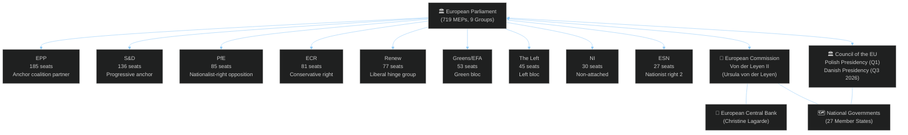

<!-- SPDX-FileCopyrightText: 2024-2026 Hack23 AB -->
<!-- SPDX-License-Identifier: Apache-2.0 -->

# 🗺️ Actor Mapping — EU Parliament Year Ahead 2026–2027

**Date:** 2026-05-07 | **Methodology:** OSINT Actor Mapping + Political Network Analysis

---

## 1 · Primary Institutional Actors

---

## 2 · Political Group Actor Profiles

### EPP — European People's Party (185 seats, 25.7%)
**Role in 2026–2027:** Agenda-setting majority anchor. Controls committee chair positions. EPP President Roberta Metsola (EP President).
- **Priorities:** Defence industrial policy, economic competitiveness, digital single market, strategic autonomy
- **Leverage:** Largest group; can swing left (EPP+S&D+Renew = 398, majority) or right (EPP+PfE+ECR = 351, below majority but blocking)
- **Vulnerabilities:** Internal tensions between Northern fiscal hawks and Southern/Eastern security hawks; Green Deal rollback pressures from business wing
- **Key votes anticipated:** Defence procurement (pro), MFF 2028 negotiating mandate (assertive), AI Act enforcement (pro)

### S&D — Socialists and Democrats (136 seats, 18.9%)
**Role in 2026–2027:** Progressive coalition anchor; essential for any centre-majority.
- **Priorities:** Social Europe (just transition directive, workers' rights), Ukraine solidarity, democratic governance
- **Leverage:** No majority without S&D; key swing on budget vs. austerity
- **Vulnerabilities:** National parties diverge on migration (Southern vs. Northern states); leadership succession after 2024 EP elections bedding-in
- **Key votes anticipated:** Just Transition Directive follow-up (strongly pro), ETS2 (pro), Budget 2027 (expansionist position)

### PfE — Patriots for Europe (85 seats, 11.8%)
**Role in 2026–2027:** Largest opposition formation with blocking minority aspirations on climate/migration.
- **Priorities:** Anti-climate regulation, migration restriction, national sovereignty, opposing Ukraine blank-cheque support
- **Leverage:** Can create blocking minorities on procedural votes with ECR; tests EPP rightward drift
- **Vulnerabilities:** Diverse national interests (Orbán-aligned vs. Le Pen-aligned); internal cohesion untested on substantive legislation
- **Key votes anticipated:** ETS2 MSR (against), DMA enforcement (sceptical), Ukraine Support Loan (against on ideological grounds)

### ECR — European Conservatives and Reformists (81 seats, 11.3%)
**Role in 2026–2027:** Pivotal swing group; more tractable than PfE for EPP deal-making on defence.
- **Priorities:** EU reform, national sovereignty, law-and-order, anti-federalism but pro-Ukraine (many CEE members)
- **Leverage:** ECR contains Polish PiS MEPs who are strongly pro-Ukraine — splits ECR from PfE on Ukraine votes
- **Vulnerabilities:** Post-PiS election loss in Poland; Italian Meloni-aligned ECR wing vs. Polish wing
- **Key votes anticipated:** Ukraine support (divided but generally pro), Defence (pro), Climate (against)

### Renew Europe (77 seats, 10.7%)
**Role in 2026–2027:** Hinge group; kingmaker in many EPP+S&D coalitions.
- **Priorities:** Digital single market, competitiveness, pro-Ukraine, EU federalism, rule of law
- **Leverage:** Without Renew, EPP+S&D alone = 321 (40 short of majority); Renew makes EPP+S&D+Renew = 398
- **Vulnerabilities:** Post-Macron fragility; French delegation weakened by domestic politics; diverse eastern liberal members
- **Key votes anticipated:** DMA enforcement (strongly pro), AI Act (pro), MFF 2028 (federalist position)

### Greens/EFA — Greens/European Free Alliance (53 seats, 7.4%)
**Role in 2026–2027:** Critical for supermajority on environmental legislation; lost leverage vs. EP9 when they had 71 seats.
- **Priorities:** Climate policy, biodiversity, digital rights, peace/Ukraine solidarity, independence movements
- **Leverage:** Necessary for 2/3 majority on constitutional matters; provides moral authority on climate
- **Vulnerabilities:** -18 seats vs. EP9; squeezed between centre-left (S&D) and Left; national Green parties in decline
- **Key votes anticipated:** ETS2 (strongly pro), Chemical simplification (against REACH weakening), AI Act oversight (pro)

### The Left (45 seats, 6.3%)
**Role in 2026–2027:** Left opposition; votes with progressives on social issues; anti-NATO on defence.
- **Priorities:** Worker rights, social policy, anti-militarism, digital rights, Ukraine (divided), anti-austerity
- **Leverage:** 45 seats needed for progressive supermajorities
- **Vulnerabilities:** Internal split on Ukraine (pro-EU sovereignty vs. anti-military left); fragmented national delegations
- **Key votes anticipated:** Just Transition (pro), Defence procurement (against), DMA (pro), Ukraine facility (split)

---

## 3 · External Actors with EP Influence

| Actor | Type | Influence Channel | Significance 2026–2027 |
|---|---|---|---|
| **European Commission (Von der Leyen II)** | Institutional | Legislative initiative; Commission proposals to EP | HIGH — MFF 2028 design, defence proposals, AI Act delegated acts |
| **Council Presidency (Poland→Denmark 2026)** | Institutional | Trilogue positions; Council mandate | HIGH — Budget 2027 trilogue, digital/defence legislation |
| **European Central Bank (Lagarde)** | Economic | Monetary policy signalling to EP Budget Committee | MEDIUM — interest rate trajectory affects EU borrowing costs |
| **NATO / European Defence Agency** | Security | AFET/SEDE committee interactions | HIGH — ReArm Europe legislative design |
| **US Government (Trump administration)** | Geopolitical | Transatlantic trade, tariffs, Ukraine policy | CRITICAL — tariff threats triggering EP trade committee activity |
| **Russian Federation** | Geopolitical | Ukraine war; energy markets; information ops | CRITICAL — Ukraine support framework decisions |
| **Big Tech (Meta, Apple, Google, Amazon)** | Commercial/Regulatory | DMA compliance; lobbying IMCO committee | HIGH — DMA enforcement decisions |
| **Civil Society (EEB, ETUC, BusinessEurope)** | Advocacy | Committee hearings; MEP networks | MEDIUM — influence on specific files |

---

## 4 · Actor Influence Network — Coalition Configurations

**Configuration 1: Grand Centre Coalition (most common 2026–2027)**
EPP (185) + S&D (136) + Renew (77) = **398 votes** (majority = 361)
- Viable for: Budget 2027, DMA enforcement, rule of law
- Fragile point: Renew may defect on migration; S&D on fiscal austerity

**Configuration 2: Centre-Right Supermajority (defence/trade)**
EPP (185) + S&D (136) + ECR (81) = **402 votes**
- Viable for: Defence procurement, Ukraine support, trade deals
- Fragile point: S&D uncomfortable with ECR on social rights provisions

**Configuration 3: Right Majority (climate rollback risk)**
EPP (185) + PfE (85) + ECR (81) + ESN (27) = **378 votes**
- Viable for: ETS2 amendments, migration legislation, REACH weakening
- Fragile point: EPP European values commitment vs. PfE/ESN Orbán-alignment

**Configuration 4: Progressive Alliance (rare but possible)**
S&D (136) + Renew (77) + Greens (53) + Left (45) = **311 votes** (short of majority — needs EPP fragments)
- Not viable alone; signals EP position on progressive agenda

---

*Methodology: EP Open Data API — live MEP counts, group composition (2026-05-07). Actor analysis uses OSINT political mapping + structural EP data. Confidence: 🟢 High on group composition, 🟡 Medium on coalition behaviour prediction.*
