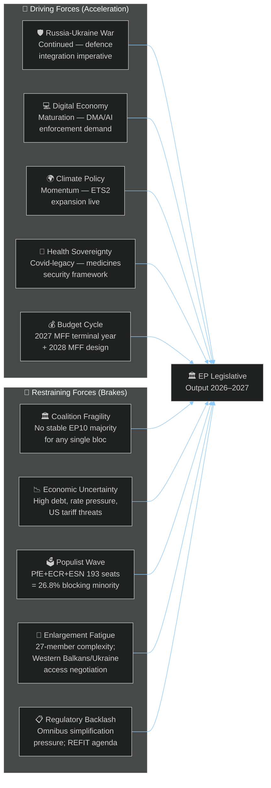
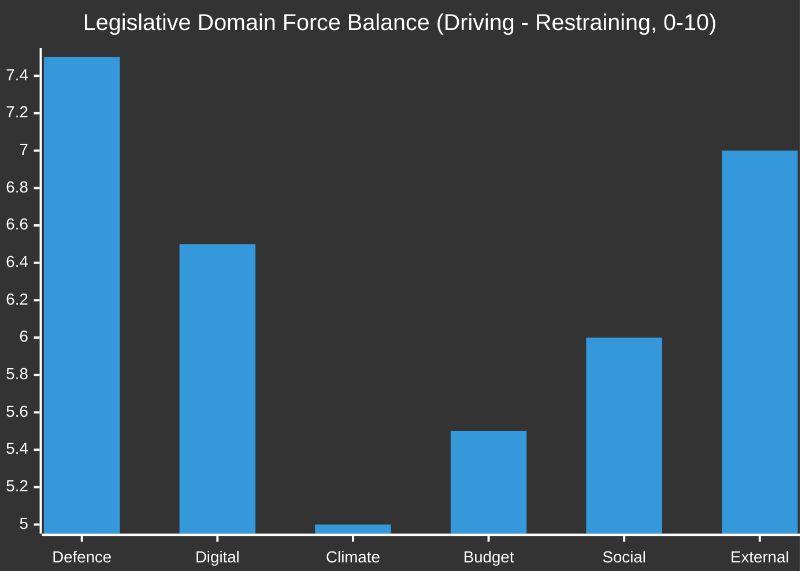

<!-- SPDX-FileCopyrightText: 2024-2026 Hack23 AB -->
<!-- SPDX-License-Identifier: Apache-2.0 -->

# 🔍 Forces Analysis — EU Parliament Year Ahead 2026–2027

**Date:** 2026-05-07 | **Methodology:** Political Forces Analysis (PESTLE + institutional dynamics)

---

## 1 · Driving Forces (Accelerators)

---

## 2 · Force Field Analysis by Policy Domain

### Domain A: Defence & Security

| Driving Forces | Restraining Forces |
|---|---|
| Russia's ongoing war against Ukraine | PfE/ESN opposition to EU defence federalisation |
| NATO's 5% GDP target pressure | Constitutional limits on EU competence in defence |
| European Defence Industrial Strategy (EDIS) Commission proposal | Member state divergence on industrial offsets |
| US disengagement risk (Trump NATO posture) | Cost pressures on EU governments (fiscal rules) |
| Baltic states + Poland urgency | Hungary veto threat in Council (requiring QMV workarounds) |

**Net force vector:** 🟢 STRONG DRIVING — Defence integration will advance in 2026–2027, but through fragmented tools (enhanced cooperation, EDIP, EDF) rather than a single Treaty reform.

### Domain B: Digital Regulation

| Driving Forces | Restraining Forces |
|---|---|
| DMA/DSA/AI Act enforcement gaps becoming visible | Big tech lobbying against Commission enforcement scope |
| EP IMCO committee assertive oversight (DMA resolution Apr 30) | Renew's industry-friendly wing seeking lighter enforcement |
| AI Act August 2026 Article 5 deadline (prohibited systems) | Member state divergence on AI Act delegated acts |
| Data Act and CRA implementation | Skills and enforcement capacity gaps at national level |
| Public trust concerns over AI in democratic processes | Innovation economy arguments vs. precautionary regulation |

**Net force vector:** 🟡 MODERATE DRIVING — EP will push for stronger enforcement; industry backlash moderates pace but cannot reverse the legislative architecture.

### Domain C: Climate & Green Deal

| Driving Forces | Restraining Forces |
|---|---|
| ETS2 MSR (buildings/transport) adopted — implementation mandate | PfE+ECR+ESN right-wing majority seeks rollback mechanisms |
| Climate litigation pressure (national/European courts) | Competitiveness narrative (ETS carbon leakage vs. industry) |
| Green financing momentum (EU taxonomy, green bonds) | Omnibus simplification bundling climate into REFIT |
| Youth climate movement continuing political pressure | Farmer protests demanding CAP derogations |
| 2030 climate targets legally binding | Energy price sensitivity in high-debt member states |

**Net force vector:** 🟡 CONTESTED — Green Deal architecture holds legally but faces implementation friction; ETS2 contested but adopted.

### Domain D: Budget & Finance

| Driving Forces | Restraining Forces |
|---|---|
| 2027 MFF final year — EP leverage at maximum before reset | Council fiscal hawks (Germany, Netherlands, Austria) |
| EP Budget Estimates 2027 adopted April 30 | NextGenEU repayment obligations compressing new spending |
| Commission 2028 MFF design consultation (H2 2026) | Post-COVID debt dynamics limiting ambition |
| EP demand for own resources (digital levy, FTT) | Member state resistance to new EU fiscal instruments |
| Ukraine reconstruction financing needs (€300–500bn) | US tariffs reducing EU export revenues → fiscal pressure |

**Net force vector:** 🟡 CONTESTED — EP expansionist vs. Council austerity; 2027 will be contested; 2028 MFF negotiations extend battle.

---

## 3 · Structural Forces (Long-Arc Dynamics, 3–5 Year Horizon)

| Force | Direction | EP Impact |
|---|---|---|
| **EP10 composition shift rightward vs. EP9** | Right-wing bloc larger; Green seat loss — structural | Moderate legislative speed; more filtering on climate/migration |
| **EU enlargement pipeline (Ukraine, Western Balkans)** | Enlargement negotiations active — structural | EP role in ratification/accession oversight; constitutional reforms needed |
| **Demographic shift in MEP composition** | Younger, more female, more digital-native — secular | Faster adoption of digital governance tools; AI voting support |
| **Transatlantic divergence** | US-EU trade tension under Trump — structural | EP demand for EU strategic autonomy legislation; reciprocal tariffs |
| **AI/Automation in legislative process** | Growing — structural disruption | AI Act oversight; AI tools in EP itself (simultaneous interpretation AI, document processing) |

---

## 4 · Forces Summary — Net Legislative Vector 2026–2027

**Interpretation:** Defence and External affairs carry the strongest driving momentum. Climate remains contested. Budget is near equilibrium. Digital has moderate forward momentum due to already-enacted legislation now in enforcement phase.

---

*Methodology: Political forces analysis using EP data, institutional dynamics, and structural factors. Data freshness: 2026-05-07. Confidence: 🟡 Medium (structural forces well-grounded; specific force magnitudes are analytical estimates). IMF unavailable — economic force magnitudes assessed from EP/WB data.*
