<!-- SPDX-FileCopyrightText: 2024-2026 Hack23 AB -->
<!-- SPDX-License-Identifier: Apache-2.0 -->

# 📊 Impact Matrix — EU Parliament Year Ahead 2026–2027

**Date:** 2026-05-07 | **Methodology:** Multi-dimensional Impact Assessment Framework

---

## 1 · Legislative Impact Matrix

Each major anticipated legislative decision is assessed across five impact dimensions:
**Political**, **Economic**, **Social**, **Institutional**, **International**

| Legislative File | Political | Economic | Social | Institutional | International | Composite |
|---|---|---|---|---|---|---|
| ReArm Europe / EDIP Defence | 🔴 9/10 | 🔴 8/10 | 🟡 6/10 | 🔴 9/10 | 🔴 10/10 | **8.4** |
| MFF 2028–2034 Design | 🔴 9/10 | 🔴 9/10 | 🔴 8/10 | 🔴 9/10 | 🟡 7/10 | **8.4** |
| Budget 2027 Trilogue | 🔴 8/10 | 🔴 8/10 | 🟡 7/10 | 🔴 8/10 | 🟡 6/10 | **7.4** |
| Ukraine Support Loan (ext.) | 🔴 9/10 | 🟡 7/10 | 🟡 6/10 | 🟡 7/10 | 🔴 10/10 | **7.8** |
| DMA Enforcement | 🟡 6/10 | 🔴 8/10 | 🔴 8/10 | 🟡 7/10 | 🟡 7/10 | **7.2** |
| AI Act Phase-in (Aug 2026) | 🟡 7/10 | 🔴 8/10 | 🔴 8/10 | 🟡 7/10 | 🟡 7/10 | **7.4** |
| ETS2 MSR Implementation | 🔴 8/10 | 🟡 7/10 | 🟡 7/10 | 🟡 6/10 | 🟡 6/10 | **6.8** |
| REACH Omnibus Chemical | 🟡 6/10 | 🟡 7/10 | 🟡 6/10 | 🟡 5/10 | 🟡 5/10 | **5.8** |
| Medicines Security Framework | 🟡 5/10 | 🟡 6/10 | 🔴 8/10 | 🟡 5/10 | 🟡 5/10 | **5.8** |
| Proxy Voting Rule Change | 🟡 5/10 | 🟢 2/10 | 🟡 7/10 | 🔴 8/10 | 🟢 2/10 | **4.8** |

---

## 2 · Stakeholder Impact Breakdown

```mermaid
%%{init: {"theme":"dark","themeVariables":{"primaryColor":"#2E7D32","primaryTextColor":"#ffffff","lineColor":"#81C784","fontFamily":"Inter, Helvetica, Arial, sans-serif"}}}%%
graph TD
    subgraph HIGH["🔴 HIGH IMPACT STAKEHOLDERS"]
        H1["🇪🇺 EU Member States\n(27 governments)\nBudget + defence + climate"]
        H2["🏭 Defence Industry\n(ReArm, EDIP direct impact)"]
        H3["🌐 Big Tech\n(DMA enforcement,\nAI Act compliance)"]
        H4["🌾 Ukrainian Government\n(Support loans,\nreconstruction)"]
    end
    subgraph MED["🟡 MEDIUM IMPACT STAKEHOLDERS"]
        M1["🏗️ Heavy Industry\n(ETS2, REACH costs)"]
        M2["🏦 Financial Sector\n(Budget 2027, MFF 2028)"]
        M3["👥 Citizens\n(AI Act rights, DMA,\ndigital market competition)"]
        M4["🌱 Climate NGOs\n(ETS2, Green Deal)"]
    end
    subgraph LOW["🟢 LOWER IMPACT (2026-2027)"]
        L1["🎓 Research Sector\n(Horizon successor 2028)"]
        L2["🏘️ Regional Governments\n(Cohesion funds 2027)"]
    end
    EP["🏛️ EP Decisions\n2026–2027"] --> H1 & H2 & H3 & H4
    EP --> M1 & M2 & M3 & M4
    EP --> L1 & L2
```

---

## 3 · Temporal Impact Distribution

| Time Horizon | Highest-Impact Legislative Action | Estimated Magnitude |
|---|---|---|
| **Immediate (May–July 2026)** | AI Act Article 5 deadline (August); DMA gatekeeper decisions; May 18–21 Strasbourg plenary | 🟡 Medium-High |
| **Short-term (July–October 2026)** | MFF 2028 Commission consultation; Defence framework proposals; Budget 2027 first reading | 🔴 High |
| **Medium-term (Oct 2026–Feb 2027)** | MFF 2027 budget conciliation; ReArm Europe final votes; AI Act GPAI model compliance | 🔴 Very High |
| **Long-term (Feb–May 2027)** | MFF 2028 EP position paper; Ukraine peace/reconstruction framework legislative | 🔴 Critical |

---

## 4 · Cross-Cutting Impact Themes

### Theme 1: Sovereignty vs. Integration Tensions
Every major file triggers the sovereignty-integration axis:
- **Defence:** National procurement sovereignty vs. EU-coordinated industrial strategy
- **Budget:** National contributions vs. EU own-resources
- **AI:** National AI competitiveness vs. EU regulatory harmonisation
- **Ukraine:** National security interests vs. EU solidarity burden-sharing

🟡 Confidence: MEDIUM — tension intensity varies by file; EPP as swing actor is key

### Theme 2: Generational Shift in Policy Priorities
EP10's composition reflects the post-2024 EP elections political shift:
- Climate policy: still advancing but at reduced intensity vs. EP9
- Digital rights: growing salience, especially among younger MEPs
- Defence: generational normalization (security spending no longer taboo)
- Social rights: persistent but in coalition with economic competitiveness framing

🟢 Confidence: HIGH (EP composition data verified from real-time EP API)

### Theme 3: US Tariff Shock Transmission
The US generalised tariff policy (25% across-the-board tariffs threatened) creates second-order EP impact:
- Trade committee (INTA) expected to be assertive on reciprocal measures
- Generalised Scheme of Preferences reform adopted April 28 (TA-10-2026-0114) pre-positions EU
- Budget revenue implications (customs duties are EU own resource)
- Industrial policy: accelerates European strategic autonomy narrative

🟡 Confidence: MEDIUM (tariff trajectory uncertain; EP reaction pattern well-established)

---

## 5 · Net Impact Score Summary

**Composite EP Year Ahead Impact: 7.2/10 — STRUCTURALLY SIGNIFICANT**

The 2026–2027 parliamentary year is above-average in structural significance due to:
- Simultaneous pressure on three existential EU architecture questions (defence, budget, digital sovereignty)
- Terminal MFF year creating institutional leverage for EP
- Active enforcement phase for already-enacted legislation (DMA, AI Act)
- Ukraine war trajectory uncertainty maintaining geopolitical elevation

*Not reaching 8.5+ due to: absence of Treaty change; limited immigration/constitutional drama compared to EP9 Brexit era.*

---

*Methodology: Multi-dimensional impact matrix using EP adopted texts (2026), political landscape data, and forward session calendar. Confidence levels: individual item scores 🟡 Medium; composite trend 🟢 High. Data: EP Open Data Portal, 2026-05-07.*
