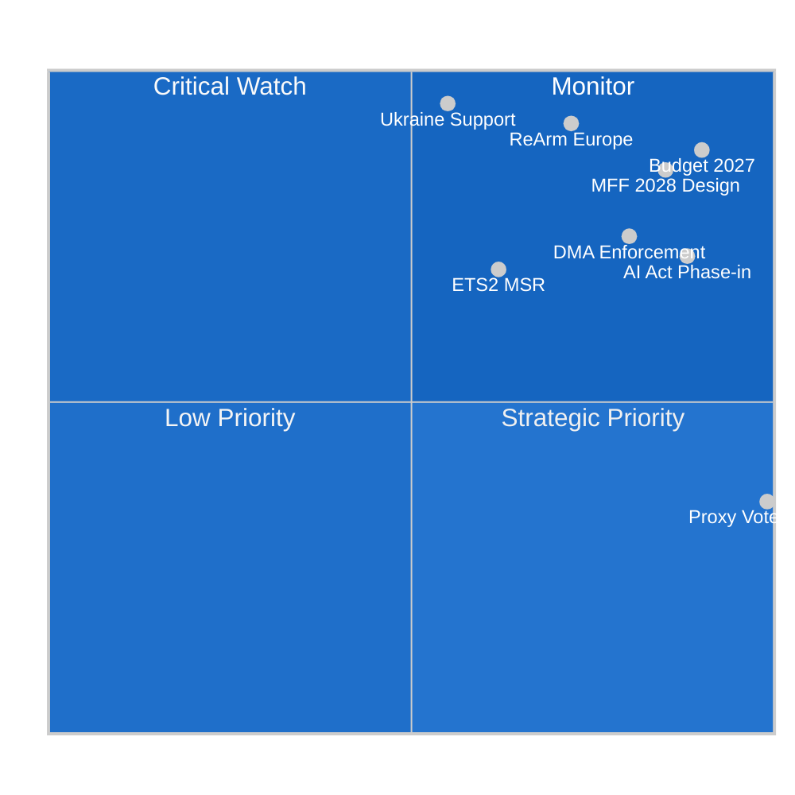

<!-- SPDX-FileCopyrightText: 2024-2026 Hack23 AB -->
<!-- SPDX-License-Identifier: Apache-2.0 -->

# 🏷️ Significance Classification — EU Parliament Year Ahead 2026–2027

**Date:** 2026-05-07 | **Article Type:** `year-ahead` | **Methodology:** Political Classification Framework v3.0

---

## 1 · Overall Significance Assessment

**TIER 1 — CONSTITUTIONAL/STRUCTURAL SIGNIFICANCE**

The May 2026 to May 2027 parliamentary year is classified as **Tier 1 — Constitutionally Significant** based on the convergence of:
- **Multiannual Financial Framework terminal phase** (2021–2027 MFF entering final budget year 2027; 2028–2034 negotiations launching)
- **Defence Union architecture decisions** (ReArm Europe framework, binding coordination)
- **Digital regulation enforcement maturation** (DMA, AI Act compliance enforcement phase)
- **Ukraine support framework legal structuring** (International Claims Commission treaty ratification)

---

## 2 · Dimensional Significance Scores

| Dimension | Score (1–10) | Justification |
|---|---|---|
| **Political** | 9/10 | No stable majority; high fragmentation; defence/budget conflicts test EP institutional authority |
| **Economic** | 8/10 | MFF terminal year; budget 2027 estimates; Ukraine facility costs; ETS2 economic impacts |
| **Social** | 7/10 | Health security (medicines framework), digital rights (DMA/AI), gender equity (proxy voting) |
| **Institutional** | 9/10 | Rules of Procedure amendments; EP vs Council budget negotiations; EP role in defence architecture |
| **External / Geopolitical** | 9/10 | Ukraine war trajectory; transatlantic relations; tariff pressures (generalised scheme reform adopted) |
| **Environmental** | 7/10 | ETS2 MSR operationalisation; chemical simplification (REACH omnibus); Green Deal continuity |
| **Technological** | 8/10 | DMA enforcement, AI Act obligations, cybersecurity frameworks, digital single market |

**Composite Significance: 8.1/10 — TIER 1: HIGH STRUCTURAL SIGNIFICANCE**

🟢 Confidence: HIGH (parliamentary calendar data from EP API; adopted texts verified; group composition real-time)

---

## 3 · Classification by Legislative Track

### 3a · Binding Acts (REGULATION/DIRECTIVE/DECISION) — High Significance
Items adopted in 2026 Q1-Q2 and expected in 2026-2027 that create binding legal obligations:

| Act | Domain | Status | EP10 Political Valence |
|---|---|---|---|
| Ukraine Support Loan Regulation 2026-2027 | Foreign/Defence | Adopted Jan 2026 | Broad consensus (EPP+S&D+Renew+Greens) |
| EU-Iceland PNR Agreement | Security/Privacy | Adopted Apr 2026 | Technical consensus, Left dissent |
| DMA (enforcement phase) | Digital | Live enforcement | EPP+Renew pro-enforcement; PfE sceptical |
| ETS2 MSR (buildings/transport) | Climate | Adopted Apr 2026 | EPP+S&D+Renew+Greens vs. PfE+ECR+ESN |
| Critical Medicines Framework | Health | Adopted Jan 2026 | Broad cross-group consensus |
| Budget Estimates EP 2027 | Institutional | Adopted Apr 2026 | EP internal consensus; Council negotiation pending |

### 3b · Non-Binding Resolutions — Medium Significance
Resolutions signal EP political position without creating legal obligations:

| Resolution | Domain | Significance |
|---|---|---|
| Ukraine Accountability/Russia attacks | Foreign Affairs | HIGH — international law; war crimes documentation |
| Armenia Democratic Resilience | Democracy support | MEDIUM — EU neighbourhood |
| Haiti Trafficking Crisis | Humanitarian | MEDIUM — global policy |
| Digital Markets Act Enforcement quality | Digital regulation | HIGH — EP oversight function |
| Livestock Sector Sustainability | Agriculture | MEDIUM — Green Deal alignment |

### 3c · Rules of Procedure Reform — Institutional Significance
| Amendment | Scope | Classification |
|---|---|---|
| Rule 135 — Agency appointments | Institutional governance | HIGH — power balance EP vs. Commission |
| Proxy voting for pregnancy/childbirth | Gender equity / participation | HIGH — precedent-setting |

---

## 4 · Forward Significance Matrix (H2 2026 – Q2 2027)

The following high-significance legislative events are anticipated based on the 33-session calendar and active pipeline:

1. **MFF 2028–2034 opening**: Commission to launch consultation mid-2026; EP response expected Sep-Nov 2026 session weeks
2. **Omnibus legislation final votes**: Chemical simplification, financial services reforms in June–September 2026
3. **AI Act compliance phase-in**: August 2026 deadline for prohibited AI (Article 5); October 2026 deadline for GPAI models — potential EP scrutiny hearings
4. **Defence procurement framework**: Expected Commission proposal on European Defence Industrial Strategy (EDIS) implementation in H2 2026; EP AFET/ITRE joint work
5. **European Banking Union completion**: Deposit insurance (EDIS) negotiations potentially reaching EP plenary 2027

---

*Methodology: EU Parliament Political Classification Framework v3.0 — dimensional scoring, quadrant analysis, legislative track classification. Data: EP Open Data Portal (2026-05-07). IMF unavailable — economic dimension scored from EP budget data only.*
