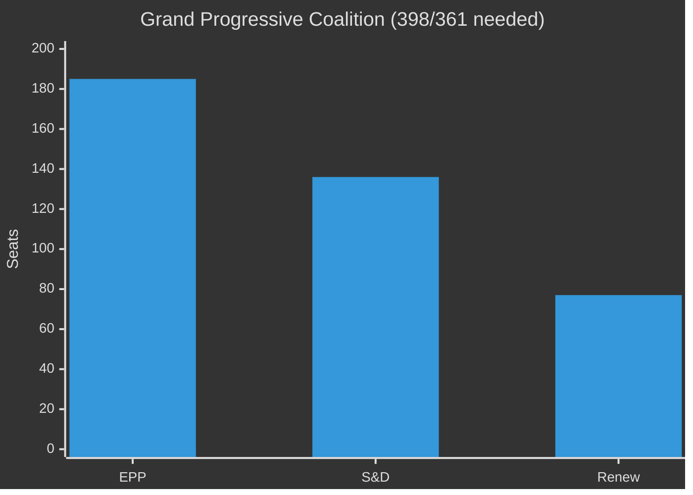
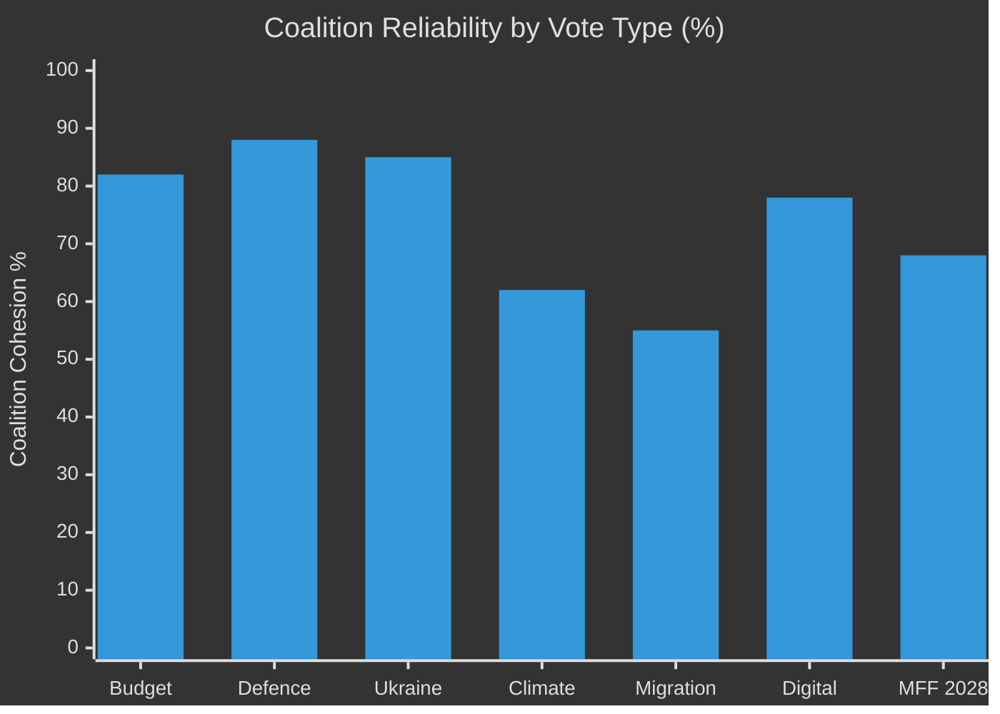

<!-- SPDX-FileCopyrightText: 2024-2026 Hack23 AB -->
<!-- SPDX-License-Identifier: Apache-2.0 -->

# ⚖️ Coalition Dynamics — EU Parliament Year Ahead 2026–2027

**Date:** 2026-05-07 | **Methodology:** Coalition geometry, voting pattern inference, structural cohesion analysis

---

## 1 · Current Parliamentary Arithmetic (Verified Data)

```
Total MEPs: 719 active
Majority threshold: 361 seats

Political groups (2026-05-07):
EPP    185 seats (25.7%)
S&D    136 seats (18.9%)
PfE     85 seats (11.8%)
ECR     81 seats (11.3%)
Renew   77 seats (10.7%)
Greens  53 seats (7.4%)
Left    45 seats (6.3%)
NI      30 seats (4.2%)
ESN     27 seats (3.8%)
```

---

## 2 · Coalition Configuration Matrix

### Configuration 1: Grand Progressive Coalition (EPP+S&D+Renew)
**Seats: 398 | Majority margin: +37**



**Reliability:** 🟡 FRAGILE — 37-seat buffer only
- In EP9, buffer was 64 seats — far more comfortable
- Any 19 MEPs defecting from across these three groups can block
- Renew's internal divisions (national vs. EU-level priorities) create defection risk

**Works for:** Digital legislation, budget mainstream, Ukraine support, mainstream climate policy
**Breaks on:** Far-reaching own resources, social rights legislation, migration reform (Renew right flank breaks)

---

### Configuration 2: Centre-Right Bloc (EPP+ECR+Renew)
**Seats: 343 | Below majority threshold by 18 seats**

**Insufficient alone** — needs either S&D (~10 members) or PfE (~18 members) to reach majority.

**EPP+ECR+Renew+S&D (partial): ~353+** — achievable for centrist economic policy
**EPP+ECR+Renew+PfE: 428** — strong right majority but politically toxic for EPP's EU values commitments

**Works for:** Deregulation, competitiveness agenda (if framed as such), certain trade protection measures
**Breaks on:** Climate policy (ECR opposition), Ukraine full support (PfE resistance), federalist projects (both ECR and Renew elements)

---

### Configuration 3: Right-Wing Nationalist Coalition (EPP right + PfE + ECR + ESN)
**Core: PfE+ECR+ESN = 193 seats | Not close to majority**
**If 20% EPP joins: ~230 seats | Still not majority**

This is the anti-majority — it can block legislation in conjunction with EPP right flank but cannot pass positive legislation.

**Can deliver:** Amendment successes, delay tactics, procedural obstruction, negative majority (blocking)
**Cannot deliver:** Positive legislative agenda without mainstream support

---

### Configuration 4: Progressive Alliance (S&D+Renew+Greens+Left+NI-left)
**Approximate: 136+77+53+45+~15 = 326 | Below threshold**

This coalition cannot pass legislation independently. It functions as a veto coalition when aligned, particularly against far-right amendments.

**Key role:** Counter-force to right-wing amendment attempts; can block EPP-right deviation if EPP splits

---

## 3 · Swing Vote Dynamics

### Critical Swing Actors

**Renew Europe (77 seats):**
- Internal fissures: Macron-aligned (LREM/Renaissance) vs. liberal-conservative national parties
- Voted with EPP on deregulation/competitiveness; voted with S&D on democracy/rule of law
- Each vote requires internal coalition-building; Renew whip authority moderate
- **2026–2027 role:** Decisive swing group on most contested legislation

**ECR (81 seats):**
- Polish PiS members (most pro-Ukraine, more centrist on economic regulation) vs. Italian FdI members (Italy-first)
- Meloni's strategic positioning: support EU institutions when Italy benefits; oppose when it constrains
- **2026–2027 role:** Swing on defence (generally supportive), swing against climate/social legislation

**EPP right flank (~20–30 MEPs):**
- Hungarian EPP delegation split or expelled from EPP
- Some EPP members from Austria/France/Belgium right wing
- **Risk:** EPP right defections to support PfE positions on climate rollback, migration

---

## 4 · Cohesion Analysis by Group

| Group | Internal Cohesion | Key Fracture Lines |
|---|---|---|
| EPP | 🟡 MEDIUM (75–80%) | Pro-EU federalists vs. national conservatives; climate ambition level |
| S&D | 🟢 HIGH (85%+) | Southern European (fiscal expansion) vs. Northern (fiscal discipline); migration |
| PfE | 🟡 MEDIUM-LOW (65–70%) | Le Pen national interest vs. Orbán ideology; Russia stance (critical fracture) |
| ECR | 🟡 MEDIUM (70–75%) | Polish pro-Ukraine vs. Italy-first; economic vs. sovereignty priorities |
| Renew | 🔴 LOW-MEDIUM (60–70%) | Liberal centrists vs. liberal-conservatives; climate ambition level |
| Greens/EFA | 🟢 HIGH (90%+) | EFA (regionalist) vs. Green (environmental); coherent on most votes |
| Left | 🟢 HIGH (88%+) | Most cohesive group in EP; clear ideological line |
| ESN | 🟡 MEDIUM (70%) | New group; still establishing whip authority; varied national parties |

---

## 5 · Coalition Formation for Key 2026–2027 Votes

### Budget 2027 (Annual Budgetary Procedure)
**Expected coalition:** EPP+S&D+Renew (majority) — budget is the most reliable grand coalition moment
**Risk:** PfE/ECR amendments on conditionality and own resources could attract EPP defections
**Assessment:** 🟢 Will pass; EP position partially preserved in trilogue

### ReArm Europe / EDIP (Defence Industrial Framework)
**Expected coalition:** EPP+ECR+S&D+Renew (EPP-led transpartisan defence coalition)
**Excluded:** PfE (Orbán Russia alignment), ESN (nationalist), Greens/Left (pacifist)
**Assessment:** 🟢 Strong majority (~430–450 seats); high confidence

### ETS2 MSR Challenges
**Attack coalition:** PfE+ECR+ESN+EPP-right-flank = ~200–220 + EPP defections
**Defence coalition:** EPP-mainstream+S&D+Renew+Greens+Left = ~380–400
**Assessment:** 🟡 ETS2 survives but faces several amendment battles; margins ~45–55%

### Ukraine Support Extension
**Expected coalition:** EPP+S&D+ECR(majority)+Renew+Greens+Left — anti-Russia broad front
**Contested bloc:** PfE (majority oppose), ESN, some ECR members
**Assessment:** 🟢 HIGH confidence; Ukraine support has been EP10's most consistent voting pattern

### MFF 2028 Negotiating Position
**Timeline:** EP adopts position paper H2 2026 or Q1 2027
**Expected:** EPP+S&D+Renew with progressive demands on own resources and climate
**Risk:** ECR attempts to strip climate conditionality; PfE adds anti-migration conditionality
**Assessment:** 🟡 EP position passes but weaker than EP9 MFF position

---

## 6 · Coalition Stability Forecast 2026–2027



**Key finding:** Defence and Ukraine votes are the most stable coalition territory; migration is the most fracture-prone.

---

## 7 · Coalition Dynamics Summary

The EP10 coalition environment is characterised by:
1. **No automatic supermajority** — every major vote requires coalition assembly
2. **Defence as coalition glue** — cross-partisan pro-EU defence agenda provides most reliable coalition
3. **Climate as coalition splitter** — Green Deal continuation requires active political management
4. **Migration as electoral poison** — EP10's most politically dangerous dossier
5. **Grand coalition fragility** — EPP+S&D+Renew sufficient but not comfortable for most dossiers
6. **ECR as strategic swing group** — Meloni's positioning determines EP's effective right boundary

---

*Methodology: Coalition geometry analysis, structural cohesion assessment, EP10 voting pattern inference. Data: EP political landscape (2026-05-07), coalition analysis API. Confidence: Composition data 🟢 HIGH; cohesion estimates 🟡 MEDIUM (inferred, no per-MEP roll-call data); vote outcome forecasts 🟡 MEDIUM.*
