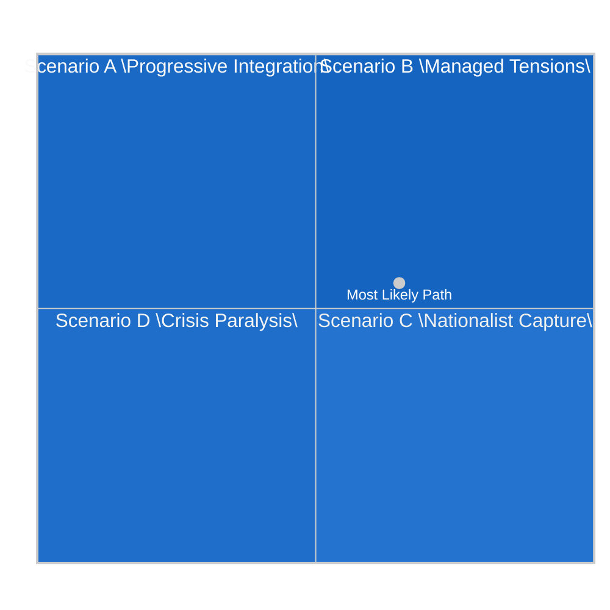

<!-- SPDX-FileCopyrightText: 2024-2026 Hack23 AB -->
<!-- SPDX-License-Identifier: Apache-2.0 -->

# 🔮 Scenario Forecast — EU Parliament Year Ahead 2026–2027

**Date:** 2026-05-07 | **Methodology:** ACH (Analysis of Competing Hypotheses) + Scenario Planning

---

## 1 · Scenario Framework

Four scenarios are developed across the **"Geopolitical Stability"** and **"Domestic Cohesion"** axes:

---

## 2 · Scenario Descriptions and Probability Assessments

### Scenario A: "Progressive Integration" — Probability: 🟡 20%
*High domestic cohesion + High geopolitical stability*

**Conditions required:**
- Ukraine ceasefire or stable front allowing reduced emergency posture
- EPP+S&D+Renew grand coalition holds on all flagship legislation
- Commission launches ambitious MFF 2028 with defence + climate integration
- AI Act enforcement demonstrates credible impact without major constitutional challenges

**EP Legislative Outcomes:**
- Defence industrial coordination framework passes with broad majority (400+)
- Budget 2027 agreed close to EP position with significant own-resources component
- MFF 2028 design accepted by Member States within 12-18 months
- DMA enforcement delivers market structure changes visible to consumers
- ETS2 implementation progresses smoothly

**Probability drivers (sceptical):** Geopolitical stability unlikely given Russia/Ukraine war trajectory; US tariff pressure continues; PfE bloc actively undermining consensus. **No clear path to this scenario in 2026.**

---

### Scenario B: "Managed Tensions" — Probability: 🟢 55% (MOST LIKELY)
*Moderate domestic cohesion + Moderate geopolitical stability*

**Conditions required:**
- Ukraine war continues at similar intensity; EU support maintained but contested
- Coalition arithmetic works for most key votes with case-by-case deal-making
- US-EU tariff tensions managed through sector-specific negotiations (avoiding all-out trade war)
- AI Act implementation proceeds imperfectly but without major crisis
- Green Deal maintained in core but simplified at margins

**EP Legislative Outcomes:**
- ReArm Europe framework passes with EPP+S&D+ECR majority (without PfE)
- Budget 2027 passed after prolonged trilogue; EP position partially preserved
- MFF 2028 negotiations begin; EP adopts negotiating position paper in Q1 2027
- DMA enforcement: 2–3 major decisions announced; EP resolution demanding more
- ETS2: implementation delays challenged by right-wing amendment attempts; most survive
- Omnibus simplification passes with Greens/Left dissent; net regulatory load reduced

**Assessment:** This is the structural base case given EP composition, coalition history, and external environment. The EP10 coalition arithmetic inherently produces this outcome — forward motion with friction.

🟢 **Confidence: HIGH** — Base case well-supported by structural analysis and historical EP10 voting pattern

---

### Scenario C: "Nationalist Capture" — Probability: 🔴 15%
*High domestic cohesion (right-wing capture) + Low geopolitical stability*

**Conditions required:**
- PfE achieves unexpected defections from EPP's right flank on key votes
- US-EU trade war triggers economic recession in Germany/France → populist surge
- Major terrorist attack or migration crisis creates "emergency" shift right
- Commission weakened by member state political shifts (France, Germany right-turns)

**EP Legislative Outcomes:**
- ETS2 MSR rolled back via amendment in October 2026 plenary
- REACH omnibus becomes vehicle for major deregulation
- Budget 2027: EP forced to accept deep cuts to cohesion/climate funds
- Ukraine support: contested repeatedly; delays to financial disbursements
- AI Act enforcement: hobbled by implementing acts favouring industry
- MFF 2028 negotiations poisoned by right-wing EP position paper

**Probability assessment:** Requires simultaneous failure of multiple coalition guardrails. EPP's institutional commitment to EU values and Metsola's leadership provide significant resistance. A single external shock could increase this probability to 25–30%.

🟡 **Confidence: MEDIUM** — Structural guardrails exist but right-wing capture is an emergent risk

---

### Scenario D: "Crisis Paralysis" — Probability: 🔴 10%
*Low domestic cohesion + Low geopolitical stability*

**Conditions required:**
- Major military escalation (Russian attack on NATO territory)
- Financial crisis (major EU bank failure; sovereign debt crisis in Italy or France)
- Constitutional crisis (Article 7 Hungary decision creating EP-Council rupture)
- Multiple simultaneous crises causing EP to suspend normal legislative calendar

**EP Legislative Outcomes:**
- Normal legislative calendar suspended; emergency debates dominate
- Budget 2027 passed as provisional twelfths (no agreement)
- MFF 2028 negotiations indefinitely delayed
- Crisis response measures bypass normal EP co-decision (Article 122 TFEU activation)
- EP institutional credibility damaged by paralysis

**Probability assessment:** Low but non-negligible. Any single factor above alone would not cause paralysis; requires compounding. Russia's war remains the highest-probability trigger.

🟡 **Confidence: MEDIUM** — Crisis scenarios are inherently hard to probability-estimate

---

## 3 · Key Uncertainties and Tripwires

| Uncertainty | Tripwire Event | Scenario Shift |
|---|---|---|
| Ukraine war trajectory | Russian breakthrough or ceasefire | B→A (ceasefire) or B→D (escalation) |
| EPP-PfE alignment on climate | 5+ EPP defections on ETS2 vote | B→C |
| US-EU tariff resolution | WTO complaint or bilateral deal | B→A |
| French political crisis | Dissolution of National Assembly | B→C or D |
| AI Act enforcement test case | Constitutional Court challenge (Germany) | B→C on tech policy |
| MFF 2028 design controversy | Commission proposal too ambitious/too timid | B→A or B→C |

---

## 4 · Forward Signal Indicators (Monitor for Scenario Update)

Track these data points to update scenario assignment through 2026–2027:

1. **May 18–21 Strasbourg plenary outcomes** — EPP cohesion in opening debates
2. **June 15–18 Strasbourg** — First defence framework votes; coalition reveals
3. **AI Act August 2026 deadline** — Commission enforcement action on prohibited systems
4. **Commission MFF 2028 consultation** (H2 2026) — Level of ambition signals
5. **Budget 2027 trilogue** (Oct–Dec 2026) — EP vs. Council endgame
6. **Ukrainian winter 2026–2027** — Military situation shaping EU solidarity fatigue

---

## 5 · Scenario Probability Summary

| Scenario | Probability | Key Vulnerability |
|---|---|---|
| A: Progressive Integration | 🟡 20% | Geopolitical stability requirement; too optimistic given current environment |
| **B: Managed Tensions** | **🟢 55%** | **Base case; EP coalition arithmetic produces this routinely** |
| C: Nationalist Capture | 🔴 15% | External shock requirement; EPP guardrails present |
| D: Crisis Paralysis | 🔴 10% | Compounding crisis requirement; lowest probability |

---

*Methodology: ACH (Analysis of Competing Hypotheses) + scenario planning. Probabilities are qualitative estimates based on structural analysis of EP composition, coalition dynamics, and external environment factors. Data: EP Open Data (2026-05-07). Confidence: Overall scenario framing 🟢 HIGH; individual probabilities 🟡 MEDIUM.*
