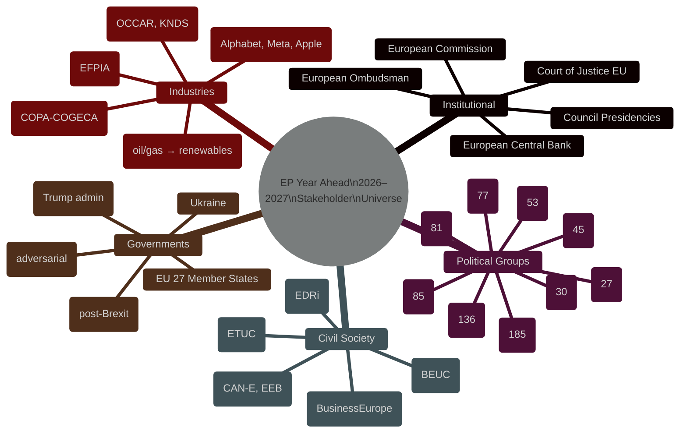
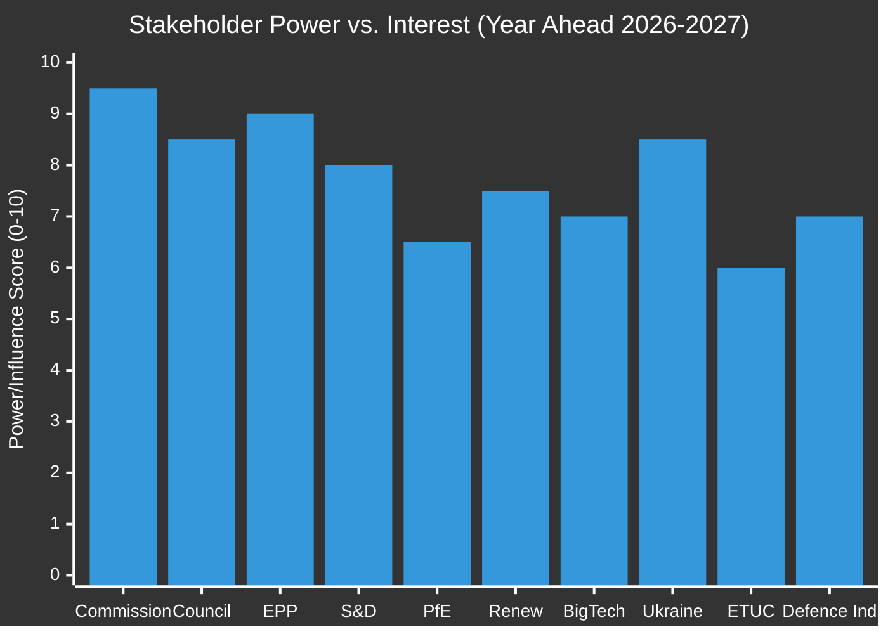

<!-- SPDX-FileCopyrightText: 2024-2026 Hack23 AB -->
<!-- SPDX-License-Identifier: Apache-2.0 -->

# 👥 Stakeholder Map — EU Parliament Year Ahead 2026–2027

**Date:** 2026-05-07 | **Methodology:** Multi-dimensional stakeholder mapping + political intelligence

---

## 1 · Stakeholder Universe Map

---

## 2 · Primary Stakeholder Perspectives

### 2a · European Commission (Von der Leyen II)

**Perspective on 2026–2027:**
The Commission enters the second year of Von der Leyen II with a legislative programme centred on the Draghi Competitiveness Agenda, ReArm Europe defence proposals, and AI Act implementation. The Commission's relationship with the EP is structurally cooperative but tactically competitive, particularly on budget (Commission wants to control MFF 2028 design) and on DMA enforcement (Commission leads but EP pushes for more).

**Stakes:**
- MFF 2028 design is existential for Commission's role as economic governance anchor
- Own Resources reform needed to fund defence, Ukraine, and transition without member state budget increases
- AI Act implementation credibility — Commission must show enforcement capacity
- DMA enforcement against Big Tech: Commission's regulatory authority vs. US political pressure under Trump

**Expected actions:**
- Launch 2028 MFF consultation H2 2026 with Commission preference for modest expansion + defence instrument
- Publish AI Act implementing acts (prohibited systems, GPAI compliance)
- DMA enforcement decisions on gatekeeper non-compliance
- Ukraine reconstruction framework legislation

🟢 **Confidence: HIGH** — Institutional mandate well-understood; specific legislative timing may shift

### 2b · European People's Party (EPP, 185 seats)

**Perspective on 2026–2027:**
EPP controls the EP Presidency (Metsola) and the largest group. Its 2026–2027 agenda balances:
- Pro-competitiveness/anti-overregulation (REFIT push, Draghi agenda support)
- Pro-Ukraine/pro-defence (core EPP security values)
- Anti-Green-Deal-overreach (climate policy moderation to win centrist voters back from PfE)
- European values / rule of law (anti-Orbán, distinguishing EPP from PfE)

**Internal tensions:**
- Northern conservative members vs. Southern security/Mediterranean members
- German CDU/CSU delegation (largest national bloc in EPP) driving fiscal conservatism
- EPP cannot align with PfE on Orbán governance (rule of law) even while sharing climate scepticism

**Expected actions:**
- Drive competitiveness omnibus through to completion
- Lead on ReArm Europe framework design
- Resist full Green Deal rollback (preserve legislative credibility) while softening implementation
- MFF 2028: push for defence spending instrument without debt mutualisation

🟢 **Confidence: HIGH** — EPP's political logic is stable and well-documented

### 2c · S&D — Socialists and Democrats (136 seats)

**Perspective on 2026–2027:**
S&D is the essential partner for any centre majority. Its key 2026–2027 concerns:
- Defending workers' rights in the just transition (Just Transition Directive follow-up)
- Maintaining full Ukraine support (solidarity imperative)
- Protecting ETS2 and Green Deal from rollback
- Budget 2027: pushing for adequate social cohesion spending
- Rule of law: most vocal EPP critic on Hungary; champions Article 7 proceedings

**Internal tensions:**
- Southern members (Italy, Greece, Spain) focus on Mediterranean migration
- Eastern members (Romania, Bulgaria) navigating national politics
- Leadership succession question post-2024 (Iratxe García Pérez leading)

**Expected actions:**
- Co-author just transition implementation resolutions
- Joint Ukraine support motions with EPP/Renew
- Budget 2027: assertive on cohesion funds and just transition spending
- MFF 2028: demand social spending ring-fence

🟢 **Confidence: HIGH**

### 2d · PfE — Patriots for Europe (85 seats)

**Perspective on 2026–2027:**
PfE represents the nationalist-populist right bloc anchored by Orbán's Fidesz, Le Pen's Rassemblement National, and smaller parties. Its 2026–2027 agenda:
- Blocking or weakening climate legislation (ETS2 MSR, Green Deal)
- Opposing EU defence federalisation (supporting instead bilateral national defence deals)
- Pushing migration restrictionism
- Challenging Ukraine financial support (varying by national party — Le Pen sympathetic to Russia, Orbán more extreme)
- Opposing rule of law conditionality on Hungary

**Key constraint:** PfE cannot reach majority alone or with ECR+ESN (193 seats = 26.8%); it can create blocking minorities but not govern.

**Expected actions:**
- Challenge ETS2 MSR implementation
- Propose amendments weakening digital regulation enforcement
- Parliamentary questions / resolutions attacking Commission DMA approach as anti-national
- Oppose weapons provisions in Ukraine support regulations

🟡 **Confidence: MEDIUM** — PfE internal cohesion uncertain; national delegations have divergent interests

### 2e · Ukrainian Government

**Perspective on 2026–2027:**
Ukraine is the single largest geopolitical external actor shaping EP work:
- Continued dependency on EU financial support (Ukraine Support Loan Regulation 2026-2027 adopted Jan 2026)
- International Claims Commission convention (TA-10-2026-0154 adopted April 30) — major diplomatic success
- Accession negotiations: Chapter-by-chapter progress; EP oversight role critical
- Reconstruction financing: €300–500bn estimated need; EP must support financing instruments

**Expected interactions:**
- Ukrainian President/PM appearances before EP plenary (annual address tradition)
- AFET committee hearings on war accountability
- Trilogue on Phase 2 Ukraine Facility / ReArm linkages
- EP own-initiative reports on accession progress chapters

🟡 **Confidence: MEDIUM** — War trajectory is volatile; specific EP-Ukraine interactions depend on battlefield and diplomatic developments

### 2f · Big Tech (Alphabet, Meta, Apple, Amazon, Microsoft, ByteDance)

**Perspective on 2026–2027:**
Major technology platforms face the full weight of EU digital regulation:
- **DMA:** Gatekeeper obligations; Commission investigations; potential EP-triggered scrutiny hearings
- **AI Act:** Article 5 prohibited systems (August 2026); GPAI model compliance (October 2026)
- **Data Act:** Cross-sector data sharing obligations
- **Lobbying strategy:** Intensive engagement with IMCO, LIBE, and ITRE committees

**Expected actions:**
- High-profile compliance announcements designed for EP audience
- Regulatory arbitrage attempts via interpretive wiggle room in implementing acts
- Potential congressional/diplomatic pressure on Commission via US-EU trade leverage
- Support Renew's lighter-touch enforcement positions in EP debates

🟢 **Confidence: HIGH** — Digital regulation pipeline well-documented; Big Tech behaviour patterns well-established

### 2g · Defence Industry (Rheinmetall, Airbus, KNDS, BAE-local)

**Perspective on 2026–2027:**
European defence industry is the largest beneficiary of the ReArm Europe momentum:
- European Defence Industrial Strategy (EDIS) and European Defence Fund (EDF) direct funding
- OCCAR (Organisation for Joint Armament Cooperation) as procurement vehicle
- Industrial capacity investment vs. procurement sovereignty tensions
- Supply chain security (dual-use materials, semiconductor chips for weapons systems)

**Expected EP interactions:**
- AFET/ITRE joint hearings on EDIS implementation
- Budget Committee scrutiny of EDF allocation
- Potential EP own-initiative on European Defence Industrial Policy

🟡 **Confidence: MEDIUM** — Defence industry interactions with EP are less transparent; lobbying via national government channels dominant

---

## 3 · Stakeholder Interest-Power Grid

---

## 4 · Stakeholder Coalition Configurations for Key Votes

| Vote / Decision | Likely Supporters | Likely Opponents | Key Swing |
|---|---|---|---|
| **ReArm Europe framework** | EPP, S&D, ECR, Renew | PfE, ESN, The Left | Greens (environmental conditions) |
| **Budget 2027 (expansionist EP position)** | EPP, S&D, Renew, Greens, Left | PfE, ECR, ESN | NI (split by national interest) |
| **ETS2 MSR implementation** | S&D, Greens, Left, Renew | PfE, ECR, ESN | EPP (split — industry wing vs. climate wing) |
| **DMA enforcement resolution** | S&D, Renew, Greens, Left | PfE, ESN | EPP, ECR |
| **Ukraine Support Loan extension** | EPP, S&D, ECR, Renew, Greens | PfE, ESN | The Left (anti-military wing) |
| **REACH omnibus (chemical simplification)** | PfE, ECR, ESN, EPP industry wing | Greens, Left, S&D | Renew (split) |

---

*Methodology: Stakeholder mapping using EP Open Data (group composition, adopted texts, coalition analysis) + structural political analysis. Data: 2026-05-07. Confidence: High on institutional actors; Medium on external/industry actors.*
