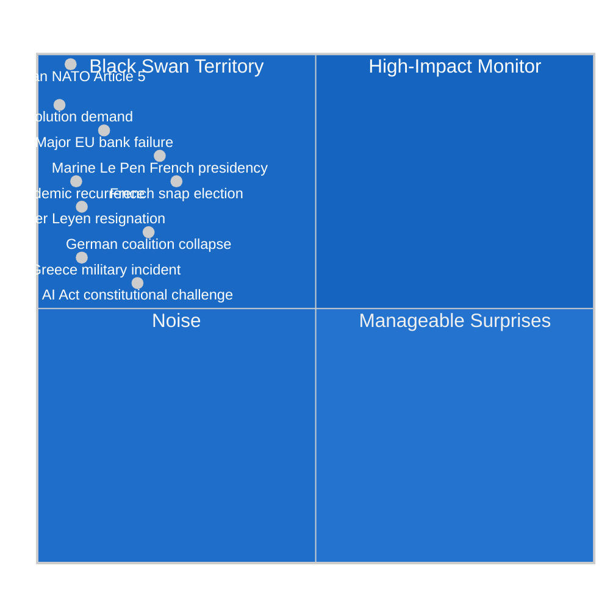

<!-- SPDX-FileCopyrightText: 2024-2026 Hack23 AB -->
<!-- SPDX-License-Identifier: Apache-2.0 -->

# 🃏 Wildcards & Black Swans — EU Parliament Year Ahead 2026–2027

**Date:** 2026-05-07 | **Methodology:** Black Swan analysis + Low-probability high-impact (LPHI) scenario modelling

---

## 1 · Black Swan Framework

Black swans for EP parliamentary purposes are events outside normal scenario planning that would fundamentally alter the legislative and political environment. By definition, these carry low assigned probabilities but extreme impact magnitude.

---

## 2 · Tier 1: High-Impact Black Swans (EP-altering events)

### 2a · Russian Military Action Against NATO Territory
**Probability: 🔴 ~5–8% | Impact: CATASTROPHIC | EP Effect: TOTAL RESTRUCTURE**

If Russia attacks a NATO member state (Baltic states most likely target, particularly Estonia or Latvia):
- Article 5 invocation → NATO war footing
- EP emergency calendar; Article 78(3) TFEU invoked for migration; Article 122 for economic emergency
- All normal legislative business suspended for 2–6 months minimum
- EU defence integration accelerated by 10+ years of political timeline
- Budget: Emergency supplementary; defence spending commitments of 5%+ GDP
- **EP role:** Accelerated approval of war economy measures; political cohesion demand vs. PfE/ECR fracture
- **Coalition shift:** PfE fragmented (Orbán-aligned members face existential crisis); massive majority for defence measures

**Monitoring indicators:**
- Russian force mobilisation near NATO borders
- Baltic intelligence community threat elevation
- Emergency NATO council meetings

---

### 2b · Major European Financial Institution Failure
**Probability: 🔴 ~10–12% | Impact: SEVERE | EP Effect: LEGISLATIVE DISRUPTION**

A major EU bank (Tier 1 systemic importance) failure triggering financial contagion:
- ECB emergency liquidity → ESM activation → EP emergency budget supplementary
- Banking Union completion fast-tracked (EDIS finalisation)
- EP ECON committee enters emergency session mode
- Italian or French sovereign stress as potential transmission channel
- **EP legislative effect:** Budget 2027 and MFF 2028 work paused; emergency economic legislation dominates
- **Most likely trigger:** Italian banking sector stress + political crisis; or German commercial real estate exposure crystallisation

---

### 2c · Marine Le Pen French Presidency (2027 Window)
**Probability: 🔴 ~22% (next French election context) | Impact: HIGH | EP Effect: COALITION FRACTURE**

While technically outside the EP's direct electoral cycle, a Le Pen presidency in France would:
- Transform PfE into the governing coalition's anchor → massive influence increase in EP
- French Renew delegation collapses; EP Renew group loses largest national delegation
- EP coalition arithmetic shifts dramatically: EPP cannot maintain EP9-style grand coalition without French Renew
- Von der Leyen Commission faces hostile major member state government → institutional crisis
- **EP effect:** Centre-ground grand coalition becomes structurally impossible; EP10 ends with right-wing dominance

**Monitoring indicators:**
- French domestic polling (Le Pen vs. Macron-successor gap)
- French economic performance under Macron successor government
- Any Marine Le Pen legal resolution (pending sentences from financial cases)

---

## 3 · Tier 2: High-Probability Disruptors (Wildcards — not full black swans)

### 3a · German Government Coalition Collapse
**Probability: 🟡 ~20% | Impact: HIGH | EP Effect: GERMAN DELEGATION DISRUPTION**

If the Merz coalition (CDU/CSU + SPD or FDP) collapses through a vote of no confidence:
- New German elections → 6-month legislative paralysis in Berlin
- German Council Presidency preparations disrupted
- EP German CDU/CSU delegation (largest EPP national delegation) in campaign mode → reduced EP work
- Budget 2027 trilogue loses reliable German negotiating partner
- **Most likely cause:** FDP budget demands; migration policy disagreement; defence spending controversy

### 3b · French Snap Legislative Elections
**Probability: 🟡 ~25% | Impact: MEDIUM-HIGH | EP Effect: RENEW DISRUPTION**

President Macron-successor calls snap legislative elections under new French political environment:
- French Renew MEPs politically distracted
- EP Renew leadership transition possible
- Coalition uncertainty in Paris creates EP-level uncertainty on French positions
- **Effect on EP legislation:** Moderate disruption; Renew group still functional but politically weakened

### 3c · AI Act Major Constitutional Challenge
**Probability: 🟡 ~18% | Impact: MEDIUM | EP Effect: REGULATORY REVIEW DEMANDS**

A national constitutional court (Germany's Bundesverfassungsgericht most likely) rules parts of AI Act incompatible with national constitutional rights frameworks:
- EP JURI + LIBE emergency committee hearings
- Commission forced to propose amending regulation
- Sets precedent for EU digital regulation's constitutional relationship to national legal orders
- **EP effect:** Digital legislative agenda delayed 12–18 months; legitimacy question for EU's AI regulatory position globally

### 3d · Turkey-Greece Military Incident
**Probability: 🔴 ~8% | Impact: MEDIUM | EP Effect: AFET/DROI COMMITTEE ACTIVATION**

Military confrontation (dogfight, naval incident) between Turkey and Greece in Aegean or Eastern Mediterranean:
- NATO's internal cohesion tested (both are NATO members)
- EP emergency resolution on Eastern Mediterranean security
- EU-Turkey relations crisis → migration deal threatened → PfE/ECR exploit for anti-migration campaigns
- **EP effect:** AFET committee emergency sessions; migration policy dossiers politicised further

---

## 4 · Wild Cards — Positive Black Swans

Not all low-probability events are negative. Positive wildcards could accelerate EP's legislative agenda:

### 4a · Russia-Ukraine Ceasefire
**Probability: 🟡 ~20% | Impact: HIGH (positive) | EP Effect: LEGISLATIVE RENAISSANCE**

A ceasefire deal (even fragile) would:
- Free up political bandwidth consumed by Ukraine crisis management
- EP10 can focus on domestic legislation: AI, Green Deal, competitiveness
- Budget freed from emergency Ukraine Facility → domestic priorities
- EPP's grand coalition position strengthened (crisis management success narrative)
- **EP legislative effect:** Significant acceleration in MFF 2028 design; climate legislation revival possible

### 4b · US-EU Trade Agreement
**Probability: 🔴 ~10% | Impact: MEDIUM (positive) | EP Effect: INTA COMMITTEE SHOWCASE**

A bilateral US-EU tariff reduction framework deal:
- EP INTA committee positioned for significant ratification role
- Boosts EU competitiveness narrative
- Economic boost reduces recession risk → fiscal space for MFF 2028
- **EP effect:** Major ratification process; EP10 establishes trade governance template for Trump-era relations

---

## 5 · Black Swan Response Preparedness Assessment

EP institutional preparedness for black swan scenarios:

| Event Type | EP Preparedness | Key Gap |
|---|---|---|
| Military crisis (Article 5) | 🟡 PARTIAL | No formal EP war-powers protocol; improvised Article 122 use |
| Financial crisis | 🟡 PARTIAL | ECON committee crisis protocols exist but not recently tested |
| Commission collapse | 🟡 PARTIAL | Formal procedures exist; politically disruptive |
| French/German domestic crisis | 🔴 WEAK | No EP mechanism to manage large delegation disruption |
| AI Act legal challenge | 🟢 ADEQUATE | JURI committee has Constitutional law expertise |

---

## 6 · Black Swan Monitoring Protocol

This analysis recommends monitoring the following early warning indicators monthly through 2027:

1. **Russian force posture (Baltic region)** — NATO intelligence assessments
2. **French polling (presidential succession)** — IFOP, BVA, OpinionWay trackers
3. **Italian sovereign spread (BTP-Bund)** — ECB weekly data
4. **EU bank CDS spreads** — Bloomberg financial risk tracker
5. **German coalition confidence votes** — Bundestag scheduling
6. **AI Act enforcement first cases** — EU AI Office announcements
7. **Turkey-Greece diplomatic incidents** — Foreign Ministry statements

---

*Methodology: Black swan LPHI (Low-Probability High-Impact) analysis; scenario tree modelling. Probabilities are qualitative expert-judgment estimates — not statistical forecasts. Data: EP composition data, structural intelligence, political risk assessment. Confidence: Framework 🟢 HIGH; individual probability estimates 🟡 MEDIUM (inherently uncertain for rare events).*
