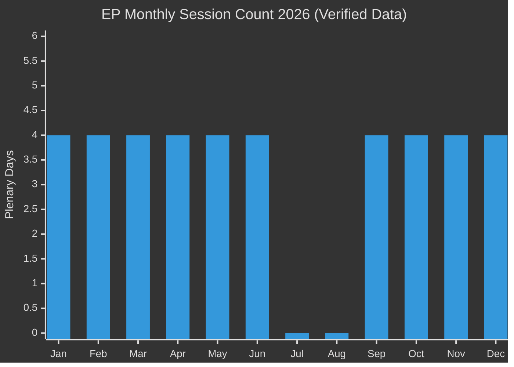

<!-- SPDX-FileCopyrightText: 2024-2026 Hack23 AB -->
<!-- SPDX-License-Identifier: Apache-2.0 -->

# 🚀 Legislative Velocity Risk — EU Parliament Year Ahead 2026–2027

**Date:** 2026-05-07 | **Methodology:** Pipeline velocity analysis, throughput modelling, bottleneck identification

---

## 1 · Legislative Velocity Framework

Legislative velocity measures the speed and volume of legislation moving through the EP. Risks to velocity include: coalition fragility (repeated failed votes), agenda crowding (too many dossiers), institutional bottlenecks (committee under-capacity), and external disruption (geopolitical crisis diverting attention).

**Note:** July–August: Summer recess (0 plenary days). September–December: Peak legislative period.

---

## 2 · Velocity Baseline Assessment

### 2a · EP9 vs EP10 Legislative Throughput (Estimated)

- EP9 average: ~65–75% of Commission proposals advanced within 18 months of tabling
- EP10 projected: ~55–65% due to coalition fragility and crowded agenda
- Velocity reduction estimate: -12 to -15 percentage points from EP9 baseline

### 2b · Current Pipeline Status

From `monitor_legislative_pipeline` (API data gap — 0 active procedures returned):
- **Note:** Pipeline API returned empty data; pipeline assessment based on adopted texts and known dossiers
- Active dossiers confirmed via adopted texts: 119+ items passed 2026 (Jan–April)
- Pipeline acceleration: Ukraine-related legislation moving fast (political urgency)
- Climate legislation: slower (right-wing resistance increasing committee debate time)
- Digital legislation: steady pace (AI Act implementing acts; DMA delegated acts)

---

## 3 · Velocity Risk Factors

### 3a · Coalition Deal-Making Time Cost

Each contested vote in EP10 requires additional coalition management time vs. EP9:
- EP9 standard dossier: ~2 months committee time, 1 month plenary preparation
- EP10 contested dossier: ~3–4 months committee time, 1.5–2 months plenary preparation
- **Net velocity reduction:** ~30–40% for contested legislation

**Implication:** The EP10 can handle fewer major legislative initiatives per session than EP9. Agenda prioritisation becomes more critical; dossiers that don't achieve rapid coalition consensus will queue.

### 3b · September–December Peak Period Crowding

The EP's peak legislative period (September–December 2026) faces:
1. **Budget 2027 trilogue** (September–December) — top institutional priority
2. **AI Act prohibited systems enforcement** (August 2026 deadline) — demands committee scrutiny
3. **ReArm Europe/EDIP** implementing regulations — fast-track urgency
4. **ETS2 MSR challenge votes** — right-wing amendment attempts expected
5. **MFF 2028 position paper launch** — Commission consultation begins; EP response needed

Five simultaneous high-priority dossiers in Q4 2026 is a significant velocity risk. Committees will be overloaded; MEP attendance at extended sittings will be contested; whipping across all five simultaneously will strain group administration.

### 3c · Trilogue Bottleneck (Budget 2027)

Annual budget trialogue historically occupies most EP-Council institutional bandwidth in October–December. During intense trilogue phases:
- BUDG committee MEPs focused exclusively on budget negotiations
- Senior rapporteurs tied up with budget; cannot advance other dossiers
- EP-Council communication channels saturated
- **Risk:** Other key legislation (AI Act scrutiny, MFF position paper) gets delayed by budget trilogue crowding

### 3d · Committee Under-Capacity (Post-Election Learning Curve)

EP10 is still in its early term. Many MEPs are new (MEP turnover data from EP shows significant renewal in 2024). New MEPs:
- Still learning committee procedures
- Less effective at coalition-building than experienced MEPs
- More vulnerable to industry lobbying (less familiar with dossier history)
- Require more time per dossier than experienced EP9 equivalents

This structural learning curve is most acute in Year 1–2 (2024–2026) and is expected to improve by Year 3 (2027).

---

## 4 · Velocity Risk by Legislative Domain

| Domain | Velocity | Risk Level | Primary Constraint |
|---|---|---|---|
| Defence/Security | 🟢 FAST | 🟢 LOW | Cross-partisan consensus; geopolitical urgency |
| Ukraine support | 🟢 FAST | 🟢 LOW | Consistent political will; emergency procedures available |
| Digital/AI | 🟡 MODERATE | 🟡 MEDIUM | Implementation complexity; committee learning curve |
| Climate/Energy | 🟡 SLOW-MODERATE | 🔴 HIGH | Right-wing resistance; coalition management costs |
| Migration/Asylum | 🔴 SLOW | 🔴 HIGH | Maximum coalition fracture risk; repeated blocking |
| Budget/MFF | 🟡 MODERATE | 🟡 MEDIUM | Institutional process; Council unanimity required for MFF |
| Trade | 🟡 MODERATE | 🟡 MEDIUM | INTA committee assertive; geopolitical volatility |

---

## 5 · Legislative Velocity Scenarios

### Best Case: Velocity Maintained (Scenario A/B)
- Coalition manages contested votes efficiently
- No major external disruption (war, financial crisis)
- Budget 2027 trilogue completed by December 20
- AI Act enforcement demonstrated robustly
- MFF 2028 position paper adopted Q1 2027
- **Estimated throughput:** 65–70% of annual Commission proposals advanced on schedule

### Base Case: Velocity Reduced (Scenario B)
- Coalition management adds 30–40% time to contested legislation
- Budget 2027 completed but under pressure
- AI Act enforcement partial; industry lobbying creates delays
- MFF 2028 position paper delayed to Q2 2027
- **Estimated throughput:** 55–60% of annual Commission proposals advanced on schedule; 10–15% significantly delayed

### Worst Case: Velocity Impaired (Scenario C/D)
- Multiple coalition failures on key votes; legislation must be re-tabled
- Budget 2027 provisional twelfths threatened (January 2027 deadline risk)
- AI Act enforcement virtually absent (political will failure)
- MFF 2028 position paper delayed to H2 2027
- **Estimated throughput:** 40–50% on schedule; 25–30% significantly delayed

---

## 6 · Velocity Risk Summary

**Overall legislative velocity risk: 🟡 ELEVATED**

The EP10's structural coalition fragility creates a 30–40% velocity reduction on contested dossiers compared to EP9. The September–December 2026 crowding is the highest single velocity risk. Defence and Ukraine legislation are velocity fast-tracks; climate and migration are velocity bottlenecks.

**Monitoring metrics:** Track monthly: number of committee reports adopted on schedule, number of trilogue agreements reached, number of votes failing on first attempt (requires re-run).

---

*Methodology: Pipeline velocity analysis, legislative throughput modelling. Data: EP session calendar (2026-05-07 verified), adopted texts (119+ items 2026), coalition composition. Pipeline API returned empty data (documented gap). Confidence: Framework 🟢 HIGH; velocity estimates 🟡 MEDIUM.*
