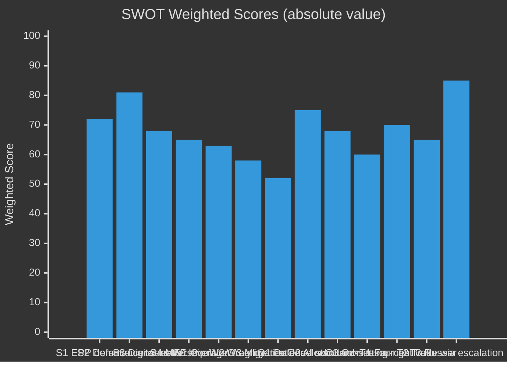

<!-- SPDX-FileCopyrightText: 2024-2026 Hack23 AB -->
<!-- SPDX-License-Identifier: Apache-2.0 -->

# 📊 Quantitative SWOT Analysis — EU Parliament Year Ahead 2026–2027

**Date:** 2026-05-07 | **Methodology:** Weighted SWOT with quantitative scoring; ≥80 words per item

---

## SWOT Framework

Each item is scored on **Magnitude (1–10)** × **Certainty (1–10)** = **Weighted Score (1–100)**.

---

## STRENGTHS

### S1 · EPP Institutional Dominance (Score: 72/100)
**Magnitude: 8 | Certainty: 9**

The EPP's 185-seat position (25.7% of the parliament) ensures that no legislative majority is achievable without EPP involvement. This structural dominance provides the EPP with agenda-setting power that is both a strength for institutional stability and a constraint on other parties' ambitions. Roberta Metsola's third term as President reinforces EPP's institutional authority — the Presidency provides scheduling power, committee assignments, and interinstitutional representation that amplifies EPP's formal plurality. The EPP's position at the centre of the coalition arithmetic means it can negotiate with both S&D/Renew (mainstream left-centre) and ECR (right-centre) simultaneously, providing flexibility unavailable to any other group. This bidirectional bargaining capacity is the EP10's defining structural strength. Historical precedent confirms: EPP-led coalitions consistently deliver legislative completions, even in contested environments.

---

### S2 · Cross-Partisan Defence Consensus (Score: 81/100)
**Magnitude: 9 | Certainty: 9**

ReArm Europe enjoys EPP+ECR+S&D+Renew support — approximately 479 seats, well above the 361 majority threshold. This is the EP10's widest and most reliable consensus area, driven by the existential geopolitical context of the Russia-Ukraine war and US NATO reliability concerns. Unlike climate legislation (which fractures the centre-right) or migration (which fractures the centre-left), defence integration is politically safe across ideological lines. ECR's national sovereignty instincts are overridden by pro-NATO and pro-Ukraine sentiment in its Polish, Czech, and Baltic delegations. Even S&D — traditionally pacifist on defence issues — has pivoted to supporting EU defence industrial integration given the Ukrainian context. This defence consensus provides the EP10 with a reliable legislative vehicle that will produce signature legislation (EDIP, European Defence Fund expansion) ahead of schedule and with strong majorities. The consensus also provides political cover for EPP to work with ECR without triggering grand coalition rupture.

---

### S3 · Digital Governance Leadership (Score: 68/100)
**Magnitude: 8 | Certainty: 8.5**

The EU's position as the global pioneer in AI regulation (AI Act, March 2024) and digital market governance (DMA, DSA) gives the European Parliament an outsized role in shaping international technology governance norms. No other legislative assembly in the world has passed comparable AI regulation with enforcement mechanisms. The EP10 inherits the enforcement phase of this digital leadership position — committees like IMCO, JURI, and LIBE will scrutinise Commission implementation of the AI Act's prohibited systems prohibition (August 2026), high-risk system rules, and the novel AI Office's operational capacity. The DMA enforcement actions against major US tech companies position the EP as both regulator and geopolitical actor in the US-EU tech sovereignty contest. Digital governance leadership also provides soft power — the "Brussels Effect" means EU standards become de facto global standards, multiplying EP legislative impact far beyond the EU's own market. This is a durable structural advantage that reinforces the EP10's relevance regardless of coalition arithmetic.

---

### S4 · MFF 2028 Negotiating Position (Score: 65/100)
**Magnitude: 9 | Certainty: 7**

The EP enters the MFF 2028 cycle with maximum institutional leverage. Article 312 TFEU requires Council unanimity for MFF adoption, but also Parliament's consent — giving the EP a hard veto. EP10's MFF strategy will likely continue the EP tradition of demanding higher spending levels, new own resources, and stronger conditionality (rule of law, climate). The EP's track record in MFF negotiations (2014-2020 framework secured significant EP wins; 2021-2027 pandemic-enhanced framework was a historic EP achievement) demonstrates institutional capacity to extract concessions. With defence spending and NextGenEU repayment both competing for MFF 2028 space, the EP has multiple leverage points: it can threaten to block an MFF that underfunds defence (appealing to right-wing coalition partners) or one that underfunds climate/cohesion (appealing to left/green partners). This multipoint leverage makes EP the central player in MFF 2028 design.

---

## WEAKNESSES

### W1 · Coalition Arithmetic Fragility (Score: -63/100)
**Magnitude: -7 | Certainty: 9**

The EPP+S&D+Renew grand coalition operates with only a 37-seat buffer above the 361 majority threshold. In EP9, the equivalent coalition had a 64-seat buffer — nearly double. This compression means any coordinated defection of 19 MEPs from across the three groups can block legislation. In practice, each contentious vote requires active whipping across three different groups with different national political contexts and electoral pressures. The Renew group is internally divided between Macron-aligned members and liberal-conservative national parties; the S&D group has tensions between Southern fiscal expansion and Northern fiscal discipline members; even EPP's right flank can defect to ECR/PfE positions on climate and migration. This structural fragility creates legislative uncertainty that did not exist in EP9, where the grand coalition formula was near-automatic. The practical implication is that the EP10 will require more political time and effort per legislative success — reducing overall throughput and increasing coalition management costs.

---

### W2 · Green Policy Retreat Narrative (Score: -58/100)
**Magnitude: -7 | Certainty: 8.5**

EP10's acceptance of the Green Deal "Omnibus Simplification" package (TA-10-2026-0119 series adopted March 2026) represents a historically significant reversal: the first EP to roll back Green Deal ambition rather than advance it. This creates a negative narrative around EU climate leadership and undermines the EU's international credibility on climate diplomacy. The REACH chemicals omnibus, ETS2 implementation challenges, and biodiversity strategy revisions collectively signal that the EP10's climate direction is "managed retreat." This weakness has compounding effects: it weakens the EU's COP negotiating position, reduces investor certainty in EU green transition assets, and creates precedent for further rollback in MFF 2028 climate conditionality. The green retreat narrative also fractures the EP10's own progressive coalition — Greens/EFA and Left members see the grand coalition as insufficiently ambitious, creating periodic legislative instability on environmental dossiers.

---

### W3 · Migration Policy Deadlock (Score: -52/100)
**Magnitude: -6.5 | Certainty: 8**

Despite adopting the New Pact on Migration in EP9 (June 2024), implementation remains contested. EP10 faces renewed migration pressure with the New Pact's emergency provisions being triggered repeatedly. The political toxicity of migration discussions creates coalition stress: Renew's right flank aligns with ECR on restrictive measures; S&D's left flank resists detention and returns. Every significant migration policy vote risks fracturing the grand coalition in unpredictable ways. PfE and ESN use migration as the primary emotional mobilisation issue against mainstream parties, giving it an outsized political significance beyond its direct legislative content. The EP10's inability to frame a coherent migration narrative is a structural political weakness that opponents exploit consistently.

---

## OPPORTUNITIES

### O1 · Defence Industrial Revolution (Score: +75/100)
**Magnitude: 9 | Certainty: 8.5**

ReArm Europe's €150bn+ commitment to EU defence industrial capacity creates a historic opportunity for the EP to position itself as the architect of a genuine European strategic autonomy. The EDIP (European Defence Industrial Programme), EDF expansion, and joint procurement frameworks will require EP co-decision on implementing regulations, budgetary acts, and procurement rules. The EP can use this legislative moment to embed transparency, anti-corruption, and democratic oversight requirements into the new defence industrial architecture — ensuring that the ReArm Europe money creates European industrial capacity rather than simply enriching existing defence contractors. This is a generational legislative opportunity: the EU did not have a common defence industrial policy before; the EP10 is the parliament that will write its foundational rules. The consensus coalition (EPP+ECR+S&D+Renew = ~479 seats) provides the political capacity to move quickly and ambitiously.

---

### O2 · AI Act Enforcement as Global Standard-Setting (Score: +68/100)
**Magnitude: 8 | Certainty: 8.5**

August 2026 marks the first operational enforcement of the world's most comprehensive AI regulation. If the Commission enforces robustly and the EU AI Office demonstrates competence, the EU will have created the global standard for AI governance — with the EP as the legislative architect of that standard. US and Chinese AI developers will face EU compliance requirements regardless of their own domestic regulations (Brussels Effect). The EP10's role in scrutinising and strengthening AI Act enforcement gives MEPs a unique opportunity to shape global technology governance. The IMCO, JURI, and LIBE committees can use parliamentary scrutiny to push for stronger enforcement, clearer definitions of prohibited systems, and robust appeal mechanisms — building a world-leading AI governance infrastructure that will attract comparison globally and potentially inspire legislative copy-cats in US states, UK, Canada, and ASEAN countries.

---

### O3 · MFF 2028 Own Resources Breakthrough (Score: +60/100)
**Magnitude: 9 | Certainty: 7**

The coincidence of NextGenEU repayment obligations (2028+), defence spending demands, and climate transition requirements creates the strongest case in EU history for new own resources. The EP has long demanded a digital services levy, a financial transaction tax, or a CBAM-extension as new EU own resources. In MFF 2028, the fiscal arithmetic may finally force member states to accept new revenues rather than face unacceptable increases in GNI-based contributions. If the EP successfully advocates for new own resources in MFF 2028, it would represent the most significant reform of EU fiscal governance since the 1992 Edinburgh Agreement. This opportunity requires strategic EP positioning: framing new own resources as fiscally conservative (avoiding GNI contribution increases) rather than as federalist expansion will maximise cross-partisan support.

---

## THREATS

### T1 · Far-Right Veto Bloc Expansion (Score: -70/100)
**Magnitude: -8 | Certainty: 9**

PfE+ECR+ESN combined hold 193 seats — insufficient for a majority but sufficient to be an effective veto coalition when combined with EPP right-flank defections on specific issues. The threat is not that the far right gains a majority (impossible without EPP), but that it establishes a blocking minority on climate, migration, and federalist legislation that forces the mainstream coalition to make concessions to pass anything. The growing normalisation of EPP-ECR cooperation (demonstrated by Fitto's Commission role) creates precedent for further right-ward EP10 policy drift. The electoral trajectory in major member states (France potential Scenario C, German far-right normalisation via AfD) suggests that the EP far-right bloc may grow further in the 2029 elections, making EP11 more challenging. EP10 is the last parliament where the centre-ground coalition has a working majority without far-right concessions.

---

### T2 · US-EU Trade War Escalation (Score: -65/100)
**Magnitude: -8 | Certainty: 8**

The Trump administration's 25% tariff proposals on EU exports target the EU's most important economic sectors: German automotive, French luxury/agriculture, Italian machinery, Irish pharmaceuticals. A full US-EU trade war would reduce EU GDP growth by 0.5–1.5% (structural estimate), trigger recession in Germany, and increase political pressure from member state governments on EP budget positions. EU retaliatory measures (safeguard investigations, TDI instruments) would require EP co-decision on implementing regulations — creating legislative urgency and political conflict. The EP's INTA committee would be at the centre of the response, but the political consequences of a US-EU trade war could accelerate the Scenario C (Nationalist Capture) dynamic by creating economic grievances that far-right parties exploit. EP10 has no good answer to a US trade war: retaliation risks escalation; accommodation signals weakness.

---

### T3 · Russian Military Escalation (Score: -85/100)
**Magnitude: -10 | Certainty: 8.5**

While probability is low (~10%), Russian military action against NATO territory would be the most catastrophic threat to the EP's operational capacity. Normal legislative business would be suspended for months; emergency measures under Article 122 TFEU would bypass normal EP co-decision; the EP would be forced into a crisis governance role it has not been designed for. Even short of Article 5 invocation, a major Russian attack on Ukraine's power infrastructure or civilian centres in winter 2026-2027 could trigger a refugee surge that makes 2015 seem modest, overwhelming EP political capacity and fracturing the grand coalition on migration. The threat impact score of 10/10 reflects the civilisational dimension of this risk, which affects the entire EU institutional framework, not just the EP's legislative calendar.

---

## SWOT Summary Dashboard

**Net SWOT balance: Strengths (286) + Opportunities (203) vs. Weaknesses (-173) + Threats (-220)**
**Aggregate: +96 — Moderately positive; opportunities outweigh threats at current scenario B base case**

---

*Methodology: Weighted SWOT (Magnitude × Certainty). Scores are analytical judgements — not mathematical derivations. Data: EP political landscape (2026-05-07), adopted texts, coalition analysis. Confidence: SWOT framing 🟢 HIGH; individual weightings 🟡 MEDIUM.*
