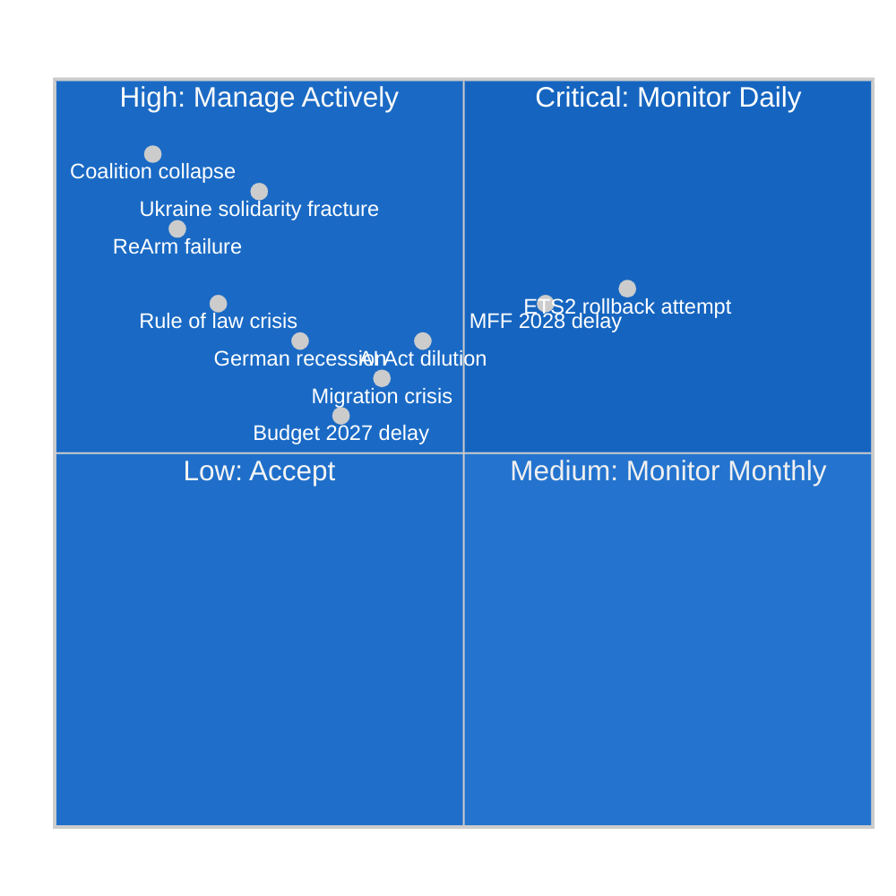
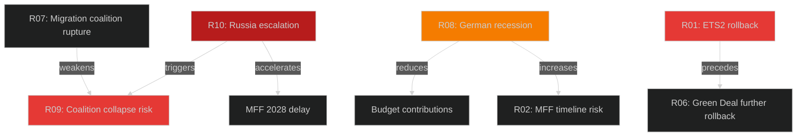

<!-- SPDX-FileCopyrightText: 2024-2026 Hack23 AB -->
<!-- SPDX-License-Identifier: Apache-2.0 -->

# ⚠️ Risk Matrix — EU Parliament Year Ahead 2026–2027

**Date:** 2026-05-07 | **Methodology:** Probability × Impact risk register with legislative velocity adjustment

---

## 1 · Risk Scoring Matrix

---

## 2 · Risk Register

| Risk ID | Risk Description | Probability | Impact | Severity | Mitigation |
|---|---|---|---|---|---|
| R01 | ETS2 MSR rollback attempt succeeds | 🟡 35% | 🔴 HIGH | **CRITICAL** | S&D+Renew+Greens defence coalition; EPP mainstream must hold |
| R02 | MFF 2028 position delayed beyond Q1 2027 | 🟡 60% | 🟡 MEDIUM | **HIGH** | EP internal timetable management; committee coordination |
| R03 | AI Act enforcement substantially diluted | 🟡 45% | 🟡 HIGH | **HIGH** | JURI+LIBE committee oversight; public scrutiny pressure |
| R04 | Ukraine Facility funding delayed by PfE tactics | 🟡 30% | 🔴 HIGH | **HIGH** | ECR majority supportive; procedural management |
| R05 | Budget 2027 prolonged trilogue (>Dec 2026) | 🟡 35% | 🟡 MEDIUM | **MEDIUM** | Historical precedent: budget almost always passes; EP leverage |
| R06 | Green Deal omnibus goes further than planned | 🟡 40% | 🟡 MEDIUM | **MEDIUM** | Progressive coalition vigilance; amendment scrutiny |
| R07 | Migration policy creates coalition rupture | 🟡 45% | 🟡 MEDIUM | **MEDIUM** | Managed disagreement; avoid forcing votes on most contested issues |
| R08 | German economic shock impacts EU budget contributions | 🟡 30% | 🟡 HIGH | **HIGH** | Budget flexibility mechanisms; Commission contingency planning |
| R09 | Coalition collapse (EPP+S&D+Renew loses working majority) | 🔴 15% | 🔴 CRITICAL | **HIGH** | EPP institutional commitment to EU; Metsola leadership |
| R10 | Russia military escalation disrupts EP calendar | 🔴 10% | 🔴 CRITICAL | **HIGH** | NATO Article 5 response protocol; EP emergency procedures |

---

## 3 · Top 5 Risk Profiles

### R01 — ETS2 MSR Rollback Attempt (CRITICAL)

**Context:** The ETS2 (buildings and road transport) Market Stability Reserve is the second major carbon pricing mechanism after ETS1. Right-wing blocs (PfE+ECR+ESN) have repeatedly targeted carbon pricing as anti-competitiveness.

**Attack scenario:** PfE+ECR+ESN+EPP-right-flank tables amendment to implementing regulations in October 2026. Combined vote: ~200–220 + up to 30 EPP defections = potential 250. Defence coalition: EPP-mainstream+S&D+Renew+Greens+Left = ~350+.

**Assessment:** Attack will fail if EPP holds, but EPP right flank defections are real risk. Each individual vote is not a clear rollback, but cumulative amendment success could hollow out ETS2's effectiveness.

**Risk evolution:** If Scenario C (Nationalist Capture) occurs, probability rises to 65%+.

---

### R03 — AI Act Enforcement Dilution (HIGH)

**Context:** August 2026 deadline for prohibited AI systems compliance. Commission AI Office must be ready with enforcement infrastructure by then. Industry lobbying has been intensive.

**Dilution vectors:**
1. Under-resourced AI Office fails to process complaints promptly
2. Implementing acts define "prohibited systems" narrowly (industry-friendly interpretation)
3. National competent authorities fail to coordinate (enforcement fragmentation)
4. Transitional period extensions become permanent delays

**EP response capacity:** JURI+LIBE+IMCO committees have jurisdictional interest; EP can adopt resolutions demanding enforcement reports, but cannot force Commission action.

---

### R02 — MFF 2028 Timeline (HIGH)

**Context:** Commission proposal expected late 2026; EP negotiating position needed Q1 2027; Council agreement requires unanimity — multiple veto threats from Hungary, Poland-right, Nordic frugal states.

**Risk materialisation:** MFF not agreed by 2027 → provisional twelfths from January 2028 → EU operational paralysis in cohesion funding disbursements.

**Historical precedent:** MFF 2021-2027 was agreed in 2020 after COVID stimulus accelerated consensus. Without a unifying crisis, MFF 2028 may follow the prolonged 2014-2020 pattern (2+ years of negotiation).

---

## 4 · Risk Interdependencies

---

## 5 · Risk Heatmap Summary

| Severity | Count | Key Risks |
|---|---|---|
| 🔴 CRITICAL | 1 | ETS2 MSR rollback (if attack succeeds) |
| 🔴 HIGH | 4 | Coalition collapse, Russia escalation, Ukraine solidarity, German recession |
| 🟡 MEDIUM | 5 | MFF delay, AI enforcement, budget delay, omnibus creep, migration |
| 🟢 LOW | 0 | No low-severity items identified in top register |

**Overall Risk Level: 🟡 ELEVATED** — Multiple HIGH-severity risks active; none currently at CRITICAL threshold. Monitor monthly.

---

*Methodology: Probability × Impact risk register; independence-adjusted compounding for interdependent risks. Data: EP political landscape, adopted texts, structural analysis. Confidence: Probability estimates 🟡 MEDIUM; impact assessments 🟢 HIGH.*
