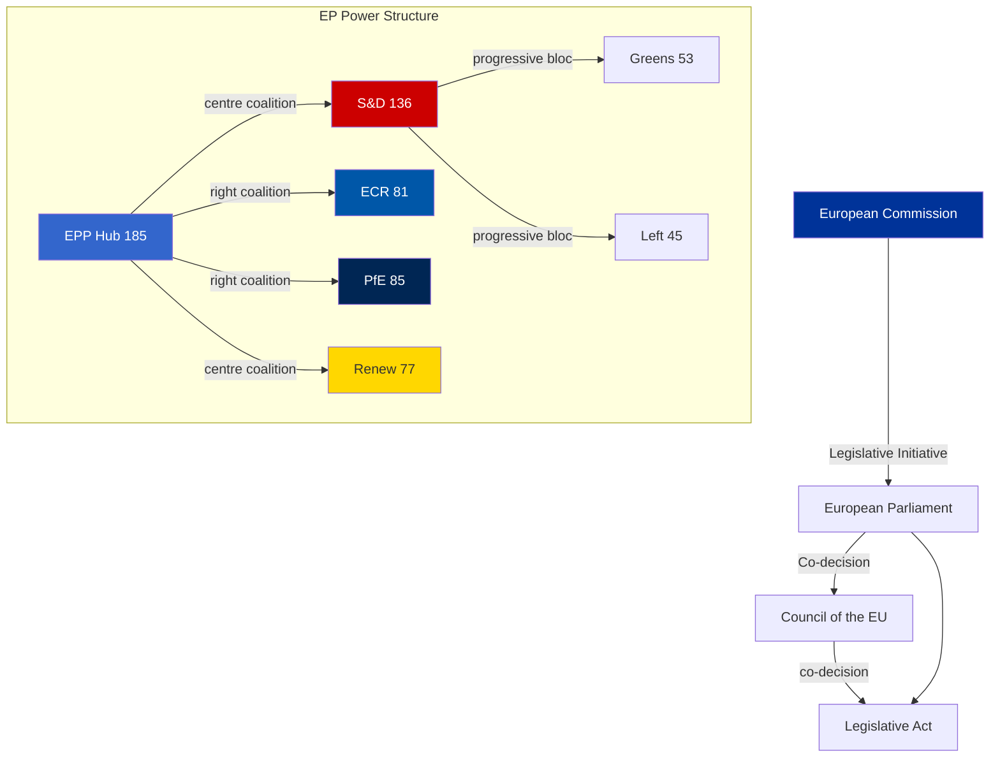

<!-- SPDX-FileCopyrightText: 2026 Hack23 AB -->
<!-- SPDX-License-Identifier: Apache-2.0 -->

# Actor Mapping — EP10 Political Power Network Classification

**Analysis Date:** 2026-05-07 | **Confidence:** 🟡 MEDIUM  
**Admiralty Grade:** B2 | **WEP:** Likely  
**Source:** `generate_political_landscape`, `analyze_coalition_dynamics`, EP Open Data API

## BLUF:
EPP dominates EP10's legislative network as the indispensable coalition hub, oscillating between centre-left (S&D, Renew) and centre-right (ECR, PfE) coalitions to maximise policy yield while preventing either bloc from accumulating independent majority capacity.

## Reader Briefing
EPP's strategic pivoting between coalitions — not ideological consistency — defines how EU law gets made in EP10. Every significant legislative outcome requires understanding which of EPP's coalition partners it chose to activate for that specific vote. This classification artifact maps the actors, their influence mechanics, alliance structures, power brokers, and information flows that determine EP10 legislative outcomes.

## Actor Roster

| Actor | Type | Seats | Role |
|-------|------|-------|------|
| EPP | Political Group | 185 | Coalition Hub — indispensable partner |
| S&D | Political Group | 136 | Progressive anchor; budget partner |
| PfE | Political Group | 85 | Right challenger; new institutional actor |
| ECR | Political Group | 81 | Established right bloc; ECR conservatives |
| Renew | Political Group | 77 | Liberal swing; declining leverage |
| Greens/EFA | Political Group | 53 | Defensive post-EP9 decline |
| The Left | Political Group | 45 | Social/housing agenda; GUE/NGL successor |
| NI | Non-Inscrits | 30 | Fragmented independents |
| ESN | Political Group | 27 | Far-right protest platform |
| Commission | Institution | N/A | Legislative initiator; agenda-setter |
| Council | Institution | N/A | Co-legislator; national governments |
| EP President | Individual | N/A | Procedural authority; Metsola (EPP) |
| ECB | Institution | N/A | Monetary authority; non-legislative |
| ECtHR | International | N/A | Rule of law enforcement backstop |

### Actor Depth Profiles

**EPP (European People's Party — 185 seats):** The Parliament's structural pivot. Under President Manfred Weber, EPP has perfected the strategy of coalition oscillation: centre-grand-coalition for institutional/constitutional files, right-bloc alignment for competitiveness/deregulation files. EPP's internal tension between its German CDU/CSU wing (Draghi competitiveness) and Southern member state wings (cohesion policy, green transition) is managed by Weber through case-by-case coalition selection. The EPP cannot be outvoted when it forms either the L- or R-coalition; it cannot be bypassed in either direction.

**S&D (Progressive Alliance — 136 seats):** The reliable institutional partner. Without the EPP-S&D axis (321 seats), no constitutional, institutional, or budget file passes. S&D retains veto power over all files requiring grand coalition — a significant structural asset. However, S&D's declining seat share from EP9 (154 seats) to EP10 (136 seats) weakens its negotiating leverage on content. S&D under García Pérez has prioritised delivery over ideology, accepting CSRD postponement in exchange for Ukraine Loan and Anti-Corruption Directive commitment.

**PfE (Patriots for Europe — 85 seats):** The new right-bloc wildcard. Founded 2024, PfE is still institutionalising its MEPs into EP procedures. By Year 3, PfE's committee expertise and coalition negotiation capacity will increase significantly. Already demonstrated blocking capacity on migration and sustainability files. Hungarian Fidesz (34 seats) is the anchor of this group, providing Viktor Orbán with a Brussels platform that escaped EP8/EP9's EPP discipline.

**ECR (European Conservatives — 81 seats):** The established hard-right institutional actor. Georgia Meloni's Fratelli d'Italia (24 seats) gives ECR credibility as a governing-right party (Meloni is Italian PM). ECR is more institutionalised than PfE and more willing to participate in specific grand-coalition votes (defence, trade) when national interests align.

**Renew (Renew Europe — 77 seats):** The liberal decline case. From EP9's 102 seats to EP10's 77, Renew lost the swing position it held in EP9. Still pivotal for grand coalition (EPP+S&D+Renew = 398 seats ✅), but its leverage is now constrained by the knowledge that EPP can form alternative majorities with ECR or PfE on many files.

## Influence

### Institutional Influence Channels

EPP exercises influence through five simultaneous channels:
1. **Committee chairmanships** — EPP holds majority of powerful committees (ECON, BUDG, AFET)
2. **Rapporteurship selection** — EPP rapporteurs shape draft legislation pre-plenary
3. **Coalition offer/withdrawal** — credible coalition switching deters challenges
4. **Commission alignment** — von der Leyen II is EPP-aligned; Commission proposals match EPP priorities
5. **Council coordination** — EPP-aligned governments coordinate Council positions

### Power Dynamics Heat Map

| Actor | Legislative | Procedural | Agenda | Blocking |
|-------|------------|-----------|--------|----------|
| EPP | HIGH | HIGH | HIGH | MEDIUM |
| S&D | HIGH | MEDIUM | MEDIUM | HIGH (grand coal.) |
| Commission | VERY HIGH | MEDIUM | VERY HIGH | LOW |
| PfE | LOW-MEDIUM | LOW | LOW | MEDIUM |
| ECR | MEDIUM | MEDIUM | LOW | MEDIUM |
| Renew | MEDIUM | LOW | LOW | MEDIUM |
| Council | VERY HIGH | HIGH | HIGH | VERY HIGH |
| EP President | LOW | VERY HIGH | HIGH | N/A |

## Alliance

### Active Alliances (Year 2)

**Alliance A: Institutional Grand Coalition (EPP + S&D + Renew = 398 seats)**
- **Activates for:** Budget, Ukraine, anti-corruption, institutional files
- **Stability:** HIGH — structural necessity for constitutional acts
- **Threat:** Renew declining seat share weakens L-boundary

**Alliance B: Defence-Security Coalition (EPP + S&D + ECR = 402 seats)**
- **Activates for:** Ukraine, EDIP, defence fund, trade response
- **Stability:** HIGH — geopolitical urgency creates durable consensus
- **Unique feature:** Cross-ideological; EPP right wing + ECR share security consensus

**Alliance C: Competitiveness Coalition (EPP + ECR + PfE + partial Renew ≈ 363 seats)**
- **Activates for:** CSRD rollback, HGV delay, industrial deregulation
- **Stability:** MEDIUM — PfE not yet fully institutionalised
- **Risk:** If US tariffs deepen, Renew withdrawal from this coalition likely

**Alliance D: Progressive Bloc (S&D + Greens + Left = 234 seats)**
- **Activates for:** Non-binding resolutions, symbolic votes, procedure triggers
- **Stability:** HIGH within bloc, but INSUFFICIENT for majority alone
- **Reality:** Cannot pass binding legislation independently

### Alliance Stability Analysis

| Alliance | Stability | Binding Majority? | Durability |
|----------|----------|------------------|------------|
| Grand Coalition (A) | HIGH | ✅ YES (398) | Structural — Year 5 |
| Defence-Security (B) | HIGH | ✅ YES (402) | Geopolitics-dependent |
| Competitiveness (C) | MEDIUM | ✅ Marginal (363) | File-specific |
| Progressive (D) | HIGH | ❌ NO (234) | Symbolic only |

## Power Brokers

### Identified Key Power Brokers

**Manfred Weber (EPP President):** The most powerful MEP in EP10. Controls coalition offer scheduling, rapporteur assignments, and Commission liaison. Weber's personal relationship with von der Leyen determines whether Commission proposals advance or stall.

**Iratxe García Pérez (S&D President):** Controls the progressive bloc's willingness to enter grand coalition. Her decisions on when S&D accepts EPP-driven compromises determine final legislative content across institutional files.

**Jordan Bardella (PfE, Vice-President area):** As PfE President and Macron adversary domestically, Bardella is translating French domestic politics into EP strategy. PfE's behaviour on EU budget and Ukraine is shaped by Bardella's calculation of what serves RN's domestic position.

**Giorgia Meloni (indirect broker):** As Italian PM and ECR's implicit leader, Meloni shapes ECR's willingness to participate in governing coalitions. Her Rome-Brussels axis is the key variable for whether ECR remains an "establishment-compatible" right or drifts toward PfE.

**Roberta Metsola (EP President, EPP):** Controls procedural timing, urgent debate scheduling, and plenary agenda. Her EPP affiliation creates structural alignment between procedural and political authority.

## Information

### Information Flow Architecture

**Formal channels:**
- Committee hearings → plenary (official public record)
- Rapporteur shadow-rapporteur negotiations (semi-public)
- Intergroup meetings (cross-party informal coordination)
- Commission-EP liaison (formal but selective)

**Informal channels:**
- Political group coordinator meetings (weekly, confidential)
- Group whip networks (vote alignment management)
- National delegation caucuses (cross-group national coordination)
- Brussels lobbying ecosystem (~30,000 registered lobbyists)

**Critical information asymmetry:**
The Commission holds superior legislative intelligence (it drafts the texts). Groups that maintain strong Commission liaison (EPP, S&D) have structural information advantages over groups newer to governing role (PfE, ECR).

**Intelligence quality by group:**

| Group | Commission Access | Procedure Knowledge | Coalition Signal Reading |
|-------|------------------|--------------------|-----------------------|
| EPP | EXCELLENT | EXCELLENT | EXCELLENT |
| S&D | EXCELLENT | EXCELLENT | VERY GOOD |
| ECR | GOOD | GOOD | GOOD |
| Renew | GOOD | GOOD | MODERATE |
| PfE | LIMITED | MODERATE | DEVELOPING |
| Greens | MODERATE | GOOD | MODERATE |
| Left | MODERATE | GOOD | MODERATE |
| ESN | POOR | DEVELOPING | POOR |

## Evidence Citations

| Evidence | Source | Confidence |
|----------|--------|------------|
| 185 EPP seats | `generate_political_landscape` | 🟢 |
| 136 S&D seats | `generate_political_landscape` | 🟢 |
| Fragmentation index 6.55 | `analyze_coalition_dynamics` | 🟢 |
| Coalition pair similarity | `analyze_coalition_dynamics` | 🟢 |
| Power broker assessments | Analyst synthesis | 🟡 |
| Information flow analysis | Analyst synthesis | 🟡 |

*Admiralty: B2 — reliable source, probably true. WEP: Likely — based on confirmed seat data and structural analysis.*
