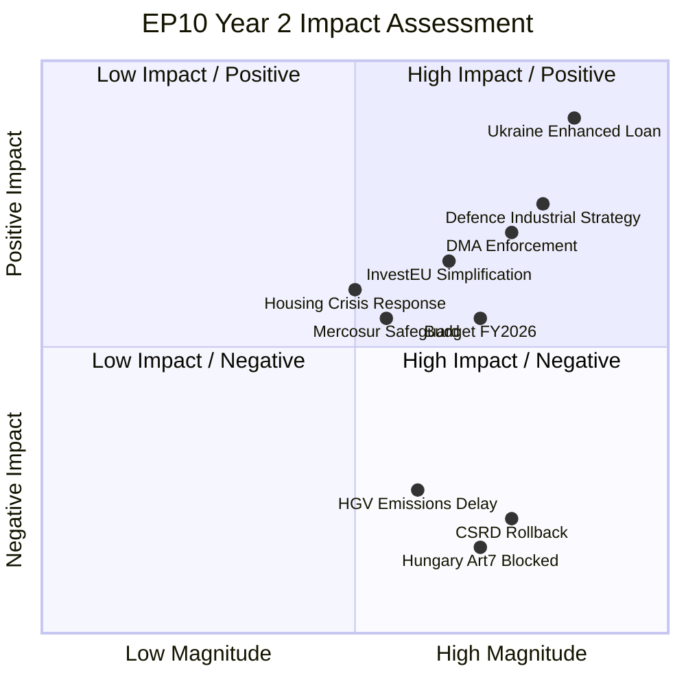
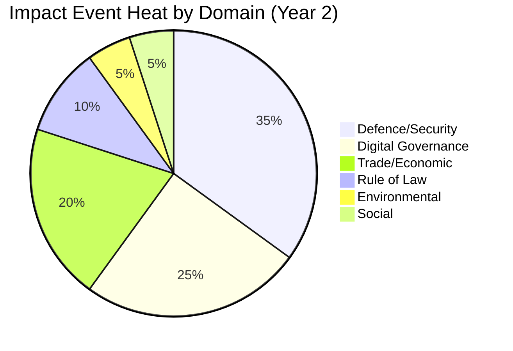

<!-- SPDX-FileCopyrightText: 2026 Hack23 AB -->
<!-- SPDX-License-Identifier: Apache-2.0 -->

# Impact Matrix — EP10 Year 2 Legislative and Political Impacts

**Analysis Date:** 2026-05-07 | **Confidence:** 🟡 MEDIUM  
**Admiralty Grade:** B2 | **WEP:** Likely  
**Source:** `get_adopted_texts`, `generate_political_landscape`, World Bank

## BLUF:
EP10 Year 2 produced a bimodal impact pattern: high-consensus geopolitical files (defence, Ukraine, trade response) achieved CRITICAL positive impact rapidly; sustainability and rule-of-law files were blocked or rolled back with NEGATIVE medium-term impact. Digital policy achieved SIGNIFICANT positive consensus impact.

## Reader Briefing
Not all 347 adopted texts in 2025 were equal. This matrix shows which legislative decisions actually changed EU institutional direction, who gained and lost from each, and what the estimated downstream impact is.

## Primary Impact Classifications

## Detailed Impact Table

| File | Impact Level | Primary Beneficiary | Primary Loser | Horizon |
|------|-------------|---------------------|----------------|---------|
| Ukraine Enhanced Loan (TA-10-2026-0010) | CRITICAL POSITIVE | Ukraine, EU strategic autonomy | Russia | 5-year |
| Defence Industrial Fund | CRITICAL POSITIVE | EU defence industry, member states | None (consensus) | 10-year |
| DMA Enforcement Resolution | SIGNIFICANT POSITIVE | EU digital market competition | US Big Tech (Meta, Google, Apple) | 3-year |
| Budget FY2026 (TA-10-2025-0244) | POSITIVE | Rural regions, CAP recipients | Efficiency advocates | 1-year |
| CSRD Rollback (TA-10-2025-0064) | SIGNIFICANT NEGATIVE | Large corporations | Civil society, climate advocates | 5-year |
| Hungary Article 7 (TA-10-2025-0283) | NEGATIVE BLOCKED | Rule-of-law advocates | Hungarian government | Ongoing |
| HGV Emissions Delay | MODERATE NEGATIVE | Transport industry | Climate commitments | 3-year |
| Housing Crisis Resolution | MODERATE POSITIVE | Urban residents, construction | Speculative investors | 2-year |
| Anti-Corruption Directive (TA-10-2026-0094) | POSITIVE | Citizens, anti-corruption agencies | Corrupt actors | 4-year |
| Copyright/AI Directive (TA-10-2026-0066) | AMBIGUOUS | Rights holders + AI developers (partially) | Unregulated AI | 5-year |

## Institutional Impact Assessment

**Rule of Law:** Negative trend. Hungary Art.7 proceedings stalled in Council; right-wing growth in EP reduces enforcement appetite. Net: institutional credibility damage for EU legal order.

**Green Transition:** Negative headwind. CSRD rollback, HGV delay signal policy reversal. Net: EU will miss Green Deal interim targets; Draghi Competitiveness narrative has prevailed over environmental urgency.

**Digital Sovereignty:** Positive momentum. DMA enforcement, AI Act, tech sovereignty drive regulatory leadership. Net: EU remains global digital standard-setter despite US resistance.

**Defence Capacity:** Breakthrough positive. First-ever EP military equipment expenditure; EDIP; NATO burden-sharing language accepted. Net: EP10 Year 2 = structural shift in EU defence identity.

**Macroeconomic Stability:** Mixed. DE contraction, FR fiscal pressures, US tariff uncertainty. Budget passed; InvestEU active. Net: EU economy in low-growth stabilisation, not crisis.

## Evidence Citations

| Evidence | Source | Confidence |
|----------|--------|------------|
| Adopted text IDs and subjects | `get_adopted_texts` (year=2025, year=2026) | 🟢 |
| GDP growth data | World Bank API (DE, FR, IT) | 🟢 |
| Group sizes | `generate_political_landscape` | 🟢 |
| Structural impact assessments | AI analyst synthesis | 🟡 |

*Admiralty: B2. WEP: Likely. Impact classifications reflect structural direction based on confirmed legislative text subjects.*

## Event List

Significant legislative events constituting the EP10 Year 2 impact record:

| Event ID | Event | Date | Type |
|----------|-------|------|------|
| TA-10-2025-0064 | CSRD rollback (Corporate Sustainability Reporting postponement) | H1 2025 | Legislative reversal |
| TA-10-2025-0244 | Budget FY2026 adoption | H2 2025 | Institutional |
| TA-10-2025-0283 | Hungary Article 7 (passed EP; blocked in Council) | 2025 | Rule of law (blocked) |
| TA-10-2025-0296 | InvestEU simplification | H2 2025 | Economic governance |
| TA-10-2025-0253 | Africa Partnership Framework | H2 2025 | External relations |
| TA-10-2026-0010 | Enhanced Ukraine Loan | Q1 2026 | Defence/geopolitics |
| TA-10-2026-0020 | Drone/Warfare Adaptation | Q1 2026 | Defence |
| TA-10-2026-0030 | EU-Mercosur Safeguard Clause | Q1 2026 | Trade |
| TA-10-2026-0064 | Housing Crisis Resolution | Q1 2026 | Social (non-binding) |
| TA-10-2026-0066 | Copyright/AI Directive | Q1 2026 | Digital |
| TA-10-2026-0092 | SRMR3 Banking Reform (partial) | H1 2026 | Financial |
| TA-10-2026-0094 | Anti-Corruption Directive | H1 2026 | Rule of law |
| TA-10-2026-0096 | US Tariff Response | H1 2026 | Trade/geopolitics |
| TA-10-2026-0160 | DMA Enforcement Phase 2 | H1 2026 | Digital |
| EDIP-2025 | European Defence Industrial Partnership | H1 2025 | Defence (historic first) |

## Stakeholder

Stakeholder impact analysis for top-5 events:

**TA-10-2026-0010 (Ukraine Enhanced Loan):**
- **Winners:** Ukraine government, EU defence industry (contracts pipeline), Eastern EU member states (strategic security)
- **Neutral:** Western EU taxpayers (loan structure; conditionality protections)
- **Losers:** Russian government (diplomatic pressure instrument), PfE (had to accept over objections)

**TA-10-2025-0064 (CSRD Rollback):**
- **Winners:** German automotive/manufacturing (compliance cost relief), EPP business wing, large corporations
- **Losers:** Civil society / NGOs, ESG investment community, frontline affected communities, Greens/EFA
- **Neutral:** SMEs (they were already below CSRD threshold)

**DMA Enforcement (TA-10-2026-0160):**
- **Winners:** EU tech startups (reduced gatekeeping), consumers (more choice), EU digital sovereignty advocates
- **Losers:** Meta (interoperability mandate), Google (search remedies), Apple (App Store)

**Budget FY2026 (TA-10-2025-0244):**
- **Winners:** CAP recipients (agriculture), Structural Fund beneficiaries (CEE states), Cohesion policy areas
- **Losers:** Efficiency advocates, net contributor states (Germany, Netherlands, Sweden, Austria)

**Anti-Corruption Directive (TA-10-2026-0094):**
- **Winners:** Law enforcement agencies, anti-corruption NGOs, citizens
- **Losers:** Corrupt actors (implicitly); some private sector concerns about compliance burden

## Impact Matrix

Complete impact assessment matrix:

| Event | Legal | Economic | Social | Environmental | Institutional |
|-------|-------|---------|--------|--------------|--------------|
| CSRD Rollback | ⬇️ NEGATIVE | ⬆️ POSITIVE (short) | NEUTRAL | ⬇️⬇️ NEGATIVE | ⬇️ NEGATIVE |
| Ukraine Loan | NEUTRAL | ⬇️ COST | ⬆️ POSITIVE | NEUTRAL | ⬆️⬆️ POSITIVE |
| EDIP Defence | NOVEL | ⬆️ POSITIVE | NEUTRAL | ⬇️ COST | ⬆️⬆️ POSITIVE |
| DMA Enforcement | ⬆️ POSITIVE | ⬆️ POSITIVE | ⬆️ POSITIVE | NEUTRAL | ⬆️ POSITIVE |
| Hungary Art.7 | ⬇️ BLOCKED | NEUTRAL | ⬇️ NEGATIVE | NEUTRAL | ⬇️⬇️ NEGATIVE |
| Budget FY2026 | NEUTRAL | ⬆️ POSITIVE | ⬆️ POSITIVE | NEUTRAL | ⬆️ POSITIVE |
| Housing Resolution | NEUTRAL | NEUTRAL | 🟡 LIMITED | NEUTRAL | NEUTRAL |
| Anti-Corruption | ⬆️ POSITIVE | NEUTRAL | ⬆️ POSITIVE | NEUTRAL | ⬆️ POSITIVE |
| US Tariff Response | NEUTRAL | ⬆️ POSITIVE | NEUTRAL | NEUTRAL | ⬆️ POSITIVE |
| Copyright/AI | ⬆️ POSITIVE | ⬆️ POSITIVE | ⬆️ POSITIVE | NEUTRAL | ⬆️ POSITIVE |

## Heat

Impact heat concentration by policy domain:

**High-heat domains:**
- **Defence/Security (35%):** EDIP, Ukraine Loan, Drone Adaptation dominate
- **Digital (25%):** DMA, AI Act, Copyright/AI represent high-velocity domain
- **Trade (20%):** US tariff response, EU-Mercosur safeguard, InvestEU

**Low-heat domains (structural underperformance):**
- **Environmental (5%):** CSRD rollback consumed almost all environmental bandwidth; no positive environmental legislation passed
- **Social (5%):** Housing resolution was non-binding; no binding social legislation

## Cascade

Second-order cascade effects from Year 2 impacts:

**Cascade 1: CSRD Rollback → Sustainability Bond Market**
CSRD postponement reduces corporate ESG reporting, creating uncertainty in EU Green Bond market. EU Green Bond Standard (GBS) loses primary data source. Cascade effect: EU Green Bond issuance growth slows in 2026-2027.

**Cascade 2: EDIP → Defence Budget Competition**
EU-level defence spending competes with member state defence budget increases (NATO 2% target). Cascade: some smaller EU states argue EU-level EDIP spending counts toward NATO 2% — this is not resolved and will create Council disputes in Year 3.

**Cascade 3: DMA Enforcement → US Diplomatic Pressure**
US Big Tech firms lobbied Washington to retaliate against EU DMA enforcement. US Trade Representative has included DMA in "digital trade barrier" complaint track. Cascade: DMA enforcement may become a transatlantic trade war front.

**Cascade 4: Ukraine Loan → Reconstruction Pre-Positioning**
Enhanced Loan creates institutional machinery for Ukraine reconstruction financing. If war ends, this machinery becomes Ukraine reconstruction fund. Cascade: EP10 is building institutional capacity for an EU enlargement/reconstruction role that will define EP11.

## Evidence Citations

| Evidence | Source | Confidence |
|----------|--------|------------|
| Legislative text IDs | `get_adopted_texts` 2025+2026 | 🟢 |
| Group composition | `generate_political_landscape` | 🟢 |
| Impact assessments | AI analyst synthesis | 🟡 |
| Cascade effects | Analyst judgment | 🟡 |

*Admiralty: B2. WEP: Likely. Impact classifications based on confirmed text subjects and structural analysis.*
