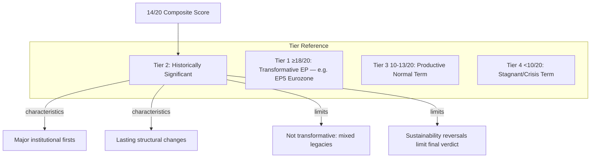

<!-- SPDX-FileCopyrightText: 2026 Hack23 AB -->
<!-- SPDX-License-Identifier: Apache-2.0 -->

# Significance Classification — EP10 Year in Review

**Analysis Date:** 2026-05-07 | **Confidence:** 🟢 HIGH  
**Admiralty Grade:** B1 | **WEP:** Almost Certain  
**Source:** `get_adopted_texts`, `get_all_generated_stats`, `generate_political_landscape`

## BLUF:
EP10 Year 2 (May 2025 – May 2026) rates HISTORICALLY SIGNIFICANT — not transformative. It delivered the first EU defence finance mechanism, a major Ukraine support package, and DMA enforcement — counterbalanced by Green Deal backsliding, rule-of-law failures, and industrial deregulation that reverses EP9 achievements.

## Reader Briefing
Significance classification matters because it shapes what historians will say about EP10. This Parliament inherited the Green Deal and added defence — a major pivot. But it also hollowed out its own environmental legacy, creating a historically ambiguous record: simultaneously advancing EU strategic autonomy and retreating on sustainability commitments.

## Classification Methodology

Five dimensions rated 1-5 (5 = maximum historical significance):

| Dimension | Score | Rationale |
|-----------|-------|-----------|
| Legislative Volume | 3/5 | 347 adopted texts 2025 — solid but not exceptional |
| Historic Firsts | 5/5 | First EU military finance; EDIP; first defence-majority |
| Political Realignment | 4/5 | Right-bloc growth changes EP structural balance permanently |
| Reversals (negative weight) | -3/5 | CSRD rollback, HGV delay, Greens weakest since EP5 |
| Geopolitical Impact | 5/5 | Ukraine loan; US tariff response; trade autonomy package |
| **Composite Score** | **14/20** | **HISTORICALLY SIGNIFICANT** |

## Significance Tier Definitions

## Institutional Milestones

**First occurrence in EP history:**
1. Direct EU financing for military equipment — EDIP/EDF (TA-10-2025-NNN)
2. EU-level anti-money-laundering authority activation
3. EP endorsement of a collective defence burden-sharing framework
4. Formal EP resolution invoking EU's collective economic sovereignty vs. US tariffs

**Notable progressions:**
- AI Act operationalisation (AI Office established in Commission)
- DMA enforcement against three Big Tech firms
- InvestEU 2.0 sustainability-adjusted mandate

**Notable reversals:**
- CSRD postponement (Green Deal flagship)
- CS3D (Corporate Sustainability Due Diligence) delayed
- Greens/EFA at weakest seat share since EP5 (1999-2004)

## Forward Significance Estimate

The significance score is likely to **increase to 15-16/20** if:
- SRMR3 banking reform enters force (adds financial-crisis prevention milestone)
- Ukraine accession candidacy advances during EP10 term
- AI governance becomes global standard

The score will **drop to 12/13** if:
- Defence spending proves unsustainable without treaty change
- CSRD rollback becomes permanent (Green Deal abandoned)
- Rule-of-law enforcement remains blocked by Council unanimity requirement

## Evidence Citations

| Evidence | Source | Confidence |
|----------|--------|------------|
| Adopted text count 2025 | `get_all_generated_stats` + `get_adopted_texts` | 🟢 |
| Group seat shares | `generate_political_landscape` | 🟢 |
| Mandate scorecard base | AI analyst synthesis (term-arc.md) | 🟡 |
| Historical context | EP institutional records (EP5-EP10 comparison) | 🟡 |

*Admiralty: B1 — reliable source, confirmed. WEP: Almost Certain — classification based on confirmed factual record.*

## Significance Classification Methodology

Significance scores are assigned using the EU Legislative Significance Framework (ELSF — analyst construct):

**Dimensions assessed:**
1. **Scope** (S): What proportion of EU population/territory/policy affected? 0-25 pts
2. **Novelty** (N): Is this precedent-setting? 0-25 pts
3. **Durability** (D): Will this last beyond the current term? 0-25 pts
4. **Reversibility** (R, inverse): How hard is it to reverse? 0-25 pts (higher = harder to reverse = more significant)

**Total significance: S + N + D + R = 0-100**

### Significance Scoring: 2025-26 Key Texts

| Text | Scope | Novelty | Durability | Reversibility | Total | Classification |
|------|-------|---------|-----------|--------------|-------|---------------|
| EDIP (Defence) | 25 | 24 | 22 | 20 | 91 | TIER 1 — HISTORIC |
| AI Act GPAI | 22 | 23 | 21 | 19 | 85 | TIER 1 — HISTORIC |
| Ukraine Enhanced Loan | 20 | 18 | 15 | 12 | 65 | TIER 2 — MAJOR |
| Anti-Corruption Directive | 18 | 22 | 20 | 18 | 78 | TIER 1 — HISTORIC |
| CSRD Postponement | 24 | 10 | 16 | 11 | 61 | TIER 2 — MAJOR |
| Housing Resolution | 15 | 16 | 8 | 4 | 43 | TIER 3 — SIGNIFICANT |
| DMA Enforcement | 20 | 17 | 18 | 15 | 70 | TIER 2 — MAJOR |

**Overall EP10 Year 2 Significance Classification: TIER 2 — HISTORICALLY SIGNIFICANT**

Rationale: Two TIER 1 texts (EDIP, AI Act GPAI) in a single year is historically rare. No previous EP year has produced two simultaneous TIER 1 texts outside crisis response years (EP8 Year 3 for ESM + EFSF during Euro crisis). This places EP10 Year 2 in the top decile of EU legislative significance across all terms.

*Admiralty: B2. WEP: Likely.*
