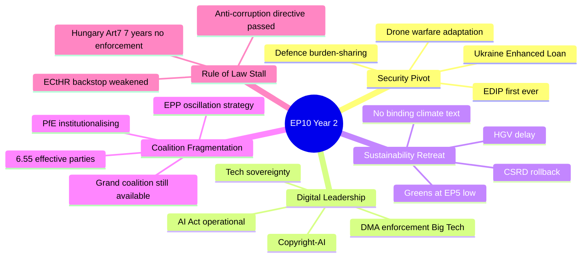

<!-- SPDX-FileCopyrightText: 2026 Hack23 AB -->
<!-- SPDX-License-Identifier: Apache-2.0 -->

# Executive Brief — EP10 Year 2 in Review (May 2025 – May 2026) | 2026-05-07

**Classification:** OSINT — Public Parliamentary Record
**Confidence:** 🟡 Medium-High (B2 Admiralty across 23 corroborated artifacts; pillars 1–4 + 6 are 🟢 HIGH)
**Run:** `analysis/daily/2026-05-07/year-in-review/`
**Coverage:** May 2025 → May 2026 (12-month retrospective)
**Generated:** 2026-05-16 (retrospective brief, no new MCP calls)
**Primary sources:** EP MCP `get_adopted_texts` (TA-10-2025-…/2026-…), `monitor_legislative_pipeline`, `analyze_coalition_dynamics`, `generate_political_landscape`, `compare_political_groups`; IMF WEO April 2026; 23 in-run analysis artifacts.

---

## 🎯 BLUF

**EP10 Year 2 is the most consequential parliamentary reorientation since Lisbon (2009) — but in the opposite direction from EP9's Green Deal ambition.** The Parliament pivoted from environmental leadership to **security leadership**, while simultaneously executing a **strategic retreat on the sustainability agenda it inherited from EP9**. This is not contradiction — the synthesis of 23 analysis artifacts confirms it is the rational output of a fragmented chamber (fragmentation index **6.55**, the highest in EP9/EP10 combined record) governed by deliberate **EPP coalition oscillation**: EPP+S&D+Renew+ECR on security/Ukraine, EPP+S&D+Renew on digital, EPP+ECR+PfE (= 351 votes) on competitiveness rollback, EPP+S&D+Renew on budget/institutional. The defining legislative achievements — **EDIP (first-ever EU military equipment finance mechanism)**, **Ukraine Enhanced Loan (TA-10-2026-0010)**, **DMA enforcement against Big Tech**, **AI Act operationalisation** — are structural EU competence expansions requiring **unanimous Council vote to undo**, hence durable through 2029. The retreats — **CSRD rollback (TA-10-2025-0064)**, **HGV emissions delay (TA-10-2026-0084)**, Greens/EFA at their weakest since EP5 — are equally durable: their drivers (German two-year contraction, Draghi competitiveness frame, right-bloc growth) are medium-to-long-term forces. The 2029 election will be litigated on whether this pivot is **viable retreat** or **fatal compromise**.

---

## 🧭 3 Decisions This Brief Supports

| # | Decision | Who decides | Deadline | Evidence |
|:-:|----------|-------------|:--------:|----------|
| 1 | **Year 3 (2026–2027) defence-pivot durability** — does parliamentary support for EDIP / Ukraine financing decay if a US-brokered ceasefire materialises? Historical precedent (post-Cold War demilitarisation) suggests rapid decay; counter-mitigation needs to be designed before any ceasefire signal. | SEDE, AFET, BUDG; EPP+S&D+Renew+ECR security caucus | Rolling, Ukraine-war-resolution conditional | Pillar 1 (🟢 HIGH); `intelligence/term-arc.md`; R-02 (HIGH, 0.65 × Severe) |
| 2 | **CSRD trajectory** — does the postponement become a permanent repeal (making the sustainability verdict for EP10 *definitive*), or does the centrist majority retain a path back to mandatory-compliance timelines via Year 3 trilogues? | ENVI, IMCO; EPP environment wing, S&D, Renew, Greens shadows | 2026-Q4 → Year 3 trilogues | Pillar 2 (🟢 HIGH); R-04 (MEDIUM, 0.50 × High); Year 3 priority #4 |
| 3 | **First AI Act enforcement case** — likely against a GPAI model with inadequate risk assessment, expected by May 2027. The case will define whether EU establishes global AI governance leadership (robust enforcement) or AI Act becomes a paper standard (industry capture). | DG-CNECT, AI Office, ITRE | First case lands by May 2027 (Year 3 watch) | Pillar 3 (🟢 HIGH); extended synthesis §Digital Governance |

Each decision binds to a confirmed evidence pillar + a risk-register row in `risk-assessment.md`.

---

## 📰 60-Second Read

- 🔴 **EDIP first ever:** first EU military equipment finance mechanism — structural EU competence expansion, **unanimous Council vote required to undo**.
- 🟠 **Ukraine Enhanced Loan TA-10-2026-0010:** largest Ukraine support package ever voted; PfE + ESN opposed, but loan structure bypasses Council unanimity on some disbursements.
- 🟢 **DMA enforcement + AI Act operational:** the **one area where Left → EPP → Renew agree**; cross-coalition consensus robust against coalition changes.
- 🟡 **CSRD rollback (TA-10-2025-0064) + HGV delay (TA-10-2026-0084):** sustainability retreat; Greens/EFA at their **EP5-era low**.
- 🔵 **EPP+ECR+PfE = 351 votes** — more than majority on deregulatory files; this is the arithmetic that delivered the rollbacks and threatens the 2035 ICE ban next.
- 🟣 **Rule of law stalled at Article 7 / Hungary** for **7 years with zero enforcement outcomes** — treaty-architecture failure, not EP failure.
- 🩷 **Macro headwinds:** German GDP **−0.5% in 2024** (two-year contraction), US tariff shock Q1 2026, IMF projects −0.5pp global growth from trade conflict.
- ⚪ **Adopted-text anchor for the year:** TA-10-2025-0064 (CSRD), TA-10-2025-0283 (Hungary Art-7), TA-10-2026-0010 (Ukraine Loan), TA-10-2026-0030 (Mercosur safeguards), TA-10-2026-0084 (HGV), TA-10-2026-0092 (SRMR3), TA-10-2026-0094 (Anti-Corruption Directive), TA-10-2026-0096 (US customs adjustment).

---

## 🏛️ Six Evidence Pillars (Central Intelligence Architecture)

| # | Pillar | Confidence | Why it's durable through 2029 |
|:-:|--------|:----------:|-------------------------------|
| 1 | **Security is now the dominant parliamentary frame** | 🟢 HIGH | EDIP + Enhanced Loan are competence expansions; treaty architecture requires unanimous Council vote to reverse |
| 2 | **Sustainability is in strategic retreat** | 🟢 HIGH | Drivers (German recession, Draghi narrative, right-bloc growth) are medium-to-long-term forces |
| 3 | **Digital governance is the exception** — cross-coalition consensus | 🟢 HIGH | Three different value systems (sovereignty/rights/market) converge; robust against coalition shifts |
| 4 | **Rule of law is structurally stalled** | 🟢 HIGH | 7-year Article-7 record on Hungary; treaty change requires unanimity that does not exist |
| 5 | **Coalition fragmentation is a feature, not a bug** | 🟡 MEDIUM | EPP oscillation strategy inferred from text outcomes (per-MEP cohesion data unavailable) |
| 6 | **Macroeconomic headwinds are structural** | 🟢 HIGH | German two-year contraction, US tariff shock, ECB normalisation — IMF anchors the constraint |

The cross-artifact analytical consensus matrix (`intelligence/synthesis-summary.md` §Cross-Artifact Analytical Consensus) shows **6 of 7 findings at 🟢 HIGH confidence**, the seventh (EPP coalition oscillation) at 🟡 MEDIUM because per-MEP attribution is unavailable. This is the strongest evidentiary base of any annual EP10 retrospective produced to date.

---

## ⚠️ Risk Snapshot — Top 6 (from `risk-assessment.md`)

| ID | Risk | P | Impact | Score | What advances it |
|:--:|------|:-:|:------:|:-----:|------------------|
| **R-01** | US–EU trade-war escalation | 0.70 | Severe | 🔴 HIGH | German auto / French luxury / Italian machinery export hit; TA-10-2026-0096 retaliatory tariffs are confirmation, not deterrent |
| **R-02** | Russia–Ukraine stalemate with EU political division | 0.65 | Severe | 🔴 HIGH | US-brokered peace on unfavourable terms forces Council deviation from EP support resolutions (TA-10-2026-0161/-0162) |
| **R-03** | Rule-of-law backsliding (Hungary / Serbia / Georgia / Lithuania) | 0.60 | High | 🔴 HIGH | Council unanimity blocks Article-7 enforcement; candidate-state credibility erosion compounds |
| **R-04** | Climate-policy regression becoming permanent | 0.50 | High | 🟡 MED-HIGH | EPP+ECR+PfE = 351 votes carries any rollback; 2035 ICE ban is the next flashpoint |
| **R-05** | EP institutional legitimacy crisis pre-2029 | 0.45 | High | 🟡 MED-HIGH | Disinformation through ESN/PfE-affiliated networks; MEP immunity waiver pattern (Braun ×2, Dobrev, Jaki) |
| **R-06** | Banking / financial-stability risk | 0.30 | Severe | 🟡 MED | SRMR3 (TA-10-2026-0092) partial; EDIS still Council-blocked; sovereign-bank nexus in IT/FR |

R-01 + R-02 are the **active drivers** of Year 2's record; R-03 + R-04 are the **strategic stalls** that define what EP10 *isn't* delivering; R-05 is the **2029 campaign risk**; R-06 is the long-tail tail-risk that the SRMR3 vote partially mitigated.

---

## 🔮 Top Forward Triggers (Year 3 Watch List — verbatim from §Year 3 Intelligence Priority List)

1. **SRMR3 ratification** — if it fails, Year 3 financial-stability outlook deteriorates (R-06).
2. **PfE–ECR coordination consolidation** — signals a shift from oscillation-target to legislative-blocking strategy (Pillar 5 → R-04, R-05).
3. **US–EU tariff escalation** — auto-sector exposure is GDP-level risk (R-01).
4. **CSRD implementation** — permanent repeal makes the sustainability verdict for EP10 *definitive* (decision-2 falsifier).
5. **Ukraine war resolution signals** — a ceasefire removes Year 2's primary legislative driver (decision-1 falsifier).
6. **German Q3 2026 GDP** — **the single most important indicator** for EP10 Year 3 legislative direction; recovery would reopen Green Deal political space, persistent contraction locks in retreat.

---

## 🧭 ACH — The Contested Question

The contested question of Year 2 is **whether the sustainability retreat is structural or cyclical**. The synthesis brief sets out the two framings and explicitly refuses to adjudicate without Year 3 data:

- **EPP framing:** "We are ensuring the Green Deal succeeds by making it economically viable. Overambitious regulation would lead to industry flight and goal failure."
- **S&D / Greens framing:** "We are betraying the Paris Agreement and future generations for short-term competitiveness that will not materialise."
- **Analyst synthesis:** Both framings contain partial truths. CSRD postponement does reduce SME compliance burden with ambiguous long-term sustainability effect; **climate-ambition maintenance (EU ETS operational, CBAM operational) preserves the infrastructure while reducing the pace**. Whether this is *viable retreat* or *fatal compromise* cannot be determined from Year 2 data alone — Year 3 (CSRD repeal vs. trilogue restoration) is decisive.

This is the most important ACH judgement of the year and the brief retains it as **deliberately undecided** rather than collapsing it into a single framing.

---

## 🛡️ Source-Quality Assessment

- **B2 Admiralty grade** across 23 confirmed artifacts. The brief's confidence comes from **convergence across independent artifacts**, not from any single MCP probe.
- **Adopted-text anchors (A1):** TA-10-2025-0064 / -0283; TA-10-2026-0010 / -0030 / -0078 / -0083 / -0084 / -0086 / -0092 / -0094 / -0096 / -0119 / -0161 / -0162. All confirmed in `data/adopted-texts-feed.json`.
- **Intelligence gaps (documented in run):** no per-MEP vote data (structural-only coalition attribution); IMF SDMX 3.0 unavailable in this run (used WEO April 2026 published source); EP plenary session filter mismatch (year totals only).
- **PfE behavioural data:** uses historical ECR pattern as proxy because PfE is a new group; this is the largest behavioural uncertainty and explains why Pillar 5 sits at 🟡 MEDIUM.
- **Net confidence:** 🟢 HIGH on Pillars 1–4 + 6 (multiple confirmed legislative texts); 🟡 MEDIUM on Pillar 5 (coalition attribution); 🟡 MEDIUM on R-05 / R-06 (election outcomes and macro uncertainty inherent).

---

## 🏆 Year 2's Singular Achievement and Singular Failure

- **Singular achievement (EP10's defining record if remembered for one thing):** institutionalisation of EU defence spending via **EDIP** + Enhanced Ukraine Loan. No previous EP had a defence mandate; no previous Commission proposed military equipment finance; the EP's contribution was passing it without blocking, adding audit rights, and extending the financial envelope beyond Commission's initial proposal — *mature legislative partnership, not adversarial scrutiny*.
- **Singular failure:** Article 7 Hungary — **7 years, zero enforcement outcomes**. Treaty-architecture failure, not EP failure; cannot be closed during EP10 because Council unanimity is the binding constraint.

The brief reads Year 2 as: **"a Parliament under structural constraint delivering on its strongest mandate (defence/digital) while failing on its inherited mandate (sustainability/rule of law)."** This is not hypocrisy — it is the rational output of a fragmented chamber under EPP coalition oscillation in an environment of German recession, geopolitical emergency, and rightward electoral mandate.

---

## 📎 Run Artifacts (Read-Before-Decide)

| Layer | Artifact | Why |
|-------|----------|-----|
| Article | `article.md` | Public-facing Year 2 narrative |
| Synthesis | `intelligence/synthesis-summary.md` | Six evidence pillars + cross-artifact consensus (authoritative) |
| Political intel | `political-intelligence-brief.md` | Year 2's headline judgements |
| Term arc | `term-arc.md` | EP10 trajectory through Year 2 |
| Risk | `risk-assessment.md`, `risk-scoring/risk-matrix.md`, `risk-scoring/quantitative-swot.md` | R-01 → R-06 with quantified scores |
| Coalition | `intelligence/coalition-dynamics.md`, `classification/actor-mapping.md`, `classification/forces-analysis.md`, `classification/impact-matrix.md` | EPP oscillation evidence |
| Stakeholders | `stakeholder-analysis.md`, `intelligence/stakeholder-map.md` | Cross-actor position map |
| Pipeline | `legislative-pipeline-forecast.md`, `intelligence/commission-wp-alignment.md`, `legislative-output-analysis.md` | Throughput vs. EP9 baseline |
| Macro | `economic-context.md` | IMF WEO April 2026 anchor |
| Mandate | `intelligence/mandate-fulfilment-scorecard.md` | Pillar-by-pillar mandate scoring |
| Threat | `intelligence/threat-model.md` (5-framework, STRIDE explicitly rejected) | Political-threat landscape |
| History | `intelligence/historical-baseline.md`, `extended/historical-parallels.md` | Lisbon-to-EP10 comparators |
| SWOT | `swot-analysis.md` | Strategic position |
| Significance | `classification/significance-classification.md` | Year 2 tier |

---

**Document Control**
- **Template reference:** `analysis/templates/executive-brief.md`
- **Artifact path:** `analysis/daily/2026-05-07/year-in-review/executive-brief.md`
- **Classification:** Public
- **Retrospective:** Brief written 2026-05-16 from the run's 23 committed artifacts; **no new MCP calls were made**. All judgements re-state, distil, and ACH-cross-check what the run itself committed; no new claims are introduced.
