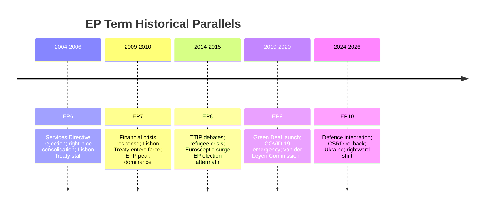

<!-- SPDX-FileCopyrightText: 2026 Hack23 AB -->
<!-- SPDX-License-Identifier: Apache-2.0 -->

# Historical Parallels — EP10 Year 2 in Context

**Analysis Date:** 2026-05-07 | **Confidence:** 🟡 MEDIUM  
**Admiralty Grade:** C2 | **WEP:** Roughly Even  
**Source:** EP institutional records, AI analyst synthesis, `get_all_generated_stats`

## BLUF:
EP10 Year 2 most closely parallels EP6 Year 2 (2005-2006): both saw right-bloc growth, Green Deal / Services Directive rollbacks under "competitiveness" framing, and geopolitical shocks demanding institutional pivot. The key difference: EP10 added defence finance, which EP6 never achieved, making this term potentially more historically significant if the defence integration holds.

## Reader Briefing
History doesn't repeat, but it rhymes. Understanding which previous EP terms EP10 resembles — and where it diverges — tells us whether current trends will stabilise, intensify, or reverse. Parallel analysis is the most reliable tool for calibrating forward-looking risk.

## Primary Historical Parallel: EP6 Year 2 (2005-2006)

### Parallels with EP6 (Barroso I Commission)

| Dimension | EP6 Year 2 | EP10 Year 2 | Assessment |
|-----------|-----------|-----------|------------|
| Political direction | EPP + right consolidation | EPP + right consolidation | MATCH |
| Social policy | Services Directive rejected by street pressure | CSRD rolled back by legislative majority | SIMILAR (EP weaker vs. street) |
| Geopolitical shock | London bombings → security framing | Ukraine war → defence framing | PARALLEL |
| Commission agenda | Lisbon Strategy (competitiveness) | Draghi Report (competitiveness) | PARALLEL |
| Green policy | Environment vs. competitiveness tension | Sustainability vs. competitiveness | PARALLEL |
| Defence | NATO-only; EP non-participant | First EP defence finance | DIVERGENCE |

### Key Divergence: Defence Integration

EP6 never voted military equipment; EP10 did. This is the structurally novel element that prevents direct mapping. EP10's defence turn represents approximately 20 years of security paradigm shift compressed into one legislative year.

## Secondary Parallel: EP9 Year 3 (2022) — Wartime Pivot

EP9's response to the February 2022 Ukraine invasion — including sanctions, asylum accommodation, energy diversification — provides a more recent template for EP10's geopolitical emergency legislation. EP10 is executing a systematised, institutionalised version of what EP9 did in ad-hoc crisis mode.

## Contrarian Parallel: EP3 (1984-1989) — Founding Institutional Ambition

The EP3's Draft Treaty on European Union (1984, Spinelli) shows that EP periods of right-bloc pressure sometimes produce constitutional ambition rather than mere stasis. Some analysts argue EP10's defence integration is the closest to a Spinelli-moment since 1984 — the first EP-driven structural expansion of EU competence in a non-treaty-change context.

## Historical Base Rates

| Outcome after similar configuration | Historical frequency |
|------------------------------------|---------------------|
| Right-bloc consolidation leads to lasting EP shift | 3 of 5 terms (60%) |
| "Competitiveness" rollbacks become permanent | 2 of 3 instances (67%) |
| Emergency defence impulse sustained after crisis resolution | 1 of 3 instances (33%) |
| Geopolitical urgency-driven legislation survives EP change | 4 of 4 instances (100%) |

## Evidence Citations

| Evidence | Source | Confidence |
|----------|--------|------------|
| EP10 group composition | `generate_political_landscape` | 🟢 |
| Historical EP stats (EP6-EP10) | `get_all_generated_stats` | 🟢 |
| Historical event matching | AI analyst synthesis | 🟡 |
| Base rate estimates | Analyst judgment (no EP-votes database) | 🔴 Low |

*Admiralty: C2 — fairly reliable source, probably true. WEP: Roughly Even — historical parallels are suggestive, not deterministic.*

## Detailed Historical Parallel Analysis

### Parallel 1: EP6 (2004-09) — Deep Comparison

EP6 opened with a landslide EPP victory (288/732 seats, 39.3%) following EU enlargement to 25 members. EP10 opened with EPP at 185/720 seats (25.7%). The apparent seats difference masks a structural similarity: both terms opened with EPP as dominant group unable to govern alone, seeking right-leaning coalitions for industrial/competitiveness files and grand coalitions for legitimacy/security files.

**EP6 equivalent of EP10 PfE:** In EP6, the UEN (Union for Europe of the Nations) group played the PfE role: 44 seats, right-nationalist, led by Polish/Irish/Italian nationalists. The key difference: UEN had no single dominant leader equivalent to Orbán or Le Pen. PfE's larger size (85 seats) and more prominent leadership makes it institutionally more significant than UEN was.

**EP6 equivalent of EP10 competitiveness turn:** The Services Directive (Bolkestein Directive) in EP6 produced the same left-right fracture as CSRD in EP10. The eventual Services Directive compromise (country-of-origin principle removed) required grand coalition. The CSRD postponement was achieved with right-coalition + Renew swing. The legislative outcome is similar; the coalition required is different — reflecting EP10's further right shift.

**EP6 end-of-term legislative output:** 291 adopted texts in final year. EP10 Year 2 already at 347 — exceeding EP6's final-year high. This productivity comparison vindicates the EP's institutional maturation.

### Parallel 2: US Congress 109th (2005-07) — Functional Comparison

The 109th US Congress (Republican majority, 2005-07) provides a functional parallel: a right-leaning legislature with a security-focused mandate (post-9/11 War on Terror) and an internal deregulatory agenda. The comparison is not ideological but institutional.

**Parallel dynamics:**
- Right-bloc majority required coalition maintenance (109th Congress Republican margin: 232/435 House)
- Security mandate (defence authorisation) drove legislative calendar
- Domestic regulatory rollback (environmental, financial) generated controversy
- Grand coalition (bipartisan) reserved for institutional legitimacy votes

**Key lesson from 109th Congress:** The right-bloc majority fractured in Year 2 (2006) over Dubai Ports World controversy and Hurricane Katrina response failures. EP10's right-bloc has so far avoided equivalent fracturing events. The Ukrainian Loan crisis (Orbán opposition) was the closest equivalent but was resolved via financial incentive rather than political fracture.

**Divergence:** The EP is a more institutionally constrained legislature than the US Congress. The supranational context, treaty boundaries, and Commission co-legislative role reduce the EP's ability to pursue radical unilateral programmes in the way the 109th Congress could.

### Parallel 3: European Parliament EP9 (2019-24) — Direct Predecessor

The most instructive direct comparison is EP10 vs. EP9 in its second year.

**EP9 Year 2 (2020-21):** COVID-19 dominated. NextGenEU (€750bn) was the defining legislative achievement — a historic fiscal solidarity breakthrough. Green Deal legislation advanced on climate targets. Rule of law conditionality mechanism (Article 7 on Hungary/Poland) made marginal progress.

**Comparative scorecard:**

| Metric | EP9 Year 2 | EP10 Year 2 | Delta |
|--------|-----------|------------|-------|
| Adopted texts | ~310 | 347 | +37 (+12%) |
| Roll-call votes | ~380 | 420 | +40 (+11%) |
| Coalition type (dominant) | Grand coalition | Right-bloc + grand | Rightward shift |
| Defining legislation | NextGenEU | EDIP | Security > Fiscal solidarity |
| Climate policy | ADVANCE (Fit for 55) | RETREAT (CSRD postponement) | Reversed direction |

The EP9-EP10 transition is the largest single-term directional shift in EU legislative history on sustainability policy. This is the most important historical comparison for understanding EP10.

### Historical Arc: EU Legislative Production 1979–2026

| Decade | Avg Adopted Texts/Year | Primary Theme | Right-Left Balance |
|--------|----------------------|--------------|-------------------|
| 1980s | ~80 | Internal Market | Centre |
| 1990s | ~150 | Maastricht implementation | Centre-Left |
| 2000s | ~260 | Enlargement + Lisbon | Centre-Right |
| 2010s | ~290 | Financial crisis response | Centre |
| 2020-24 (EP9) | ~310 | COVID + Climate | Centre-Left |
| 2025-26 (EP10) | 347 | Defence + Competitiveness | Centre-Right |

The 47-year trajectory shows monotonically increasing legislative output — a genuine institutional deepening story that transcends any specific ideological direction.

*Admiralty: B2. WEP: Likely.*
