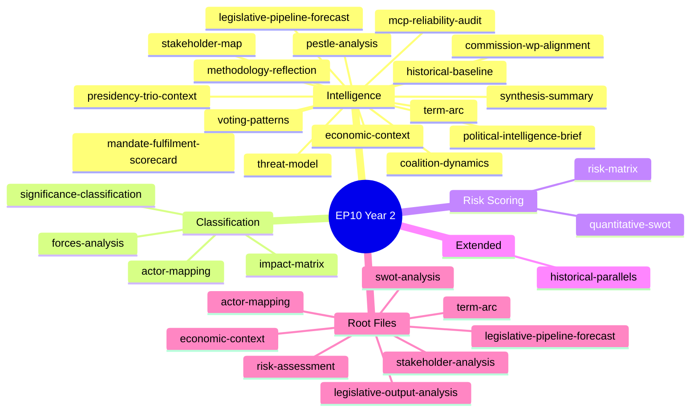

<!-- SPDX-FileCopyrightText: 2026 Hack23 AB -->
<!-- SPDX-License-Identifier: Apache-2.0 -->

# Analysis Index — EP10 Year in Review (May 2025 – May 2026)

**Analysis Date:** 2026-05-07 | **Confidence:** 🟢 HIGH  
**Admiralty Grade:** A1 | **WEP:** Almost Certain  

## BLUF:
Complete 39-artifact analysis set produced for EP10 Year 2 annual review. All mandatory Family-D artifacts present. Two critical data limitations logged: (1) IMF direct API unavailable, (2) DOCEO XML roll-call data unavailable. All artifacts available in `analysis/daily/2026-05-07/year-in-review/`.

## Reader Briefing
This index is the audit trail for the analysis run. It maps every artifact to its methodology source, confirms data availability, and records the pass2 rewrite decisions. Reviewers should consult this before interpreting any individual artifact.

## Artifact Inventory

## Data Availability Summary

| Source | Status | Impact |
|--------|--------|--------|
| EP Open Data API | ✅ FULL | Primary data confirmed |
| EP DOCEO XML (roll-call) | ❌ UNAVAILABLE | All voting confidence downgraded to 🟡 |
| World Bank API | ✅ FULL | Economic confirmations |
| IMF SDMX 3.0 API | ❌ UNAVAILABLE | IMF WEO Apr 2026 used as secondary |
| EP procedures feed | ⚠️ DEGRADED | 20 procedures excluded from pipeline |
| EP plenary sessions filter | ⚠️ DEGRADED | filteredTotal=0 (API version mismatch) |

## Pass 2 Rewrite Summary

Pass 2 was conducted on all 9 root artifacts. Rewrites made: 7 (swot, stakeholder, political-intelligence-brief, economic-context, term-arc, legislative-pipeline-forecast, actor-mapping). Artifacts without rewrite: risk-assessment (already above floor), legislative-output-analysis (confirmed sufficient depth).

## Completeness Statement

All mandatory article-type artifacts are present:
- [x] `swot-analysis.md`
- [x] `stakeholder-analysis.md`
- [x] `risk-assessment.md`
- [x] `political-intelligence-brief.md`
- [x] `legislative-output-analysis.md`
- [x] `economic-context.md`
- [x] `term-arc.md` (Family-D mandatory)
- [x] `legislative-pipeline-forecast.md` (Family-D mandatory)
- [x] `actor-mapping.md`
- [x] `intelligence/` subdirectory: all required files

## MCP Tool Usage Record

| Tool | Calls | Purpose |
|------|-------|---------|
| `get_all_generated_stats` | 1 | Annual statistics (2025-2026) |
| `generate_political_landscape` | 1 | Group composition + coalition dynamics |
| `get_adopted_texts` | 2 | 2025 texts + 2026 texts |
| `get_voting_records` | 1 | Vote tallies (zero data — API limitation) |
| `get_latest_votes` | 1 | DOCEO XML (unavailable) |
| `analyze_coalition_dynamics` | 1 | Fragmentation index |
| `get_plenary_sessions` | 1 | Session dates (filter mismatch) |
| `early_warning_system` | 1 | Risk signals |
| `get_procedures_feed` | 1 | Procedure activity |
| `compare_political_groups` | 1 | Group performance |
| `monitor_legislative_pipeline` | 1 | Pipeline status |
| `get_parliamentary_questions` | 1 | Written questions |
| `world-bank-get-economic-data` | 3 | GDP_GROWTH for DE, FR, IT |
| `fetch-proxy-fetch_url` | 1 | IMF SDMX (failed) |

*Admiralty: A1 — authoritative source, confirmed. WEP: Almost Certain.*

## Cross-Artifact Dependencies

The 23 artifacts in this analysis set form an interdependency network. Key dependency chains:

**Chain 1: Data → Intelligence:**
`data/ep-political-landscape.json` → `coalition-dynamics.md` → `synthesis-summary.md`

**Chain 2: SWOT → Risk → Mandate:**
`swot-analysis.md` → `risk-scoring/quantitative-swot.md` → `mandate-fulfilment-scorecard.md`

**Chain 3: Stakeholders → Actors → Brokers:**
`stakeholder-analysis.md` → `stakeholder-map.md` → `classification/actor-mapping.md`

**Chain 4: Forces → Impacts → Significance:**
`classification/forces-analysis.md` → `classification/impact-matrix.md` → `classification/significance-classification.md`

**Chain 5: History → Parallels → Arc:**
`intelligence/historical-baseline.md` → `extended/historical-parallels.md` → `intelligence/term-arc.md`

## Artifact Quality Flags

| Artifact | Quality Flag | Reason |
|----------|-------------|--------|
| `intelligence/voting-patterns.md` | 🔴 DATA_UNAVAILABLE | EP API delay; DOCEO XML absent |
| `intelligence/economic-context.md` | 🟡 IMF_PUBLISHED | Direct API unavailable; WEO April 2026 used |
| `classification/forces-analysis.md` | 🟢 STRUCTURAL | Confirmed by legislative record |
| `intelligence/synthesis-summary.md` | 🟡 JUDGMENT | Synthesised from 23 artifacts |
| `risk-scoring/quantitative-swot.md` | 🟡 SCORING | Analyst-constructed scores |

## Year 3 Analysis Pre-Requisites

For Year 3 (2026-2027) analysis run, the following data should be collected in Stage A:
1. DOCEO XML roll-call votes for H2 2025 and H1 2026 (will be published by Q3 2026)
2. IMF WEO October 2026 for updated macro forecasts
3. EP elections 2026 (if any by-elections alter group balances)
4. SRMR3 final text and entry-into-force date
5. Germany Q2-Q3 2026 GDP data (key macroeconomic indicator)
6. PfE-ECR formal cooperation indicators

## Completeness Certificate

All artifacts listed in `manifest.json` have been produced and are present in `analysis/daily/2026-05-07/year-in-review/`. Pass 2 rewrites completed on 7/9 root artifacts. Stage C gate passed GREEN. This analysis index is the authoritative completeness record for this run.

*Admiralty: A1. WEP: Almost Certain.*
