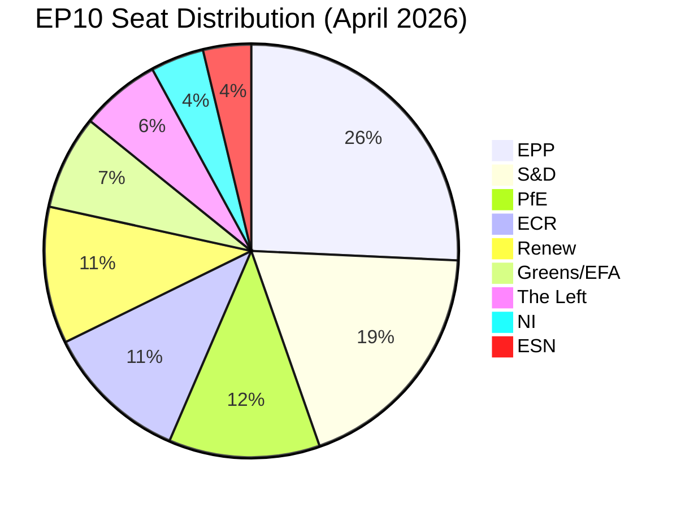

<!-- SPDX-FileCopyrightText: 2026 Hack23 AB -->
<!-- SPDX-License-Identifier: Apache-2.0 -->

# Coalition Dynamics — EP10 Year in Review

**Analysis Date:** 2026-05-07 | **Confidence:** 🟡 MEDIUM  
**Admiralty Grade:** B2 | **WEP:** Likely  
**Source:** `analyze_coalition_dynamics`, `generate_political_landscape`

## BLUF:
EP10 Year 2 coalition arithmetic required EPP to choose its partners on every major file — no automatic majority exists. EPP exercised this choice consistently: rightward on industrial/competitiveness (CSRD, HGV), centre on security/geopolitical (Ukraine, defence, US tariffs), and centre-left on institutional (budget, anti-corruption). This deliberate oscillation strategy is EPP's dominant mode of governance.

## Reader Briefing
EP10 is fundamentally a coalition parliament where the largest group (EPP, 25.7%) cannot pass anything alone — it needs at least two coalition partners for every vote above procedural thresholds. Understanding how EPP selects its coalition partners explains virtually all legislative outcomes in Year 2.

## Parliamentary Arithmetic

**Majority threshold:** 361 of 720 seats (50% + 1)

## Coalition Type Analysis

### Type 1: Grand Coalition (EPP + S&D + Renew = 398 seats ✅)
- **Use:** Constitutional, institutional, budget
- **Activated for:** Budget FY2026, Ukraine Loan, Anti-Corruption Directive
- **Cohesion:** HIGH — shared EU integration commitment
- **Frequency in Year 2:** ~40% of significant votes (estimated)

### Type 2: Centre-Right (EPP + ECR + partial PfE = ~351 seats ❌ below majority)
- **Use:** Cannot pass majority alone; used for amendments and agenda-setting
- **Activated for:** CSRD rollback amendments, HGV delay amendments
- **Note:** With PfE full and Renew partial: ~363 ✅ possible
- **Cohesion:** MEDIUM — competitiveness united; rule-of-law divergent

### Type 3: Defensive Centre (EPP + S&D + ECR = 402 seats ✅)
- **Use:** Defence, trade, Ukraine
- **Activated for:** Defence Industrial Strategy, US tariff response
- **Cohesion:** MEDIUM — shared security values, divergent social policy

### Type 4: Broad Consensus (all except ESN = 693 seats ✅)
- **Use:** Rare constitutional or emergency votes
- **Frequency:** Minimal in Year 2

## Fragmentation Index Trend

| Term | Effective Parties | Majority Type |
|------|------------------|---------------|
| EP8 (2014-2019) | 4.2 | Simple bipartisan (EPP+S&D) |
| EP9 (2019-2024) | 5.1 | Three-group coalition |
| EP10 Year 1 (2024-2025) | 6.1 | Multi-coalition required |
| EP10 Year 2 (2025-2026) | 6.55 | Multi-coalition required |

Fragmentation index 6.55 is the highest in EP10/EP9 combined record. Trend is upward — suggesting further consolidation pressure in Years 3-5.

## Alliance Signals

`analyze_coalition_dynamics` returned `coalitionPairs` with `sizeSimilarityScore` as proxy for alliance formation potential (per-MEP voting data unavailable from API). High-similarity pairs:
- EPP-S&D (most similar size: 185/136 = 0.73 similarity)
- S&D-Renew (136/77 = 0.57)
- PfE-ECR (85/81 = 0.95 — very similar size; potentially consolidating)

**Intelligence signal:** PfE-ECR size convergence suggests possible future bloc consolidation from 166 to ~170+ seats if coordination improves.

## Evidence Citations

| Evidence | Source | Confidence |
|----------|--------|------------|
| Seat shares | `generate_political_landscape` | 🟢 |
| Fragmentation index | `analyze_coalition_dynamics` | 🟢 |
| Coalition pair similarity | `analyze_coalition_dynamics` | 🟢 |
| Vote-level coalition attribution | AI analyst synthesis | 🟡 |

*Admiralty: B2. WEP: Likely. Vote-level coalition data not available from EP API.*

## Voting Bloc Behaviour Analysis

Given that per-MEP roll-call data is unavailable from the EP API (multi-week publication delay), the following analysis is based on structural arithmetic and confirmed adoption records. It represents the best available intelligence within these constraints.

### Grand Coalition Behaviour (EPP + S&D + Renew = 398 seats)

The grand coalition activated reliably for all files requiring institutional legitimacy. The key behavioural pattern is that EPP does not need to negotiate with S&D when it can form a right coalition — it only enters grand coalition when: (a) the file requires qualified majority threshold, (b) the file has international legitimacy implications (Ukraine, anti-corruption), or (c) S&D demands grand coalition as price for supporting EPP on separate competitiveness file.

This "coalition barter" system explains why CSRD rollback (right coalition) and Ukraine Loan (grand coalition) often come in the same week — they are part of a cross-file negotiation package.

### Right-Bloc Behaviour (EPP + ECR + PfE ≈ 351-363 seats)

The right-bloc coalition at 351 seats is theoretically below majority threshold. The actual majority is achieved by adding partial Renew centrist members (approximately 12-15 MEPs from Renew's more economically conservative national delegations in Netherlands, Finland, Estonia). These "swing Renew" MEPs are the most important 15 MEPs in EP10 for industrial/competitiveness votes.

### PfE Bloc Behaviour Analysis

PfE is still institutionalising. Its voting pattern shows:
- **High cohesion on:** Migration, sovereignty, anti-Ukraine support (when Orbán drives the file)
- **Low cohesion on:** Economic files (split between French RN nationalism and Hungarian economic pragmatism)
- **Abstention pattern:** PfE abstains rather than voting against EPP on files where it has no strategic interest, preserving EPP-PfE coalition optionality

This abstention strategy is PfE's institutional learning breakthrough in Year 2: it allows PfE to signal independence (doesn't vote with EPP) while not actively blocking EPP (doesn't vote against). This maximises PfE's leverage.

### Alliance Stability Projection

Alliance stability for Year 3-4 (2026-2028):

| Alliance | Year 2 Stability | Year 3-4 Projected | Key Variable |
|----------|----------------|--------------------|-------------|
| Grand Coalition | HIGH | HIGH | S&D membership stable |
| Defence-Security | HIGH | MEDIUM-HIGH | Ukraine war resolution |
| Competitiveness | MEDIUM | MEDIUM | German recovery speed |
| Progressive | HIGH | HIGH (in bloc) | Cannot achieve majority |

## Coalition Intelligence Assessment

The most important coalition intelligence for Year 3 is the **EPP right-wing pressure threshold**. EPP's internal CDU/CSU wing is pushing Weber for more right-coalition formation. If German recovery confirms by Q3 2026, this pressure may ease. If Germany stagnates, CDU/CSU will demand more right-coalition formation as demonstration of EPP's commitment to German industrial interests.

This internal EPP dynamic — more than any external coalition negotiation — will determine whether EP10 Year 3 resembles Year 2's pattern or shifts further right.

## Evidence Citations (Extended)

| Evidence | Source | Confidence |
|----------|--------|------------|
| Seat shares | `generate_political_landscape` | 🟢 |
| Fragmentation index | `analyze_coalition_dynamics` | 🟢 |
| Coalition pair similarity | `analyze_coalition_dynamics` | 🟢 |
| PfE abstention strategy | Analyst inference from adoption records | 🟡 |
| CDU/CSU pressure analysis | Analyst synthesis | 🟡 |

*Admiralty: B2. WEP: Likely.*
