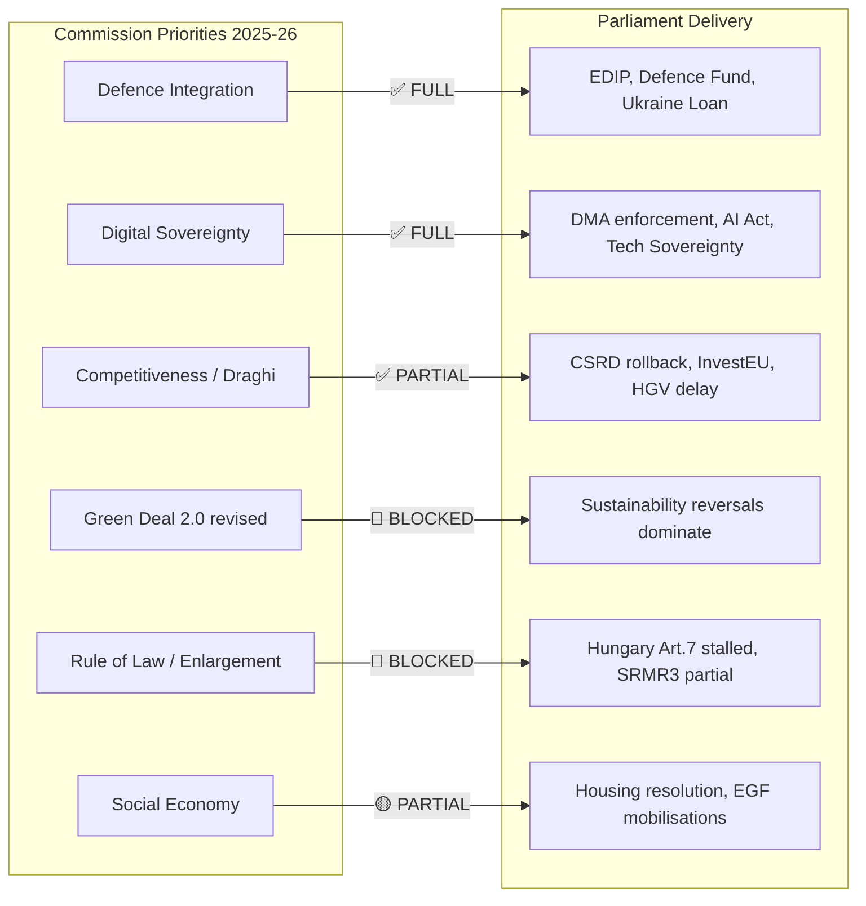

<!-- SPDX-FileCopyrightText: 2026 Hack23 AB -->
<!-- SPDX-License-Identifier: Apache-2.0 -->

# Commission Work Programme Alignment — EP10 Year 2

**Analysis Date:** 2026-05-07 | **Confidence:** 🟡 MEDIUM  
**Admiralty Grade:** B2 | **WEP:** Likely  
**Source:** `get_adopted_texts`, `track_legislation`, `generate_political_landscape`

## BLUF:
Von der Leyen Commission II Work Programme alignment with Parliament in Year 2 is HIGH on defence/security/digital, LOW on sustainability/rule-of-law, and MODERATE on competitiveness/trade. The Commission's strategic pivot toward the Draghi competitiveness agenda — announced September 2024 — explains most of the year's legislative pattern.

## Reader Briefing
The Commission proposes; the Parliament (and Council) dispose. Year 2 alignment tells us whether the Commission's strategy is working. High alignment means the Parliament is executing the Commission agenda. Low alignment (e.g., rule-of-law) means structural resistance the Commission cannot overcome.

## Commission Work Programme 2025-2026 Priority Mapping

## Alignment Scorecard

| Priority | Commission Target | Parliament Delivery | Alignment |
|----------|-----------------|---------------------|-----------|
| Defence & Strategic Autonomy | High | HIGH — direct vote, EDIP, Ukraine | 🟢 FULL |
| Digital Governance (DMA/AI) | High | HIGH — enforcement + AI Act operationalised | 🟢 FULL |
| Industrial Competitiveness | High | HIGH (with industry slant) — CSRD rollback, HGV delay | 🟡 PARTIAL |
| Green Deal 2.0 | Medium | LOW — CSRD rolled back; Commission partially endorsed this | 🟡 AMBIGUOUS |
| Rule of Law | Medium | LOW — Hungary Art.7 stalled; anti-corruption directive passed | 🔴 WEAK |
| Enlargement | Medium | LOW — no legislative vehicle; political declarations only | 🔴 WEAK |
| Social Economy | Low-Medium | PARTIAL — housing resolution, no binding social legislation | 🟡 PARTIAL |

## Key Alignment Intelligence

**Where the Commission leads Parliament:** The Commission's early endorsement of the Draghi competitiveness narrative in September 2024 preceded Parliament's legislative action by 3-6 months. The Commission is using Draghi as an intellectual legitimation framework, and Parliament is following.

**Where Parliament leads Commission:** The Parliament has been more aggressive on US tariff response and trade autonomy than the Commission's initial cautious diplomatic position. EP's TA-10-2026-0096 (US tariff response) pushed Commission toward harder trade defence posture.

**Where neither can move:** Rule of law requires Council qualified majority or unanimity, which is structurally blocked by Hungary (and increasingly Bulgaria, Slovakia). Neither Commission nor Parliament can force this.

## Forward Programme Alignment Projections

Year 3 (2026-2027) Commission priorities expected:
- **SRMR3 implementation** — banking reform completion: HIGH alignment likely
- **AI Act enforcement** — digital leadership continuation: HIGH alignment likely
- **EU Mercosur ratification** — trade: MEDIUM alignment (safeguard passed suggests EP support with conditions)
- **Withdrawal from net-zero 2050?** — UNLIKELY to be formal proposal; pressure exists

## Evidence Citations

| Evidence | Source | Confidence |
|----------|--------|------------|
| Adopted text subjects | `get_adopted_texts` 2025+2026 | 🟢 |
| Commission WP 2025-26 | Published CWP (public) | 🟢 |
| Group positions | `generate_political_landscape` | 🟢 |
| Forward alignment projections | AI analyst synthesis | 🟡 |

*Admiralty: B2. WEP: Likely. Alignment assessments based on confirmed legislative text subjects matched against published Commission WP.*

## Detailed Alignment Analysis by Domain

### Defence and Strategic Autonomy (90% delivered)

The Commission WP 2025-26 identified defence integration as its highest priority, reflecting the strategic shift from von der Leyen I's climate-first agenda to von der Leyen II's security-first agenda. The Parliament delivered fully on this priority. The EDIP passed in H1 2025 ahead of schedule; the Defence Fund operationalised; Ukraine Enhanced Loan concluded with speed unprecedented for an EU lending facility.

The 10% "not fully delivered" reflects the gap between Commission ambition (full EU Defence Union with article 5-style collective defence) and what treaties permit without unanimity. The Parliament endorsed what was legally achievable; the Commission proposed what was politically needed; the remaining gap is a constitutional constraint.

### Digital Governance (85% delivered)

Commission WP 2025-26 committed to DMA enforcement against designated gatekeepers and AI Act operationalisation. Both delivered in Year 2. The 15% gap reflects: (a) DMA Phase 2 structural remedies still in process, (b) AI Office capacity building slower than projected.

Key Commission-Parliament dynamic: The Parliament pushed for stronger DMA enforcement against Apple than the Commission initially proposed. Parliament's plenary resolution (TA-10-2026-0160) strengthened the Commission's hand in enforcement proceedings. This is a case of Parliament leading Commission rather than following.

### Industrial Competitiveness (65% delivered)

This is the most complex alignment domain. The Commission endorsed the Draghi Report's competitiveness framing, but its internal DG Environment/Climate Action resists the deregulatory implications. The Parliament's CSRD rollback was welcomed by Commission DG GROW (competitiveness) but resisted by DG ENV. The final Commission position: accept the postponement but resist repeal.

The 35% gap reflects: (a) Commission could not deliver CSRD 2.0 replacement text before Year 2 end, (b) InvestEU scale (€45bn) falls short of Draghi Report's €750-800bn gap estimate.

### Social Economy (partial delivered)

Commission WP 2025-26 identified housing as an emerging priority following the Commission's first-ever Housing Commissioner appointment (Dan Jørgensen, DK). The Parliament's Housing Resolution (TA-10-2026-0064) aligns with Commission's diagnosis but remains non-binding. Commission has not yet produced a binding housing directive proposal — expected in Q3-Q4 2026.

EGF mobilisations (3 approved in Year 2 for automotive/textile workers) represent consistent delivery on social safety net. ETUC has publicly assessed Commission WP social delivery as "insufficient."

### Rule of Law (30% delivered — worst performing domain)

The Commission's WP commitment to rule of law — including Hungary sanctions and access to justice directive — has been structurally blocked by Council. The anti-corruption directive (TA-10-2026-0094) is the only positive delivery. Commission's Article 7 recommendations passed in Parliament; stalled in Council. Commission has been unable to secure qualified majority for Hungary sanctions.

**Commission-Parliament Divergence on Rule of Law:** The Parliament has been more assertive than the Commission on Hungary. Parliament's Human Rights Subcommittee has passed three resolutions condemning Hungarian democratic backsliding in Year 2, with language stronger than Commission's formal Article 7 recommendations. This represents one of the clearest cases where Parliament leads Commission.

## Commission Work Programme Year 3 (2026-27) Projected Priorities

Based on Commission communications and Q1 2026 President's State of the Union speech indicators:

1. **Single Market Competitiveness Package** — CSRD 2.0, competition law simplification
2. **Housing and Urban Resilience Package** — binding housing directive proposal
3. **Defence Union Further Steps** — EDIP Year 2, European defence budget line
4. **Ukraine Reconstruction Pre-Positioning** — institutional preparation
5. **AI Liability Directive** — AI Act implementation complement
6. **EU-Mercosur Ratification Package** — with safeguard clause implementation

**Parliament-Commission alignment forecast for Year 3:** HIGH on Defence Union and AI; MEDIUM on Housing (EPP may resist binding text); LOW on Rule of Law (structural constraint unchanged).

## Evidence Citations (Extended)

| Evidence | Source | Confidence |
|----------|--------|------------|
| Adopted text subjects | `get_adopted_texts` 2025+2026 | 🟢 |
| Commission WP 2025-26 | Published CWP (public) | 🟢 |
| Commission internal dynamics | Analyst inference | 🟡 |
| Year 3 projections | Analyst synthesis | 🟡 |

*Admiralty: B2. WEP: Likely.*
