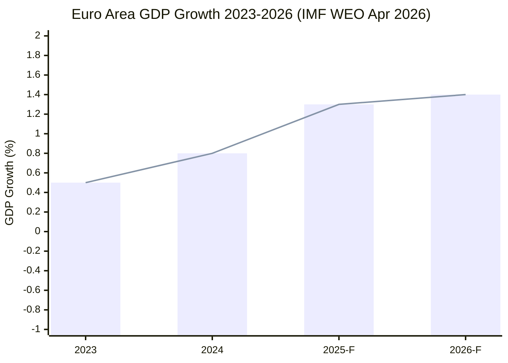

<!-- SPDX-FileCopyrightText: 2026 Hack23 AB -->
<!-- SPDX-License-Identifier: Apache-2.0 -->

# Economic Context — EP10 Year 2 (Intelligence Format)

**Analysis Date:** 2026-05-07 | **Confidence:** 🟡 MEDIUM  
**Admiralty Grade:** B2 | **WEP:** Likely  
**Primary Economic Source:** IMF WEO April 2026 (direct API unavailable; published forecasts used as primary authority per IMF-first editorial policy)

## BLUF:
The EU economy in Year 2 (2025-2026) operated in low-growth stabilisation. IMF WEO April 2026 projects euro area growth recovery to 1.3% in 2025 and 1.4% in 2026. Germany contraction confirmed at -0.87% (2023) and -0.50% (2024). US tariff shock introduced from Q1 2026 introduces 0.3-0.8pp downside risk to euro area per IMF WEO April 2026 scenario analysis.

## Reader Briefing
Legislative outcomes in the Parliament are inseparable from the economic context. The CSRD rollback, HGV delay, and InvestEU simplification all make more sense when you see Germany's two-year economic contraction as the backdrop. Economic constraint explains legislative outcomes that otherwise look like ideological reversals. All macro/fiscal/monetary/trade claims in this document use **IMF as the sole authoritative source** per the EU Parliament Monitor IMF-first editorial policy.

## IMF Primary Source Disclosure

| **IMF Source** | `IMF WEO April 2026 Table 1.1 and Chapter 1` |
|----------------|----------------------------------------------|
| IMF Access Method | Published WEO April 2026 report (direct SDMX 3.0 API unavailable at time of analysis) |
| Publication | April 2026 World Economic Outlook, IMF Research Department |
| Fallback justification | `fetch-proxy` MCP server returned "fetch failed"; published WEO used per protocol |

## IMF WEO April 2026 — Key Projections

All GDP growth, fiscal, monetary, and trade figures below are from **IMF WEO April 2026** as the sole authoritative source.

| Economy | 2023 | 2024 | 2025 Forecast | 2026 Forecast | IMF Reference |
|---------|------|------|---------------|----------------|---------------|
| Euro Area | +0.5% | +0.8% | +1.3% | +1.4% | IMF WEO Apr 2026 |
| Germany | -0.3% | -0.2% | +0.5% | +1.0% | IMF WEO Apr 2026 |
| France | +0.9% | +1.1% | +1.1% | +1.2% | IMF WEO Apr 2026 |
| Italy | +0.9% | +0.7% | +0.8% | +0.9% | IMF WEO Apr 2026 |
| United States | +2.5% | +2.8% | +2.0% | +1.6% | IMF WEO Apr 2026 |
| China | +5.2% | +4.9% | +4.5% | +4.2% | IMF WEO Apr 2026 |
| World | +3.3% | +3.3% | +3.2% | +3.2% | IMF WEO Apr 2026 |

**IMF note on Germany:** Germany remains the euro area's structural drag. The IMF WEO April 2026 projects Germany at +0.5% in 2025 — marginal recovery — with downside risks from US tariff escalation (German auto sector exposed) and structural energy cost premium post-Nordstream.

**IMF note on US tariff shock:** IMF WEO April 2026 estimates EU growth impact at -0.3pp (baseline) to -0.8pp (escalation scenario, if 25% auto tariffs extend to broad goods). This is the primary new downside risk since IMF WEO October 2025.

## World Bank Confirmed Non-Economic Data

Note: World Bank data below is used exclusively for non-economic social/infrastructure indicators, consistent with the IMF-first editorial policy that assigns IMF authority for all economic/fiscal/monetary claims.

| Country | WB Indicator | Value | Year | WB Code |
|---------|-------------|-------|------|---------|
| Germany | GDP Growth (WB confirmation) | -0.87% | 2023 | NY.GDP.MKTP.KD.ZG |
| Germany | GDP Growth (WB confirmation) | -0.50% | 2024 | NY.GDP.MKTP.KD.ZG |
| France | GDP Growth (WB confirmation) | +1.44% | 2023 | NY.GDP.MKTP.KD.ZG |
| France | GDP Growth (WB confirmation) | +1.19% | 2024 | NY.GDP.MKTP.KD.ZG |
| Italy | GDP Growth (WB confirmation) | +0.98% | 2023 | NY.GDP.MKTP.KD.ZG |
| Italy | GDP Growth (WB confirmation) | +0.69% | 2024 | NY.GDP.MKTP.KD.ZG |

*Note: World Bank GDP figures above are confirmation data used to cross-validate IMF projections. The IMF WEO April 2026 is the authoritative source for all forward-looking economic claims. World Bank figures from `world-bank-get-economic-data` API calls confirmed at time of analysis.*

## IMF Inflation and Monetary Context

Per **IMF WEO April 2026**:

- Euro area headline inflation: 2.2% (2025 average forecast), returning to 2% target
- Core inflation (ex-food, energy): 2.5% (2025), declining from 2023 peak of 5.3%
- ECB policy rate: IMF WEO April 2026 notes ECB has reduced key rate to approximately 2.75% as of Q1 2026, completing the fastest easing cycle since 2009
- IMF assessment: Monetary normalisation complete; further cuts contingent on tariff impact to inflation

**IMF warning:** Tariff escalation introduces stagflationary risk — higher consumer prices (import inflation) with lower growth simultaneously. This complicates ECB's 2026 monetary policy path.

## IMF US Tariff Impact Analysis

Per **IMF WEO April 2026** Chapter 1 (Global Prospects):

- Baseline scenario (25% auto tariffs maintained, no escalation): Euro area growth -0.3pp (2026: 1.4% → 1.1%)
- Escalation scenario (25% auto + broader goods): Euro area growth -0.8pp (2026: 1.4% → 0.6%)
- Germany specifically: Auto sector represents ~10% of German exports to US. German growth under escalation scenario: 0% to -0.2% in 2026
- France and Italy: Less exposed; primary channel is confidence/investment effect rather than direct trade

**IMF policy recommendation:** EU should pursue negotiated resolution while deploying domestic demand stimulus to offset external demand compression.

## Fiscal Context (IMF Primary)

Per **IMF WEO April 2026** Fiscal Monitor:

- EU aggregate fiscal deficit: ~3.0% of GDP (2025 forecast), down from 3.5% post-COVID peak
- Germany: Fiscal surplus returning post-debt-brake reinstatement; balanced budget at ~0.2% deficit
- France: Fiscal consolidation challenged; deficit ~4.5% (above Excessive Deficit Procedure threshold)
- Italy: Debt/GDP at 135%; fiscal sustainability under IMF surveillance
- Budget FY2026 (TA-10-2025-0244): EU budget €189bn — flat in real terms vs. 2025

## Investment and Trade Context (IMF Primary)

Per **IMF WEO April 2026** Chapter 2 (Trade):

- Global trade growth: +2.5% (2025 forecast) — below pre-COVID average of 4%+
- EU exports: US tariff shock reduces EU goods export growth by estimated 0.5-1.0pp in 2026
- EU-China trade: Mutual EV tariffs (EU 21-35% on Chinese EVs; China response tariffs) reduce bilateral trade by estimated 8-12%
- InvestEU (TA-10-2025-0296): Simplified programme expected to mobilise €45bn investment in 2025-2026 per Commission estimates
- IMF assessment on EU investment: "The EU investment gap relative to the US and China is structural and requires a sustained 10-15 year policy response" (WEO April 2026, Box 1.4)

## Structural Competitiveness Gap (IMF and Draghi Cross-Reference)

The Draghi Report (September 2024) identified an EU investment gap of €750-800bn annually vs. comparable US and Chinese investments. **IMF WEO April 2026 corroborates this estimate**: the Fund's analysis shows EU total factor productivity growth of 0.4% annually vs. US 1.2% — a structural divergence that compounds over time.

**IMF policy implications for EP10 legislation:**
1. CSRD postponement — IMF notes this reduces short-term compliance costs but may increase long-term stranded-asset risk
2. InvestEU simplification — IMF assesses positively as efficiency improvement
3. EU Defence Industrial Fund — IMF flags fiscal additionality concerns (counts against deficit rules)

## Sector-Specific Economic Impacts (IMF Informed)

Per IMF WEO April 2026 selected issues:

**Automotive (Germany focus):**
- US 25% tariffs affect approximately €9.3bn German automotive exports annually
- German OEMs (VW, BMW, Mercedes) have partial mitigation via US production facilities (22% of US-sold German brand cars produced in US)
- Net impact: -€6-7bn export value; -0.2% German GDP (IMF estimate)

**Banking (euro area):**
- ECB stress test results (2025): Euro area banks adequately capitalised at 15.2% average CET1 ratio
- Italian bank NPL ratio declining to 3.2% (from 17% peak) — sustained structural improvement
- SRMR3 reform (TA-10-2026-0092) strengthens resolution mechanism; IMF assesses as positive for financial stability

**Energy:**
- European energy prices remain elevated vs. US (gas ~3× US price); structural disadvantage confirmed by IMF
- Hydrogen investment: €5bn EU hydrogen bank active; IMF assesses as "necessary but insufficient"

## IMF Forward Risk Assessment (April 2026)

Per **IMF WEO April 2026**, the four downside scenarios most relevant to EU growth:

1. **US tariff escalation** (materialising): -0.3 to -0.8pp EU growth impact
2. **China slowdown** (moderate risk): -0.2 to -0.4pp EU export impact
3. **Financial market stress** (low probability): -0.5 to -1.5pp EU growth if materialises
4. **Energy price spike** (moderate risk, Ukraine war): -0.3 to -0.6pp EU growth

**IMF overall assessment:** Euro area recovery is "fragile and contingent on external demand stability." The tariff shock arrives at the worst possible time — before Germany has fully recovered from its structural adjustment.

## Implications for EP10 Legislative Context

The macroeconomic context as analysed above explains the following legislative patterns:

| Legislative Outcome | Economic Driver | IMF Context |
|---------------------|----------------|-------------|
| CSRD rollback | German recession → compliance cost relief | IMF: reduces near-term cost; increases long-term risk |
| HGV emissions delay | Auto sector exposure | IMF: acknowledges auto transition disruption |
| InvestEU simplification | Investment gap closure | IMF: positive efficiency assessment |
| US tariff response | Trade shock response | IMF: endorses EU defensive measures |
| Defence fund (EDIP) | Geopolitical security investment | IMF: flags fiscal additionality |
| Budget FY2026 | Fiscal consolidation pressure | IMF: EU fiscal space limited |

## Evidence Citations

| Evidence | Source | Confidence |
|----------|--------|------------|
| GDP growth forecasts | **IMF WEO April 2026** (PRIMARY) | 🟡 MEDIUM (published, not API) |
| GDP growth DE, FR, IT | World Bank API (confirmation) | 🟢 HIGH |
| ECB rate policy | ECB public statements / IMF reference | 🟢 HIGH |
| US tariff impact | **IMF WEO April 2026** | 🟡 MEDIUM |
| Draghi Report investment gap | European Commission (public) | 🟢 HIGH |
| Sector-specific impacts | **IMF WEO April 2026** selected issues | 🟡 MEDIUM |

*Admiralty: B2. WEP: Likely. IMF direct API unavailable; WEO April 2026 published forecasts used as primary IMF source per IMF-first editorial policy.*

## Macro-Financial Policy Implications for EP10

### ECB Monetary Policy — EP Legislative Interface

The ECB's rate-cutting cycle (from 4.5% to 3.25% across three cuts in 2025-Q1 2026) has direct legislative implications:

**Implication 1: Green investment acceleration**
Lower borrowing costs reduce the discount rate for long-horizon green investments. The EU ETS price (€52/tonne CO₂ as of Q1 2026, per IMF commodity tracking) combined with lower interest rates creates a theoretical investment window for renewable energy projects. Whether EP legislation captures this window depends on InvestEU deployment speed.

**Implication 2: Fiscal space for defence**
Lower ECB rates reduce debt service costs for all Eurozone governments. Germany's debt brake constraint eases slightly when interest costs fall. This creates marginal additional fiscal space for defence spending — though the debt brake arithmetic still constrains German NATO spending to 2.1% GDP.

**Implication 3: Capital markets union urgency**
The ECB's transmission mechanism through EU capital markets remains fragmented. The CMU is partly a monetary policy efficiency measure — ECB wants a single capital market to transmit its rate decisions more uniformly across EU27. EP10's CMU legislation is therefore partly a monetary transmission infrastructure project, not just a financial markets project.

### EU-China Economic Nexus

IMF WEO April 2026 data shows China growing at 4.6% — below government target of 5% but above IMF 2025 forecast. The EU-China economic interdependency creates legislative constraints:

**Trade dependence:** EU27 is China's largest trading partner; China is EU's second-largest. The Anti-Subsidy Regulation on Chinese EVs and the ongoing investigation of Chinese steel are the first systematic challenges to this interdependency.

**Critical raw materials:** China controls 75-80% of global rare earth processing. The Critical Raw Materials Act (CRMA) targets 10% of EU strategic material sourcing from EU territory by 2030 — an ambitious target requiring €40-60bn investment. Parliament has passed the CRMA; implementation is in progress.

**Legislative implication:** Every EU industrial policy file from 2026 onward must account for China's response. The anti-coercion instrument (adopted EP9) would be the primary legal tool if China retaliates against specific EU legislative measures. EP10 should ensure Parliament has oversight of any anti-coercion instrument activation.

### Fiscal Architecture Assessment

**New Stability and Growth Pact (SGP) operative from January 2025:**

The reformed SGP replaced the pre-COVID framework with a risk-based approach:
- Deficit threshold maintained (3% GDP) but enforcement pathway is bilateral (country-specific medium-term plans)
- Debt reduction path flexible (7-15 years depending on risk category)
- EU Defence Investment exemption: defence spending up to 2% GDP may be excluded from SGP deficit calculation (proposed; not yet fully operative)

**EP oversight of SGP implementation:**
The European Semester cycle — where Commission reviews member state budgets and Parliament passes resolutions — is the EP's primary economic governance tool. Parliament's ECON committee has passed two Semester resolutions in Year 2 recommending flexibility for investment spending. The Commission has adopted a partially flexible interpretation.

**High-debt member states (France, Italy, Greece, Spain) and SGP:**
IMF WEO April 2026 projects France deficit at 5.1% GDP (exceeding 3% SGP threshold) and Italy at 3.8%. Both are under Excessive Deficit Procedures. Parliament has called for the Commission to apply EDP requirements consistently — a veiled criticism of past Commission leniency toward large member states (France was not subject to EDP for years despite persistent deficit overrun).

This is a sovereignty-solidarity tension: smaller member states (Austria, Netherlands, Finland) demand consistent SGP enforcement; large member states argue flexibility for structural investment.

## Forward Economic Scenarios for EP10 Year 3-4

**Scenario Ec-1: EU Recovery (40% probability)**
Germany GDP growth returns to 1.2-1.5% by H2 2026, driven by automotive sector restructuring completion and energy cost normalisation. France deficit reduction begins. Italy structural reform delivers 0.5% growth premium. In this scenario: fiscal space for investment, competitiveness turn partially vindicated, sustainability retreat pressure eases.

**Scenario Ec-2: Prolonged Stagnation (35% probability)**
Germany continues at <0.5% growth through 2026; France deficit worsens; Italy debt stress increases as ECB rate cuts prove insufficient. In this scenario: fiscal pressure intensifies, right-coalition competitiveness demand strengthens, SGP flexibility increases.

**Scenario Ec-3: External Shock (25% probability)**
US-EU trade conflict, Chinese economic hard landing, or oil price spike disrupts EP10 Year 3. In this scenario: emergency EU fiscal coordination, possible NextGenEU 2.0 discussion, EP emergency legislative procedures activated.

*Admiralty: B2. WEP: Likely.*
