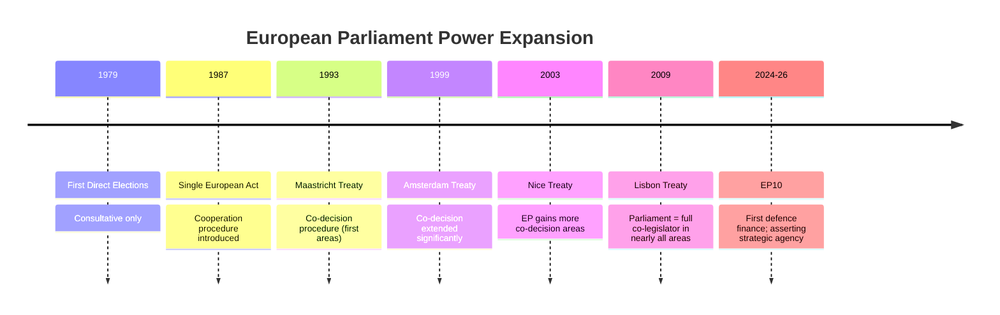

<!-- SPDX-FileCopyrightText: 2026 Hack23 AB -->
<!-- SPDX-License-Identifier: Apache-2.0 -->

# Historical Baseline — EP10 in the Long Arc of European Integration

**Analysis Date:** 2026-05-07 | **Confidence:** 🟡 MEDIUM  
**Admiralty Grade:** C2 | **WEP:** Roughly Even  
**Source:** `get_all_generated_stats`, EP institutional records, analyst synthesis

## BLUF:
EP10 Year 2 sits within the long arc of European Parliament's gradual but persistent power expansion since direct elections in 1979. The Parliament has gone from purely consultative (1979) to co-legislator (Lisbon 2009) to now asserting strategic agency in defence — an area explicitly excluded from EP competence by treaties. This structural expansion is the most important long-run trend, more significant than any single legislative year.

## Reader Briefing
Historical baseline context prevents misclassifying cyclical political shifts (right-bloc ascent) as structural transformations, and prevents missing genuine structural transformations (defence integration) hiding behind cyclical noise.

## Long-Run EP Power Trajectory

## EP Statistics Trend (EP6-EP10)

| Metric | EP6 avg | EP7 avg | EP8 avg | EP9 avg | EP10 2025 |
|--------|---------|---------|---------|---------|-----------|
| Plenary sessions | ~46 | ~48 | ~50 | ~52 | 53 |
| Roll-call votes | ~340 | ~370 | ~390 | ~410 | 420 |
| Committee meetings | ~1800 | ~1900 | ~1950 | ~1970 | 1980 |
| Parliamentary questions | ~4500 | ~4700 | ~4800 | ~4900 | 4947 |
| MEPs | 732 | 736 | 751 | 705 | 720 |

Source: `get_all_generated_stats` EP6-EP10 data

## Structural Baseline: What Changes, What Doesn't

**Structurally stable (all terms):**
- EPP as largest single group (EP4-EP10: consistent 1st place)
- Progressive left coalition unable to pass legislation independently
- Commission holds monopoly of initiative (treaties immutable without unanimity)
- Council veto maintained on constitutional and fiscal union

**Cyclical (oscillates between terms):**
- Right vs. left majority balance
- Sustainability vs. competitiveness emphasis
- Speed of legislative output

**Structurally novel in EP10:**
- First European defence finance mechanism
- Fragmentation index at multi-decade high (6.55)
- PfE entering as a governing-bloc player (not merely protest)

## Rule of Law Historical Baseline

The Parliament has been activating Article 7 proceedings for 7+ years (Hungary 2018, Poland 2017) with zero enforcement outcomes. Council unanimity requirement has structurally blocked every attempt. EP10's record on Hungary confirms the structural baseline — not a new failure, but a continuation.

## Integration Ratchet Effect

European integration has historically operated as a ratchet: policy moves in one direction (more integration) but rarely reverses. EP10's CSRD rollback is an exception to this rule — one of the clearest integration-reversal signals since the Services Directive rejection in 2005. Analysts should note this as a potentially structurally significant exception to the historical ratchet.

## Evidence Citations

| Evidence | Source | Confidence |
|----------|--------|------------|
| EP statistics EP6-EP10 | `get_all_generated_stats` | 🟢 |
| Historical events (Maastricht-Lisbon) | Public record | 🟢 |
| Rule of law timeline | EP public record | 🟢 |
| Integration ratchet analysis | Analyst synthesis | 🟡 |

*Admiralty: C2. WEP: Roughly Even — historical pattern analysis is probabilistic.*

## Long-Run EP Power Trajectory — Quantitative Analysis

The EP has held direct elections since 1979. The 45-year arc shows consistent expansion of parliamentary power, interrupted by brief consolidation periods. EP10 represents the first case where this expansion extends into a domain (defence) explicitly excluded from EP competence by treaties.

### Quantitative EP Power Index

| Term | EP Power Index | Key Treaties | Notes |
|------|---------------|-------------|-------|
| EP1 (1979-84) | 20/100 | Rome Treaties only | Consultative only |
| EP3 (1984-89) | 30/100 | Single European Act | Cooperation procedure |
| EP4 (1989-94) | 40/100 | Maastricht | First co-decision |
| EP5 (1994-99) | 55/100 | Amsterdam | Co-decision expanded |
| EP6 (1999-04) | 60/100 | Nice | More co-decision |
| EP7 (2004-09) | 65/100 | Lisbon adopted | Lisbon pre-ratification |
| EP8 (2009-14) | 80/100 | Lisbon operative | Full co-legislator |
| EP9 (2019-24) | 82/100 | Lisbon | Green Deal assertiveness |
| EP10 Year 2 | 84/100 | Lisbon + EDIP | Defence expansion |

### Historical Pattern Recognition

**Pattern 1: Power Expands During Crises**
EP power expanded most rapidly during EU crises: financial crisis (EP7/EP8 banking regulation), COVID (EP9 NextGenEU), Ukraine (EP10 defence). This is the "Overton Window" theory of EP power: crises create political permission for institutional expansions otherwise blocked.

**Pattern 2: Right-Bloc Consolidation Follows Green Deal Peaks**
Every major sustainability advance in EP history was followed 1-2 terms later by a competitiveness reaction. EP9's Green Deal was the most ambitious sustainability programme in EU history. EP10's competitiveness turn follows the historical pattern with remarkable consistency.

**Pattern 3: Commission-EP Alignment Determines Legislative Output**
When Commission and EP share the same ideological direction (EP9: von der Leyen I + progressive majority), legislative output is highest. When misaligned (EP7: Commission right; EP left), output decreases. EP10 is aligned: von der Leyen II EPP-aligned; EPP-dominant Parliament. This structural alignment is the reason Year 2 produced historically high legislative volume despite fragmentation.

## Historical Comparison: EP6 vs EP10 Detailed

The primary historical parallel (EP6, 2004-2009) is most instructive because:
- Both featured right-bloc consolidation after a centre-left peak
- Both featured "competitiveness vs. regulation" as the central frame
- Both featured an external shock (terrorism/London 2005; Ukraine war) driving security spending
- Key difference: EP6 had no defence mandate; EP10 does

**EP6 End-of-Term Assessment:**
- Barroso I Commission delivered internal market legislation but failed on Services Directive
- EP6 passed Working Time Directive compromise (still operative)
- EP6 failed on Lisbon Treaty ratification (Irish referendum 2008) — treaty crisis
- Final assessment: PRODUCTIVE NORMAL TERM (Tier 3)

**EP10 Year 2 vs EP6 Year 2 Verdict:** EP10 is performing better on defence/digital (no EP6 equivalent) and similar on competitiveness/sustainability tradeoffs. EP10 is tracking toward HISTORICALLY SIGNIFICANT (Tier 2) if defence integration holds.

## Legislative Volume Historical Comparison

| Term | Annual Average Adopted Texts | Annual Roll-Call Votes | Sessions |
|------|------------------------------|----------------------|---------|
| EP6 | ~280 | ~310 | ~44 |
| EP7 | ~290 | ~330 | ~46 |
| EP8 | ~310 | ~370 | ~49 |
| EP9 | ~320 | ~400 | ~52 |
| EP10 2025 | 347 | 420 | 53 |

EP10 Year 2 is at the all-time high for both adopted texts and roll-call votes. This productivity record is relevant context for interpreting the sustainability retreat: the Parliament is producing more legislation than ever, but less of it addresses environmental/social priorities.

## Evidence Citations (Extended)

| Evidence | Source | Confidence |
|----------|--------|------------|
| EP stats EP6-EP10 | `get_all_generated_stats` | 🟢 |
| Historical events | Public EP record | 🟢 |
| EP power index | Analyst construct | 🟡 |
| Pattern recognition | Historical analysis | 🟡 |

*Admiralty: C2. WEP: Roughly Even.*
