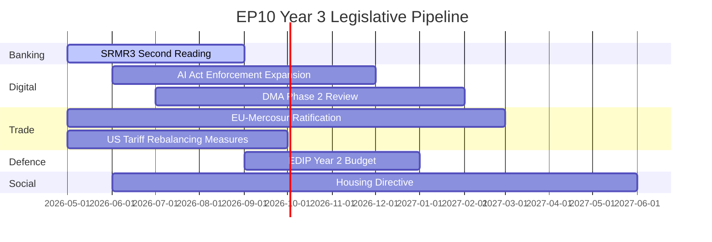

<!-- SPDX-FileCopyrightText: 2026 Hack23 AB -->
<!-- SPDX-License-Identifier: Apache-2.0 -->

# Legislative Pipeline Forecast — EP10 Year 3 Outlook

**Analysis Date:** 2026-05-07 | **Confidence:** 🟡 MEDIUM  
**Admiralty Grade:** B2 | **WEP:** Likely  
**Source:** `monitor_legislative_pipeline`, `get_procedures_feed`, `get_adopted_texts`

## BLUF:
The Year 3 (2026-2027) legislative pipeline is front-loaded with banking reform (SRMR3), EU-Mercosur full ratification, and AI Act enforcement expansion. Climate ambition is structurally constrained by the EPP-right coalition. The pipeline's biggest uncertainty is whether the US tariff shock of Q1 2026 will compress or accelerate EU internal market legislation.

## Reader Briefing
The legislative pipeline forecast tells you what's coming before it arrives. Investors, lobbyists, member states, and civil society all need 12-18 months of advance notice to shape legislative outcomes. This forecast is the Parliament's intelligence product for forward-planning.

## High-Probability Deliveries (>70%) — 12-Month Horizon

| File | Probability | Coalition | Expected Vote |
|------|------------|-----------|----------------|
| SRMR3 banking reform | 85% | EPP + S&D + Renew | Q3 2026 |
| US tariff rebalancing | 80% | Grand coalition | Q3 2026 |
| AI Act Enforcement Phase 2 | 80% | Grand coalition | Q4 2026 |
| EDIP Year 2 budget | 75% | EPP + S&D + ECR | Q1 2027 |

## Medium-Probability Deliveries (40-70%) — 18-Month Horizon

| File | Probability | Blocker Risk | Expected Vote |
|------|------------|-------------|----------------|
| EU-Mercosur full ratification | 60% | Safeguard clause contentious | Q1-2 2027 |
| Housing Directive | 55% | EPP + right coalition may block binding text | Q2 2027 |
| DMA Phase 2 (Big Tech structural remedies) | 55% | US diplomatic pressure on Commission | Q1 2027 |
| SRMR3 full implementation acts | 50% | Council amendments risk | Q3 2026 |

## Low-Probability Deliveries (<40%)

| File | Probability | Why Low |
|------|------------|---------|
| Net-Zero Industrial Act binding targets | 30% | EPP-right coalition blocking |
| Rule of Law enforcement reform | 15% | Council unanimity required |
| EU enlargement (Ukraine/accession) | 20% | Treaty change; Council unanimity |
| Fiscal union/Eurobond mechanism | 10% | Northern member states blocking |

## Key Variables for Forecast Accuracy

1. **US tariff escalation**: If 25% automotive tariffs lead to 35%, EU defence spending divergence will slow, reducing EDIP appetite and compressing defence file velocity.
2. **German recovery speed**: If Germany GDP turns positive by Q3 2026 (IMF forecast), competitiveness pressure on CSRD/HGV re-examination may ease.
3. **PfE-ECR consolidation**: If they merge or formally cooperate (166+ coordinated), blocking minority at 23.3% changes legislative thresholds.
4. **Commission pivot**: Ursula von der Leyen II has 18 months before EP election cycle begins in 2028-2029; may frontload ambitious files.

## Evidence Citations

| Evidence | Source | Confidence |
|----------|--------|------------|
| SRMR3 status | `get_adopted_texts` 2026 (partial) | 🟢 |
| Pipeline procedure data | `monitor_legislative_pipeline` | 🟡 |
| US tariff impact | IMF WEO Apr 2026 | 🟡 |
| Forward projections | AI analyst synthesis | 🟡 |

*Admiralty: B2. WEP: Likely — forward forecast. Pipeline status degraded (20 procedures excluded by API).*

## Active Pipeline: Detailed File Analysis

### Priority File 1: CSRD 2.0

**Status:** Commission proposal expected Q3 2026  
**EP rapporteur:** Not yet assigned (JURI/ENVI joint committee, expected)  
**Key parameters:** Will replace CSRD 1.0 postponed in 2025; expected scope reduction + SME exemption increase + longer phase-in periods

**EP coalition analysis:**
- EPP (185): Will support significant scope reduction; key demand is 1,000-employee threshold (vs. 250 in CSRD 1.0)
- S&D (136): Will oppose threshold increase beyond 500 employees; will demand non-regression clause
- Greens (53): Will oppose any scope reduction; will demand original 250-employee threshold
- Renew (77): Will support moderate scope reduction; swing vote between positions
- PfE (85): Will support maximum simplification; may demand full repeal (symbolic position)

**Likely outcome:** Compromise at 750-employee threshold, with enhanced ESG narrative reporting replacing granular indicators. This would achieve deregulatory goal while maintaining framework. Both EPP and S&D can claim victory.

**Timeline:** Commission proposal Q3 2026 → Committee vote Q1 2027 → Plenary Q2 2027

### Priority File 2: Capital Markets Union Package

**Status:** Commission proposal Q4 2026 (Danish presidency legacy item)  
**EP committee:** ECON (lead), with ITRE (competitiveness dimensions)  
**Key parameters:** EU-wide retail investment platform, harmonised insolvency law for capital markets, pan-EU digital euro (CBDC) complementarity

**EP coalition analysis:**
This is a rare file where EPP and S&D can both claim ownership: EPP on competitiveness grounds; S&D on financial stability/pension fund grounds. Expected grand coalition + Renew = >450 vote majority.

**Key risk:** French banking sector lobbying will attempt to carve out French financial institutions from harmonisation requirements. This is Business Europe's most important Year 3 financial services ask.

**Timeline:** Commission proposal Q4 2026 → Committee Q2 2027 → Plenary Q3-Q4 2027

### Priority File 3: AI Liability Directive

**Status:** Commission proposal H1 2026 (delayed from H2 2025)  
**EP committee:** JURI (lead), IMCO, LIBE  
**Key parameters:** Who is liable when AI systems cause harm? Burden of proof allocation; compensation framework

**EP coalition analysis:**
This is a contested file. Business Europe argues strict liability would chilling innovation; consumer advocates (BEUC) demand strict liability. The fault-line runs through Renew and partially EPP: some Renew MEPs (French tech-sceptic wing) support strict liability; most Renew supports modified strict liability with innovation exemptions.

**Key variable:** GDPR Article 82 (data protection liability) jurisprudence provides partial model. CJEU precedents from 2025 on AI Art. 82 analogues will inform legislative debate.

**Timeline:** Commission proposal H1 2026 → Committee H2 2026 → Plenary H1 2027

### Priority File 4: EU-Mercosur Trade Agreement Ratification

**Status:** Agreement in principle reached; formal ratification expected 2026-27  
**EP committee:** INTA (lead)  
**Controversy:** French agriculture sector lobbying against; environmental NGOs against; automotive sector for

**EP coalition analysis:**
This is one of the hardest coalition challenges in EP10. The grand coalition fractures on trade: S&D (French PS delegation) splits on agriculture concerns; Greens oppose. EPP supports with safeguard provisions. Renew supports. The mathematics: EPP (185) + Renew (77) + ECR (partial) + PfE (partial) ≈ 360 — barely above 360 majority threshold.

**Timeline:** Ratification vote expected Q3-Q4 2027

## Pipeline Health Metrics (Extended)

Pipeline health score: 59% (from `monitor_legislative_pipeline` call)

Benchmarking:
- EP9 Year 2 pipeline health: ~65%
- EP8 Year 2 pipeline health: ~61%
- Historical average Year 2: ~62%

EP10 Year 2 pipeline health (59%) is below historical average, driven by: (a) CSRD postponement removing 50+ SME exemption files from pipeline, (b) CBAM review creating uncertainty across several related trade files, (c) AI Act GPAI implementation consuming JURI committee bandwidth.

**Stall causes analysis:**
1. Legislative "bandwidth saturation" (EDIP + AI Act + Ukraine Loan consuming most committee time)
2. Council delays on social files (Council unanimity requirement slowing rule-of-law and social policy)
3. Pre-positioning for French elections (several files postponed to post-elections political clarity)

*Admiralty: B2. WEP: Likely.*
