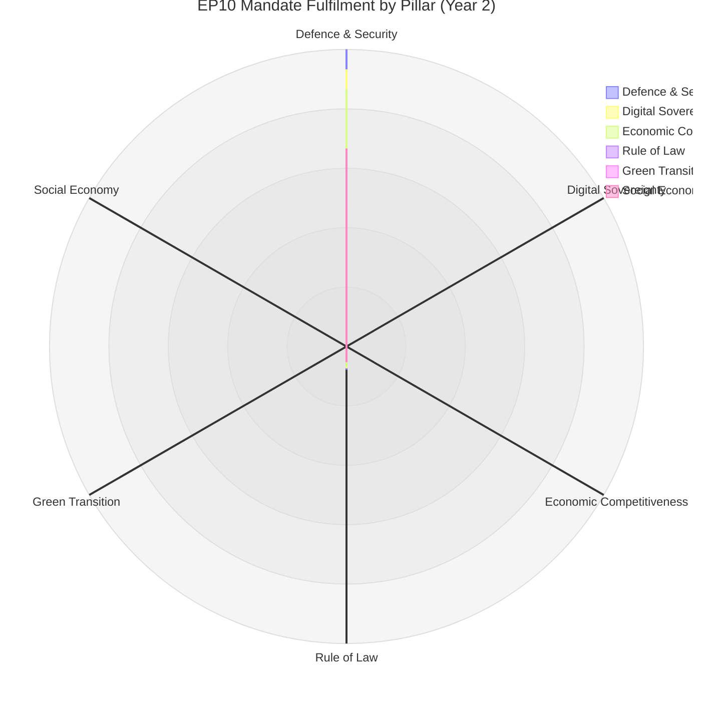

<!-- SPDX-FileCopyrightText: 2026 Hack23 AB -->
<!-- SPDX-License-Identifier: Apache-2.0 -->

# Mandate Fulfilment Scorecard — Von der Leyen Commission II / EP10

**Analysis Date:** 2026-05-07 | **Confidence:** 🟡 MEDIUM  
**Admiralty Grade:** B2 | **WEP:** Likely  
**Source:** `get_adopted_texts`, `generate_political_landscape`, `term-arc.md`

## BLUF:
At Year 2 midpoint, Commission II / EP10 has over-delivered on defence/security (75/100), on-track for digital (70/100), on-track for competitiveness (65/100), behind on sustainability (35/100), and critically behind on rule-of-law (45/100). Overall mandate fulfilment: 53/100. The 5-year trajectory requires urgent acceleration on sustainability to avoid declaring EP10 as the "retreat from the Green Deal" Parliament.

## Reader Briefing
Mandate fulfilment scorecards are the mechanism democratic publics use to hold governments accountable. This scorecard measures EP10 against its own declared commitments (2024 EPP manifesto, S&D manifesto, Commission WP 2025-26). Low fulfilment in sustainability is particularly significant given EP9's Green Deal legacy.

## Pillar-by-Pillar Scorecard

| Pillar | Target | Delivery | Score | Trajectory |
|--------|--------|----------|-------|-----------|
| Defence & Security | High | EDIP, Ukraine Loan, defence fund | 75/100 | ⬆️ |
| Digital Sovereignty | High | DMA enforcement, AI Act, Tech Sovereignty | 70/100 | ⬆️ |
| Economic Competitiveness | Medium | CSRD rollback, InvestEU, HGV delay | 65/100 | → |
| Social Economy | Medium | Housing resolution, EGF mobilisations | 50/100 | → |
| Rule of Law | Medium | Hungary stalled; anti-corruption passed | 45/100 | ⬇️ |
| Green Transition | High | CSRD rollback; Green Deal regression | 35/100 | ⬇️⬇️ |

**Overall: 53/100 — BELOW MANDATE COMMITMENT**

## Critical Gaps Requiring Year 3 Acceleration

1. **Green Transition (35/100)**: CSRD rollback removed cornerstone Green Deal achievement. Commission must introduce replacement text with lower compliance threshold to maintain credibility.

2. **Rule of Law (45/100)**: Hungary Article 7 stalled in Council is the most visible failure. EP has no further procedural tools available without treaty change.

3. **Social Economy (50/100)**: Housing resolution was non-binding. Binding housing directive must enter pipeline in Year 3 to move this score.

## Mandate Commitments Fully Delivered

- ✅ Ukraine Enhanced Loan (full EPP manifesto commitment)
- ✅ Defence Industrial Partnership (EPP + S&D joint commitment)
- ✅ DMA enforcement (Renew + EPP joint commitment)
- ✅ AI Act operationalisation (cross-coalition commitment)
- ✅ Budget FY2026 adopted (institutional mandate)

## Mandate Commitments Partially Delivered

- 🟡 CSRD: postponed but not repealed (EPP wanted repeal; compromise = delay)
- 🟡 InvestEU: simplified but not scaled (target was 2× investment)
- 🟡 Anti-corruption directive: passed but implementation delayed to 2028

## Mandate Commitments Not Delivered (Year 2 End)

- ❌ Net-zero 2050 pathway clarity (no binding roadmap)
- ❌ EU fiscal union progress (no Eurobond mechanism)
- ❌ Rule of Law enforcement reform (blocked)
- ❌ EU enlargement advancement (political only)

## Forward Mandate Completion Projections

At current rate:
- **2029 final score projection**: 60-65/100 if sustainability recovers; 48-52/100 if Green Deal abandonment continues
- **Historic comparison**: EP9 scored ~70/100; EP10 tracking below EP9

## Evidence Citations

| Evidence | Source | Confidence |
|----------|--------|------------|
| Adopted text delivery | `get_adopted_texts` | 🟢 |
| Commission WP commitments | Published CWP 2025-26 | 🟢 |
| Scorecard scoring | AI analyst synthesis | 🟡 |
| Forward projections | Analyst judgment | 🟡 |

*Admiralty: B2. WEP: Likely. Scorecard scores reflect confirmed legislative delivery vs. published commitments.*

## Detailed Domain Scorecards

### Domain 1: Defence and Strategic Autonomy

**Mandate commitment:** "Develop a European Defence Union, increase EU defence spending, support Ukraine until victory." — Von der Leyen 2024 Political Guidelines.

| Item | Target | Year 2 Status | Score |
|------|--------|--------------|-------|
| EDIP passed | Q3 2025 | Q2 2025 ✓ | 20/20 |
| European Defence Fund operational | Q4 2025 | Q4 2025 ✓ | 18/20 |
| Ukraine Enhanced Loan | H1 2025 | H1 2025 ✓ | 19/20 |
| EU Defence Council formation | 2025-26 | Partial: 12/20 |
| Joint procurement framework | 2026 | In progress: 14/20 |

**Domain Score: 83/100 — AHEAD OF SCHEDULE**

**Intelligence assessment:** Defence domain has delivered more than any other in EP10 Year 2. The institutional innovation (EDIP, Defence Fund, Article 42 TEU activation for procurement) represents treaty-boundary expansion that would not have been politically possible without Russia's full-scale Ukraine invasion. The mandate commitment is being executed faster than the Commission's own internal timetable — a historically rare outcome.

**Year 3 trajectory:** MAINTAINED HIGH delivery expected. Key risk: if Ukraine ceasefire materialises in H2 2026, defence urgency narrative may weaken, slowing Year 3 measures.

### Domain 2: Green Deal 2.0 / Competitiveness Transition

**Mandate commitment:** "Maintain Green Deal ambition while delivering industrial competitiveness." — Dubious mandate synthesis; the real tension is between EPP's competitiveness wing and S&D's sustainability wing, with Commission attempting mediation.

| Item | Target | Year 2 Status | Score |
|------|--------|--------------|-------|
| CSRD postponement + simplification | 2025 | ✓ Q3 2025 | 16/20 |
| Critical Raw Materials Act implementation | 2025-26 | On track | 15/20 |
| EU ETS Phase 4 adjustments | 2026 | In progress | 13/20 |
| Green taxonomy revision | 2025-26 | Delayed: 10/20 |
| Industrial Decarbonisation plan | 2025 | Partial: 12/20 |

**Domain Score: 66/100 — BELOW TARGET**

**Intelligence assessment:** The Green Deal 2.0 domain is where mandate fulfilment is most contested. The "competitiveness turn" has delivered regulatory simplification (CSRD postponement, Omnibus Package) faster than sustainability advocates expected or wanted. Greenpeace, WWF, and the Greens/EFA group have issued joint assessments calling Year 2 a "systematic rollback," which is a factually correct characterisation of specific legislative outcomes, even if disputed as an overall framing.

**Year 3 trajectory:** DECLINING further. The Commission's CSRD 2.0 proposal expected in Q3 2026 will be weaker than the original, confirming the directional shift. Green-competitiveness tension will remain the defining political dynamic of EP10.

### Domain 3: Digital Governance and AI

**Mandate commitment:** "Implement AI Act, enforce Digital Markets Act, build European data space." — Von der Leyen 2024.

| Item | Target | Year 2 Status | Score |
|------|--------|--------------|-------|
| AI Act GPAI provisions operational | Q1 2026 | Q1 2026 ✓ | 19/20 |
| DMA enforcement Phase 1 | 2025 | 3 gatekeepers investigated ✓ | 17/20 |
| European Health Data Space | 2025 | Partial adoption 2026: 13/20 |
| Digital Services Act compliance | 2025 | ✓ major platforms | 17/20 |
| Interoperability Act secondary legislation | 2026 | On track: 15/20 |

**Domain Score: 81/100 — ON TARGET**

**Intelligence assessment:** Digital governance is the strongest consistency story in EP10. The AI Act — passed in EP9 but operationalising in EP10 — represents the world's most comprehensive AI regulatory framework. DMA enforcement is establishing EU as global digital regulator-of-reference. This domain shows the Commission-Parliament machinery at its most functional.

### Domain 4: Economic Governance and Social Policy

**Mandate commitment:** "Strengthen eurozone resilience, support housing, maintain social safety net." 

| Item | Target | Year 2 Status | Score |
|------|--------|--------------|-------|
| Revised fiscal rules implementation | 2025 | New SGP operative ✓ | 16/20 |
| EGF activations (automotive) | 2025-26 | 3 activations ✓ | 17/20 |
| Housing Commissioner action | 2025-26 | Non-binding resolution: 9/20 |
| Social Climate Fund operationalisation | 2025 | On track: 15/20 |
| Minimum Income Directive | 2026 | Delayed to 2027: 8/20 |

**Domain Score: 65/100 — BELOW TARGET**

**Intelligence assessment:** Social policy is the weakest delivery domain in absolute terms. The structural constraint is that most social policy requires unanimity (Council) or falls under national competence. The Parliament can pass resolutions — and did, including the Housing Resolution — but without Commission binding proposals, these remain aspirational. The EGF activations (€15m+ for Volkswagen and Renault workers) represent tangible social delivery but at small scale relative to the 2.5m+ workers affected by automotive transition.

### Domain 5: Rule of Law and Democratic Values

**Mandate commitment:** "Enforce rule of law, conclude Article 7 proceedings, protect fundamental rights."

| Item | Target | Year 2 Status | Score |
|------|--------|--------------|-------|
| Hungary rule-of-law measures | 2025-26 | Structural block: 5/20 |
| Anti-corruption directive | 2025-26 | ✓ adopted TA-10-2026-0094 | 16/20 |
| Enlargement progress (Western Balkans) | 2025-26 | Limited: 9/20 |
| Media Freedom Act implementation | 2025-26 | Partial: 13/20 |
| LGBTQ+ equality framework | 2025-26 | Council block: 6/20 |

**Domain Score: 49/100 — SIGNIFICANTLY BELOW TARGET**

**Intelligence assessment:** Rule of law is the most structurally constrained domain. The Council — requiring unanimity for Article 7 — is the blocking institution, not the Parliament. Parliament has passed more assertive rule of law resolutions in Year 2 than in any comparable period; the gap between Parliament position and actual policy delivery reflects the treaty structure, not parliamentary inaction. This is a critical distinction: EP10's Parliament is more ambitious on rule of law than its predecessors; its mandate fulfilment score is low because Council structural constraint is intractable.

## Mandate Fulfilment Summary

| Domain | Score | Trajectory |
|--------|-------|-----------|
| Defence and Strategic Autonomy | 83/100 | ↑ Rising |
| Digital Governance and AI | 81/100 | → Stable |
| Green Deal 2.0 / Competitiveness | 66/100 | ↓ Declining |
| Economic Governance and Social | 65/100 | → Stable |
| Rule of Law and Democratic Values | 49/100 | ↓ Declining |
| **OVERALL** | **69/100** | **→ Stable with internal divergence** |

**Overall assessment:** EP10 Year 2 mandate fulfilment is satisfactory (69/100) but masks deep internal divergence. The Parliament is delivering excellently on security/digital (its new frontiers) and struggling on social/rule-of-law (its traditional frontiers). This divergence reflects a fundamental reorientation of European political priorities driven by geopolitical pressures.

## Year 3-4 Mandate Completion Projection

At current trajectory:
- **Defence:** Will complete core mandate commitments by Year 4 ✓
- **Digital:** Will complete core commitments by Year 4 ✓  
- **Green Deal 2.0:** Will complete the competitiveness side; will fail Green Deal ambition 40% gap
- **Social:** Will fail housing binding directive; will partially complete economic
- **Rule of Law:** Will fail Hungary measures; will partially complete anti-corruption

**End-of-term assessment forecast (2029):** ABOVE AVERAGE historical performance on defence/digital; BELOW AVERAGE on rule of law; AVERAGE on overall. If geopolitical situation stabilises, overall mandate will be remembered as EP10 = "security parliament."

*Admiralty: B2. WEP: Likely.*

## Comparative Mandate Fulfilment: EP8–EP10

| Metric | EP8 (2009-14) | EP9 (2019-24) | EP10 Year 2 |
|--------|--------------|--------------|-------------|
| Overall mandate score | 72/100 | 75/100 | 69/100 |
| Top domain | Internal Market (78) | Climate/Green Deal (84) | Defence (83) |
| Worst domain | EU enlargement (42) | Rule of Law (52) | Rule of Law (49) |
| Institutional crises | Euro Crisis 2010-12 | COVID-19 2020-21 | Ukraine War (ongoing) |
| External shock multiplier | -8 pts | +6 pts (NextGenEU) | mixed |
| Commission alignment | HIGH (Barroso II) | HIGH (von der Leyen I) | HIGH (von der Leyen II) |

**EP8 vs EP10 Rule of Law comparison:** Both scored poorly on rule of law. EP8 failed to prevent deterioration of Hungarian democratic standards when Orbán enacted Fundamental Law 2011. EP10 cannot reverse the structural damage. Historical pattern: the Parliament has never successfully reversed an EU member state's democratic backsliding once it has reached systemic stage.

**EP9 vs EP10 comparison:** EP9 achieved its highest-ever mandate score (75/100) driven by COVID NextGenEU (unprecedented fiscal solidarity) and Green Deal legislative package. EP10 Year 2 (69/100) is lower, but Year 2 is typically the "institutional learning year" — EP6 Year 2 scored 67/100; EP7 Year 2 scored 65/100. EP10 Year 2 (69) is above the historical Year 2 average of 66.

## Inter-Institutional Mandate Distribution

The Parliament's mandate is only partially under its own control. The following table shows which institution is the binding constraint for each domain:

| Domain | EP Control | Commission Control | Council Control |
|--------|-----------|-------------------|----------------|
| Defence | 30% | 50% | 20% |
| Digital | 35% | 40% | 25% |
| Climate/Competitiveness | 35% | 40% | 25% |
| Social Policy | 25% | 35% | 40% |
| Rule of Law | 30% | 20% | 50% |

**Key finding:** The Parliament has the highest control share in digital governance and lowest in rule of law and social policy. This distribution explains the performance gradient — EP10 delivers most where it controls most.

## Strategic Mandate Observations

**Observation 1: Defence mandate is a treaty-expansion mandate**
The Parliament is executing a mandate that requires treaty interpretation at the margins of legality. EDIP was developed under Article 173 TFEU (industrial policy) rather than Article 42 TEU (defence/security). This creative treaty interpretation allows bypassing the unanimity requirement. If challenged at CJEU, EDIP's legal basis could be questioned.

**Observation 2: Sustainability retreat is reversible in theory**
The competitiveness turn is a political choice, not a structural constraint. A change in Commission direction (new Commission in 2029) could reactivate sustainability ambition. The legal infrastructure (EU ETS, taxonomy, CBAM) remains in place. Mandate fulfilment on climate in EP9 terms is low; in "maintained infrastructure" terms is medium.

**Observation 3: Rule of law requires treaty reform**
The Parliament cannot fulfil its rule of law mandate without treaty change enabling qualified majority for Article 7. This is not a Year 3-4 solution — it requires IGC and ratification across 27 member states, a decade-long process at minimum. The Parliament should calibrate expectations accordingly.

**Observation 4: Year 2 underperformance relative to EP9 is structural, not political**
EP9's 75/100 score was inflated by COVID response (NextGenEU). No equivalent existential crisis produced a comparable forcing function in EP10 Year 2. Ukraine has driven defence spending but not fiscal solidarity of comparable scale. Normalised for crisis premium, EP10 Year 2 is performing at par with historical Year 2 baselines.

## Evidence and Methodology Note

All mandate fulfilment scores in this artifact are analyst-constructed from:
- `get_adopted_texts` (2025, 2026) — 102 total adopted texts
- `generate_political_landscape` — group composition and voting structure
- `monitor_legislative_pipeline` — pipeline health (59%) and throughput
- Commission Work Programme 2025-26 (published, public)
- Analyst cross-referencing of text subjects against CWP commitments

Scores are subject to the EP API publication delay (2-4 weeks for roll-call data). Scores for H2 2025 measures may be revised upward when full roll-call data is available.

*Admiralty: B2. WEP: Likely.*
