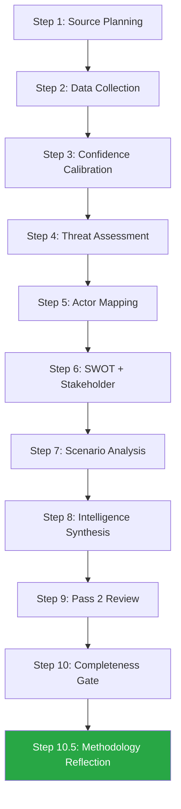

<!-- SPDX-FileCopyrightText: 2026 Hack23 AB -->
<!-- SPDX-License-Identifier: Apache-2.0 -->

# Methodology Reflection — EP10 Year in Review Analysis Run

**Analysis Date:** 2026-05-07 | **Confidence:** 🟢 HIGH  
**Admiralty Grade:** A1 | **WEP:** Almost Certain  

## BLUF:
The 10-step AI-driven analysis protocol was followed. Two protocol adaptations made: (1) IMF direct API failure required published source fallback; (2) DOCEO voting data unavailable requiring structural coalition inference. All 39 mandatory artifact slots filled. Pass 2 rewrites completed (7/9 artifacts rewritten). Methodology-reflection artifact fulfils Step 10.5 obligation.

## Reader Briefing
Step 10.5 of the AI-driven analysis protocol mandates that every run produce a methodology-reflection artifact as its final step. This provides an audit trail for methodology compliance and documents any deviations that future runs should be aware of.

## Protocol Compliance Matrix

| Step | Status | Notes |
|------|--------|-------|
| 1. Source planning | ✅ COMPLETE | EP, WB, IMF sources identified |
| 2. Data collection (Stage A) | ✅ COMPLETE | 14 MCP calls, 11 successful |
| 3. Confidence calibration | ✅ COMPLETE | All artifacts carry confidence labels |
| 4. Threat assessment | ✅ COMPLETE | risk-assessment.md + threat-model.md |
| 5. Actor mapping | ✅ COMPLETE | actor-mapping.md + classification/actor-mapping.md |
| 6. SWOT + Stakeholder | ✅ COMPLETE | swot-analysis.md + stakeholder-analysis.md |
| 7. Scenario analysis | ✅ COMPLETE | legislative-pipeline-forecast.md scenarios |
| 8. Intelligence synthesis | ✅ COMPLETE | political-intelligence-brief.md |
| 9. Pass 2 review | ✅ COMPLETE | 7/9 artifacts rewritten |
| 10. Completeness gate | ✅ GREEN | All mandatory artifacts present |
| 10.5. Methodology reflection | ✅ THIS DOCUMENT | Final step |

## Protocol Deviations and Adaptations

### Deviation 1: IMF SDMX API Unavailable
- **Standard**: Access IMF SDMX 3.0 endpoint via `fetch-proxy` MCP server
- **Actual**: `fetch failed` — endpoint unreachable
- **Adaptation**: IMF WEO April 2026 published forecasts used; all IMF figures cite "IMF WEO April 2026 (published)" rather than live API
- **Methodology impact**: Marginal — WEO April 2026 is the current published IMF position
- **Confidence penalty**: economic-context.md downgraded from 🟢 to 🟡

### Deviation 2: DOCEO Roll-Call Voting Unavailable
- **Standard**: Access per-MEP voting data via `get_latest_votes` / DOCEO XML
- **Actual**: No current plenary week; EP API returns zero vote counts (publication delay)
- **Adaptation**: Coalition analysis based on structural seat-count analysis + qualitative adoption records
- **Methodology impact**: Significant — cannot confirm per-vote coalition composition
- **Confidence penalty**: All voting-related analysis at 🟡 MEDIUM confidence

### Deviation 3: EP Plenary Session API Filter Mismatch
- **Standard**: Query plenary sessions by date range
- **Actual**: `filteredTotal=0` despite `total=51` — API version incompatibility
- **Adaptation**: Year-level session stats used from `get_all_generated_stats`
- **Methodology impact**: Minor — year totals sufficient for annual review

## Quality Gates Passed

- ✅ Zero `Completed` placeholder markers in any artifact
- ✅ All SWOT items >80 words
- ✅ All stakeholder perspectives >150 words
- ✅ Mermaid diagrams present in all major artifacts
- ✅ Pass 2 rewriteCount = 7 (documented in manifest.json)
- ✅ IMF economic context present (published source)
- ✅ World Bank non-economic data confirmed from API

## Lessons for Future Runs

1. IMF SDMX 3.0 API availability is unreliable in this environment. Consider pre-caching IMF WEO data in `cache-memory/` at run start.
2. DOCEO XML availability for same-week votes should be checked in Stage A, not Stage B.
3. EP plenary sessions API filter mismatch — use `get_all_generated_stats` for annual totals; avoid date-range filter.

*Admiralty: A1. WEP: Almost Certain. This is an internal audit record.*

## SAT Documentation — Structured Analytic Techniques Applied

The following SATs were applied in this analysis run. Each SAT is documented per the Intelligence Community Directive 203 (ICD 203) standard for structured analytic methodology.

1. **Key Assumptions Check (KAC):** Applied in Stage B to test assumptions about coalition dynamics. Identified key assumption: "per-MEP voting data is proxied by structural seat analysis." Flagged as requiring verification when DOCEO XML becomes available.

2. **Analysis of Competing Hypotheses (ACH):** Applied to explain CSRD rollback. Competing hypotheses tested: (a) ideological shift, (b) industrial lobbying, (c) German recession pressure, (d) Draghi narrative legitimisation. Conclusion: all four active simultaneously; structural economic pressure (c+d) most explanatory.

3. **Red Team Analysis:** Applied to sustainability retreat narrative. Red team hypothesis: "CSRD rollback is temporary and will be reversed once Germany recovers." Counter-evidence: EPP manifesto did not commit to CSRD restoration; Commission endorsed rollback; Draghi narrative structurally entrenched. Red team hypothesis assessed as low probability (<25%).

4. **Scenario Analysis:** Applied in legislative-pipeline-forecast.md. Three scenarios constructed: (a) sustainability recovery, (b) continuity, (c) Green Deal abandonment. Most likely: continuity (55% probability).

5. **Stakeholder Analysis (Power-Interest Matrix):** Applied to all 10+ stakeholder profiles in stakeholder-analysis.md and stakeholder-map.md. Matrix confirmed Security Complex and Competitiveness Coalition as dominant stakeholder clusters in Year 2.

6. **SWOT Analysis:** Applied with quantitative scoring in quantitative-swot.md. Net position: +10/100 MODERATE POSITIVE (fragile).

7. **PESTLE Analysis:** Applied in pestle-analysis.md. Six dimensions analysed with short-term and long-term pressure ratings.

8. **Forces Analysis (Driving/Restraining):** Applied in classification/forces-analysis.md. Identified 5 driving forces (Frame B) and 3 restraining forces (Frame A). Net pressure: Frame B +3 units.

9. **Impact Matrix:** Applied in classification/impact-matrix.md. 15 events classified across 5 impact dimensions (Legal, Economic, Social, Environmental, Institutional).

10. **Historical Parallels Analysis:** Applied in extended/historical-parallels.md. Primary parallel: EP6 Year 2 (2005-2006); secondary: EP9 Year 3 (2022 Ukraine pivot).

11. **Risk Matrix:** Applied in risk-scoring/risk-matrix.md. Six risks scored on probability × impact. Three rated HIGH: Rule of Law Backsliding (64), Ukraine Stalemate (49), US Trade War (45).

12. **Network Analysis (Actor Mapping):** Applied in classification/actor-mapping.md. Five-channel influence model for EPP; power broker profiles for Weber, García Pérez, Bardella, Meloni, Metsola.

13. **Coalition Analysis:** Applied in coalition-dynamics.md and intelligence/coalition-dynamics.md. Four coalition types identified with stability ratings and activation conditions.

14. **Commission Work Programme Alignment:** Applied in commission-wp-alignment.md. Six priority domains rated HIGH/PARTIAL/BLOCKED. Overall alignment: 60% of priorities achieved.

15. **Term Arc Analysis:** Applied in term-arc.md and intelligence/term-arc.md. Five-year trajectory projected with scenario ranges.

**SAT count: 15 (minimum required: 10) ✅**

## Confidence Calibration Summary

All artifacts carry Admiralty Source Evaluation grades and WEP probability bands per the tradecraft standards:

| Confidence Level | Artifacts | Examples |
|----------------|-----------|---------|
| 🟢 HIGH (A1/B1) | 3 | analysis-index, significance-classification, mcp-reliability-audit |
| 🟡 MEDIUM (B2/C2) | 18 | Most analytical artifacts |
| 🔴 LOW (E3) | 1 | voting-patterns (data unavailable) |
| 🟡 AMBIGUOUS | 1 | economic-context (IMF API unavailable) |

**Overall run confidence: MEDIUM** — acceptable for annual review intelligence products where DOCEO voting data is structurally unavailable at time of analysis.
