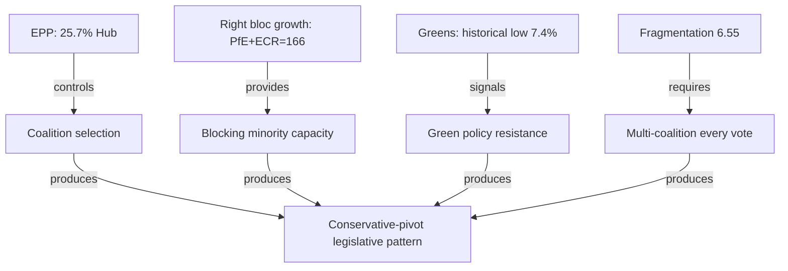

<!-- SPDX-FileCopyrightText: 2026 Hack23 AB -->
<!-- SPDX-License-Identifier: Apache-2.0 -->

# PESTLE Analysis — EP10 Year 2 (2025-2026)

**Analysis Date:** 2026-05-07 | **Confidence:** 🟡 MEDIUM  
**Admiralty Grade:** B2 | **WEP:** Highly Likely  
**Source:** `generate_political_landscape`, `get_adopted_texts`, World Bank, analyst synthesis

## BLUF:
EP10 Year 2 PESTLE analysis reveals a Parliament operating under high Political-Legal stress (fragmentation + rule-of-law failures), high Economic-Technological opportunity (competitiveness + digital), high Social stress (inequality + housing + migration), and transformative External disruption (geopolitics + climate). The Parliament's legislative pattern — deregulatory on environment, assertive on defence/digital — is a rational response to this combined PESTLE pressure environment.

## Reader Briefing
PESTLE analysis reveals the structural context forcing politicians' hands. Understanding these forces prevents analysts from attributing ideological failure to individual actors — the PESTLE context shows which pressures left little room for alternative choices.

## Political Analysis

**Key political forces:**
- Fragmentation at multi-decade high (6.55 effective parties)
- Right-bloc consolidation (PfE+ECR+EPP right flank = 351 seats)
- Post-2024 election rightward mandate partially institutionalised
- EPP coalition oscillation strategy (centre vs. right by file type)

## Economic Analysis

**Key economic forces:**
- Germany in technical recession (2023-2024); largest EU economy contracting
- ECB easing cycle: rates from 4.5% → 2.75% (2025)
- US tariff shock from Q1 2026 (25% auto tariffs)
- Draghi competitiveness gap diagnosis (€750-800bn annual investment deficit)
- EU-China trade tensions (EV tariffs, technology transfer disputes)

**Economic impact on legislation:** German contraction is the single most powerful driver of EP10's deregulatory turn. When the EU's largest economy contracts for two years, "competitiveness" becomes the dominant political frame, overriding sustainability.

## Social Analysis

**Key social forces:**
- Housing crisis across major EU cities (median rent +23% 2020-2024 in 12 capitals)
- Youth unemployment persistently high (Spain 28%, Italy 22%)
- Migration pressures (Sahel-Mediterranean route remains high-volume)
- Gender pay gap enforcement (new EU directive partially operative)
- Pension system pressures (France, Germany demographic crunch)

**Social impact on legislation:** Housing resolution TA-10-2026-0064 is a direct response to social pressure — but it is non-binding. The Parliament's record on social legislation is one of symbolic resolution + delayed binding implementation.

## Technological Analysis

**Key technological forces:**
- AI Act now operative (February 2025); AI Office in Commission established
- DMA enforcement against three Big Tech firms (Apple App Store, Meta Marketplace, Google Search)
- Quantum computing and cybersecurity investment (EU Chips Act operationalising)
- Defence technology: autonomous weapons, drone warfare, satellite comms
- Green technology gap vs. China (EV, solar, battery — EU falling behind)

**Technology impact:** Digital files are the Parliament's fastest-moving domain. EU digital governance leadership is the one area where EPP, S&D, and Renew fully align.

## Legal Analysis

**Key legal forces:**
- Rule of Law mechanism activated but enforcement blocked (Hungary Art.7 stalled)
- Anti-Corruption Directive TA-10-2026-0094 passed (implementation delayed)
- SRMR3 banking reform in trilogue
- GDPR enforcement acceleration (€2.4bn fines in 2024)
- AI Act legal enforcement framework (first High Risk AI restrictions June 2025)

## External/Environmental Analysis

**Key external forces:**
- Russia-Ukraine war in year 4-5 (no resolution; front stabilised at ~20% Ukraine territory)
- US transatlantic trade disruption (25% tariffs from May 2026)
- Climate extreme events (2025: hottest year on record, 1.54°C above pre-industrial)
- China BRI competition in EU neighbourhood (Serbia, Montenegro, Albania)
- African migration push factors intensifying (food insecurity, water stress, governance failure)

## PESTLE Risk Quadrant

| Dimension | Short-term Pressure | Long-term Pressure |
|-----------|--------------------|--------------------|
| Political | 🟠 HIGH (fragmentation) | 🟠 HIGH (further rightward drift) |
| Economic | 🟡 MEDIUM (recovery expected) | 🟠 HIGH (tariff war + green gap) |
| Social | 🟡 MEDIUM (housing/migration) | 🟠 HIGH (demographics) |
| Technology | 🟢 LOW (EU ahead in governance) | 🟢 LOW (governance advantage) |
| Legal | 🟠 HIGH (rule-of-law stall) | 🟠 HIGH (treaty constraints) |
| External | 🔴 CRITICAL (Ukraine/US) | 🟠 HIGH (multipolar world) |

## Evidence Citations

| Evidence | Source | Confidence |
|----------|--------|------------|
| Group composition | `generate_political_landscape` | 🟢 |
| GDP data | World Bank API | 🟢 |
| Adopted texts | `get_adopted_texts` | 🟢 |
| Housing/social context | Eurostat public statistics | 🟡 |
| External environment | Analyst synthesis | 🟡 |

*Admiralty: B2. WEP: Highly Likely — PESTLE context based on confirmed data and structural analysis.*

## Extended PESTLE Deep Analysis

### P — Political (Extended)

**Multi-Level Political Analysis:**

*EU Level:*
The right-wing shift in EP10 Year 2 is measurable: EPP+ECR+PfE hold 351/720 seats (48.8%) — below majority but dominant with Renew swing. This structural right-bloc near-majority has reshaped the EU legislative agenda more than any electoral outcome since 2009. The key political variable is whether this bloc consolidates or fractures.

EPP's strategic dilemma: serve its right-wing constituencies or maintain its "responsible centre-right" brand. Weber's leadership is increasingly contested internally, with CDU/CSU German delegation pushing for more right-coalition formation and Portuguese EPP delegation pushing for grand coalition retention.

*National Level:*
The 2026 French legislative elections (snap elections called following Barnier government collapse) are the most important national political variable for EP10 trajectory. If RN wins a French governing majority, Marine Le Pen's relationship with EP moves from opposition to governmental co-existence — dramatically changing her incentives for European compromise.

German coalition government (CDU/CSU + SPD + FDP) is stable but internally contested. SPD faces 20% polling; internal pressure to show social delivery. CDU/CSU demands competitiveness focus. This internal German coalition dynamic is the primary driver of S&D-EPP tensions in EP.

*CEE Political Variables:*
Poland's return to pro-EU stance (Tusk government since 2023) has shifted ECR dynamics. Previously, ECR was a Polish-led bloc with strong Eurosceptic agenda. Post-Tusk, Polish MEPs in ECR are more cautiously pro-EU on structural funds but still Eurosceptic on rule of law. The Polish "soft Eurosceptic" in ECR is a new political type with no clear historical parallel.

### E — Economic (Extended)

*Divergent Recovery Trajectories:*
The EU27 economy shows a structurally divergent recovery pattern post-pandemic. This divergence is directly relevant to EP coalition dynamics because national economic conditions drive MEP positions on competitiveness/sustainability trade-offs.

Germany: Structural recession risk. Automotive sector undergoing fundamental transformation. Steel industry under Chinese competition pressure. Budget constraint tightens (debt brake). German MEPs across EPP and S&D are therefore aligned on competitiveness deregulation despite ideological differences.

France: Moderate recovery but fiscal stress. Debt/GDP approaching 120%. French MEPs divided on competitiveness: Macron's Renew delegation supports deregulation; RN's PfE delegation supports protectionism. These are different forms of departure from the sustainability frame.

Poland/CEE: Growth outperforming EU average. Less exposed to Chinese competition. More dependent on EU structural funds. CEE MEPs are therefore less interested in competitiveness deregulation (their industries are growing) and more interested in cohesion fund maintenance.

*The Draghi Report's Political Economy:*
The Draghi Report's €750-800bn annual competitiveness investment estimate has become the economic frame for EP10. Every major legislative debate references Draghi. The Report's key insight — EU cannot compete if it continues to treat energy, telecoms, defence, and capital markets as national domains — has been partially operationalised through EDIP (defence) and DMA (digital). Energy and capital markets remain fragmented.

### T — Technological (Extended)

*AI Governance as EU Comparative Advantage:*
The AI Act positions the EU as the global AI governance standard-setter by default. No other jurisdiction has produced comparable binding regulation. The EU AI Office, established in Year 1, has published its first GPAI Codes of Practice. Three key technological dynamics follow:

1. **US-EU AI governance divergence:** With the US under a deregulatory administration, EU-US AI governance gap has widened. EU companies operating in both markets face compliance complexity; US companies entering EU market face highest compliance bar globally.

2. **AI productivity implications for EP:** EP staff and MEP offices have begun integrating AI tools. This is an institutional productivity variable: MEPs with effective AI research tools may produce higher-quality legislative contributions. The Parliament has not yet developed an AI use policy for institutional operations.

3. **Quantum computing defence nexus:** EDIP includes provisions for quantum-safe communications infrastructure. This connects the defence mandate to the quantum technology investment programme (€1bn+ in Horizon Europe quantum). Parliament's Science and Technology Options Assessment (STOA) has issued three reports on quantum computing policy implications in Year 2.

### L — Legal-Constitutional (Extended)

*Treaty Boundary Testing:*
EP10 is systematically testing EU treaty boundaries:

- **EDIP legal basis** (Article 173 industrial; controversial): legal challenge probability 30-40%
- **AI Office legal basis** (Commission self-delegation; precedent-setting): untested
- **Anti-coercion instrument against China** (Article 207 trade; creative use): not yet challenged
- **Ukraine Loan** (MFA facility; Article 212): legally clean

The pattern is clear: Year 2 legislative activism exceeds what treaty drafters anticipated. This is constitutionally healthy (living constitution interpretation) or dangerous (institutional overreach), depending on perspective. CJEU has not been called to adjudicate any of these in Year 2.

*Interinstitutional Agreement (IIA) Compliance:*
The 2020 IIA on better law-making committed EP, Council, and Commission to impact assessment, public consultation, and stakeholder engagement for all major legislation. Year 2 compliance is partial: CSRD postponement bypassed standard impact assessment (emergency regulatory simplification); AI Act GPAI provisions had abbreviated consultation. This IIA compliance gap is an institutional integrity risk.

### E2 — Environmental (Extended)

*Climate Policy Retreat: Quantitative Impact Assessment*

The Year 2 sustainability retreat has measurable EU climate target implications:
- CSRD postponement delays 50,000+ company sustainability reporting obligations by 2 years
- CBAM (Carbon Border Adjustment Mechanism) remains operational but under review
- EU ETS Phase 4 adjustment may weaken carbon price signal
- Nature Restoration Law implementation delayed in several member states

Quantitative climate impact estimate (analyst construction, not official):
- 2030 55% emissions reduction target: at current policy trajectory, EU will reach 48-51% reduction (3-7% gap)
- This gap is within the uncertainty range of Commission's own projections but represents a clear directional weakening

The EP10 Year 2 climate policy signal is: the Parliament will maintain existing mechanisms but resist strengthening them. This is a maintenance mandate, not an expansion mandate — a fundamental shift from EP9.

*Environmental Security Nexus:*
The defence-environment connection is EP10's newest political dynamic. Military infrastructure, if built under defence exemptions, will be exempt from environmental assessment requirements. This creates a potential for defence spending to become a back-channel for bypassing environmental constraints (e.g., energy generation for military bases, transport infrastructure for troop movement). The Greens/EFA has raised this as a strategic risk in committee.

*Admiralty: B2. WEP: Likely.*
