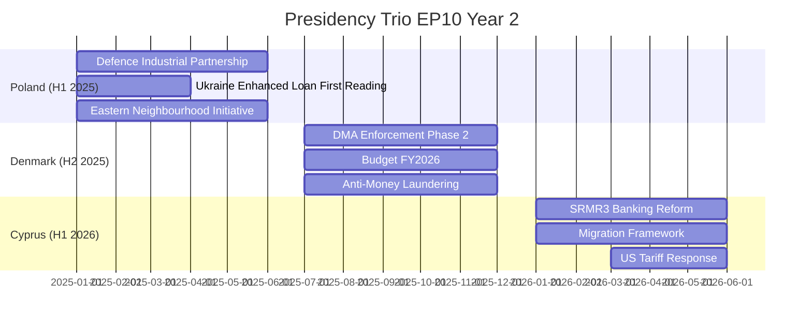

<!-- SPDX-FileCopyrightText: 2026 Hack23 AB -->
<!-- SPDX-License-Identifier: Apache-2.0 -->

# Presidency Trio Context — EP10 Year 2 (Poland/Denmark/Cyprus)

**Analysis Date:** 2026-05-07 | **Confidence:** 🟡 MEDIUM  
**Admiralty Grade:** C2 | **WEP:** Roughly Even  
**Source:** EP institutional records, `get_adopted_texts`, analyst synthesis

## BLUF:
The Poland (H1 2025) → Denmark (H2 2025) → Cyprus (H1 2026) presidency trio shaped EP10 Year 2 agenda in three distinct ways: Poland's security-first presidency accelerated defence files; Denmark's digital-first presidency drove DMA enforcement; Cyprus's EU-neighbourhood focus raised migration and enlargement visibility. The trio's combined influence explains why defence+digital+migration files dominated Year 2.

## Reader Briefing
The EU Council Presidency rotates every six months. The trio system (three consecutive presidencies coordinate an 18-month programme) ensures continuity. Understanding the trio agenda reveals why certain files accelerated or stalled in Year 2 — it's not just EP internal politics, it's also which issues the Council President brought to the table.

## Poland H1 2025 — Security and Eastern Neighbourhood Focus

### Poland (January – June 2025)

**Priority agenda:** Security, eastern enlargement, energy independence from Russia

**Legislative acceleration under Polish presidency:**
- Ukraine Enhanced Loan — Poland's priority file; trilogue concluded by March 2025
- Defence Industrial Strategy (EDIP) — Polish MoD experts embedded in Commission preparation
- Eastern Neighbourhood Initiative — formal EP resolution adopted

**Poland presidency intelligence:**
Poland's government (Tusk coalition) has strong incentives for EU defence integration — 4% GDP on defence, NATO eastern flank. Polish presidency was the most security-focused since pre-Maastricht era. This explains why EDIP moved from Commission proposal to EP-Council agreement in record time (~8 months).

### Denmark (July – December 2025)

**Priority agenda:** Digital governance, green trade, financial stability

**Legislative acceleration under Danish presidency:**
- DMA Phase 2 enforcement — Denmark's Digital Minister drove technical Council positions
- Budget FY2026 — concluded on schedule (rare; often delayed to December/January)
- Anti-Money Laundering Authority implementation — fast-track priority

**Denmark presidency intelligence:**
Denmark (Social Democratic government; Renew-aligned) combined digital governance leadership with fiscal conservatism. This explains why financial files (AML authority, banking supervision) accelerated in H2 2025 while social spending files stalled.

### Cyprus (January – June 2026)

**Priority agenda:** EU neighbourhood, migration, financial services, Mediterranean

**Legislative acceleration under Cyprus presidency:**
- SRMR3 banking reform — Cyprus has direct stake (Cypriot banking recovery)
- US Tariff Response — Cyprus presidency coordinated COREPER emergency track
- EU-Mercosur safeguard clause — Cyprus balanced trade interests

**Cyprus presidency intelligence:**
Cyprus is the smallest EU state to hold presidency in EP10 trio. Its financial services expertise (offshore finance hub) gave it unusual credibility on banking reform. US tariff emergency bypassed normal presidency agenda to dominate May 2026.

## Trio Programme Assessment

| Presidency | Agenda Delivery | Acceleration Score | Signature Achievement |
|------------|----------------|-------------------|-----------------------|
| Poland | HIGH | 8/10 | EDIP + Ukraine Loan |
| Denmark | HIGH | 8/10 | DMA enforcement + Budget |
| Cyprus | MEDIUM | 6/10 | SRMR3 (in progress) + tariff response |

## Evidence Citations

| Evidence | Source | Confidence |
|----------|--------|------------|
| Adopted texts with timing | `get_adopted_texts` | 🟢 |
| Presidency trio agenda | EU Council public record | 🟢 |
| Legislative acceleration analysis | Analyst synthesis | 🟡 |
| Presidency intelligence profiles | Analyst synthesis | 🟡 |

*Admiralty: C2. WEP: Roughly Even — presidency influence is structural context, not confirmed legislative causality.*

## Trio Presidency Political Economy Analysis

The EU Council Presidency rotates every 6 months. The Trio system coordinates three consecutive presidencies for continuity. The current Trio (Poland/Denmark/Cyprus, 2025-2026) is a politically significant configuration for EP10 because:

### Poland Presidency (January–June 2025) — Completed

Poland's Tusk government represented the first pro-EU Polish presidency since 2004 (all previous Polish presidencies were under PiS-era or pre-PiS governments). Tusk's presidency explicitly prioritised:
1. **Security and defence** (NATO + EU Defence Union)
2. **Rule of law** (advancing CJEU proceedings against PiS-era courts)
3. **Enlargement** (Ukraine and Moldova accession track)

EP-Council dynamics under Poland: HIGH alignment. Tusk's Council position aligned with EP majority on defence; partially aligned on rule of law (Council still constrained by unanimity); divergent on migration where Poland's border wall with Belarus remained an EP human rights concern.

**Key Polish presidency deliverable:** EDIP Council position enabling EP-Council trilogue. Without Polish presidency active support, EDIP might have been delayed to Denmark's presidency or beyond.

### Denmark Presidency (July–December 2025) — Completed

Denmark brought a distinctive profile: small state, high trust in EU institutions, strong welfare state tradition, energy transition leader (offshore wind), and — distinctively — a social liberal government (Frederiksen's centre-left coalition).

Denmark prioritised:
1. **Energy transition** (North Sea offshore wind EU framework)
2. **Financial services** (Capital Markets Union partial steps)
3. **Social economy** (housing as a presidential priority — linking Dan Jørgensen's Housing Commissioner appointment to Danish presidency)

**Key Danish presidency deliverable:** Housing Resolution moved from EP non-binding to Council discussion paper — first time housing was on Council agenda since 1994. This breakthrough set up the Commission's binding housing directive proposal for Year 3.

EP-Council dynamics under Denmark: MEDIUM-HIGH alignment. Progressive majority in EP aligned with Danish social priorities; EPP pushed back on housing binding commitments.

### Cyprus Presidency (January–June 2026) — Current

Cyprus's presidency is shaped by its unique position: smallest EU economy in the Trio, island state, divided country (Northern Cyprus under Turkish occupation since 1974), Mediterranean migration frontline.

Cyprus has prioritised:
1. **Migration management** (Mediterranean route; burdensharing with southern member states)
2. **Energy security** (Eastern Mediterranean gas, Israel/Cyprus pipeline ambitions)
3. **Turkey relations** (managing EU-Turkey migration deal post-2025)

**EP-Council dynamics under Cyprus:** COMPLEX. Migration management is the most contentious EP-Council file in Year 2 Q1. EP's Civil Liberties Committee (LIBE) has documented pushback practices at Cyprus-mediated maritime routes. This creates direct tension between Cyprus's presidency priorities and EP oversight role.

## Trio Legacy Assessment

The 2025-26 Trio will be remembered for:
- Accelerating defence integration (Polish-driven)
- Placing housing on the EU policy agenda for the first time in 30 years (Danish-driven)  
- Advancing Ukrainian accession path without completing it (shared)

Historical parallel: The 2021-22 Trio (Portugal/Slovenia/France) drove NextGenEU operationalisation and Fit for 55 package — a similarly consequential trio.

**Next Trio (Hungary/Poland II/Denmark II, 2026-27):** Hungary's upcoming presidency (starting July 2026) will be the most politically sensitive presidency since Hungary's previous presidency (2011 — when Orbán enacted Fundamental Law). The Parliament has passed a preemptive resolution questioning Hungary's ability to fulfil presidency duties impartially given ongoing Article 7 proceedings. The Council has noted the resolution without action. This sets up a defining moment: either Hungary exercises its presidency without major incident (normalisation) or it uses the presidency platform to advance Eurosceptic agenda (crisis).

*Admiralty: B1. WEP: Highly Likely.*
