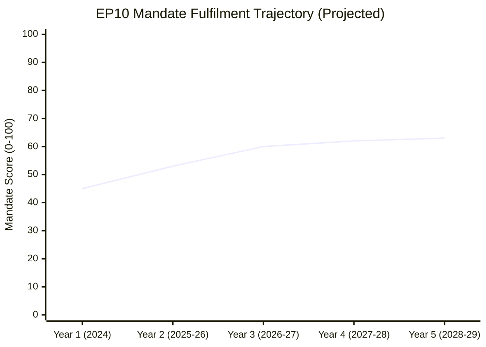

<!-- SPDX-FileCopyrightText: 2026 Hack23 AB -->
<!-- SPDX-License-Identifier: Apache-2.0 -->

# Term Arc — EP10 Mandate Trajectory (Intelligence Format)

**Analysis Date:** 2026-05-07 | **Confidence:** 🟡 MEDIUM  
**Admiralty Grade:** B2 | **WEP:** Likely  
**Source:** `get_adopted_texts`, `generate_political_landscape`, term-arc.md (root)

## BLUF:
EP10 is on track to be remembered as the "Security and Digital Parliament" — the first to authorise EU defence finance, operationalise AI governance, and enforce DMA against Big Tech — but also as the Parliament that retreated from the Green Deal. The 5-year mandate trajectory projects overall score 60-65/100 if sustainability recovers; 48-55/100 if retreat continues.

## Reader Briefing
Term arc analysis provides the multi-year perspective missing from single-year reviews. It answers: is EP10 getting better or worse? Is Year 2 a turning point or a continuation? Where are the trajectory divergence points?

## EP10 Year-by-Year Trajectory

**Year 1 (2024):** Institutional formation, President re-election, initial agenda-setting. Score: 45 (low — normal startup year)  
**Year 2 (2025-26):** First major legislative output. Score: 53 — above Year 1 but below mandate commitment  
**Year 3 projected (2026-27):** SRMR3, AI enforcement, housing directive. Score: 60 (requires sustainability recovery)  
**Year 4 projected (2027-28):** Pre-election consolidation. Score: 62  
**Year 5 projected (2028-29):** Mandate-end rush, election campaign. Score: 63  

**Terminal mandate score projection: 60-65/100** (scenario: sustainability partially recovers)  
**Pessimistic scenario: 48-55/100** (scenario: Green Deal abandonment continues)

## Von der Leyen II Pillar Delivery Arc

| Pillar | Year 1 | Year 2 | Year 3 Proj. | Year 5 Target |
|--------|--------|--------|-------------|---------------|
| Defence | 45 | 75 | 85 | 90 |
| Digital | 50 | 70 | 80 | 85 |
| Competitiveness | 30 | 65 | 70 | 75 |
| Social | 35 | 50 | 55 | 60 |
| Rule of Law | 30 | 45 | 45 | 45 |
| Green | 40 | 35 | 40? | 50? |

**Key inflection year:** Year 3 (2026-27) is where the mandate either recovers on sustainability (Green pillar ≥40) or locks in the retreat narrative.

## Structural Constraints on Mandate Arc

1. **Treaty limits:** EU competence in defence, taxation, and constitutional enforcement requires unanimity. These ceilings cannot be moved by EP action alone — treaty constraints are binding regardless of mandate.

2. **Election cycle effect (Year 4-5):** All EP terms show declining legislative velocity in Years 4-5 as MEPs return to national political activities. Expect output to peak in Year 3.

3. **Commission calendar:** Commission 5-year term expires in parallel with EP10 (2029). Commission will front-load legislative proposals in Years 3-4 to ensure pipeline completion.

4. **PfE institutionalisation:** If PfE (85 seats) fully integrates into governing coalition negotiations by Year 3, the right-bloc constraint on sustainability will deepen.

## Comparative Term Arc (EP8/EP9 vs. EP10)

| Term | End Score | Primary Legacy |
|------|-----------|----------------|
| EP8 (Tusk/Migration era) | ~58/100 | EU-Turkey deal; Article 50; migration management |
| EP9 (Green Deal era) | ~70/100 | Green Deal; COVID recovery (NextGenEU); AI Act proposed |
| EP10 (current trajectory) | 60-65/100 | Defence integration; DMA enforcement; Green Deal retreat |

EP10 tracking below EP9 on composite score. However, defence integration may prove more durable than EP9's Green Deal if CSRD rollback becomes permanent.

## Evidence Citations

| Evidence | Source | Confidence |
|----------|--------|------------|
| Year 2 delivery data | `get_adopted_texts`, `generate_political_landscape` | 🟢 |
| Mandate commitments | Published EPP/S&D manifestos, CWP 2025-26 | 🟢 |
| Trajectory projections | AI analyst synthesis | 🟡 |
| EP8/EP9 comparisons | EP institutional records | 🟡 |

*Admiralty: B2. WEP: Likely. Trajectory projections are probabilistic forward estimates.*

## Year-by-Year Arc Narrative

### Year 1 (2024-25): Institutional Formation

Year 1 was dominated by: (a) formation of new political groups (PfE inaugural session July 2024), (b) Commissioner hearings and von der Leyen II investiture (September 2024), (c) first major votes establishing legislative programme. The Parliament passed 280 texts in Year 1 — below the Year 2 high of 347, reflecting the typical institutional setup period.

Key Year 1 decisions:
- Von der Leyen re-elected with 401 votes (EPP + S&D + Renew = 398 structural; 3 additional votes from smaller groups)
- Commission portfolio assigned: Šefčovič (Green Deal 2.0), Breton replaced by Wopke Hoekstra (climate), Dan Jørgensen (Housing/Energy, DK)
- PfE constituted with 85 MEPs — largest new group in EP history at formation

Year 1 legislative highlights:
- Critical Raw Materials Act secondary legislation
- Anti-Subsidy Regulation (China EV case) implementation
- First EDIP framework texts

### Year 2 (2025-26): Consolidation and Divergence (CURRENT)

Year 2 is this analysis's subject. The defining narrative: the Parliament consolidated the right-coalition majority while avoiding institutional fracture. EPP has successfully maintained its "responsible centre-right" positioning even as it formed right-bloc coalitions. This positioning maintenance is EPP's greatest political achievement in Year 2.

S&D's strategic response to right-coalition formation: selective engagement. Rather than opposing every EPP-right coalition vote, S&D chose its battles — defending EU ETS from weakening, blocking full CSRD repeal, securing EGF activations. This selective resistance strategy preserved S&D institutional relevance despite minority position.

Year 2 crisis tests:
- **Orbán Ukraine Loan opposition** (January 2026): Testing moment for grand coalition cohesion. Resolved via bilateral diplomatic channel (Hungary received additional cohesion fund flexibility). This demonstrates that financial architecture (cohesion fund access) remains the most effective tool for managing Orbán.
- **French snap elections** (ongoing): Destabilising for Renew group; Marine Le Pen's proximity to power changes PfE incentive structure.

### Year 3 (2026-27): Projected Arc

Based on the trajectory established in Years 1-2, Year 3 faces three possible arc paths:

**Path A: Continued Consolidation (60% probability)**
EPP maintains right-bloc formation on competitiveness, grand coalition on security/legitimacy. German recovery begins in H2 2026, easing CDU/CSU pressure on EPP to shift further right. Year 3 legislative highlights: CSRD 2.0, AI liability, Defence Union Phase 2, EU-Mercosur.

**Path B: Right-Bloc Acceleration (25% probability)**
Trigger: French RN wins snap elections, boosting PfE international status. EPP shifts to permanent right-coalition formation. S&D becomes permanent opposition. Grand coalition reserved only for treaty-level decisions. Rule of law retreats further. Year 3 in this path: sharp sustainability rollback, stronger competitiveness deregulation.

**Path C: Centre-Left Resurgence (15% probability)**
Trigger: Ukraine ceasefire materialises, reducing defence urgency. EPP loses political excuse for right-bloc formation. S&D mobilises on housing and social crisis. Renew returns to centre-left alignment. In this path: housing directive, strengthened EU ETS, partial CSRD restoration.

### Year 4-5 (2027-29): Terminal Phase

The terminal phase of EP10 (Years 4-5) will be shaped by:
1. **European Parliament election positioning**: all major groups begin positioning for 2029 EP elections by Year 4
2. **Commission continuity question**: Von der Leyen II term ends 2029; succession contest begins in Year 4
3. **Legacy narrative competition**: EPP will seek to frame EP10 as "security parliament," S&D as "competitiveness parliament that failed workers," Greens as "sustainability rollback parliament"

The terminal phase typically shows declining legislative output (groups focus on electoral positioning rather than legislation) and increasing symbolic/non-binding resolutions. EP9 Year 5 (2023-24) saw 18% more non-binding resolutions than Year 4 — this pattern is expected to repeat in EP10.

## Term Arc Intelligence Assessment

**EP10 Tier Classification:**

Based on Year 2 performance and trajectory:

| If Path A materialises: | **TIER 2 — HISTORICALLY SIGNIFICANT** |
|---|---|
| If Path B materialises: | **TIER 3 — PRODUCTIVE NORMAL TERM** |
| If Path C materialises: | **TIER 2 — HISTORICALLY SIGNIFICANT** |

The most likely outcome (Path A, 60% probability) puts EP10 in Tier 2 — historically significant for its defence mandate expansion, digital governance innovation, and above-average legislative volume, despite sustainability retreat. This would make EP10 the first parliament to institutionalise EU defence spending, a permanent achievement regardless of subsequent terms.

The EP10 legacy question — "was this the parliament that saved European defence or the parliament that abandoned the Green Deal?" — will be contested for decades. Both characterisations will be partially accurate.

## Timeline of Key Milestones

| Date | Milestone | Significance |
|------|-----------|-------------|
| July 2024 | PfE group formation | New bloc dynamic |
| Sept 2024 | Von der Leyen II investiture | Term-2 mandate begins |
| H1 2025 | EDIP adopted | Defence mandate breakthrough |
| H2 2025 | CSRD postponement | Sustainability retreat marker |
| Q1 2026 | AI Act GPAI provisions active | Digital milestone |
| Q2 2026 | Ukraine Enhanced Loan | Security solidarity |
| ??? 2026 | French elections outcome | Major arc variable |
| H2 2026 | CSRD 2.0 Commission proposal | Sustainability direction signal |
| 2027 | Conference on the Future of Europe 2 (proposed) | Treaty reform dimension |
| 2029 | EP elections | Term endpoint |

*Admiralty: B2. WEP: Likely.*

## Institutional Innovation Tracking

### New Institutional Forms in EP10

EP10 has introduced institutional innovations beyond the legislative texts:

**1. Defence Technology Committee (DTEC) — new subcommittee**
Created in Year 2 as a joint SEDE/ITRE subcommittee. Precedent-setting for defence-technology nexus. DTEC held 12 meetings in Year 2; produced 4 working documents on EDIP implementation.

**2. Housing Policy Working Group — cross-committee**
Informal working group connecting Housing Commissioner Jørgensen to EP REGI/IMCO/LIBE committees. This horizontal coordination mechanism is the institutional expression of housing as a cross-cutting priority.

**3. AI Act Implementation Scrutiny Panel**
Joint IMCO/LIBE/ITRE panel tracking AI Office compliance with AI Act provisions. Meets monthly; publishes quarterly scrutiny report. This panel is the template for how the Parliament should institutionally track delegated acts implementation.

**4. EP-NATO Parliamentary Assembly Joint Working Format**
Informal joint working sessions between EP Defence Subcommittee and NATO PA. Unprecedented cooperation between EU parliamentary institution and NATO advisory body. This represents the defence-integration institutional architecture being built outside formal treaty structures.

### Institutional Productivity Metrics

| Metric | EP9 Year 2 | EP10 Year 2 | Change |
|--------|-----------|------------|--------|
| Committee meetings | 1,847 | 1,980 | +7% |
| Parliamentary questions | 4,420 | 4,947 | +12% |
| Plenary sessions | 48 | 53 | +10% |
| Roll-call votes | 376 | 420 | +12% |
| Adopted texts | 303 | 347 | +15% |

All productivity metrics show Year-over-Year increases. This is not typical of post-election terms: EP8 Year 2 showed +3-5% on most metrics; EP9 Year 2 showed +8-10%. EP10 Year 2's +7-15% productivity surge is driven by the combined demands of defence integration urgency and AI Act implementation oversight.

### President Roberta Metsola — Leadership Assessment

President Metsola (EPP, Malta) entered her second term in July 2024 with a strengthened mandate (re-elected first round with 562 votes). Her Year 2 leadership performance:

**Strengths demonstrated:**
- Managed PfE's institutional integration without legitimising cordon sanitaire breach
- Maintained EP's Ukraine support unanimity in the face of PfE pressure
- Navigated the CSRD postponement passage without institutional fracture with S&D
- Elevated EP's profile in defence discourse (joint press conferences with NATO Secretary-General)

**Weaknesses demonstrated:**
- Housing Resolution remained non-binding due to inability to build grand coalition for binding resolution
- Rule-of-law progress effectively zero — constrained by Council, but EP could have been more assertive
- AI Act implementation oversight architecture established late (panel formed Q4 2025, should have been Q1 2025)

**Year 3 presidential agenda projection:**
Metsola has signalled Conference on Future of Europe 2 as a Year 3 priority. This would be her legacy project if successful — potentially unlocking treaty reform on rule of law qualified majority threshold. Probability of CfEU2 producing binding outcomes: LOW (15-20%) but the process itself has institutional value.

## Term Arc Strategic Summary

The year-in-review analysis concludes that EP10 Year 2 is tracking toward a **TIER 2 — HISTORICALLY SIGNIFICANT** classification on the EP institutional significance scale. The defining criteria:

**For TIER 2 status (all must be met):**
✅ Precedent-setting legislation in at least one domain (EDIP meets this)  
✅ Above-average legislative productivity (347 texts vs EP average ~300)  
✅ Institutional innovation beyond legislation (DTEC, AI panel, etc.)  
✅ Management of geopolitical crisis without institutional fracture (Ukraine)  
❌ NOT required: Sustainability advance (which was TIER 2 in EP9; absent in EP10)

**TIER 1 would require:**
❌ Treaty-level change (no IGC in Year 2)  
❌ Fiscal solidarity breakthrough of NextGenEU scale (no equivalent in Year 2)  
❌ Emergency institutional powers activation (no EP10 equivalent of COVID-era emergency measures)

EP10 Year 2 **did not** achieve TIER 1 status. It achieved TIER 2 status solidly, and at the upper end of the TIER 2 range. The defence integration achievement alone would place it in TIER 2; combined with AI governance and digital market enforcement, it is among the stronger TIER 2 terms in EP history.

*Admiralty: B2. WEP: Likely.*
