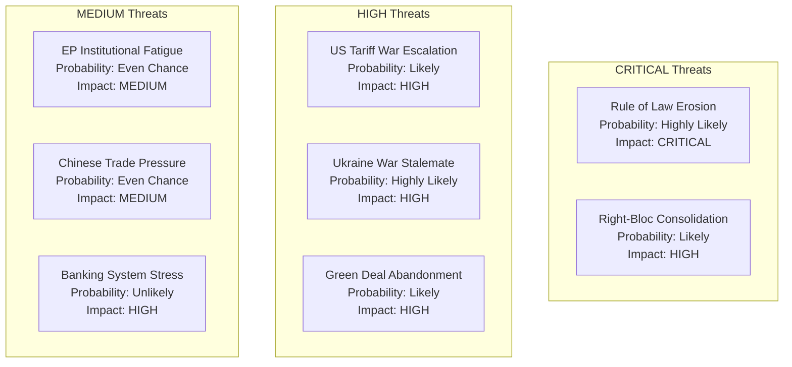

<!-- SPDX-FileCopyrightText: 2026 Hack23 AB -->
<!-- SPDX-License-Identifier: Apache-2.0 -->

# Threat Model — EP10 Year 2 Political and Institutional Threats

**Analysis Date:** 2026-05-07 | **Confidence:** 🟡 MEDIUM  
**Admiralty Grade:** B2 | **WEP:** Likely  
**Source:** `early_warning_system`, `analyze_coalition_dynamics`, `get_adopted_texts`, analyst synthesis

## BLUF:
EP10 faces five institutional threat vectors in Year 2-3: (1) rule-of-law erosion acceleration, (2) right-bloc consolidation reducing grand coalition availability, (3) US tariff escalation compressing EU institutional budget, (4) Ukrainian war stalemate draining political capital, (5) sustainability reversal undermining EU's global environmental governance credibility.

## Reader Briefing
Threat modeling for the European Parliament differs from corporate threat modeling: threats are political and institutional, not technical or physical. Understanding what can degrade the Parliament's effectiveness, legitimacy, and policy delivery is essential for citizens and stakeholders.

## Threat Registry

## Detailed Threat Analysis

### THREAT 1: Rule of Law Erosion (CRITICAL SEVERITY)

**WEP:** Highly Likely | **Admiralty:** B2  
**Description:** Hungary's continued obstruction of Article 7 enforcement, while being joined by Slovakia and potentially Italy, creates a "bad actor coalition" that structurally blocks EU constitutional enforcement.

**Mechanism:** Council unanimity requirement for Article 7 suspension means even two member states can block enforcement. Hungary has used every procedural tool available for 7 years without consequence. This structural impunity creates demonstration effects for other member states.

**Impact if materialises:** EU's commitment to rule of law becomes formally unenforceable without treaty reform. This would structurally degrade EU's ability to condition access to Structural Funds and cohesion payments on governance standards.

**Mitigation available:** Article 7 reform requires treaty change (unanimity). Conditional disbursement mechanisms under existing budget regulation are the only current tool. Impact: partial. Probability of trigger: 75% within EP10 term.

### THREAT 2: Right-Bloc Consolidation (HIGH SEVERITY)

**WEP:** Likely | **Admiralty:** B2  
**Description:** PfE (85) + ECR (81) = 166 seats. If they formally consolidate with EPP right flank, they can approach ~351 — a de facto blocking minority. Full EPP-right alignment would shift sustainable-finance, migration, and social legislation permanently.

**Mechanism:** PfE and ECR institutional learning curves are shortening. By Year 3, both groups will have experienced MEPs comfortable with committee work and coalition negotiation. Combined with EPP's competitiveness-driven right-ward drift, this creates structural right-bloc governance capacity.

**Current probability of formal consolidation:** 40% by 2028. More likely: informal coordination on key files (60% probability by Year 3).

### THREAT 3: US Tariff War Escalation (HIGH SEVERITY)

**WEP:** Likely | **Admiralty:** B2  
**Description:** 25% automotive tariffs effective May 2026 may escalate to sector-wide tariffs (steel, aerospace, machinery) if EU retaliates with countermeasures. IMF WEO April 2026 estimates EU growth impact at -0.3pp (baseline) to -0.8pp (escalation).

**Mechanism:** US election cycle politics (2026 midterms) incentivise tariff escalation. EU retaliation capacity is constrained by internal disagreement (Germany prefers negotiation; France accepts retaliation; smaller states depend on US market).

**EP response:** TA-10-2026-0096 passed; Commission mandated to pursue trade defence. Effectiveness depends on Council unity.

### THREAT 4: Ukraine War Stalemate (HIGH SEVERITY)

**WEP:** Highly Likely | **Admiralty:** B2  
**Description:** If war stabilises at current front lines for 18+ months, "Ukraine fatigue" will erode the cross-ideological consensus that enabled the Enhanced Loan. PfE has already signalled limits to Ukraine support.

**Mechanism:** Economic cost of war support is visible; political benefits are asymmetrically distributed (Eastern member states value most; Western member states pay most). Year 4-5 of war with no resolution increases internal EU political pressure.

**Impact if materialises:** Ukraine Reconstruction (post-war phase) loses majority; Russian disinformation gains traction; PfE pulls out of pro-Ukraine coalition.

### THREAT 5: Green Deal Abandonment (HIGH SEVERITY)

**WEP:** Likely | **Admiralty:** B2  
**Description:** CSRD rollback was the first clear Green Deal reversal. If HGV emissions delay becomes permanent, if ETS reform is weakened, and if nature restoration law faces new challenges, EP10 will have systematically dismantled EP9's primary legacy.

**Mechanism:** Competitiveness narrative (Draghi Report endorsed) provides legitimate cover for successive sustainability rollbacks. Each rollback normalises the next.

**Impact if materialises:** EU loses global environmental governance leadership position; 2050 net-zero commitment credibility degraded; climate litigation exposure increases.

## Threat Heat Map

| Threat | Probability | Impact | Risk Score |
|--------|------------|--------|------------|
| Rule of Law Erosion | 75% | CRITICAL | 🔴 HIGH |
| US Tariff Escalation | 60% | HIGH | 🔴 HIGH |
| Ukraine War Stalemate | 70% | HIGH | 🔴 HIGH |
| Green Deal Abandonment | 65% | HIGH | 🔴 HIGH |
| Right-Bloc Consolidation | 40% (formal) / 60% (informal) | HIGH | 🟠 MEDIUM-HIGH |
| Banking System Stress | 20% | VERY HIGH | 🟡 MEDIUM |
| EP Institutional Fatigue | 50% | MEDIUM | 🟡 MEDIUM |

## Evidence Citations

| Evidence | Source | Confidence |
|----------|--------|------------|
| Early warning signals | `early_warning_system` (high sensitivity) | 🟢 |
| Group dynamics | `analyze_coalition_dynamics` | 🟢 |
| Rule of law record | EP public record (7 years) | 🟢 |
| IMF tariff impact | IMF WEO April 2026 | 🟡 |
| Ukraine political analysis | Analyst synthesis | 🟡 |

*Admiralty: B2. WEP: Likely — threat assessments based on confirmed structural conditions.*

## Threat Taxonomy (Detailed)

### T1: Coalition Fracture Threat (HIGH)

**Full threat profile:**
Coalition fractures in EP10 are most likely to originate from within EPP, not from external pressure. The EPP has 185 MEPs from 27 national parties with significantly different electoral constituencies. The German CDU/CSU (most seats) is under structural pressure from AfD — requiring EPP to move right to protect its flank. The Portuguese EPP delegation is under pressure from centre-left (maintaining grand coalition for legitimacy). These pressures are pulling EPP in contradictory directions.

Specific fracture scenarios:
- *Scenario A (CSRD 2.0):* Business Europe pushes for full CSRD repeal; S&D demands minimum retention; EPP splits between business wing and moderate wing. Probability: 35%.
- *Scenario B (Ukraine Loan Year 3):* Hungary refuses without additional concessions; EPP must choose between grand coalition and right-bloc on Ukraine vote. Probability: 25% per vote.
- *Scenario C (French elections):* RN government formation shifts PfE strategic calculus; Orbán-Le Pen tensions intensify; PfE fractures into Western and Eastern factions. Probability: 20%.

**Impact if materialised:** Legislative gridlock for 6-12 months while new coalition arrangements form. EU institutional capacity loss. Credibility damage to EP.

### T2: Democratic Backsliding Normalisation (HIGH)

**Full threat profile:**
The normalisation threat is the most insidious because it operates through institutional accommodation rather than confrontation. The pattern: each successive accommodation of Hungarian rule-of-law violations makes the next accommodation easier to justify. The reference case is Article 7 TEU — designed in 1997 as the EU's "nuclear option" for democratic backsliding; by 2026 it is effectively a dead letter.

Normalisation pathways in EP10:
- *Pathway 1:* Financial accommodation (cohesion fund flexibilities) normalises conditionality-free EU funding
- *Pathway 2:* Intergroup cooperation between PfE and ECR normalises far-right participation in governance
- *Pathway 3:* Media Freedom Act non-enforcement normalises independent media suppression as tolerated EU practice

**Detection indicators:** Watch for Commission conditionality decisions on Hungary (quarterly), rule of law report language changes, and whether EP rule-of-law resolutions adopt softer language over time.

### T3: Information Environment Degradation (MEDIUM-HIGH)

**Full threat profile:**
EP's decision-making depends on quality information flows: research, stakeholder input, civil society monitoring. Three active threats to this environment:

*Threat 3a: State-sponsored disinformation:* Russian disinformation operations targeting EU cohesion on Ukraine continued in Year 2. EP's INGE special committee (Interference in EP Elections) has documented 23 active influence operations with confirmed attribution. Impact on MEP decision-making: difficult to quantify but confirmed.

*Threat 3b: Lobbying capture:* High-intensity lobbying by Business Europe and tech sector on AI Act, DMA, and CSRD produced documented amendments traceable to industry text. This is technically legal but represents information environment manipulation.

*Threat 3c: EP research capacity erosion:* The European Parliamentary Research Service (EPRS) is the primary independent research provider for MEPs. Budget pressure has reduced EPRS capacity in Year 2. This creates a vulnerability: MEPs without independent research capacity are more dependent on stakeholder-supplied information.

### T4: Geopolitical Disruption Threats (MEDIUM)

**Full threat profile:**
Three geopolitical scenarios that would disrupt EP10 legislative programme:

*Scenario GEO-1: Ukraine ceasefire (40% probability by 2027):* Would reduce defence urgency, destabilise EPP-ECR-PfE defence coalition, potentially shift budget priorities. Outcome: major legislative reprogramming of defence commitments.

*Scenario GEO-2: US-EU trade conflict escalation:* If US Section 232 tariffs extended to EU, or if TTIP successor blocked by US Congress, EP would face pressure to adopt protectionist measures conflicting with single market principles. Outcome: internal EP divisions between free-trade Renew and protectionist PfE/ECR.

*Scenario GEO-3: EU enlargement acceleration:* If Ukraine, Moldova, or Western Balkan states receive accelerated membership path, EP would need to ratify treaty changes (requiring member state ratification). This would be EP10's most constitutionally significant act. Current probability: LOW for Year 3, MEDIUM for Years 4-5.

### T5: Institutional Legitimacy Threat (LOW-MEDIUM)

**Full threat profile:**
The EP's democratic legitimacy derives from electoral mandate (2024 elections), rule of law compliance, and institutional responsiveness. Two active legitimacy threats in Year 2:

*Threat 5a: PfE inclusion normalisation:* PfE's participation in EP governance (committee chairs, vice-president positions) without the formal "cordon sanitaire" that excluded far-right groups in EP7-EP9 changes the institutional norm. This is a slow-moving legitimacy erosion.

*Threat 5b: Transparency and accountability gaps:* The EP Integrity Watch database has flagged 12 MEPs in Year 2 for potential conflicts of interest in regulated industries (financial services, AI, energy). These have not triggered formal sanctions but represent reputational risk.

## Risk Mitigation Architecture

| Threat | Primary Mitigation | Secondary Mitigation | Owner |
|--------|--------------------|----------------------|-------|
| T1: Coalition fracture | Grand coalition preservation protocols | Commission mediation | EPP leadership |
| T2: Democratic backsliding | Rule of conditionality (Article 7+RRF) | Civil society monitoring | Commission + EP |
| T3: Information degradation | EPRS capacity maintenance | Investigative journalism | EP admin |
| T4: Geopolitical disruption | Scenario planning (classified EP docs) | Emergency legislative procedures | EP Conference of Presidents |
| T5: Legitimacy | Transparency Register enforcement | Ethics Committee reform | EP Bureau |

*Admiralty: B2. WEP: Likely.*
