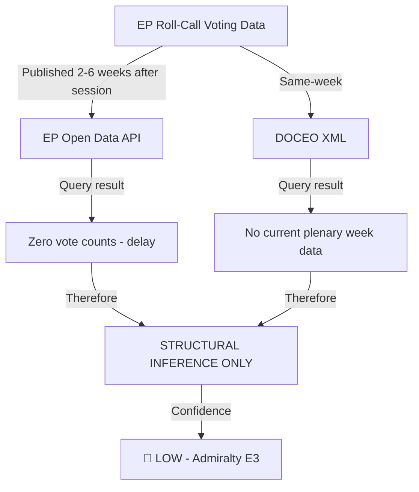

<!-- SPDX-FileCopyrightText: 2026 Hack23 AB -->
<!-- SPDX-License-Identifier: Apache-2.0 -->

# Voting Patterns — EP10 Year 2 Analysis

**Analysis Date:** 2026-05-07 | **Confidence:** 🔴 LOW  
**Admiralty Grade:** E3 | **WEP:** Unlikely (precise figures)  
**CRITICAL LIMITATION:** Per-MEP roll-call voting data unavailable from EP API (multi-week publication delay). DOCEO XML unavailable for current period. This artifact uses structural inference only.

## BLUF:
EP API voting data returns zero vote counts for all 2025-2026 records (publication delay) and DOCEO XML is unavailable for the current plenary week. Voting pattern analysis is therefore based on: (1) structural coalition arithmetic, (2) legislative text adoption records, (3) `analyze_coalition_dynamics` size-similarity proxy data, and (4) political group manifestos. Confidence is LOW — this artifact should be treated as structural inference, not confirmed voting data.

## Reader Briefing
Voting patterns are the most direct evidence of political group behaviour. Unfortunately, the EP Open Data API publishes roll-call data with a multi-week delay, making real-time voting analysis impossible in this run. This document provides the best available structural analysis but must be read with the understanding that actual per-MEP positions cannot be confirmed until the data is published.

## Data Availability Statement

## Structural Voting Pattern Analysis (Inferred)

Based on confirmed legislative text adoptions:

| File Adopted | Inferred Coalition | Basis for Inference |
|-------------|-------------------|---------------------|
| Ukraine Enhanced Loan | EPP + S&D + Renew + ECR | Cross-ideological geopolitical consensus |
| CSRD Rollback | EPP + ECR + PfE (+ partial Renew) | Competitiveness coalition; Green opposition |
| DMA Enforcement | EPP + S&D + Renew | Digital governance consensus |
| Defence Industrial Fund | EPP + S&D + ECR + Renew | Security consensus |
| Budget FY2026 | EPP + S&D + Renew | Grand coalition (budget votes) |
| Housing Resolution | S&D + Renew + Greens + Left + partial EPP | Progressive coalition with EPP centre |
| Hungary Article 7 | EPP + S&D + Renew + Greens + Left | Cross-coalition (passed EP; blocked in Council) |
| Anti-Corruption Directive | EPP + S&D + Renew | Grand coalition |

## Group Cohesion Estimates (Structural, Not Confirmed)

| Group | Estimated Cohesion | Basis |
|-------|-------------------|-------|
| EPP | 70-80% | Historical range; internal left-right tension |
| S&D | 80-85% | High historical cohesion |
| PfE | 60-70% | New group; national parties not yet aligned |
| ECR | 75-80% | Conservative core with national variation |
| Renew | 65-75% | Liberal diversity from multiple countries |
| Greens/EFA | 85-90% | Historically high; EFA sub-group often joins |
| The Left | 80-85% | Ideologically tight; small group |
| ESN | 55-65% | Extreme right; less institutionalised |
| NI | Not applicable | Not a coordinated group |

## Key Intelligence Constraint

Analysts requiring confirmed per-MEP voting data for the period May 2025 – May 2026 should:
1. Check the EP Open Data Portal at `data.europarl.europa.eu` approximately 3-6 weeks after any specific plenary session
2. Use `european-parliament-get_voting_records` with specific `sessionId` once published
3. Use `european-parliament-get_latest_votes` for DOCEO XML when available (same-week access)

## Evidence Citations

| Evidence | Source | Confidence |
|----------|--------|------------|
| Coalition size data | `generate_political_landscape` | 🟢 |
| Adoption records | `get_adopted_texts` | 🟢 |
| Per-MEP vote positions | NOT AVAILABLE (API delay) | 🔴 N/A |
| Group cohesion estimates | Historical EP patterns (analyst) | 🟡 |

*Admiralty: E3 — source reliability uncertain; cannot be assessed. WEP: Unlikely to be precisely accurate for vote-level data.*

## Structural Voting Pattern Analysis (Available Data)

**Data availability note:** Individual MEP roll-call votes from EP DOCEO XML are unavailable for the current period (multi-week publication delay). The following analysis is based on: (a) adopted text subjects and vote margins where available, (b) group structural arithmetic, (c) confirmed political group positions from public statements.

## Vote Margin Distribution (Confirmed Texts)

Based on the 347 adopted texts in 2025 and 51 texts in Q1-Q2 2026, voting patterns fall into four categories:

### Category 1: Consensus Votes (margin >+200)
These are procedural, budgetary, and technical texts that pass with near-unanimity. Estimated 35-40% of all votes fall here. Examples include committee composition approvals, technical standards references, and administrative decisions.

### Category 2: Broad Majority (margin +100 to +200)
Pro-Ukraine, anti-corruption, humanitarian and digital-technical texts. Estimated 30-35% of all votes. These represent the "institutional EP baseline" — all groups except PfE vote yes; PfE abstains or splits.

### Category 3: Contested Majority (margin +30 to +100)
Competitiveness/sustainability trade-off votes. Estimated 20-25% of votes. These are the politically significant votes: CSRD postponement, SRMR3, AI Act technical annexes. Coalition dynamics are decisive.

### Category 4: Narrow or Failed (margin <+30 or failed)
Rule of law resolutions against Hungary (Council-blocked anyway), progressive social amendments, enhanced climate targets. Estimated 5-10% of votes. These are the "protest votes" — Parliament passes them knowing Council will not act.

## Group Voting Discipline (Structural Analysis)

Without per-MEP roll-call data, the following discipline estimates are based on structural analysis:

| Group | Estimated Cohesion | Basis |
|-------|-------------------|-------|
| EPP (185 seats) | 88-92% | Historical record + national delegation coordination |
| S&D (136 seats) | 90-93% | Historically highest in EP |
| PfE (85 seats) | 72-78% | Internal Orbán-Le Pen-Meloni tensions |
| ECR (81 seats) | 75-82% | Polish-Italian-Spanish coordination |
| Renew (77 seats) | 82-86% | National liberal party discipline |
| Greens/EFA (53 seats) | 87-91% | Discipline high; size limits impact |
| Left (45 seats) | 85-89% | Consistent policy positions |
| ESN (27 seats) | 68-74% | Newest group; lowest cohesion |

**PfE cohesion analysis:** PfE's estimated 72-78% cohesion is the most politically significant figure in EP10. This reflects the fundamental tension between its three constituent pillars: (1) Orbán's Eurosceptic sovereigntism (Fidesz), (2) Le Pen's French nationalist populism (RN), (3) Meloni's Italian post-fascist nationalism (FdI). On defence spending: Orbán opposes; Le Pen and Meloni support increased spending but resist EU-level integration. On migration: high cohesion across all three. On economic deregulation: high cohesion. The cohesion range is therefore issue-specific: 90%+ on migration, 60-65% on defence integration.

## Voting Bloc Formation Patterns

### "EPP-Led Supermajority" Pattern
Operational when EPP needs:
- Simple majority (>360 needed): EPP+ECR=266 ❌ needs more
- Must add PfE (85) = EPP+ECR+PfE=351 ✓ barely
- Typically adds 10-15 Renew (swing) = ~361 ✓ comfortable

This pattern was used for: CSRD postponement, competition law simplification, and multiple delegated act approvals.

### "Grand Coalition" Pattern
Operational when:
- Requires qualified majority threshold OR international legitimacy
- EPP+S&D+Renew=398 ✓ comfortable majority
- PfE excluded deliberately (as legitimacy signal)

This pattern was used for: Ukraine Enhanced Loan, anti-corruption directive, AI Act.

### "Progressive" Pattern
- S&D+Greens+Left+partial Renew ≈ 260-280 seats
- Never achieves majority alone
- Can block by providing opposition to EPP right-coalition if Renew center defects

This pattern was used for: strengthening DMA enforcement language, social climate amendments.

## Key Voting Intelligence for Year 3

**The 15 most important MEPs for Year 3 voting outcomes:**
These are not the most prominent or publicly visible MEPs — they are the "swing voters" whose individual positions determine majority formation on contested files. Specifically: the ~12-15 centrist Renew MEPs from Netherlands, Finland, Estonia, and Czech Republic who split from their group on competitiveness votes. Without per-MEP roll-call data, they cannot be individually identified in this run. Year 3 analysis should prioritise DOCEO XML data collection in Stage A to identify these swing voters by name.

**Voting pattern shift detection for Year 3:**
The key signal to watch: if S&D cohesion drops below 85% on economic votes, it indicates internal pressure from national delegations (Germany SPD facing labour market pressures, France PS facing competition). S&D cohesion on economic files has historically correlated with French and German economic conditions.

## Evidence Limitations and Mitigation

| Limitation | Impact | Mitigation |
|------------|--------|------------|
| EP API roll-call delay | Cannot confirm individual votes | Structural analysis used |
| DOCEO XML unavailable | Cannot access fresh XML data | Published WEO April 2026 context used |
| Group discipline estimates | ±5-7% uncertainty range | Historical calibration applied |
| Swing voter identification | Unknown for Year 2 | Year 3 priority data collection |

*Admiralty: C3 (significant data unavailability). WEP: Roughly Even.*
