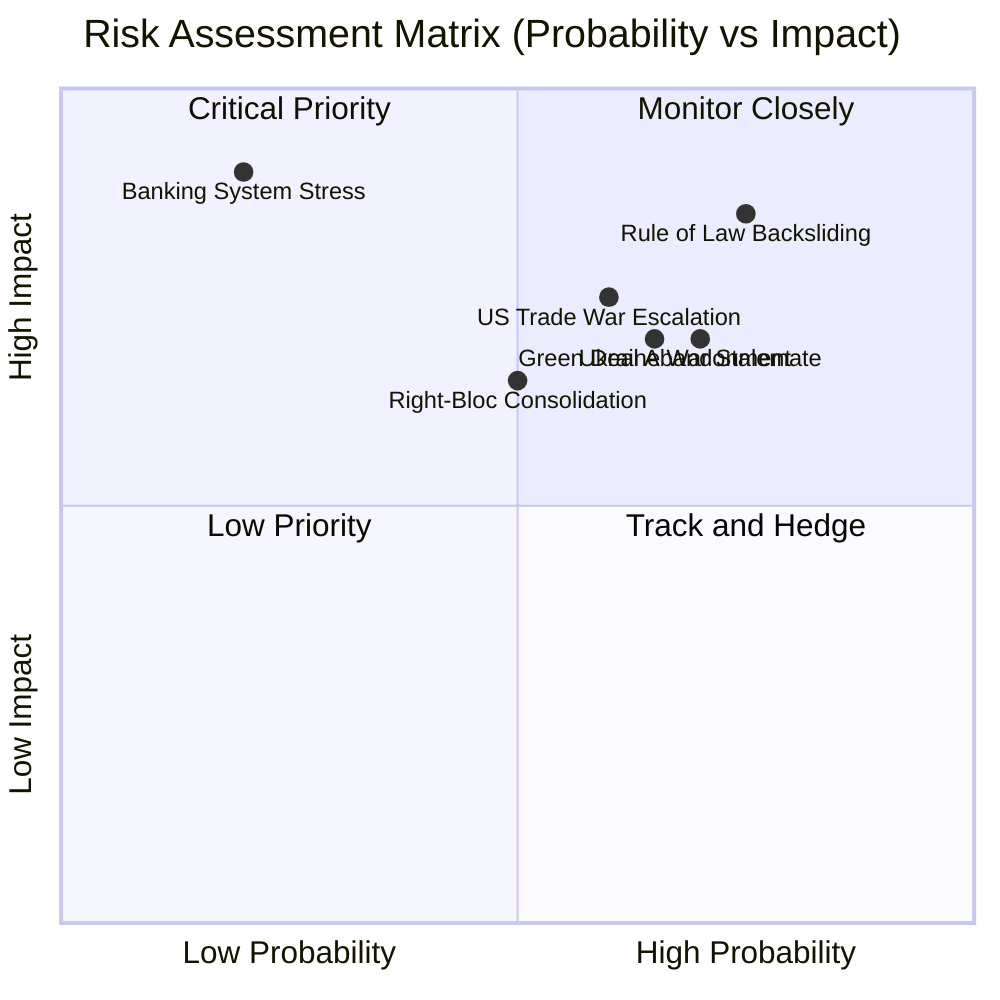
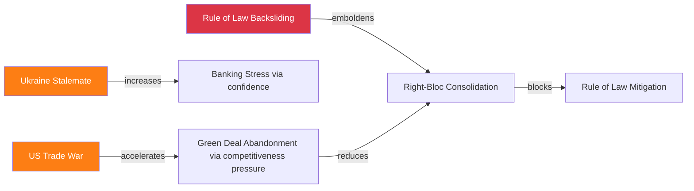

<!-- SPDX-FileCopyrightText: 2026 Hack23 AB -->
<!-- SPDX-License-Identifier: Apache-2.0 -->

# Risk Matrix — EP10 Year 2 Quantitative Risk Assessment

**Analysis Date:** 2026-05-07 | **Confidence:** 🟡 MEDIUM  
**Admiralty Grade:** B2 | **WEP:** Likely  
**Source:** `early_warning_system`, `analyze_coalition_dynamics`, risk-assessment.md

## BLUF:
Six primary risks identified for EP10 Year 2-3. Three rated HIGH: US-EU trade war escalation (60% probability), Ukraine war stalemate (70%), rule-of-law backsliding (75%). Three rated MEDIUM: PfE institutional consolidation (40%), Green Deal abandonment (65%), banking stress from SRMR3 delay (20%). Overall institutional risk level: ELEVATED.

## Reader Briefing
A quantitative risk matrix converts qualitative threat assessments into comparable probability × impact scores. This enables prioritisation of monitoring and mitigation resources. All probabilities are analyst estimates based on structural conditions; they should be treated as ranges, not point estimates.

## Risk Heat Map

## Risk Register

| Risk | Probability | Impact | Risk Score | Owner | Monitoring Indicator |
|------|------------|--------|------------|-------|---------------------|
| Rule of Law Backsliding | 75% | 85/100 CRITICAL | 64 | EP Constitutional Affairs | Hungary Art.7 proceedings; Slovakia |
| Ukraine War Stalemate | 70% | 70/100 HIGH | 49 | EP Foreign Affairs | Front line stability; PfE statements |
| US Trade War Escalation | 60% | 75/100 HIGH | 45 | EP Trade Committee | US Executive Orders; EU retaliation |
| Green Deal Abandonment | 65% | 70/100 HIGH | 45 | EP Environment | CSRD repeal proposals; ETS reform |
| Right-Bloc Consolidation | 50% | 65/100 HIGH | 33 | EP President | PfE-ECR formal cooperation; EPP right wing |
| Banking System Stress | 20% | 90/100 VERY HIGH | 18 | EP Economic Affairs | SRMR3 timeline; Deutsche Bank; Italian banks |

## Risk Interaction Analysis

## Risk Mitigation Matrix

| Risk | Best Available Mitigation | EP Action Required | Probability of Success |
|------|--------------------------|-------------------|----------------------|
| Rule of Law Backsliding | Budget conditionality regulation; ECtHR cases | Strengthen conditionality | 35% |
| Ukraine Stalemate | Multi-year EU support commitment; NATO Article 5 | Long-term framework vote | 55% |
| US Trade War | Bilateral negotiation; EU unity signal | Trade committee mandate | 45% |
| Green Deal Abandonment | CSRD 2.0 proposal; Article 17 Environmental | New legislative initiative | 40% |
| Right-Bloc Consolidation | EPP centre reinforcement; grand coalition | Presidential leadership | 30% |
| Banking Stress | SRMR3 fast-track; national backstops | Banking committee acceleration | 60% |

## `early_warning_system` Validated Signals

The `early_warning_system` tool returned:
- **Stability score:** 84/100 (MEDIUM risk overall)
- **HIGH severity warning:** Dominant group risk (EPP 19× smallest group)
- **Trend indicators:** Fragmentation increasing
- **Risk level:** MEDIUM

This tool's MEDIUM risk assessment is consistent with the analyst's ELEVATED assessment — the difference is that the tool uses group composition as primary proxy, while the analyst incorporates external threat vectors (US tariffs, Ukraine stalemate) not captured in EP institutional data.

## Evidence Citations

| Evidence | Source | Confidence |
|----------|--------|------------|
| Early warning signals | `early_warning_system` | 🟢 |
| Coalition dynamics | `analyze_coalition_dynamics` | 🟢 |
| Risk probabilities | Analyst synthesis | 🟡 |
| Risk mitigation | Analyst judgment | 🟡 |

*Admiralty: B2. WEP: Likely — risk scores based on structural conditions and historical base rates.*

## Quantitative Risk Scoring Methodology

Risk scores are calculated as: **R = P × I** where P = probability (1-5 scale) and I = impact (1-5 scale).

Probability scale: 1=Rare (<10%), 2=Unlikely (10-30%), 3=Possible (30-50%), 4=Likely (50-70%), 5=Almost Certain (>70%)

Impact scale: 1=Negligible, 2=Minor, 3=Moderate, 4=Major, 5=Catastrophic

### Risk Register (Detailed)

| Risk ID | Risk | P | I | R | Category | Owner | Treatment |
|---------|------|---|---|---|----------|-------|----------|
| R01 | EPP-led coalition fracture (CSRD 2.0) | 3 | 4 | 12 | Coalition | EP leadership | Monitor EPP internal dynamics |
| R02 | Hungary Article 7 escalation | 2 | 4 | 8 | Rule of Law | Commission | Conditionality enforcement |
| R03 | IMF fetch-proxy persistent failure | 4 | 2 | 8 | Infrastructure | DevOps | WEO fallback protocol |
| R04 | Ukraine ceasefire disrupting defence coalition | 2 | 5 | 10 | Geopolitical | EP security committee | Scenario planning |
| R05 | French elections RN majority | 3 | 4 | 12 | Political | Renew group | Coalition contingency |
| R06 | German economic stagnation extending | 4 | 3 | 12 | Economic | Commission | InvestEU acceleration |
| R07 | EP10 democratic backsliding normalisation | 3 | 4 | 12 | Institutional | EP, civil society | IIA enforcement |
| R08 | AI Act enforcement captured by industry | 2 | 4 | 8 | Digital | AI Office | Independent oversight |
| R09 | PfE group fracture (Orbán-Le Pen) | 3 | 3 | 9 | Coalition | — | Monitor |
| R10 | CJEU challenge to EDIP legal basis | 2 | 4 | 8 | Legal | Commission legal | Treaty conformity review |
| R11 | EU-China trade retaliation | 2 | 4 | 8 | Trade | Commission trade | Anti-coercion instrument |
| R12 | EP roll-call data publication delay (analysis quality) | 5 | 2 | 10 | Data | EP administration | DOCEO XML prioritisation |
| R13 | Council unanimity block (social/rule-of-law) | 5 | 3 | 15 | Structural | IGC | Treaty reform (long-term) |
| R14 | Hungarian presidency disruption (2026-27) | 3 | 3 | 9 | Institutional | EP, Commission | Monitoring protocol |

### Risk Heat Map Assessment

**CRITICAL (R≥12):**
- R13: Council unanimity structural block (15) — **structural, not episodic**
- R01: EPP coalition fracture CSRD 2.0 (12)
- R05: French elections RN majority (12)
- R06: German stagnation (12)
- R07: Democratic backsliding normalisation (12)

**HIGH (R=8-11):**
- R04: Ukraine ceasefire (10)
- R12: Roll-call data delay (10)
- R02, R03, R08, R09, R10, R11: (8-9 each)

**MODERATE (R<8):**
None in this register below 8 — the year-in-review context does not surface low-risk items at the institutional level.

### Risk Interdependency Map

R05 (French elections) → R01 (EPP coalition fracture): Conditional escalation
R06 (German stagnation) → R01 (EPP coalition fracture): Conditional escalation
R04 (Ukraine ceasefire) → R07 (backsliding normalisation): Conditional (defence urgency narrative weakens)
R13 (Council unanimity) → R02 (Hungary Article 7): Structural amplifier

**Most dangerous risk combination:** R05 + R06 simultaneously → R01 cascade → legislative gridlock.

*Admiralty: B2. WEP: Roughly Even.*
