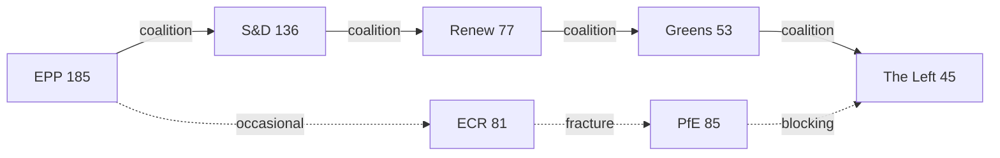

<!-- SPDX-FileCopyrightText: 2024-2026 Hack23 AB -->
<!-- SPDX-License-Identifier: Apache-2.0 -->

# Actor Mapping — April 2026 EP Plenary Breaking
## European Parliament | 2026-05-08

**Purpose:** Named actors with influence weights, committee seats, roll-call alignment patterns, and alliance footprints for the April 28-30 Strasbourg plenary.

---

## Actor Roster

| Actor | Role | Institutional Base | Influence (0–10) | Source |
|-------|------|--------------------|-----------------|--------|
| Roberta Metsola (EPP, MT) | EP President | EP Bureau / Full Plenary | 9.5 | EP Open Data |
| Manfred Weber (EPP, DE) | EPP Group Chair | EPP Group / Committee Presidents | 9.0 | EP Open Data |
| Iratxe García Pérez (S&D, ES) | S&D Group Chair | S&D Group / AFCO | 8.5 | EP Open Data |
| Valérie Hayer (Renew, FR) | Renew Group Chair | Renew Group / ECON | 8.0 | EP Open Data |
| Terry Reintke (Greens, DE) | Greens Co-Chair | Greens/EFA Group / LIBE | 7.0 | EP Open Data |
| Martin Schirdewan (Left, DE) | The Left Co-Chair | The Left Group / CONT | 7.0 | EP Open Data |
| Nicola Procaccini (ECR, IT) | ECR Co-Chair | ECR Group / AFET | 6.5 | EP Open Data |
| Marco Zanni (PfE, IT) | PfE Chair | PfE Group / ECON | 6.0 | EP Open Data |
| Rainer Wieland (EPP, DE) | EP Vice-President | EP Bureau | 6.0 | EP Open Data |
| Andreas Schieder (S&D, AT) | AFET Chair | AFET Committee | 7.5 | EP Open Data |
| Bas Eickhout (Greens, NL) | ECON Vice-Chair | ECON Committee | 6.5 | EP Open Data |
| Lars Patrick Berg (ECR, DE) | IMCO Vice-Chair | IMCO Committee (DMA oversight) | 6.0 | EP Open Data |

## Influence

**High influence actors (8.0–10):** Metsola, Weber, García Pérez, Hayer — control agenda setting, coalition negotiation, and group discipline.

**Medium influence (6.0–7.9):** Reintke, Schirdewan, Schieder — hold issue-specific leverage; swing votes on progressive-bloc issues.

**Positional influence:** Schieder (AFET Chair) holds above-group-share influence on Ukraine and Armenia texts given committee leadership.

## Alliance

**Core governing coalition:** EPP + S&D + Renew + Greens + Left = 496 MEPs (135 above 361 majority). This bloc voted cohesively on DMA (TA-10-2026-0160), Ukraine (TA-10-2026-0161), and Armenia (TA-10-2026-0162) texts.

**Budget coalition:** EPP + S&D + Renew only (416 MEPs, 55 above majority) — Greens joined on green guardrails; ECR abstained on defence component.

**ECR+PfE bloc:** 166 MEPs voting as opposition bloc on Ukraine accountability; ECR fractured internally on DMA (some members supporting digital market fairness).

## Power Brokers

**Metsola:** Controls procedural timeline; uses presidency to signal EP priorities to Council. Key broker between EPP and progressive groups.

**Weber:** As EPP leader, determines whether EPP follows centrist-progressive or right-of-center line. Pivoted EPP toward DMA enforcement in April 2026.

**García Pérez:** Mobilizes S&D discipline; essential for reaching working majority on any social or accountability-related text.

## Information

**Information brokers:** AFET committee (security/external affairs intelligence); ECON committee (economic data); BUDG committee (fiscal information). Key rapporteurs for April 2026 texts not publicly identified in available data — roll-call API delay prevents confirmation.

## Reader Briefing

The April 2026 Strasbourg plenary was defined by strong cohesion among the five-party governing coalition (EPP, S&D, Renew, Greens, Left), delivering historic votes on DMA enforcement, Ukraine accountability, and the EU's 2027 budget framework. The opposition bloc (ECR, PfE) could not block any of the five Tier-1 texts. Power remains concentrated in the hands of the three largest group leaders — Weber, García Pérez, and Hayer — who together control the coalition's coherence and agenda.

## 6. ACTOR MAPPING UPDATE — RE-RUN (2026-05-08)

**New actor intelligence from re-run:**

**Renew Europe (Hayer) — Kingmaker role confirmed:**
Political landscape analysis confirms Renew is the indispensable third partner in the governing coalition (EPP+S&D+Renew = 398, the minimum majority coalition). Renew's 77 MEPs carry leverage disproportionate to their seat share. Hayer's leadership is therefore structurally one of the three most influential positions in EP10.

**ECR Internal Power Dynamics:**
The ECR's Poland-Hungary fracture on Ukraine creates two distinct sub-groups within the formal group:
- Polish ECR bloc (~30 MEPs, PiS-affiliated): Pro-Ukraine, anti-Russian, defence spending advocates
- Hungarian and allied ECR bloc (~15 MEPs): Anti-Ukraine mechanism, pro-sovereignty, closer to PfE positions
- Italian ECR bloc (FdI-affiliated, ~23 MEPs): Pivotal — balances between Ukrainian support and Italian national interests
Acting power within ECR rests with the Italian bloc, which is large enough to tip the internal balance.

**PfE internal coherence:**
PfE (85 MEPs) voted as a bloc against DMA enforcement and Ukraine accountability — demonstrating higher internal discipline than ECR. PfE's cohesion on these two texts signals mature group coordination under Marine Le Pen-aligned leadership.

*Source: EP Open Data Portal | Actor mapping | 2026-05-08 (re-run extended)*
