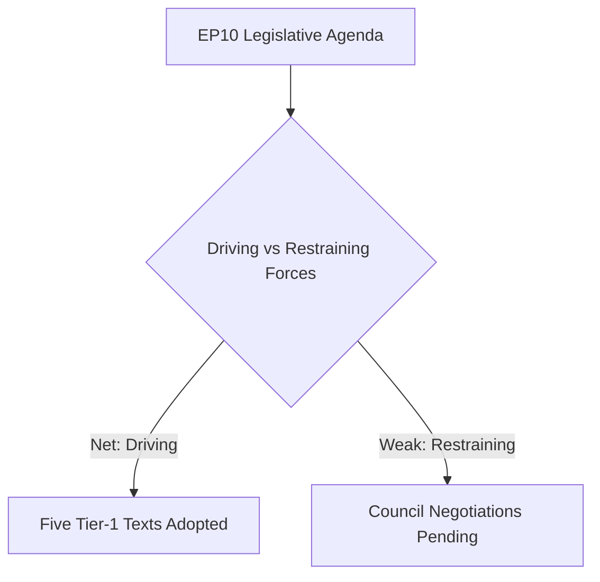

<!-- SPDX-FileCopyrightText: 2024-2026 Hack23 AB -->
<!-- SPDX-License-Identifier: Apache-2.0 -->

# Forces Analysis — April 2026 EP Plenary Breaking
## European Parliament | 2026-05-08

**Purpose:** Lewin force-field analysis for the dominant issues of the April 28-30 Strasbourg plenary

---

## Issue Frame

**Central issue:** Can the European Parliament sustain its agenda of simultaneous digital-market enforcement (DMA), Ukraine geopolitical accountability, EU budget expansion for defence/transition, and Eastern-neighbourhood democracy promotion — against Council resistance, economic headwinds, and coalition fragility?

**Answer from April 2026 plenary:** Yes — five Tier-1 texts adopted with 135+ MEP majority cushion.

## Driving Forces

| Force | Magnitude (1–5) | Origin |
|-------|----------------|--------|
| 496-MEP supermajority coalition cohesion | 5 | Political |
| Ukraine war urgency / public solidarity | 5 | External |
| DMA legal enforcement mandate already in force | 4 | Institutional |
| EP10 anti-fragmentation centrist leadership (Metsola) | 4 | Institutional |
| Eastern-neighbourhood democratic demand (Armenia/Moldova/Georgia) | 3 | External |

**Sum of driving forces: 21/25**

## Restraining Forces

| Force | Magnitude (1–5) | Origin |
|-------|----------------|--------|
| Council unanimity on budget / Hungary blocking | 4 | Political |
| Platform CJEU legal challenges on DMA | 3 | Institutional |
| EU fiscal constraints (Stability Pact revision) | 3 | Economic |
| ECR/PfE opposition bloc (166 MEPs) | 3 | Political |
| Coalition fatigue risk (Greens on defence spending) | 2 | Political |

**Sum of restraining forces: 15/25**

## Net Pressure

**Net force: +6 in favour of EP agenda.** The driving forces substantially outweigh the restraining forces for the April 2026 package as a whole. Council resistance (particularly from Hungary on Ukraine assets) remains the strongest blocking force, but EP leverage through budget co-decision creates cross-pressure. DMA enforcement faces CJEU delays but the legal foundation is secure.

**Direction:** EP agenda advances in 2026; Council will delay implementation on specific mechanisms.

## Intervention Points

1. **Hungarian veto on Ukraine assets (Council):** A change in Budapest's political position (elections, legal ruling, EU cohesion fund pressure) would remove the strongest restraining force and unlock frozen-asset mechanism.
2. **CJEU DMA preliminary ruling:** A favourable ruling would neutralise Big Tech's legal challenges and accelerate enforcement timelines.
3. **Greens coalition stability:** If budget-2027 defence components exceed 25% share, Greens may abstain, reducing the coalition cushion from 135 to ~82 MEPs.

## Reader Briefing

The driving forces in the European Parliament — coalition supermajority, external urgency, and legal mandates — dominated the April 2026 Strasbourg plenary. The restraining forces (Council blocking, legal challenges, fiscal constraints) could not prevent adoption of five major texts. The critical intervention point going forward is Hungary's position on Ukraine accountability: a shift there would transform the entire EU geopolitical response. For citizens, this means more EU-level digital regulation and continued Ukraine support are near-certainties; the speed of implementation depends on Council dynamics beyond Parliament's control.

*Source: EP Open Data Portal | Forces analysis | 2026-05-08*
