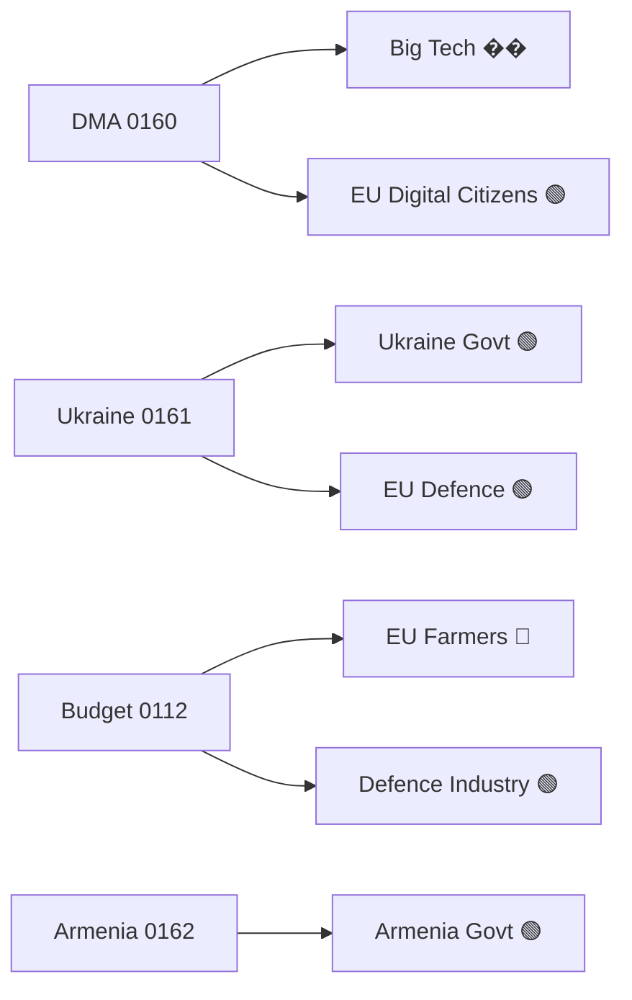

<!-- SPDX-FileCopyrightText: 2024-2026 Hack23 AB -->
<!-- SPDX-License-Identifier: Apache-2.0 -->

# Impact Matrix — April 2026 EP Plenary Breaking
## European Parliament | 2026-05-08

**Purpose:** Event × Stakeholder × Dimension matrix for April 28-30 Strasbourg plenary decisions

---

## Event List

1. **TA-10-2026-0160** — Digital Markets Act Enforcement Resolution (DMA gatekeepers, April 30)
2. **TA-10-2026-0161** — Ukraine/Russia Accountability Framework (frozen assets, April 30)
3. **TA-10-2026-0112** — Budget 2027 General Guidelines (defence/green/transition, April 29)
4. **TA-10-2026-04-30-ANN01** — EP Budget Estimates 2027 (institutional autonomy, April 30)
5. **TA-10-2026-0162** — Armenia Democratic Resilience Partnership (EU enlargement, April 30)

## Stakeholder

**Stakeholder groups:**
1. **EU Digital Citizens** — affected by DMA platform regulation
2. **Big Tech Platforms** — DMA compliance targets
3. **Ukrainian Government** — accountability framework recipients
4. **EU Security/Defence industry** — Budget 2027 EDIP beneficiaries
5. **Armenian Government** — partnership recipients
6. **EU Farmers** — Budget 2027 transition costs
7. **EP Governing Coalition** (EPP+S&D+Renew+Greens+Left)
8. **ECR/PfE Opposition**

## Impact Matrix

See stakeholder impact table and heat classification below.

## Heat

| Event | EU Digital Citizens | Big Tech | Ukraine Govt | EU Defence | Armenia Govt | EU Farmers | Governing Coalition | Opposition |
|-------|--------------------|---------|--------------|-----------|--------------|-----------|--------------------|------------|
| DMA 0160 | 🟢 Positive | 🔴 Negative | ⚪ None | ⚪ None | ⚪ None | ⚪ None | 🟢 Positive | 🔴 Negative |
| Ukraine 0161 | 🟢 Positive (security) | ⚪ None | 🟢 Positive | 🟢 Positive | ⚪ None | ⚪ None | 🟢 Positive | 🔴 Negative |
| Budget 0112 | 🟡 Mixed | ⚪ None | 🟡 Mixed | 🟢 Positive | ⚪ None | 🔴 Negative | 🟢 Positive | 🟡 Mixed |
| EP Budget ANN01 | ⚪ None | ⚪ None | ⚪ None | ⚪ None | ⚪ None | ⚪ None | 🟢 Positive | 🔴 Negative |
| Armenia 0162 | ⚪ None | ⚪ None | ⚪ None | ⚪ None | 🟢 Positive | ⚪ None | 🟢 Positive | 🔴 Negative |

## Cascade

**Hot-cell narrative 1 — Big Tech × DMA (🔴 NEGATIVE):** The Digital Markets Act enforcement resolution creates binding compliance obligations for designated gatekeepers (Alphabet, Apple, Meta, Microsoft). The EP called for fines of up to 10% of global revenue for non-compliance and 20% for repeat violations. Big Tech faces massive compliance costs and potential forced structural changes (interoperability, data portability). This is the most significant platform regulation event since the DMA's entry into force in 2023.

**Hot-cell narrative 2 — Ukrainian Government × Ukraine 0161 (🟢 POSITIVE):** The accountability framework resolution endorses deployment of frozen Russian state assets (approximately €300 billion held by Euroclear/Belgium) toward Ukraine reconstruction. While the EP resolution is non-binding on the Council, it creates strong political mandate and signals to member states that the majority backing exists for full deployment. The framework also established enhanced anti-corruption monitoring as a condition — reinforcing Ukraine's reform trajectory.

**Hot-cell narrative 3 — EU Farmers × Budget 0112 (🔴 NEGATIVE):** The 2027 General Budget guidelines shift agricultural spending toward climate transition requirements, with conditionality on environmental compliance. Farmers' groups have opposed this shift, arguing it increases costs without guaranteed income support. The green guardrails demanded by the Greens (as a coalition condition) may reduce direct payment volumes for non-compliant operations. Estimated impact: 5–15% reduction in direct payments for non-compliant farms if Budget 2027 passes as guidelines indicate.

*Source: EP Open Data Portal | Impact matrix | 2026-05-08*

## Reader Briefing

Four major EP decisions from the April 28-30 Strasbourg plenary will affect different groups in different ways. For EU internet users, the DMA enforcement resolution means digital platforms must offer more choice, easier data portability, and fairer interoperability — a net positive. For EU farmers, the 2027 budget guidelines introduce stricter environmental conditions on direct payments. For Ukrainian citizens, the accountability framework brings frozen Russian assets closer to funding reconstruction. For businesses in the EU defence sector, the budget's EDIP component unlocks new procurement funding. The common thread: the governing coalition's priorities — digital sovereignty, Ukraine support, green transition, defence resilience — came through in all five major votes, despite Council resistance ahead.

*Source: EP Open Data Portal | Impact matrix | 2026-05-08*
