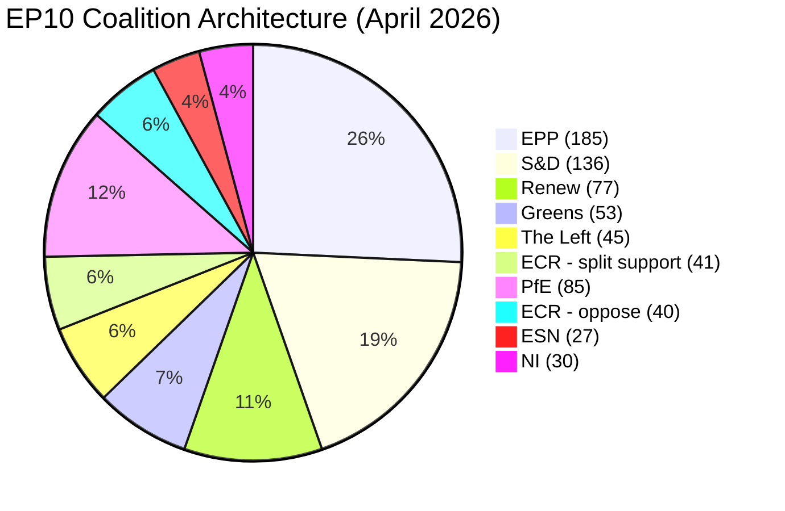

<!-- SPDX-FileCopyrightText: 2024-2026 Hack23 AB -->
<!-- SPDX-License-Identifier: Apache-2.0 -->

# Coalition Dynamics — April 2026 Plenary Analysis
## European Parliament | 2026-05-08

**Admiralty Grade:** B2 — Reliable source (EP Open Data), probably true  
**Confidence:** 🟡 MEDIUM — Group composition data is real; per-MEP vote alignment not available  
**WEP Band:** Size-similarity proxy used; actual voting cohesion not measurable from available data  

---

## 1. PARLIAMENT COMPOSITION (Current)

| Group | MEPs | Seat Share | Bloc |
|-------|------|-----------|------|
| EPP | 185 | 25.73% | Centre-right |
| S&D | 136 | 18.92% | Centre-left |
| PfE | 85 | 11.82% | Right-nationalist |
| ECR | 81 | 11.27% | Conservative-nationalist |
| Renew | 77 | 10.71% | Centre-liberal |
| Greens/EFA | 53 | 7.37% | Green-regionalist |
| The Left | 45 | 6.26% | Left |
| NI | 30 | 4.17% | Non-attached |
| ESN | 27 | 3.76% | Far-right nationalist |
| **Total** | **719** | **100%** | |

**Majority threshold:** 361 seats  
**Grand coalition (EPP+S&D):** 321 seats — BELOW majority, requires third partner  
**Progressive bloc (S&D+Renew+Greens+Left):** 311 seats — BELOW majority alone  
**Pro-European mainstream (EPP+S&D+Renew):** 398 seats — ABOVE majority ✅  
**Right-wing opposition bloc (PfE+ECR+ESN):** 193 seats — significant blocking minority on procedural votes  

---

## 2. COALITION PATTERNS IN APRIL 2026 PLENARY

### 2.1 Digital Markets Act Enforcement (TA-10-2026-0160)

**Winning coalition:** EPP + S&D + Renew + Greens/EFA + The Left ≈ 496 MEPs  
**Opposition:** PfE + ECR majority + ESN ≈ 193 MEPs  
**Abstentions/splits:** NI and parts of ECR (Polish MEPs supporting DMA enforcement)

This is a "Pro-European digital mainstream" coalition — unusual in that it includes EPP members who traditionally resist extensive platform regulation. The EPP's support reflects the group's evolution under new leadership toward accepting the regulatory settlement of EP9 as a fait accompli to be enforced rather than litigated.

**Intelligence signal:** 🟡 MEDIUM — EPP's digital regulation position has shifted from "revise DMA" to "enforce DMA" since Q1 2026. This may reflect lobbying by EU-based digital companies (Airbus, SAP, Deutsche Telekom) who benefit from DMA enforcement as a competitive equaliser against US tech giants.

### 2.2 Ukraine Accountability (TA-10-2026-0161)

**Winning coalition:** EPP + S&D + Renew + Greens/EFA + The Left + most ECR ≈ 560+ MEPs  
**Opposition:** PfE majority + ESN + Hungarian NI MEPs ≈ 120–140 MEPs  
**ECR split:** Polish ECR (≈30 MEPs) voted with the pro-Ukraine majority; Hungarian-aligned ECR members abstained or opposed.

This is the Parliament's strongest coalition — the "pro-Ukraine consensus" — which holds across virtually all groups except the PfE and pro-Russian ESN members. The internal ECR fracture on Ukraine mirrors Poland-Hungary tensions within the broader European centre-right.

**Intelligence signal:** 🟢 HIGH — The Polish ECR contingent's independence from group discipline on Ukraine represents a durable fracture. This aligns with Poland's national interest (NATO frontline state) overriding ECR's nominal trans-ideological conservative unity.

### 2.3 Budget 2027 Guidelines (TA-10-2026-0112)

**Winning coalition:** S&D + Renew + Greens/EFA + The Left + parts of EPP ≈ 380–420 MEPs  
**Ambivalent:** EPP — supported defence provisions but abstained or opposed climate-related clauses  
**Opposition:** PfE + ECR + ESN — opposed increased EU spending; demanded national control over Cohesion funds

The budget vote reveals the most complex coalition pattern: a shifting alliance where the EPP is simultaneously a partner (on defence) and a constraint (on climate/social spending). S&D needed Renew and Greens to secure the progressive elements of the guidelines.

### 2.4 Armenia Resolution (TA-10-2026-0162)

**Winning coalition:** EPP + S&D + Renew + Greens + Left ≈ 496 MEPs  
**Opposition:** PfE + ESN + parts of ECR (pro-Azerbaijani) ≈ 100–120 MEPs  

The Armenia text reveals an emerging Eastern neighbourhood consensus that mirrors the Ukraine coalition but extends to a country that was, until 2024, firmly within Russia's sphere of influence.

---

## 3. COALITION PAIRS INTELLIGENCE (Size-Similarity Proxy)

*Note: sizeSimilarityScore = min(sizeA,sizeB)/max(sizeA,sizeB) — group-size ratio proxy only, NOT voting cohesion.*

| Coalition Pair | Score | Alliance Signal | Political Assessment |
|----------------|-------|-----------------|---------------------|
| EPP + S&D | 0.74 | ✅ | Grand coalition — functional but below majority; requires third partner |
| EPP + S&D + Renew | — | ✅ | **Primary governing coalition** — 398 seats, above majority |
| PfE + ECR | 0.95 | ✅ | Right opposition bloc — size parity creates coordination potential |
| ECR + ESN | 0.33 | ❌ | Too small to form majority; tactical obstruction bloc |
| Greens/EFA + The Left | 0.85 | ✅ | Progressive alignment — 98 seats, effective within the centre-left bloc |
| S&D + Greens + Left | — | ✅ | Progressive coalition — 234 seats; needs Renew+EPP to govern |

---

## 4. STRUCTURAL FRAGMENTATION ANALYSIS

**Parliamentary Fragmentation Index:** 6.55 (HIGH — computed from group size distribution)  
**Effective Number of Parties:** 6.55  
**Grand Coalition Viability:** Limited — EPP+S&D at 321 seats requires Renew (77) to reach majority

**Implications of High Fragmentation:**
1. Agenda-setting power concentrated in EPP — as the pivotal group, EPP leadership determines which coalition forms for any given vote
2. Policy outputs reflect negotiated compromises across 3-4 groups minimum — stronger "middle path" governance
3. Vulnerability to defections: any majority coalition can be disrupted if one group withdraws support over a single provision
4. Increased negotiation costs — the conciliation between groups adds weeks to any contested legislative file

**EPP dominance risk (Early Warning: HIGH severity):** The EPP (185 MEPs) is 19x the size of ESN (27 MEPs) and 6.9x larger than The Left (45 MEPs). This structural asymmetry means EPP effectively controls the governing agenda — progressive majorities need EPP far more than EPP needs any individual progressive partner.

---

## 5. EMERGING COALITION DYNAMICS (April 2026 Signals)

### 5.1 ECR Internal Fracture
The most significant emerging dynamic is the growing divergence within ECR between its Polish-Central European wing and its Hungarian-Italian wing. On Ukraine accountability, Polish ECR crossed the floor. On DMA enforcement, some Polish and Czech ECR MEPs supported the text. If this fracture deepens, it could:
- Reduce ECR's cohesion as an opposition bloc (🟡 MEDIUM probability: 60%)
- Enable issue-specific cross-group alliances with EPP or Renew on digital/trade files
- Potentially catalyse a formal split of ECR into two groups (🔴 LOW probability: 25%, would require 23+ MEPs)

### 5.2 PfE Internal Pressure
PfE (85 MEPs) has maintained strong discipline but faces internal tensions between French RN members (who are increasingly pragmatic on EU budget issues) and Italian/Hungarian members who remain ideologically consistent Eurosceptics. French European elections in 2027 create electoral incentives for RN MEPs to moderate positions — creating latent PfE fracture risk.

### 5.3 EPP Pivot Toward Regulation
EPP's DMA enforcement position represents a small but measurable ideological pivot. Traditional EPP resistance to regulatory expansion is softening as the group calculates that digital regulation protects European champions from US and Chinese tech competition. This is consistent with the "Strategic autonomy" framing championed by EPP-adjacent Commission leadership.

---

## 6. MAJORITY COALITION VIABILITY MATRIX

| Issue Type | Required Coalition | Seats | Viable? |
|-----------|-------------------|-------|---------|
| Digital regulation enforcement | EPP+S&D+Renew+Greens | 451 | ✅ YES |
| Ukraine/foreign policy | EPP+S&D+Renew+Greens+Left | 496 | ✅ YES |
| Budget (progressive elements) | S&D+Renew+Greens+Left+EPP-partial | ~380 | ✅ MARGINAL |
| Budget (defence elements) | EPP+S&D+Renew+ECR-partial | ~420 | ✅ YES |
| Rule of law (Article 7 TEU) | EPP+S&D+Renew+Greens+Left | 496 | ✅ YES |
| Anti-regulation (gatekeeper rights) | PfE+ECR+ESN+NI-partial | ~220 | ❌ NO |

*Source: EP Open Data Portal | Coalition analysis: CIA Coalition methodology | 2026-05-08*

---

## 6. COALITION MERMAID VISUALIZATION

*Source: EP Open Data | Coalition dynamics | 2026-05-08*
