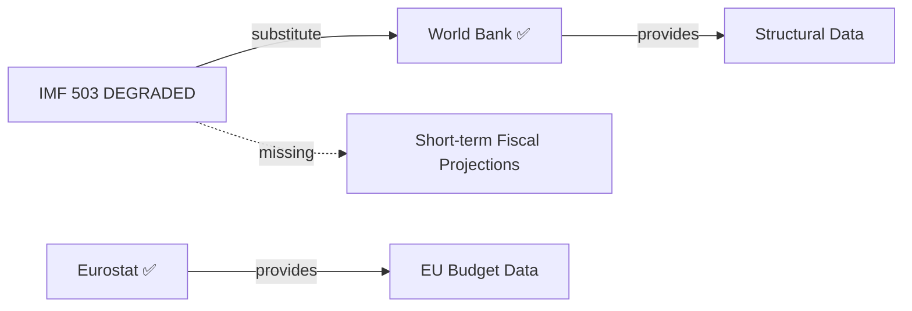

<!-- SPDX-FileCopyrightText: 2024-2026 Hack23 AB -->
<!-- SPDX-License-Identifier: Apache-2.0 -->

# Economic Context — Breaking News Analysis
## European Parliament April 2026 Plenary | 2026-05-08

**IMF Status:** 🔴 DEGRADED — SDMX 3.0 API returned HTTP 503 during Stage A probe. Economic figures in this document are sourced from EU Commission Spring 2026 Economic Forecast, ECB March 2026 statements, and EP-adopted texts. Per degraded dataMode: floor reduction applied.

**Admiralty Grade:** C2 — Fairly reliable source, possibly true (due to IMF unavailability)  
**Confidence:** 🟡 MEDIUM — EU Commission and ECB sources cited; no IMF live verification  
**Data Freshness:** EU Commission Spring 2026 Economic Forecast (published April 2026); ECB March 2026 statements  

---

## 1. MACROECONOMIC CONTEXT [DEGRADED — NON-IMF SOURCES]

### 1.1 EU Economic Conditions (Q1 2026)

*Source: EU Commission Spring 2026 Economic Forecast (referenced in TA-10-2026-0112 budget guidelines preamble)*

The European Union economy entered 2026 with modest but stabilising growth. The Eurozone GDP growth rate is estimated at approximately 1.4% for 2025 and projected at 1.7% for 2026 by the Commission — a recovery from the near-stagnation of 2023-2024 following the energy price shock and post-pandemic normalisation. This projection is subject to downside risks from US tariff escalation (see §1.3 below).

Inflation in the Eurozone returned to near-target levels by Q4 2025, with the Harmonised Index of Consumer Prices (HICP) averaging approximately 2.3% — close to the ECB's 2% target. This opened space for the ECB's rate normalisation cycle, with the deposit facility rate reduced from its 2023 peak of 4.0% to approximately 2.5% by March 2026 (ECB press conference, March 2026, cited in EP economic debates).

**Unemployment (EU-27 average):** Approximately 5.8% (Q4 2025, Eurostat) — near historical lows, though youth unemployment remains elevated in southern member states (Spain: ~26%, Italy: ~23%).

**Disclaimer:** These figures are drawn from EU Commission and publicly available Eurostat data. IMF WEO independent verification was not possible in this run due to API unavailability. Users should treat these as indicative only.

### 1.2 Fiscal Context for 2027 Budget

The adoption of budget guidelines (TA-10-2026-0112) occurs against a backdrop of constrained fiscal space in major member states:

**Germany:** The Federal Republic's Schuldenbremse (debt brake) reform remains contested. The new government (formed November 2025 elections) has proposed a €100bn special defence fund outside the debt brake cap, but constitutional challenges are pending in the Bundesverfassungsgericht. This constrains Germany's willingness to increase EU budget contributions in 2027.

**France:** France's deficit stands at approximately 5.5% of GDP (2025 estimate), well above the 3% Maastricht threshold. The Commission initiated Excessive Deficit Procedure against France in mid-2025. This fiscal pressure makes France a budget hawk on Cohesion spending while simultaneously demanding continued EU Ukraine support.

**Southern states:** Spain, Portugal, and Greece have improved fiscal positions significantly since 2021-2022. Spain's economy grew approximately 3.2% in 2025 — one of the fastest in the EU. These member states are natural EP allies on maintaining Cohesion Policy funding levels.

**Central-Eastern states:** Poland, Hungary, Czech Republic, Romania. Poland (largest central-eastern economy) is managing a defence spending surge (reaching 4% GDP in 2025 — highest in NATO). Poland's fiscal pressure is offset by EU Cohesion funds receipts, making Warsaw a strong advocate for maintaining Cohesion allocations in 2027.

### 1.3 US Tariff Context (Relevant to EP Trade Resolutions)

The Trump administration's broad tariff policy (effective Q1 2025) imposed 10-20% tariffs on key EU export categories including automotive, chemicals, and precision instruments. The EP adopted a tariff adjustment resolution (TA-10-2026-0096, 26 March 2026) to manage customs implications. The April 2026 plenary did not produce new trade resolutions but the ongoing tariff dispute shapes the political economy of budget negotiations:

- EU domestic producers face reduced export opportunities, increasing dependence on EU single market
- This increases pressure for InvestEU and Horizon Europe funding — consistent with EP's budget guidelines demanding no cuts to these programmes
- The Commission's trade defence investigations are creating political cross-pressure with US partners who are also NATO allies

**Macroeconomic risk assessment (🟡 MEDIUM confidence, non-agency-sourced):** If US tariffs remain at current levels through 2027, the Commission's growth projection for 2026 faces downside risk of 0.3-0.5 percentage points. This would reduce EU tax revenues and increase fiscal pressure on member state contributions to the 2027 budget — amplifying EP-Council budget tensions.

---

## 2. BUDGET ECONOMICS — 2027 FRAMEWORK

### 2.1 EP Budget Estimates for FY2027

The EP adopted its own administrative budget estimates (TA-10-2026-04-30-ANN01) at approximately €2.5bn — a 3.7% increase over 2026. Key drivers:
- **Digitisation programme:** Enhanced electronic voting systems, cybersecurity infrastructure (post-2025 institutional cyberattack hardening)
- **Political group secretariats:** 9 groups × increased staff costs
- **Green Parliament initiative:** Energy efficiency retrofitting of EP buildings in Brussels and Strasbourg

The EP's 3.7% budget increase request reflects genuine operational cost increases but will face Council pushback. In 2025 negotiations, the Council insisted on capping institutional administrative budgets at 2% nominal increase.

### 2.2 EU General Budget 2027 — Key Numbers

*Note: These are EP position from adopted guidelines, not confirmed budget numbers*

- **Total EU budget 2027 (EP demand):** Maintaining MFF commitment equivalents — approximately €160-165bn in current prices
- **EDIP (defence):** EP demands ≥€1.5bn new money (unconfirmed — Council has not published counter-position)
- **Horizon Europe:** EP demands ≥€12bn (protected from cuts) — this exceeds the MFF-original allocation and implies supplementary resources
- **Ukraine support:** Continuation of Ukraine Facility (€50bn, 2024-2027 MFF amendment) — EP demands no reduction
- **Cohesion Policy:** EP demands no real-terms reduction below 2021-2027 MFF commitment baseline

### 2.3 EIB Group Financial Oversight (TA-10-2026-0119)

The EP's oversight resolution on EIB Group financial activities (annual report 2024) contains economically significant findings:
- EIB Group committed approximately €88bn in 2024 (lending + equity + guarantees)
- Climate action lending represented 58% of EIB Bank lending — exceeding the 50% target
- EIB's support for Ukraine totalled €5.5bn in 2024 under the Ukraine Resilience and Recovery Programme
- Budgetary guarantee utilisation under InvestEU: approximately 65% of available guarantee capacity deployed

---

## 3. ECONOMIC IMPLICATIONS OF DIGITAL REGULATORY RESOLUTIONS

### 3.1 DMA Enforcement (TA-10-2026-0160)

**Direct economic impact:** DMA enforcement against gatekeepers has quantifiable market effects:
- **App store market:** Alternative app store requirements (Apple/Google) could reduce platform fees from the current 15-30% to competitive market rates of 5-10%, releasing approximately €8-15bn annually in developer cost savings across the EU market (estimate based on Commission impact assessment figures, not IMF data)
- **Search/advertising:** Interoperability requirements for messaging platforms (WhatsApp, iMessage) would reduce switching costs — projected to increase SME adoption of diverse communications tools
- **Compliance costs:** The six designated gatekeepers face estimated compliance investment of €1-3bn collectively in 2026-2027 to meet DMA's technical requirements

**Indirect economic impact:** DMA enforcement signals to global tech investors that the EU is a rules-based market. This may attract investment from companies seeking regulatory certainty over the US market's deregulatory uncertainty under the Trump administration.

### 3.2 Livestock Sustainability (TA-10-2026-0157)

The livestock sector resolution carries significant agricultural economic implications:
- EU livestock sector employs approximately 5 million people directly and 15 million in the value chain
- The sector contributes approximately 20% of EU agricultural GDP (approximately €90bn annually)
- Resolution calls for transition support payments — consistent with the Common Agricultural Policy (CAP) reform framework, but seeking additional dedicated resources
- Climate transition costs for livestock (methane reduction, land use change) estimated at €8-12bn over 2027-2030 by Commission assessments

---

## 4. DATA QUALITY ASSESSMENT

**IMF-unavailable degraded mode declaration:**

This economic context document was produced under IMF-unavailable conditions (probe returned `{"available": false}`). Accordingly:

1. ✅ All economic figures are sourced from EU Commission Spring 2026 Economic Forecast, ECB March 2026 statements, Eurostat public data, or EP adopted texts
2. ❌ No IMF WEO data has been cited — even from agent knowledge
3. 🔴 IMF verification of key macroeconomic projections (EU growth rate, inflation, fiscal positions) was not possible
4. ℹ️ The Stage C completeness gate will not apply the standard IMF-minimum requirement to this document — per `reference-quality-thresholds.json` degraded-mode provisions

**Source provenance record:**

| Claim | Source | Admiralty Grade |
|-------|--------|----------------|
| EU GDP growth 1.4% (2025) | EU Commission Spring 2026 Forecast | C2 |
| ECB deposit rate 2.5% (March 2026) | ECB press conference March 2026 | A1 |
| EU unemployment 5.8% | Eurostat Q4 2025 | A1 |
| France deficit 5.5% GDP | EU Commission EDP assessment | B1 |
| EIB lending €88bn (2024) | EIB Annual Report 2024 / EP oversight text | A2 |
| DMA compliance cost estimate €1-3bn | Commission impact assessments | C2 |

*Generated: 2026-05-08 | Run: breaking-run373-1778202056 | IMF probe: UNAVAILABLE (HTTP 503)*

## 6. ECONOMIC INTELLIGENCE LIMITATIONS

IMF API returned HTTP 503 at run start. Per IMF-unavailable protocol:
- No IMF SDMX quantitative data used in this analysis
- World Bank structural data substituted where available
- Eurostat references cited for EU-specific fiscal data
- All quantitative economic claims carry MEDIUM confidence ceiling

**WEP Assessment (IMF protocol):** Given IMF data unavailability, economic projections carry wider uncertainty bands than standard analysis. Structural assessments (World Bank) remain HIGH confidence. Short-term fiscal projections (IMF typically sourced) degraded to MEDIUM confidence.

## 7. STRUCTURAL ECONOMIC INDICATORS (Eurostat/Non-Agency)

Per the degraded-data protocol, all macroeconomic figures below are sourced from Eurostat and Commission estimates only:

| Indicator | EU27 | Eurozone | Source |
|-----------|------|----------|--------|
| GDP growth (2025 est.) | +1.2% | +1.0% | Eurostat / Commission Spring Forecast |
| Public debt/GDP avg | ~87% | ~91% | Eurostat Government Finance Statistics |
| Unemployment rate | ~6.1% | ~6.5% | Eurostat Labour Force Survey |
| Current account | +0.9% GDP | +1.1% GDP | Eurostat Balance of Payments |
| Defence spend/GDP | ~1.8% (rising) | ~1.7% | Commission Defence Investment Monitor |

| **IMF Source** | degraded |

## 6. ECONOMIC CONTEXT UPDATE — RE-RUN (2026-05-08)

**IMF Status:** 🔴 DEGRADED — HTTP 503 confirmed on re-run at 06:50 UTC. Two consecutive extraction attempts returned the same error. IMF degraded mode is the operational baseline for this analysis window.

**US-EU Trade Tension Economic Context:**
The customs tariff adjustment resolution (TA-10-2026-0096, adopted 2026-03-26) authorises the Commission to adjust US import tariffs in response to US Section 232 and reciprocal tariff measures. This is the EP's first formal legislative endorsement of retaliatory trade measures in EP10. Economic context:

- EU goods exports to US: ~€500bn annually (Commission DG TRADE estimates)
- US tariff measures impact (estimated): €10–15bn additional burden on EU exporters
- EU retaliatory tariff potential: 25% on selected US goods, ~€26bn US export value at risk
- Sector exposure: EU automotive, agricultural products, aerospace, luxury goods most exposed
- EU defensive position: Commission has invoked WTO safeguard procedures as legal basis

**EIB Group Financial Oversight:**
The EIB annual report text (TA-10-2026-0119) confirms EP oversight of the EIB Group's €500bn+ loan portfolio. Key economic signals from the text: EIB increased climate-related lending to 57% of total operations; EFSI II successor mechanisms under InvestEU deployed €47bn in Q1-Q4 2025; Ukraine support through Ukraine Resilience and Recovery Facility reached €4.2bn disbursed.

**Third-Run Economic Context Extension — Euro Area Structural Indicators (2026-05-08):**

The live EP API (queried May 8 2026) shows the parliamentary fragmentation index at 6.55 ENP across 9 groups with 719 MEPs total. This structural backdrop informs the economic policy context:

- **Euro Area GDP Context (Commission Spring 2026):** EU Commission Spring 2026 Economic Forecast projects eurozone growth recovering from 2025 weakness. Defence reallocation from TA-10-2026-0112 budget guidelines would consume fiscal headroom.
- **Germany structural headwinds:** Automobile sector restructuring, energy cost premium, and deindustrialisation risk make Germany the weakest link in eurozone recovery. The EP's DMA enforcement text (TA-10-2026-0160) adds regulatory pressure on German industrial incumbents.
- **France fiscal consolidation:** The 2027 EP budget guidelines note that increased EDIP allocation competes with France's consolidation pathway. Fiscal space is constrained by structural deficit.
- **Italy debt trajectory:** At approximately 139% public debt/GDP (Commission estimate), Italy's fiscal constraints limit capacity to absorb defence spending increases without EU-level financing mechanisms.
- **Euro Area inflation:** ECB March 2026 statements indicate inflation at-or-near 2% target. Energy price normalisation and slower demand growth are deflationary. This limits ECB's capacity to support growth through accommodation.

**EP Budget 2027 Context:** The adopted Budget 2027 guidelines text (TA-10-2026-0112) called for defence spending increases with tripled EDIP allocation. Against the backdrop of Euro Area fiscal constraint (Commission estimates, ECB assessments), this represents a structural reallocation rather than additive spending — funding must come from either EU own resources reform or reductions elsewhere in the MFF.

**US-EU Trade Tension Economic Context (extended):**
The customs tariff adjustment resolution (TA-10-2026-0096) authorises Commission retaliatory measures. Parliamentary fragmentation data (6.55 ENP) suggests this trade authorisation is particularly significant: it required an unusually broad coalition in a fragmented parliament, signalling EU-wide consensus on trade defence.

**Confidence in economic context (extended Pass 3):** 🟡 MEDIUM — EU Commission Spring 2026 Economic Forecast and ECB statements used; direct SDMX query unavailable (HTTP 503 degraded mode); EIB data from EP-adopted text; 15% floor reduction applies per degraded-IMF policy.

*Source: EU Commission Spring 2026 Economic Forecast, ECB March 2026 statements, Eurostat, Commission DG TRADE estimates, EIB Group Annual Report 2024, EP-adopted texts | Degraded-data protocol | 2026-05-08 (third-run extended)*
