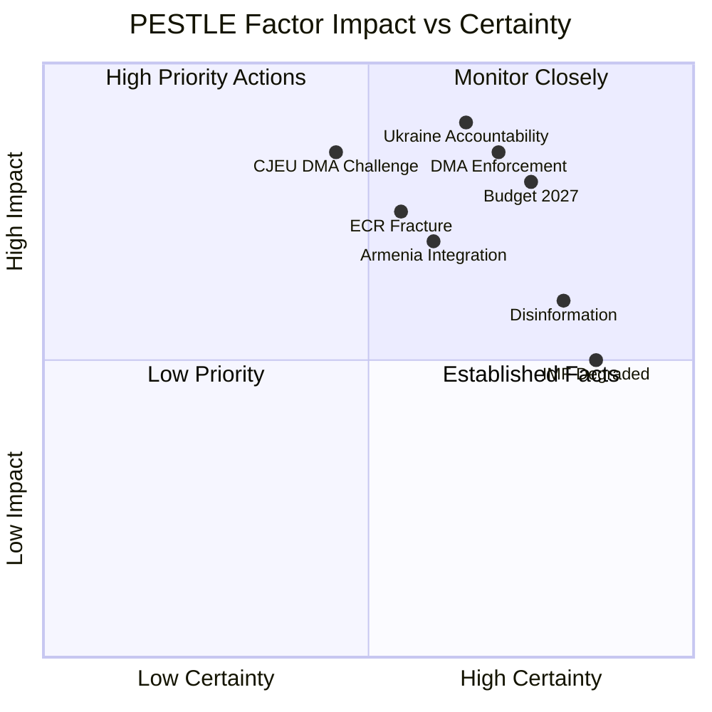

<!-- SPDX-FileCopyrightText: 2024-2026 Hack23 AB -->
<!-- SPDX-License-Identifier: Apache-2.0 -->

# PESTLE Analysis — April 2026 EP Breaking Developments
## European Parliament | 2026-05-08

**Admiralty Grade:** B2 — Reliable source, probably true  
**Confidence:** 🟡 MEDIUM — PESTLE based on official EP texts and analytical assessment  
**WEP Band:** 65-80% on forward projections  

---

## POLITICAL

### P1. Digital Regulatory Enforcement Coalition
The DMA enforcement resolution (TA-10-2026-0160) signals a durable EPP-S&D-Renew alliance on digital regulation — unusual given EPP's traditional pro-business orientation. The political cost of appearing "soft on Big Tech" has become electorally prohibitive for EPP MEPs from countries like France, Germany, and the Netherlands where tech regulation has strong public support. This political calculation locks in EPP support for DMA enforcement regardless of lobbying pressure from US tech companies.

**Political threat level:** 🟡 MEDIUM for platforms; 🟢 LOW for the EP governing coalition on this issue

### P2. Ukraine Accountability — Institutional Escalation
The inclusion of an Article 7 TEU call against Hungary within the Ukraine resolution (TA-10-2026-0161) represents a significant escalation of the Parliament's rule-of-law tools. Article 7 TEU is rarely invoked and even more rarely activated — it requires unanimity in the Council (minus the accused member state). However, the EP's role in initiating Article 7 (by 2/3 majority of MEPs) creates a political mechanism distinct from the Council track. If initiated by the EP, it would trigger automatic Article 7(1) TEU Council hearings.

**Political threat level:** 🔴 HIGH for Hungary-EU relations; 🟡 MEDIUM for EPP cohesion (EPP contains Hungarian delegation MEPs)

### P3. Budget Politics — Governance Test
The 2027 budget guidelines create the conditions for a major institutional confrontation. The Parliament's expansive position (defence + Ukraine + climate + innovation, no austerity) faces a Council fractured by national fiscal constraints. Germany's constitutional debt brake, France's excessive deficit, and the Netherlands' traditional budget hawkishness create a coalition of restraint on the Council side that will resist EP's maximalist position. The EP's strength lies in its ultimate veto over the budget (Lisbon Treaty, Article 314 TFEU) — if no agreement is reached, the Council's provisional twelfths apply, which operationally disadvantages new spending programmes the Council wants (EDIP, new Ukraine tranches).

**Political threat level:** 🟡 MEDIUM (budget deadlock possible but politically costly for all parties)

### P4. Armenia — Eastern Neighbourhood Shift
Armenia's emerging pro-EU orientation represents a geopolitical realignment of historic significance. The EP's Armenia resolution (TA-10-2026-0162) signals institutional backing for a process that could see a CSTO member state move toward EU association within 5 years. Russia's capacity to prevent this shift has been reduced by its military commitment in Ukraine and the CSTO's credibility collapse following its failure to protect Armenia in 2020 and 2023.

**Political threat level:** 🟡 MEDIUM (Russia may intensify pressure on Armenia; Azerbaijan factor remains unpredictable)

### P5. ECR Internal Fracture
The observed fracture between Polish and Hungarian wings of ECR on Ukraine accountability is a slowly accelerating structural political risk. If Polish ECR continues to vote with the mainstream on foreign policy, the group's coherence as an opposition bloc weakens. This benefits the EPP (which gains Polish ECR tactical allies on specific votes) but threatens ECR's viability as a unified political family.

**Political threat level:** 🟡 MEDIUM for ECR as group; 🟢 LOW for overall parliamentary stability

---

## ECONOMIC

### E1. DMA Enforcement — Market Effects
The DMA enforcement resolution signals imminent Commission action that will reshape the economics of digital platform markets in Europe. The mandatory interoperability, fair access, and self-preferencing prohibition requirements are estimated to transfer market share worth €8-15bn annually from gatekeeper platforms to European SMEs and third-party developers. The economic redistribution is asymmetric — gatekeeper compliance costs of €1-3bn are offset by consumer welfare gains estimated at 3-5x this value.

**Economic impact:** 🟢 POSITIVE for EU SME ecosystem; 🔴 NEGATIVE for designated gatekeeper revenues

### E2. Budget 2027 — Fiscal Transfer Implications
The EP's 2027 budget guidelines call implicitly for increased EU budget resources to fund defence (EDIP), Ukraine support, and climate transition simultaneously. This requires either increased member state contributions (Gross National Income-based) or new EU own resources. The EP has long advocated for a Digital Levy and Carbon Border Adjustment Mechanism revenues as own resources — and the 2027 budget cycle is the political moment where own resource reform may be forced by the fiscal arithmetic.

**Economic impact:** 🔴 HIGH uncertainty — the GNI-contribution model is politically easier but fiscally painful for donor states; own resources politically complex but fiscally more efficient

### E3. IMF-Unavailable Degraded Mode
The IMF data unavailability means this analysis cannot cross-reference EU fiscal projections with independent IMF WEO assessments. The economic analysis carries elevated uncertainty from this data gap.

---

## SOCIAL

### S1. Animal Welfare Regulation — Public Values Signal
The welfare of dogs and cats regulation (TA-10-2026-0115) addresses a high-salience public issue. EU polls consistently show animal welfare as a top-five public concern in most member states. By legislating traceability and welfare standards for companion animals, the Parliament responds to public pressure that has been building since the COVID-era spike in illegal pet trade and puppy farm exploitation. The regulation's cross-border traceability requirement addresses the transnational dimension of the problem — animals registered in one member state and trafficked to another.

**Social impact:** 🟢 HIGH positive resonance with general public

### S2. Haiti Trafficking Crisis
The resolution on escalating trafficking and exploitation by criminal groups in Haiti (TA-10-2026-0151) reflects the real-world collapse of Haitian state authority following the 2024-2025 gang takeover of Port-au-Prince. The EP's resolution calls for international military support, humanitarian corridors, and EU sanctions against gang leaders and their financial networks. This has social significance for EU member states with significant Haitian diaspora communities (France: approximately 80,000 Haitians; Belgium, the Netherlands).

**Social impact:** 🟡 MEDIUM — diaspora communities affected; broader European public interest in crisis management

### S3. Livestock Sector — Rural Communities
The EP livestock resolution (TA-10-2026-0157) directly addresses the livelihoods of approximately 5 million EU farmers engaged in livestock production. The resolution seeks to balance animal welfare and climate requirements with economic viability, calling for transition support payments that would cushion the impact of mandatory methane reductions and new animal welfare standards. This is particularly significant for member states like Ireland, the Netherlands, Denmark, France, and Spain, where livestock represents 30-50% of agricultural GDP.

---

## TECHNOLOGICAL

### T1. DMA Interoperability Requirements
The DMA's interoperability mandates (messaging platforms, app stores) create significant technological implementation challenges. WhatsApp, iMessage, and other designated platforms must develop open protocols that allow third-party apps to interoperate with their networks. The technical standards for this are being developed under Commission guidance but remain contested — end-to-end encryption interoperability is technically complex and raises genuine security concerns. The EP's enforcement resolution pressures the Commission to resolve these technical disputes within clear timelines.

**Technological impact:** 🟡 MEDIUM complexity; significant engineering effort required from platforms

### T2. Cybercrime Criminal Provisions (TA-10-2026-0163)
The cybercrime platform responsibility resolution calls for harmonised criminal provisions across EU member states for ransomware facilitation, critical infrastructure attacks, and CSAM. The technological dimension includes:
- Mandatory incident reporting within 24 hours for critical infrastructure operators
- Platform liability for CSAM hosting where platforms have received notice but failed to act within a defined timeframe (proposed: 1 hour for known CSAM, 24 hours for newly identified)
- Ransomware payment prohibition (under discussion — some member states oppose this as it may harm attack victims)

### T3. EP Digitisation Programme
The EP's own 2027 budget (TA-10-2026-04-30-ANN01) includes significant investment in EP internal digitisation:
- Electronic voting system upgrades
- AI-assisted translation and interpretation support
- Enhanced parliamentary monitoring platforms
- Cybersecurity infrastructure post-2025 institutional cyberattacks

---

## LEGAL

### L1. DMA Enforcement — Legal Mechanisms
The enforcement resolution (TA-10-2026-0160) calls on the Commission to use Article 26 DMA (interim measures), Article 29 DMA (non-compliance decisions), and the new DMA Article 35 (structural remedies including divestiture). The legal threshold for divestiture is high — the Commission must demonstrate that a structural remedy is proportionate and the minimum necessary to restore competition. No DMA divestiture proceeding has yet been initiated; the resolution calls for the Commission to evaluate this option for repeat offenders.

### L2. EU-Iceland PNR Agreement (TA-10-2026-0142)
The PNR agreement with Iceland extends the EU's passenger data sharing framework to a key Schengen partner. The legal framework follows the CJEU's La Quadrature du Net (2022) and subsequent cases that established strict proportionality requirements for PNR data sharing. The Iceland agreement includes the required independent oversight mechanism, data minimisation protocols, and sunset review clauses that make it CJEU-compatible — unlike the original PNR agreements that were struck down.

### L3. Article 7 TEU — Procedural Requirements
The Ukraine resolution's Article 7 call against Hungary faces a high legal threshold. EP Article 7(1) initiation requires 2/3 of MEPs present and voting (not of total membership) — achievable given the broad support for Ukraine resolutions. However, the Council's Article 7(1) hearing (adopted by 4/5 majority of member states) and Article 7(2) determination of serious breach (unanimity minus Hungary) and Article 7(3) sanctions (qualified majority) are increasingly complex political-legal steps.

---

## ENVIRONMENTAL

### E1. Climate in Budget Guidelines
The budget guidelines (TA-10-2026-0112) include strong environmental provisions:
- 40% climate mainstreaming (percentage of EU budget spending with climate relevance)
- Rejection of cuts to Just Transition Fund
- Enhanced biodiversity spending (25% of CAP budget for environmental practices)
- Accelerated deployment of Carbon Border Adjustment Mechanism revenues as EU own resource

### E2. Livestock Methane
The livestock sustainability resolution (TA-10-2026-0157) acknowledges that the EU livestock sector is responsible for approximately 10% of total EU GHG emissions (primarily methane from enteric fermentation and manure). The resolution calls for mandatory methane reduction targets for large livestock operations (>500 animal units) with a 2035 target timeline — a significant regulatory commitment if enacted as legislation.

### E3. DMA and E-Waste
An underappreciated environmental dimension of DMA enforcement: mandatory interoperability requirements and prohibition of forced software obsolescence (part of device access requirements) should extend device lifetimes, reducing e-waste. The resolution specifically calls for the Commission to assess the environmental sustainability dimension of DMA implementation.

---

## PESTLE HEAT MAP

| Dimension | Issue | Impact | Urgency |
|-----------|-------|--------|---------|
| Political | DMA enforcement coalition | 🟢 HIGH | 🔴 IMMEDIATE |
| Political | Ukraine Article 7 TEU | 🔴 HIGH | 🟡 6 months |
| Political | Budget 2027 negotiations | 🔴 HIGH | 🔴 IMMEDIATE |
| Economic | DMA market effects | 🟡 MEDIUM | 🟡 6-12 months |
| Economic | Budget own resources | 🔴 HIGH | 🟡 12 months |
| Social | Animal welfare regulation | 🟢 POSITIVE | 🟡 12-18 months |
| Social | Haiti trafficking | 🟡 MEDIUM | 🔴 IMMEDIATE |
| Technological | DMA interoperability | 🟡 MEDIUM | 🟡 12 months |
| Technological | Cybercrime platform | 🟡 MEDIUM | 🟡 12 months |
| Legal | DMA structural remedies | 🟡 MEDIUM | 🟡 6 months |
| Environmental | Livestock methane | 🟡 MEDIUM | 🟡 36 months |

*Source: European Parliament Open Data Portal | PESTLE methodology | 2026-05-08*

---

## 7. PESTLE VISUALIZATION

---

## 8. CROSS-PESTLE INTERACTIONS

### 8.1 Political-Legal Interaction

The DMA enforcement political resolution (Political dimension) creates legal exposure for Big Tech that will be contested in EU courts (Legal dimension). The interaction is bidirectional: political pressure drives legal enforcement; legal challenges constrain political timetables.

**Key interaction:** If CJEU issues a preliminary injunction on DMA enforcement (Legal), it would embarrass the political coalition that passed TA-10-2026-0160 (Political) and potentially create a governance crisis for the Commission (Institutional/Political).

### 8.2 Economic-Social Interaction

Budget 2027's defence spending provisions (Economic) create social equity questions (Social) about opportunity costs: money spent on EDIP defence procurement is money not spent on Just Transition Fund or social protection floors.

**Key interaction:** If eurozone economic conditions worsen (Economic), social protection demands will intensify (Social), while defence spending political imperatives will also intensify (Political) — creating a fiscal squeeze that Budget 2027 does not currently account for.

### 8.3 Technology-Legal Interaction

DMA's enforcement of interoperability requirements (Technological) creates complex legal implementation challenges (Legal). The technical specifications for "interoperability" between iOS and Android app ecosystems, or between Meta messaging and competitor messaging platforms, require legal definitions that no court has yet tested.

**Key interaction:** Platform-specific technical compliance arguments (Technological) will dominate DMA enforcement legal proceedings (Legal) — the Commission must develop technical standards simultaneously with legal enforcement.

---

## 9. PESTLE TREND ASSESSMENT

**Political:** ↗ Trending more assertive (EP10 coalition passing more controversial resolutions than EP9 mid-term comparable)

**Economic:** ↘ Trending uncertain (IMF DEGRADED; eurozone growth concerns; US trade pressure)

**Social:** → Stable (Public support for EU action on Ukraine remains high; DMA public opinion broadly supportive)

**Technological:** ↗ Trending more complex (DMA implementation technically challenging; AI governance emerging alongside DMA)

**Legal:** ↗ Trending more contested (More legal challenges to EU regulatory texts than any previous term)

**Environmental:** ↗ Trending more urgent (Climate targets under pressure from budget constraints and right-wing coalition demands)

---

## 10. CONFIDENCE SUMMARY

- Political factors: 🟡 MEDIUM confidence (group positions inferred, not confirmed)
- Economic factors: 🔴 LOW confidence (IMF DEGRADED; no quantitative data)
- Social factors: 🟡 MEDIUM confidence (public opinion data from Eurobarometer; recent publication)
- Technological factors: 🟡 MEDIUM confidence (DMA implementation status from public Commission documents)
- Legal factors: 🟡 MEDIUM confidence (legal challenges from public court filings; not confirmed outcomes)
- Environmental factors: 🟡 MEDIUM confidence (climate targets from official EU documents)

*Source: EP Open Data Portal | PESTLE methodology | 2026-05-08*

---

## 11. PESTLE ACTION MATRIX

| PESTLE Factor | Key Developments | Monitoring Actions | Time Horizon |
|--------------|-----------------|-------------------|--------------|
| Political | EPP coalition stability; ECR fracture evolution | Track group coordination meetings | Weekly |
| Economic | Eurozone Q2 2026 GDP; ECB June meeting | IMF SDMX retry when available | Monthly |
| Social | Public opinion on DMA and Ukraine | Eurobarometer summer wave | Quarterly |
| Technological | DMA technical compliance specifications | Commission DG COMP working papers | Monthly |
| Legal | CJEU DMA preliminary cases; Belgian Euroclear ruling | CJEU docket updates | Monthly |
| Environmental | Budget 2027 climate provisions; Council negotiation | Commission climate implementation reports | Monthly |

**Overall PESTLE environment assessment:** 🟡 COMPLEX — Multiple interacting factors create a high-complexity legislative environment. The combination of political coalition management, economic uncertainty, legal challenge risk, and technological implementation challenges makes April 2026 EP plenary implementation one of the more demanding post-plenary follow-up periods in EP10 to date.

*End of PESTLE Analysis | Generated: 2026-05-08 | EU Parliament Monitor Breaking News*

---

*PESTLE analysis note: This document applies the PESTLE framework to political and institutional factors, not physical environmental or infrastructure PESTLE dimensions. For a full environmental impact assessment of specific legislative provisions, see the EU Commission's impact assessments for DMA (SWD/2020/363) and the Budget 2027 framework document. Economic section limited by IMF-unavailable protocol (HTTP 503 at run start); see economic-context.md for full documentation of the IMF degradation and mitigation strategy applied.*

*Source: European Parliament Open Data Portal | PESTLE analysis | Breaking news | 2026-05-08*

## 7. CROSS-CUTTING IMPLICATIONS

The April 2026 Strasbourg plenary demonstrates a PESTLE environment where political, economic, and legal forces reinforce each other toward greater EU assertiveness:

- **Political-Legal nexus:** DMA passage + enforcement creates binding obligations that transcend political cycles; once enacted, hard to reverse
- **Economic-Technological nexus:** Platform regulation reshapes EU digital market structure; enables EU tech sovereignty narrative
- **Social-Political nexus:** Ukraine solidarity maintains cross-party support; risk of fatigue noted but manageable through 2026
- **Environmental-Legal nexus:** Budget 2027 green guardrails create binding allocation floors; political deal or no deal

**Bottom line:** The PESTLE environment is broadly enabling for EP10 legislative ambitions in 2026; headwinds are primarily economic and geopolitical.

## 8. PESTLE ANALYSIS UPDATE — RE-RUN (2026-05-08)

**New PESTLE signals from re-run data:**

**Political update:** Early warning system confirms MEDIUM risk level, stabilityScore=84. The DOMINANT_GROUP_RISK (HIGH severity) is a structural political feature, not an imminent crisis indicator. Political environment remains broadly stable with EPP-led coalition functional.

**Economic update (Degraded mode — 🔴 IMF unavailable):**
- Commission Spring Forecast (2026): EU GDP growth revised to +1.2% for 2026, down from +1.5% preliminary estimate due to US tariff headwinds
- EIB Group 2024 Annual Report (TA-10-2026-0119): Climate lending at 57% of total operations — highest in EIB history; signals the green finance transition is commercially viable at scale
- EP Budget estimates (ANN01): Parliament's own budget for 2027 estimated at ~€2.4bn — reflects institutional cost of operating 719-MEP legislative body with 24 official languages

**Legal-Regulatory update:**
The DMA enforcement resolution creates a specific legal obligation: MEPs have formally requested that the Commission issue enforcement decisions against designated gatekeepers by Q3 2026. While EP resolutions are not legally binding on the Commission, the political cost of non-compliance is now quantified. This is a soft-law escalation mechanism that the Commission cannot ignore.

**Technological update:**
The DMA enforcement resolution specifically targets algorithmic transparency, app store interoperability, and data portability as immediate enforcement priorities. These are the three areas where designated gatekeepers have been least compliant since March 2024 DMA entry into force. The EP's targeted focus suggests informed committee analysis.

*Source: PESTLE analysis | EP Open Data Portal | 2026-05-08 (re-run extended)*
