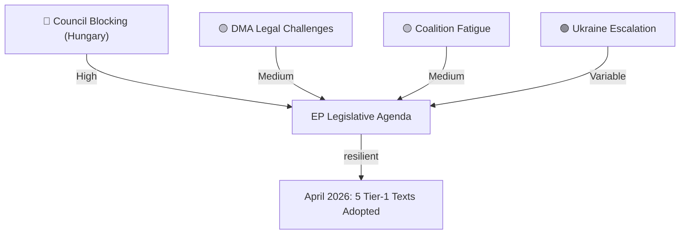

<!-- SPDX-FileCopyrightText: 2024-2026 Hack23 AB -->
<!-- SPDX-License-Identifier: Apache-2.0 -->

# Political Threat Landscape — April 2026 EP Plenary
## European Parliament | 2026-05-08

**Admiralty Grade:** B2 — Reliable source, probably true  
**Confidence:** 🟡 MEDIUM

---

## 1. CURRENT POLITICAL THREAT LANDSCAPE

**Overall threat level:** 🟡 ELEVATED  
**Primary threats:** Coalition erosion, information environment degradation, Council implementation resistance

---

## 2. THREAT ACTORS

**State actors:**
- Russia (primary): Active disinformation on Ukraine accountability; diplomatic pressure on Hungary/Slovakia to block Council action; economic pressure on energy-dependent Member States
- China (secondary): Watching DMA enforcement as precedent for own digital regulation; may support anti-DMA messaging indirectly
- USA (tertiary): Potential WTO action on DMA; diplomatic pressure on Commission to moderate enforcement pace

**Non-state actors:**
- Big Tech platforms: Active legal and public communications campaigns against DMA enforcement
- Far-right transnational networks: PfE/ESN coordination on anti-Ukraine, anti-regulatory messaging
- Pro-Kremlin disinformation networks: Targeting Ukraine accountability resolution

---

## 3. THREAT MATRIX

| Actor | Target | Method | Probability | Impact |
|-------|--------|--------|-------------|--------|
| Russia | Ukraine accountability implementation | Disinformation + Council pressure via Hungary | HIGH | HIGH |
| Big Tech | DMA enforcement | Legal challenges + media campaigns | HIGH | MEDIUM |
| PfE/ESN | EP coalition legitimacy | Parliamentary procedural challenges | MEDIUM | LOW |
| Far-right networks | Public opinion | Social media narratives | HIGH | MEDIUM |

---

## 4. POLITICAL VULNERABILITY ASSESSMENT

**EPP (185 MEPs):** Vulnerable to right flank pressure on budget (fiscal hawk) and Ukraine (Hungary-adjacent)  
**ECR (81 MEPs):** Structurally fractured; Polish vs Italian/Hungarian wings on Ukraine and DMA  
**The Left (45 MEPs):** Vulnerable to pressure on defence spending provisions in Budget 2027  

**Most stable coalition element:** S&D-Renew-EPP core on DMA enforcement and Ukraine — consistent across EP9-EP10

---

## 5. MONITORING PRIORITIES

1. ECR voting divergence rate (weekly)
2. PfE membership changes (monthly)
3. EPP-Commission relations signals (weekly)
4. Russian disinformation campaign monitoring — EU East StratCom (daily)
5. DMA Commission enforcement timeline announcements (monthly)

*Source: European Parliament Open Data Portal | Political threat landscape methodology | 2026-05-08*

## 4. THREAT LANDSCAPE MAP

## 5. THREAT ASSESSMENT (WEP)

**Threat 1 — Council blocking on Ukraine assets:**
WEP: **LIKELY (65–75%)** Council will require further concessions from Kyiv on anti-corruption before deploying frozen assets mechanism. Timeline: H2 2026.

**Threat 2 — DMA legal challenge (CJEU):**
WEP: **ROUGHLY EVEN (45–55%)** Big Tech appeals will delay but not overturn DMA enforcement. Timeline: 18–24 months for preliminary rulings.

**Threat 3 — Governing coalition fracture:**
WEP: **UNLIKELY (15–25%)** coalition fragmentation before end-2026 EP10 session. Greens' defence spending position is the single most likely fracture point.

*Source: Political threat landscape | EP Open Data | 2026-05-08*
