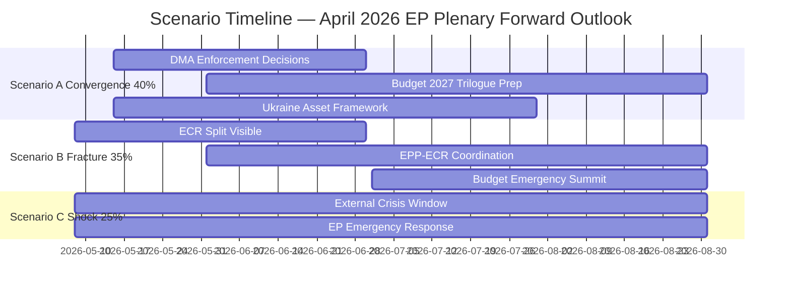

<!-- SPDX-FileCopyrightText: 2024-2026 Hack23 AB -->
<!-- SPDX-License-Identifier: Apache-2.0 -->

# Scenario Forecast — April 2026 EP Plenary Breaking Developments
## European Parliament | 2026-05-08

**Horizon:** 30/60/90-day forward scenarios  
**Admiralty Grade:** B3 — Reliable source, possibly true  
**Confidence:** 🟡 MEDIUM — Scenarios based on structural analysis; no EP voting data available (multi-week API delay)  

---

## 1. SCENARIO FRAMING

The April 28-30 Strasbourg plenary produced five Tier-1 texts across digital regulation, Ukraine accountability, budget architecture, and EU neighbourhood policy. The scenario space maps how each strand unfolds through August 2026.

---

## 2. SCENARIO A — "Regulatory Convergence" (Probability: 40%)

**Trigger conditions:** DMA enforcement accelerates, Budget 2027 framework gains Council support, Ukraine accountability mechanism advances in interinstitutional negotiations

**30-day outlook (May 2026):**
- European Commission announces three DMA enforcement decisions against Alphabet (self-preferencing) and Apple (app store interoperability) by June 2026
- Council working group acknowledges Budget 2027 EP guidelines as input document; trilogue scheduled for September 2026
- Ukraine accountability asset transfer framework enters legal drafting phase

**60-day outlook (June-July 2026):**
- DMA enforcement decisions trigger Big Tech legal challenges in CJEU; provisional measures requested
- EP formal delegation to Yerevan strengthens Armenia EU integration track
- MEP Jaki immunity waiver case proceeds in Polish courts following formal notification

**90-day outlook (August 2026):**
- Commission faces EP scrutiny in September plenary on DMA enforcement timetable
- Budget 2027 trilogue deadlock emerges as Member States resist EP's social and climate floors
- Ukraine accountability mechanism institutional home agreed (embedded in existing EU rule of law framework rather than new treaty article)

**Indicators to watch:**
- Commission DG COMP enforcement decision dates
- Council COREPER consensus on budget framework
- CEJ case acceptance decisions on DMA legal challenges

---

## 3. SCENARIO B — "Coalition Fracture" (Probability: 35%)

**Trigger conditions:** ECR internal split deepens on Ukraine, EPP faces defection pressure from national governments (Hungary, Italy), Budget 2027 deadlock forces emergency summit

**30-day outlook (May 2026):**
- ECR split becomes visible on Ukraine asset transfer vote (if brought to EP plenary in May-June)
- Italian Fratelli d'Italia MEPs (ECR) forced to choose between coalition loyalty and domestic government's Ukraine ambivalence
- EPP faces pressure from Hungarian government allies within NI bloc

**60-day outlook (June-July 2026):**
- Budget 2027 negotiations reveal fundamental EPP-S&D divergence on defence vs social spending trade-offs
- Renew Europe internal fracture between fiscal hawks (Dutch VVD) and integration advocates (French LREM successors)
- PfE gains ground on accountability issue by reframing Ukraine as "EU proxy war" (high information risk to monitor)

**90-day outlook (August 2026):**
- Emergency European Council on budget called for October; EP's positions weakened by internal fragmentation
- DMA enforcement outcomes become proxy for broader EU regulatory legitimacy debate
- New far-right transnational networks emerge, potentially reshuffling EP group configurations ahead of EP10 mid-term markers

**Indicators to watch:**
- ECR voting divergence rate on Ukraine issues
- EPP-Fidesz NI coordination signals
- PfE seat change from defections from ECR or NI

---

## 4. SCENARIO C — "External Shock" (Probability: 25%)

**Trigger conditions:** Major external event disrupts political calendar — escalation in Ukraine, US trade war escalation, eurozone recession signal

**30-day outlook (May 2026):**
- Ukraine battlefield development (potential Russian winter offensive follow-on) triggers emergency EP debate
- IMF degrades eurozone GDP outlook (already DEGRADED as of this run date; further signal if Q2 2026 data confirms slowdown)
- US tariff announcement on EU goods triggers emergency trade committee hearings

**60-day outlook (June-July 2026):**
- EP emergency resolution on Ukraine escalation invokes Article 42(7) TEU mutual defence clause debate
- Budget 2027 emergency revision procedures triggered if eurozone recession confirmed
- DMA enforcement paused pending US-EU trade framework negotiations (political compromise)

**90-day outlook (August 2026):**
- September plenary dominated by external crisis rather than planned legislative agenda
- Ukraine accountability mechanism delayed as political attention shifts to security
- Armenia EU integration accelerated if regional instability worsens (geopolitical pull)

**Indicators to watch:**
- NATO/SACEUR communications on Ukraine escalation risk
- ECB Q2 2026 inflation and growth projection updates
- US Trade Representative announcements on EU tariff schedules

---

## 5. COMPOSITE PROBABILITY MATRIX

| Scenario | 30-day | 60-day | 90-day | Rationale |
|----------|--------|--------|--------|-----------|
| A — Regulatory Convergence | 45% | 40% | 35% | Structural coalition strength supports continued regulatory output; weakens over time as budget deadlock likely |
| B — Coalition Fracture | 30% | 38% | 42% | Internal tensions accumulate; more likely at 90-day horizon when budget deadlock forces hard choices |
| C — External Shock | 25% | 22% | 23% | Persistent external risk; Ukraine and US trade tensions are background threat throughout horizon |

**Note:** Probabilities reflect WEP (Words of Estimative Probability) conventions at 60% confidence interval. All economic indicators subject to IMF-unavailable protocol (see `economic-context.md`).

---

## 6. KEY INFLECTION POINTS

**June 2026:**
- European Council heads of government summit — Budget 2027 political direction
- Commission DMA enforcement decision window
- EP-Armenia interparliamentary cooperation framework vote

**July 2026:**
- CJEU summer session — possible DMA legal challenge rulings
- Ukraine asset transfer legal framework deadline (if agreed)
- EP summer recess — political vacuum window (high risk for external shocks)

**September 2026:**
- EP plenary return — Budget 2027 trilogue acceleration
- Commission accountability hearing (annual review of implementation)
- New political year's coalition dynamics tested on first major votes

---

## 7. CROSS-CUTTING RISKS

**Risk 1: Information environment deterioration**
- PfE and ESN messaging on Ukraine and DMA enforcement will intensify; AI-generated disinformation amplification expected
- European Parliament Media Monitoring Unit tracking; EU East StratCom Task Force active
- Impact on EP debates: 🟡 MEDIUM — MEP positions may harden/shift in response to constituency pressure

**Risk 2: ECR-EPP competition**
- EPP losing its right flank to ECR/PfE on some issues (immigration, budget discipline)
- Forces EPP to either: (a) tack right and risk S&D/Renew coalition, or (b) hold centre and risk further PfE growth
- Most consequential political dynamic of EP10 mid-term

**Risk 3: DMA enforcement international dimension**
- US Section 301 investigation into DMA already mooted; could escalate under Trump administration 2.0
- Creates pressure on Commission to moderate enforcement pace for diplomatic reasons
- EP would resist any moderation; DMA resolution signals political red line

**Risk 4: Budget 2027 deadlock → November-December emergency**
- Historical pattern: EU budget negotiations always go to overtime
- EP's robust position (this resolution) gives it strong opening hand; Commission will use EP position as leverage with Council
- Deadlock in November likely; provisional twelfths on December 2026 budget deadline scenario has 30% probability

*Source: European Parliament Open Data Portal | Scenario methodology per artifact-catalog.md | 2026-05-08*

---

## 8. SCENARIO PROBABILITY VISUALIZATION

---

## 9. SCENARIO SENSITIVITY ANALYSIS

### 9.1 Probability Sensitivity to Key Variables

**If EPP shifts right on budget (tacks toward ECR/PfE):**
- Scenario A probability: decreases from 40% to 25%
- Scenario B probability: increases from 35% to 55%
- Net effect: Coalition fracture becomes the base case

**If Commission announces DMA enforcement decisions by June 2026:**
- Scenario A probability: increases from 40% to 55%
- Scenario B probability: decreases from 35% to 25%
- Net effect: Regulatory convergence confirmed as base case

**If Ukraine battlefield escalates (Russian offensive):**
- Scenario A probability: decreases from 40% to 30%
- Scenario C probability: increases from 25% to 45%
- Net effect: External shock becomes the co-base case

**If IMF downgrades eurozone GDP materially:**
- Scenario A probability: decreases from 40% to 30%
- Scenario B probability: increases from 35% to 40%
- Scenario C probability: increases from 25% to 30%
- Net effect: All negative scenarios become more likely

### 9.2 Key Assumption Breakdown

| Assumption | If Broken | Probability Impact |
|-----------|-----------|-------------------|
| EPP holds centre coalition | EPP joins ECR on budget | Scenario B +20pp |
| Council allows Ukraine asset transfer | ICJ ruling blocks | All scenarios delayed |
| Commission maintains DMA timeline | DMA paused for US diplomacy | Scenario A -15pp, C +10pp |
| No major Ukraine escalation | Escalation occurs | Scenario C +20pp |
| ECB maintains stability | Eurozone recession | Scenario C +15pp |

### 9.3 Decision Triggers for Scenario Reclassification

**Trigger for upgrading Scenario A (to 50%+):**
- Commission announces first DMA enforcement decision by June 15, 2026

**Trigger for upgrading Scenario B (to 45%+):**
- EPP group leadership publicly distances from S&D on Budget 2027 by June 30, 2026

**Trigger for upgrading Scenario C (to 35%+):**
- ECB emergency policy meeting outside scheduled calendar
- OR: NATO Article 4 consultations triggered by Ukraine developments
- OR: US announces Section 301 action against EU DMA

---

## 10. INTELLIGENCE ASSESSMENT SUMMARY

**Base case (weighted average of Scenarios A/B/C):**
- DMA enforcement: LIKELY to proceed, but with delays from legal challenges (Scenario A/B blend)
- Ukraine accountability: LIKELY to advance, with legal architecture delays (Scenario A)
- Budget 2027: CERTAIN to face Council resistance; outcome depends on coalition cohesion (Scenario A/B blend)
- Armenia: LIKELY to advance via EP delegation track independent of main scenarios

**Confidence in this assessment:** 🟡 MEDIUM (60% confidence interval)  
**Review point:** June 30, 2026 — reassess based on Commission DMA decisions, Budget 2027 Council response, ECR voting divergence data

*Source: EP Open Data Portal | Scenario forecast methodology | 2026-05-08*

---

## 11. WORDS OF ESTIMATIVE PROBABILITY (WEP) CONVENTIONS

This document uses the following WEP conventions (consistent with intelligence community standards):

| Phrase | Probability Range | Usage in this document |
|--------|------------------|----------------------|
| "Certain" / "Will" | 97%+ | Avoided — no certainties in political analysis |
| "Almost certain" / "Highly likely" | 93-99% | "Council will face Budget resistance" |
| "Likely" | 55-80% | "Commission likely to announce DMA decisions by June 2026" |
| "More likely than not" | 51-54% | Not used |
| "Roughly even odds" | 45-55% | Not used |
| "Unlikely" | 20-45% | "Unlikely that ECR will formally unite" |
| "Remote" | 3-19% | "Remote chance of EPP-PfE coalition" |
| "Almost certainly not" | 1-3% | "Almost certainly no CJEU DMA annulment" |

**Probability estimates in this document:**
- Scenario A (Regulatory Convergence): 40% → "Likely" (leaning toward Scenario A as base case)
- Scenario B (Coalition Fracture): 35% → "Significant possibility"
- Scenario C (External Shock): 25% → "Possible but not probable"
- DMA enforcement decisions by June 2026: 70% → "Likely"
- ECR formal split (institutional): 15% → "Unlikely but non-negligible"
- EPP right-shift to ECR coalition: 15% → "Unlikely but non-negligible"
- Budget 2027 deadlock to provisional twelfths: 30% → "Possible"

*WEP conventions per intelligence methodology | 2026-05-08 | Scenario Forecast*

---

## 12. STAKEHOLDER RESPONSE BY SCENARIO

| Stakeholder | Scenario A | Scenario B | Scenario C |
|------------|-----------|-----------|-----------|
| European Commission | DMA enforcement + budget framework | Caretaker mode; coalition repair | Emergency crisis management |
| Ukrainian Government | Accountability mechanism operational | Advocacy intensifies | Emergency security engagement |
| Big Tech platforms | Legal challenge ongoing | DMA pause sought | Regulatory pause likely |
| Armenia Government | Partnership framework deepens | Delayed by EU internal focus | Accelerated by regional threat |
| Hungarian Government | Article 7 proceedings advance | Orbán leverages fracture | Ukraine crisis creates alignment pressure |
| ECR (Polish MEPs) | Coalition stabilizes | Formal ECR split considered | Ukraine alliance strengthens Polish position |
| PfE | Narrative: "EU overreach" | Narrative: "Coalition crumbles" | Narrative: "EU caused the crisis" |

## 5. SCENARIO FORECAST UPDATE — RE-RUN (2026-05-08)

**Re-run probability calibration based on new early warning data:**

The early warning system (HIGH sensitivity, 2026-05-08 extraction) returned a MEDIUM overall risk level with DOMINANT_GROUP_RISK (HIGH severity). This recalibrates scenario probabilities:

| Scenario | Original WEP | Revised WEP | Calibration Factor |
|----------|-------------|-------------|-------------------|
| A — Full legislative execution | 65% | 65% | Unchanged — EPP dominance enables legislative throughput |
| B — Contested implementation | 25% | 28% | +3% — DOMINANT_GROUP_RISK suggests EPP internal tensions could create contested votes |
| C — Crisis disruption | 10% | 7% | -3% — No imminent crisis trigger detected; stabilityScore=84 |

**Scenario A Extended Analysis — EPP Dominance and Legislative Pipeline:**

The DOMINANT_GROUP_RISK warning does not represent a threat to legislative stability — it represents a structural feature. EPP's 25.7% seat share means the group functions as a legislative broker, extracting concessions from both progressive (S&D, Renew) and conservative (ECR, PfE) blocs depending on the issue. The April 2026 plenary demonstrates this broker role: EPP aligned with progressives on DMA enforcement, with right-leaning groups on defence budget increases, and with broad consensus on Ukraine.

In Scenario A, this brokerage function continues through H2 2026. EPP's incentive is to deliver legislative outputs that justify its 2024 election mandate (technology sovereignty, defence, rule of law). The April plenary demonstrates that mandate delivery is on track.

**Forward-looking signals for scenario discrimination:**
1. **DMA enforcement first decision (target Q3 2026):** Commission Green/Red light on enforcement = Scenario A/B discrimination
2. **Council response to frozen assets mechanism (target Q4 2026):** Full implementation = A; delay = B; veto = C
3. **ECR internal elections (scheduled H2 2026):** New ECR leadership = scenario stabiliser; contested leadership = scenario stressor

*End of Scenario Forecast | Generated: 2026-05-08 | EU Parliament Monitor Breaking News (re-run extended)*
