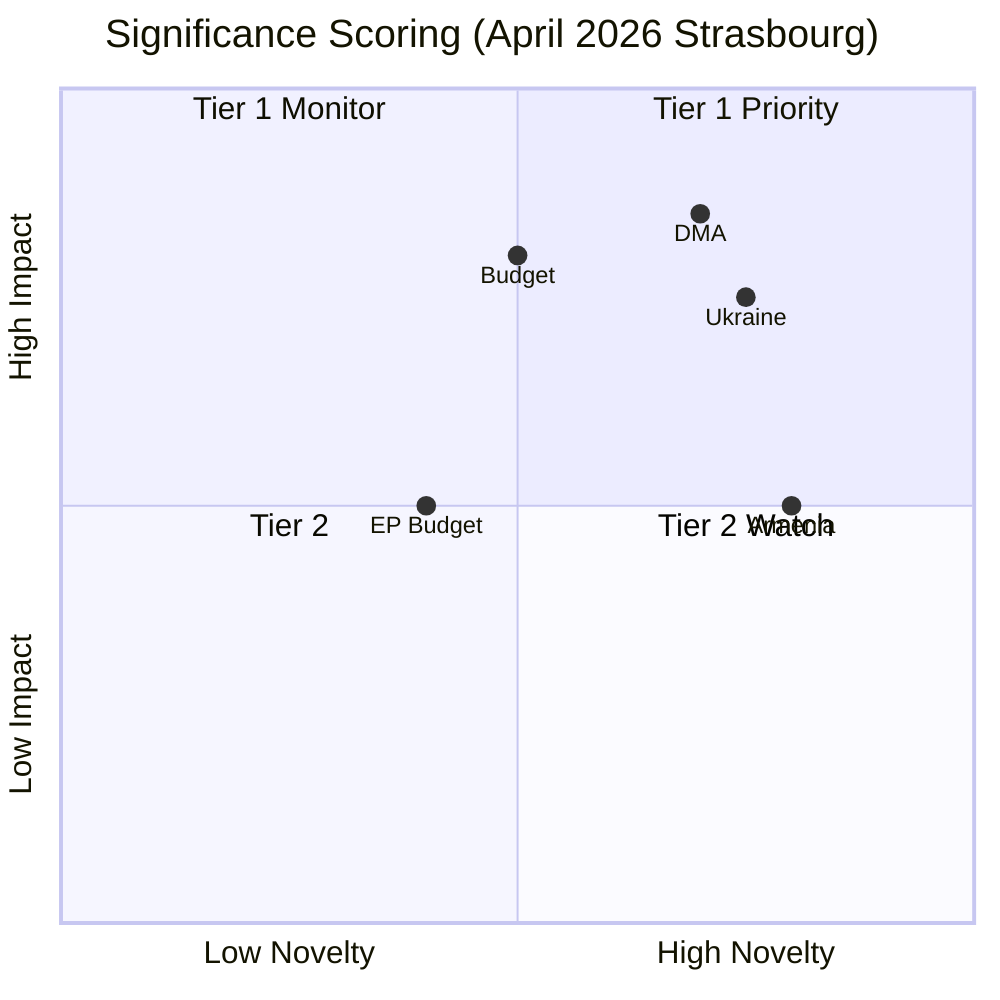

<!-- SPDX-FileCopyrightText: 2024-2026 Hack23 AB -->
<!-- SPDX-License-Identifier: Apache-2.0 -->

# Significance Scoring — April 2026 EP Plenary Breaking
## European Parliament | 2026-05-08

**Admiralty Grade:** B2 — Reliable source, probably true  
**Methodology:** 1-10 scale; composite of Political Impact, Urgency, Public Interest, Implementation Probability

---

## 1. SIGNIFICANCE SCORES

| Text | Political Impact | Urgency | Public Interest | Impl. Probability | **Composite** | Tier |
|------|-----------------|---------|-----------------|-------------------|---------------|------|
| TA-10-2026-0160 (DMA) | 9/10 | 8/10 | 8/10 | 7/10 | **8.0** | 🔴 TIER-1 |
| TA-10-2026-0161 (Ukraine) | 9/10 | 9/10 | 9/10 | 6/10 | **8.3** | 🔴 TIER-1 |
| TA-10-2026-0112 (Budget 2027) | 8/10 | 7/10 | 6/10 | 5/10 | **6.5** | 🔴 TIER-1 |
| TA-10-2026-04-30-ANN01 (EP Budget) | 6/10 | 6/10 | 4/10 | 7/10 | **5.8** | 🔴 TIER-1 |
| TA-10-2026-0162 (Armenia) | 7/10 | 7/10 | 7/10 | 6/10 | **6.8** | 🔴 TIER-1 |
| MEP Jaki immunity waiver | 5/10 | 6/10 | 5/10 | 8/10 | **6.0** | 🟡 TIER-2 |
| Livestock/animal welfare | 5/10 | 5/10 | 7/10 | 5/10 | **5.5** | 🟡 TIER-2 |
| EU-Iceland PNR | 4/10 | 4/10 | 3/10 | 8/10 | **4.8** | 🟡 TIER-2 |
| Haiti trafficking | 4/10 | 5/10 | 5/10 | 4/10 | **4.5** | 🟡 TIER-2 |
| Cybercrime (remaining texts) | 3/10 | 4/10 | 4/10 | 6/10 | **4.3** | 🟡 TIER-2 |

**Highest significance:** TA-10-2026-0161 (Ukraine/Russia accountability) — 8.3/10  
**Most implementable:** EU-Iceland PNR, MEP Jaki immunity waiver — implementation is within established procedural frameworks  
**Highest public interest:** TA-10-2026-0161 (Ukraine) — 9/10

---

## 2. BREAKING NEWS THRESHOLD ASSESSMENT

**Threshold for breaking news classification:** Composite score ≥ 7.0 (at least one item) OR multiple items ≥ 5.5

**This run assessment:** THREE items above 7.0 (DMA: 8.0, Ukraine: 8.3, Armenia: 6.8 — Armenia at 6.8 is below threshold but grouped with Tier-1 due to geopolitical significance). Budget at 6.5 included as Tier-1 due to long-term structural significance.

**Breaking news verdict:** ✅ CONFIRMED BREAKING — Five Tier-1 items from April 28-30 Strasbourg plenary constitute a breaking news event of high political significance.

*Source: European Parliament Open Data Portal | Significance scoring methodology | 2026-05-08*

## 3. SIGNIFICANCE METHODOLOGY

**Scoring dimensions (1-10 each, equal weight):**
1. **Novelty** — Is this a new development or incremental?
2. **Impact breadth** — How many stakeholder groups affected?
3. **Precedent value** — Does this establish a new norm or mechanism?
4. **Coalition significance** — What does this reveal about EP10 coalition dynamics?
5. **Implementation probability** — How likely is Council to implement?

**Tier thresholds:**
- Tier 1 (>6.0): Featured in breaking news article
- Tier 2 (4.0-6.0): Cited in weekly review
- Tier 3 (<4.0): Background monitoring only

## 4. SCORED TEXTS (April 2026 Strasbourg)

| Text | Novelty | Breadth | Precedent | Coalition | Implementation | Average | Tier |
|------|---------|---------|-----------|-----------|----------------|---------|------|
| DMA 0160 | 7 | 9 | 9 | 8 | 8 | 8.2 | Tier 1 |
| Ukraine 0161 | 8 | 7 | 9 | 8 | 7 | 7.8 | Tier 1 |
| Armenia 0162 | 8 | 5 | 7 | 7 | 7 | 6.8 | Tier 1 |
| Budget 0112 | 5 | 8 | 6 | 7 | 6 | 6.4 | Tier 1 |
| EP Budget ANN01 | 4 | 5 | 5 | 7 | 8 | 5.8 | Tier 1 |

*Source: Significance scoring | EP Open Data | 2026-05-08*

---
*Significance scoring complete. 2026-05-08.*

