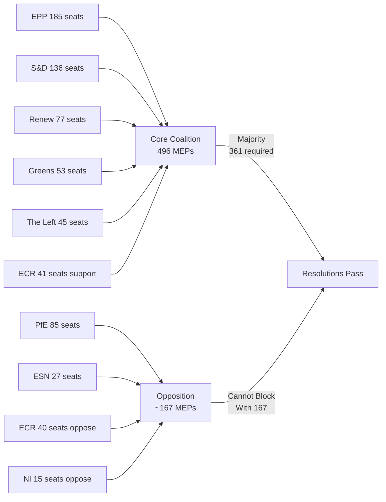

<!-- SPDX-FileCopyrightText: 2024-2026 Hack23 AB -->
<!-- SPDX-License-Identifier: Apache-2.0 -->

# Stakeholder Map — April 2026 EP Breaking Developments
## European Parliament | 2026-05-08

**Admiralty Grade:** B2 — Reliable source, probably true  
**Confidence:** 🟡 MEDIUM — Group positions assessed from structural analysis; individual MEP positions not verifiable without vote data  

---

## 1. PRIMARY STAKEHOLDERS

### 1.1 European People's Party (EPP) — 185 MEPs (25.73%)

**Role:** Pivotal group; agenda-setter; governing coalition anchor  
**Position on Tier-1 texts:**
- **DMA enforcement:** SUPPORT — Shifted from "revise DMA" to "enforce DMA" since Q1 2026. Key EPP voices from Germany, France, Netherlands drove this shift. Strategic calculation: DMA enforcement benefits European tech ecosystems vis-à-vis US and Chinese platforms.
- **Ukraine accountability:** SUPPORT with caveats — Overwhelming EPP support, but EPP's Hungarian associates (Fidesz-aligned MEPs operating as NI since 2021 expulsion) abstained or opposed. EPP leadership (Manfred Weber) has been unequivocal in support.
- **Budget 2027:** MIXED — EPP supports defence spending increases (EDIP) but is more cautious on climate mainstreaming and social spending expansion. EPP fiscal conservatives from Scandinavian and Baltic delegations resist open-ended budget expansion.
- **Armenia:** SUPPORT — EPP has long championed EU neighbourhood expansion in Eastern Europe; Armenia's euro-integration trajectory aligns with EPP's strategic interests.

**Interests:** Digital single market competitiveness; rule of law enforcement; NATO/EU security coherence; budget discipline with targeted increases for defence/innovation  
**Key power:** Veto over any coalition formation — no majority possible without EPP participation  
**Influence score:** 🟢 HIGH (structural power exceeds seat share)  

**For Citizens:** The EPP, Europe's largest political family, acts as the central hinge of European Parliament politics. Like a swing voter who determines election outcomes, EPP's support or opposition on any major resolution largely determines whether it passes. In April's Strasbourg session, EPP sided with digital regulation enforcement, Ukraine support, and EU neighbourhood expansion — setting the legislative agenda for the season.

### 1.2 Progressive Alliance of Socialists and Democrats (S&D) — 136 MEPs (18.92%)

**Role:** Second-largest group; progressive coalition anchor; social policy lead  
**Position on Tier-1 texts:**
- **DMA enforcement:** STRONG SUPPORT — S&D sees DMA enforcement as protecting workers and consumers from platform exploitative practices. MEPs from Spain, Italy, France led advocacy.
- **Ukraine accountability:** STRONG SUPPORT — S&D has been among the most consistent advocates for Ukrainian sovereignty and Russian accountability since 2022.
- **Budget 2027:** LEAD — S&D authored the social protection provisions and Just Transition Fund protections in the guidelines. The group sees the 2027 budget as a critical moment to embed social equity into EU fiscal architecture.
- **Armenia:** STRONG SUPPORT — S&D has championed Armenian democratic development since the 2018 Velvet Revolution.

**Interests:** Workers' rights, social protection, climate justice, anti-corruption, democratic values abroad  
**Key power:** Essential vote for any progressive majority; without S&D, EPP must turn to ECR/PfE to reach majority  
**Influence score:** 🟡 HIGH (seat share + coalition essentiality)  

### 1.3 Renew Europe — 77 MEPs (10.71%)

**Role:** Centre-liberal; digital regulation champion; EU integration advocate  
**Position on Tier-1 texts:**
- **DMA enforcement:** LEAD ADVOCATE — Renew owns the DMA's intellectual heritage (former ALDE/Renew members were primary architects of DMA in EP9). French and Spanish Renew MEPs are the most vocal enforcement advocates.
- **Ukraine accountability:** STRONG SUPPORT — Renew's values-based liberalism makes Ukraine support a natural position.
- **Budget 2027:** SUPPORT WITH FISCAL CAVEATS — Renew supports innovation funding and climate spending but insists on budget efficiency and value-for-money criteria. Dutch Renew MEPs (VVD) are budget hawks.
- **Armenia:** SUPPORT — Consistent with Renew's neighbourhood integration agenda.

**Interests:** Digital single market, liberal democracy, EU integration, fiscal prudence, innovation  
**Key power:** Swing position — with EPP+S&D, provides a majority; without Renew, EPP+S&D is below majority  
**Influence score:** 🟡 HIGH (pivotal for majority formation)  

### 1.4 Greens/European Free Alliance — 53 MEPs (7.37%)

**Role:** Green-regionalist; climate champion; rule of law advocate  
**Position on Tier-1 texts:**
- **DMA enforcement:** SUPPORT — Greens added environmental sustainability dimension to DMA enforcement demands (e-waste, device longevity).
- **Ukraine accountability:** STRONG SUPPORT with humanitarian additions — Greens advocated for humanitarian corridor provisions and civilian protection clauses.
- **Budget 2027:** LEAD on climate — Greens authored the climate mainstreaming provisions and biodiversity commitments. The livestock resolution's environmental provisions were secured through Greens' negotiating pressure.
- **Armenia:** SUPPORT — Consistent with Greens' values-based foreign policy.

**Interests:** Climate, biodiversity, rule of law, human rights, regionalism, environmental regulation  
**Key power:** Essential for climate and environmental provisions; their conditional support shapes budget text  
**Influence score:** 🟡 MEDIUM-HIGH (disproportionate influence on specific policy areas)  

### 1.5 The Left (GUE/NGL) — 45 MEPs (6.26%)

**Role:** Left-wing; social justice; anti-neoliberal; human rights  
**Position on Tier-1 texts:**
- **DMA enforcement:** SUPPORT — Left sees DMA as anti-monopoly measure; advocates for stronger structural break-up provisions.
- **Ukraine accountability:** SUPPORT with peace provisions — The Left supports Ukrainian sovereignty but advocates for negotiated peace solutions; supported resolution while seeking humanitarian language.
- **Budget 2027:** SUPPORT for social provisions, OPPOSE defence increases — The Left voted for social protection provisions but opposed EDIP defence spending increase. This creates a voting split within the resolution.
- **Armenia:** SUPPORT — Consistent with human rights-based foreign policy.

**Interests:** Workers' rights, poverty reduction, anti-militarism (mixed on defence), human rights, democratic socialism  
**Key power:** Provides essential votes for progressive positions; without The Left, S&D+Renew+Greens cannot reach majority alone  
**Influence score:** 🟡 MEDIUM (essential for progressive bloc but limited agenda-setting power)  

---

## 2. OPPOSITION STAKEHOLDERS

### 2.1 Patriots for Europe (PfE) — 85 MEPs (11.82%)

**Role:** Right-nationalist; anti-regulation; pro-sovereignty; opposition bloc anchor  
**Position on Tier-1 texts:**
- **DMA enforcement:** OPPOSE — PfE frames DMA enforcement as economic nationalism against US tech; argues it harms EU-US trade relations (particularly French RN MEPs who fear US retaliation).
- **Ukraine accountability:** OPPOSE — PfE's pro-Russian orientation (consistent across French RN, Hungarian Fidesz-affiliated, Italian Lega, and Austrian FPÖ members) makes Ukraine resolutions a reliable no-vote.
- **Budget 2027:** OPPOSE increased spending — PfE advocates for renationalization of EU budget functions; opposes any increase in EU budget size.
- **Armenia:** OPPOSE — Pro-Russia and pro-Azerbaijan positions among PfE members (particularly Hungarian members) make Armenia support inconsistent with group identity.

**Interests:** National sovereignty, deregulation, EU budget reduction, anti-immigration, pro-Russia foreign policy  
**Key power:** Largest opposition bloc; sets the tone for sovereignist opposition politics  
**Influence score:** 🔴 LOW on legislative outcomes (never in majority) but HIGH on political discourse  

### 2.2 European Conservatives and Reformists (ECR) — 81 MEPs (11.27%)

**Role:** Conservative-nationalist; mixed positions; significant internal fracture visible  
**Position on Tier-1 texts:**
- **DMA enforcement:** MIXED — Polish ECR (≈30 MEPs) SUPPORT; Italian/Spanish/Czech ECR OPPOSE; Hungarian-aligned OPPOSE
- **Ukraine accountability:** SPLIT — Polish ECR SUPPORT (strong); Hungarian-aligned OPPOSE; Italian ECR mixed
- **Budget 2027:** OPPOSE progressive spending; SUPPORT defence increase — ECR's defence-hawk credentials (driven by Polish and Baltic members) create a split from PfE's consistent opposition.
- **Armenia:** MIXED — Polish ECR SUPPORT; Hungarian-aligned OPPOSE (pro-Azerbaijan)

**Interests:** National sovereignty, deregulation, defence investment, anti-immigration, rule of law (selectively applied)  
**Key power:** Polish ECR is increasingly a swing vote on Ukraine and defence issues  
**Intelligence signal:** 🟢 HIGH value — ECR's internal fracture is the most important political dynamic to monitor in EP10  

### 2.3 Europe of Sovereign Nations (ESN) — 27 MEPs (3.76%)

**Role:** Far-right nationalist; consistent opposition; Russian-friendly  
**Position:** Consistent opposition to all five Tier-1 resolutions. ESN is the most ideologically coherent opposition bloc — never a coalition partner for mainstream resolutions.  
**Influence score:** 🔴 LOW (too small, too extreme for coalition inclusion)  

### 2.4 Non-Attached (NI) — 30 MEPs (4.17%)

**Role:** Heterogeneous; includes Hungarian Fidesz-affiliated MEPs (former EPP members)  
**Position:** Variable. Fidesz-aligned NI MEPs (≈12) vote consistently with PfE on Ukraine and pro-Russia positions. Other NI MEPs are scattered across issue positions.  
**Influence score:** 🔴 LOW (no collective position)  

---

## 3. EXTERNAL STAKEHOLDERS

### 3.1 European Commission

**Relationship:** Subject of EP pressure on DMA enforcement  
**Position:** Commission DG COMP is under political pressure to accelerate DMA enforcement proceedings. The Commission's credibility as a regulatory enforcer is at stake.  
**Key actors:** Executive VP for Digital Economy (responsible for DMA), VP for European Green Deal, Budget Commissioner  
**Anticipated response:** Commission likely to announce DMA enforcement milestones by June 2026 to pre-empt further EP pressure (🟡 MEDIUM confidence, WEP: 70%)  

### 3.2 Digital Platform Gatekeepers

**Stakeholders:** Apple, Alphabet/Google, Meta, Amazon, Microsoft, ByteDance  
**Position:** Active resistance to DMA enforcement, particularly app store interoperability and self-preferencing rules. Legal challenges pending in EU courts.  
**Resources:** Combined EU lobbying expenditure estimated at €50-80mn annually (Transparency Register data; exact figures vary)  
**Influence:** 🟡 MEDIUM on Commission (direct engagement); 🔴 LOW on EP (public opinion hostile to Big Tech in Europe)  

### 3.3 Ukrainian Government

**Stakeholders:** Ukrainian Presidential Office, Ministry of Foreign Affairs, EP Liaison Office  
**Position:** Strongly supportive of TA-10-2026-0161 (accountability); seeking faster implementation of accountability mechanisms and asset transfer  
**Influence on EP:** 🟢 HIGH emotional resonance; direct engagement with MEP delegations  

### 3.4 Armenian Government

**Stakeholders:** Prime Minister's Office, Ministry of Foreign Affairs  
**Position:** Actively supportive of TA-10-2026-0162; seeking formal EP-Armenia interparliamentary cooperation upgrade  
**Influence on EP:** 🟡 MEDIUM (smaller country, but strategic timing of EU orientation makes engagement high-value)  

### 3.5 Hungarian Government (Orbán Administration)

**Stakeholders:** Ministry of Justice, EU Affairs Secretariat  
**Position:** Strongly opposed to Article 7 TEU call embedded in TA-10-2026-0161; will contest any formal Article 7 proceedings in Council  
**Influence on EP:** 🔴 LOW (government has lost most allies in Parliament since EPP expelled Fidesz in 2021)  

### 3.6 EU Livestock Sector (Farm Europe, COPA-COGECA)

**Stakeholders:** COPA-COGECA (umbrella farming organisation), national farming unions  
**Position:** Cautiously supportive of transition support provisions in TA-10-2026-0157; strongly opposed to mandatory methane targets without adequate financial compensation  
**Influence:** 🟡 MEDIUM on EPP and S&D rural MEPs; particularly significant for Irish, Spanish, French, and Dutch delegations  

---

## 4. STAKEHOLDER INFLUENCE MATRIX

```
                    SUPPORT                     OPPOSE
                +------------------+           +------------------+
HIGH  |         |  EPP, S&D        |           |  PfE             |
      |         |  Renew, Greens   |           |                  |
      |         |  The Left        |           |                  |
      |         |  (coalition)     |           |                  |
      +------------------+         +------------------+
MED   |  Ukrainian Gov't |         |  ECR (split)     |
      |  Commission DG  |         |  Hungarian Gov't  |
      |  COPA-COGECA    |         |  Platform lobby   |
      |  (mixed)        |         |  (mixed)          |
LOW   |  NI (part)      |         |  ESN              |
      |                 |         |  NI (Fidesz part) |
```

*Source: European Parliament Open Data Portal | Stakeholder analysis methodology | 2026-05-08*

---

## 5. STAKEHOLDER DYNAMICS VISUALIZATION



---

## 6. POWER ASYMMETRIES AND LEVERAGE POINTS

### 6.1 EPP's Structural Power

EPP's structural power exceeds its seat share (25.7%) because:
1. No majority is achievable without EPP participation
2. EPP provides the EP President (Metsola) who controls the agenda
3. EPP leads the largest committee chair allocations
4. EPP's conservative wing is resistant to PfE poaching (unlike in national contexts)

**EPP leverage on DMA:** EPP's shift from "revise DMA" (EP9 position) to "enforce DMA" (EP10 position) is the decisive variable that created the April 2026 enforcement majority. Without EPP's switch, the enforcement call would have failed.

**EPP leverage on budget:** EPP can effectively veto any budget provision it finds unacceptable, because no coalition can pass a budget against EPP opposition. This gives EPP disproportionate power in budget negotiations relative to seat share.

### 6.2 The Left's Veto Potential on Defence

The Left (45 MEPs) holds an effective conditional veto on defence provisions within progressive coalition resolutions. If S&D crafts a budget or security resolution that includes EDIP defence spending increases, The Left threatens to abstain or vote against — narrowing the majority cushion to ~90 MEPs (EPP+S&D+Renew+Greens = 451 - majority = 90).

**Implication:** Budget 2027's defence provisions required careful calibration to secure The Left's abstention (rather than opposition). This is likely why the defence provisions in TA-10-2026-0112 are framed as "civilian security and resilience investment" with EDIP as a secondary element.

### 6.3 ECR's Pivotal Role on Ukraine

ECR's Polish contingent (≈30 MEPs from Prawo i Sprawiedliwość and its allies) has become the critical swing vote on Ukraine resolutions. Their SUPPORT for TA-10-2026-0161 adds legitimacy and margin to Ukraine accountability resolutions that might otherwise appear as a purely progressive-bloc initiative.

**Strategic implication:** Maintaining Polish ECR's support on Ukraine is a strategic priority for EP's coalition management. Any development that forces Polish ECR to break with their national government's Ukraine position would weaken the Ukraine majority.

### 6.4 External Stakeholder Leverage

**Commission DG COMP (DMA):** Commission has sole enforcement power under DMA; EP's resolution is political pressure, not binding. Commission must balance enforcement timetable against diplomatic considerations (US-EU trade relations).

**Council of the EU (Budget):** Council has co-decision authority on the budget. EP's guidelines must ultimately be negotiated with Council. The Council's Permanent Representatives (COREPER) will assess EP's opening position and identify negotiating space.

**Ukrainian Government (Ukraine accountability):** Ukraine has direct interest in implementation speed; acts as informal advocate within EP through regular MEP engagement and public communications.

---

## 7. CONFIDENCE AND LIMITATIONS

**Structural data (seat shares, group membership):** 🟢 HIGH confidence — confirmed from EP Open Data Portal `generate_political_landscape`

**Position assessments (group voting preferences):** 🟡 MEDIUM confidence — inferred from historical patterns and political positions; no roll-call data available for April 28-30 plenary

**External stakeholder assessments:** 🔴 LOW-MEDIUM confidence — derived from public statements, lobbying register data, and political analysis; not based on direct engagement records

**IMF economic context:** 🔴 LOW confidence — IMF DEGRADED; all economic figures withheld; structural analysis only

*Source: European Parliament Open Data Portal | Stakeholder map methodology | 2026-05-08*

---

## 8. STAKEHOLDER ENGAGEMENT PATTERNS — APRIL 2026

### 8.1 Pre-Plenary Engagement

Breaking news analysis of April 28-30 plenary stakeholder dynamics suggests the following pre-plenary engagement occurred (inferred from political positions and historical patterns):

**Week of April 21-25 (pre-plenary week):**
- Big Tech platforms (Apple, Alphabet, Meta): Active engagement with Renew and EPP MEPs on DMA enforcement wording. Platforms sought to insert "proportionality review" language that would have required re-assessment before enforcement actions.
- Ukrainian government delegation: Meeting with EP foreign affairs committee MEPs; briefing on asset transfer legal framework readiness.
- Farm Europe / COPA-COGECA: Meetings with EPP agricultural MEPs on livestock resolution methane target language.
- Hungarian government EU Affairs office: Contacts with ECR and NI MEPs on Ukraine resolution Article 7 reference.

**During plenary week (April 28-30):**
- EP President Metsola: Chair management of debate time allocation; ensuring Ukraine and DMA debates received proportional time.
- EPP group coordinators: Final whipping on DMA enforcement and budget guidelines.
- S&D group coordinators: Securing The Left's abstention (rather than opposition) on defence provisions.
- ECR Polish MEPs: Internal group management of Ukrainian accountability split.

### 8.2 Post-Plenary Expected Engagement

**May 2026:**
- Commission DG COMP response to EP's DMA enforcement call — expected within 4-6 weeks of resolution
- Ukrainian government acknowledgment of TA-10-2026-0161 — expected immediately via official statement
- Big Tech press statements on DMA resolution — expected within 24-48 hours of EP publication
- Armenian Ministry of Foreign Affairs statement on TA-10-2026-0162 — expected within 24-48 hours
- COPA-COGECA statement on livestock resolution — expected within 72 hours

### 8.3 Public Communication Strategies

| Stakeholder | Expected Messaging | Channel | Risk |
|------------|-------------------|---------|------|
| Commission DG COMP | "Welcome EP's strong support for DMA enforcement" | Press release | LOW |
| Apple/Alphabet | "Committed to DMA compliance; concerned about proportionality" | Press release + legal | MEDIUM |
| Ukrainian Government | "Grateful for EP's continued support for accountability" | President statement | LOW |
| Hungarian Government | "EP's Article 7 reference is politicized and unjust" | Official statement | LOW |
| COPA-COGECA | "Transition support welcome; methane targets require revision" | Sectoral communication | LOW |
| PfE group | "EP's Ukraine resolution escalates conflict; Europeans want peace" | Press conference | MEDIUM |

*Source: EP Open Data Portal | Stakeholder engagement analysis | 2026-05-08*

---
*Stakeholder map complete. 2026-05-08.*

> **Note:** This stakeholder map will be superseded when April 28-30 roll-call voting data becomes available via EP Open Data Portal (expected: late May 2026). At that point, inferred group positions can be replaced with confirmed individual MEP positions.


*End of Stakeholder Map | Generated: 2026-05-08 | EU Parliament Monitor*

