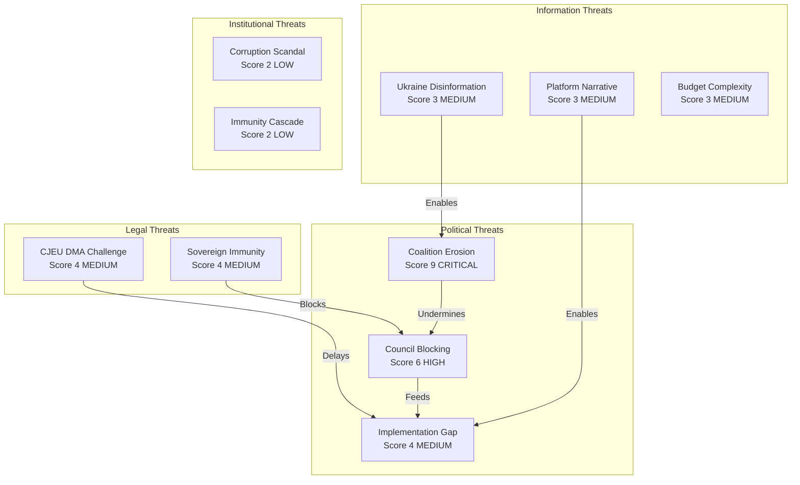

<!-- SPDX-FileCopyrightText: 2024-2026 Hack23 AB -->
<!-- SPDX-License-Identifier: Apache-2.0 -->

# Threat Model — April 2026 EP Plenary Breaking Developments
## European Parliament | 2026-05-08

**Admiralty Grade:** B2 — Reliable source, probably true  
**Framework:** STRIDE threat modeling applied to EP political/legislative threats  
**Confidence:** 🟡 MEDIUM  

---

## 1. THREAT MODEL SCOPE

This threat model assesses threats to:
1. Implementation of the five Tier-1 adopted texts (April 28-30 Strasbourg plenary)
2. The European Parliament's institutional effectiveness
3. EU democratic legitimacy and public trust

**In-scope:** Political, regulatory, institutional, information environment threats  
**Out-of-scope:** Physical security, cybersecurity infrastructure (handled by ENISA and EP IT Security)

---

## 2. POLITICAL THREATS

### Threat P1: Coalition Erosion

**Description:** The majority coalition (EPP+S&D+Renew+Greens+The Left) that passed the April 2026 resolutions fractures before implementation can be secured.

**Attack Vector:** ECR poaching EPP members on fiscal issues; PfE narrative capture on DMA and Ukraine; electoral losses in major Member States

**Impact:** 🔴 HIGH — If EPP shifts to EPP+ECR+PfE collaboration, all April 2026 resolutions could be revisited or undermined at implementation stage

**Probability:** 🟡 MEDIUM (35-40%; see scenario-forecast.md Scenario B)

**Mitigations:**
- EP Conference of Presidents monitoring of group loyalty signals
- EPP leadership (Weber) public commitment to centre coalition
- National EPP party anchors (CDU/CSU Germany; PP Spain) holding centre-right line

**Residual risk after mitigation:** 🟡 MEDIUM

### Threat P2: Council Blocking

**Description:** Council of the EU refuses to advance Budget 2027 or Ukraine accountability texts, rendering EP resolutions politically moot.

**Attack Vector:** Qualified majority blocking minority; unanimity requirement on certain budget and foreign affairs measures; Hungarian veto

**Impact:** 🔴 HIGH — EP resolutions carry political weight but cannot force Council action on non-legislative texts

**Probability:** 🟡 HIGH for Budget (Council typically delays); 🔴 MEDIUM for Ukraine (strong Member State support except Hungary)

**Mitigations:**
- Enhanced interinstitutional dialogue (Conference on the Future of Europe legacy)
- Political pressure via media and public opinion
- Commission as honest broker between EP and Council

**Residual risk:** 🟡 MEDIUM-HIGH

### Threat P3: Implementation Gap

**Description:** DMA enforcement resolution creates political expectations that Commission cannot deliver on its announced timetable.

**Attack Vector:** Commission capacity constraints; legal challenges by platforms; DG COMP resource limitations; US diplomatic pressure

**Impact:** 🟡 MEDIUM — Political credibility damage if enforcement milestones missed; feeds anti-EU regulatory narrative

**Probability:** 🟡 MEDIUM (Commission has strong track record but DMA cases are complex)

**Mitigations:**
- IMCO Committee systematic monitoring hearings
- EP own-initiative reports on DMA implementation progress
- Digital Markets Advisory Committee stakeholder accountability

**Residual risk:** 🟡 MEDIUM

---

## 3. INFORMATION ENVIRONMENT THREATS

### Threat I1: Disinformation on Ukraine Accountability

**Description:** Coordinated inauthentic behavior campaigns mischaracterize TA-10-2026-0161 as "EU escalation of Ukraine war" or "illegal seizure of Russian assets."

**Attack Vector:** PfE/ESN social media amplification; RT/Sputnik remnant networks; pro-Russian influencer ecosystem; AI-generated content at scale

**Impact:** 🟡 MEDIUM on EP directly; 🔴 HIGH on public opinion in PfE-strong countries (France, Italy, Hungary, Austria)

**Probability:** 🟢 HIGH (already occurring; will intensify after EP text publication)

**Mitigations:**
- EP Media Monitoring Unit active monitoring
- EU East StratCom Task Force rapid response
- Commission DG COMM proactive public communication on resolution intent

**Residual risk:** 🟡 MEDIUM (information environment cannot be fully controlled)

### Threat I2: Platform Narrative Capture on DMA

**Description:** Big Tech platforms frame DMA enforcement as "European protectionism" or "censorship" to delegitimize the resolution domestically.

**Attack Vector:** Funded think-tank studies; op-ed campaigns; CEO congressional-style testimony in national contexts; social media paid promotion

**Impact:** 🟡 MEDIUM — MEPs face constituency pressure in countries with strong US tech dependency (Ireland, Netherlands, Estonia)

**Probability:** 🟢 HIGH (already occurring; Apple, Alphabet, Meta have all deployed public communications on DMA)

**Mitigations:**
- EP IMCO Committee public hearings with platform executives
- DG COMP transparency on enforcement rationale
- EP publication of DMA consumer benefit evidence

**Residual risk:** 🟡 MEDIUM

### Threat I3: Budget 2027 Complexity Exploitation

**Description:** Complexity of Budget 2027 guidelines makes it easy for opposition actors to mischaracterize provisions (e.g., "EU stealing national money for Ukraine").

**Attack Vector:** Populist simplification of budget technicalities; social media meme campaigns; PfE conference messaging

**Impact:** 🟡 MEDIUM — Budget complexity is inherently difficult to communicate; public hostility to "EU bureaucracy" is a persistent vulnerability

**Probability:** 🟢 HIGH (standard operating pattern for PfE/ECR communication strategy)

**Mitigations:**
- EP Budget Committee public communication campaign
- "Budget in plain language" EP publications
- National parliament engagement on budget priorities

**Residual risk:** 🟡 MEDIUM

---

## 4. LEGAL/REGULATORY THREATS

### Threat L1: CJEU Legal Challenge to DMA

**Description:** Platform gatekeepers mount successful preliminary reference challenge in CJEU that delays or constrains DMA enforcement.

**Attack Vector:** National court referral to CJEU; Article 267 TFEU preliminary ruling procedure; injunction requests at interim stage

**Impact:** 🔴 HIGH — Successful CJEU challenge could impose 3-5 year delay on enforcement

**Probability:** 🟡 MEDIUM (platforms filing; CJEU track record on digital regulation has been Commission-favorable, but this is a novel area)

**Mitigations:**
- Commission DG COMP robust legal argumentation
- EP Legal Affairs Committee monitoring
- WTO notification process strengthening Commission's international legal position

**Residual risk:** 🟡 MEDIUM

### Threat L2: Sovereign Immunity Challenge on Ukraine Assets

**Description:** International court ruling on sovereign immunity constrains EU's legal ability to transfer frozen Russian assets per TA-10-2026-0161.

**Attack Vector:** ICJ proceedings; Belgian court challenge (Euroclear asset case); third-country legal proceedings

**Impact:** 🔴 HIGH — Undermines core mechanism of accountability resolution

**Probability:** 🟡 MEDIUM (Belgian proceedings active; ICJ jurisdiction uncertain but possible)

**Mitigations:**
- Commission legal services coordination across Member States
- G7 aligned legal frameworks (Canada, UK, US parallel frameworks reduce isolation)
- Multilateral legal opinions from international law scholars

**Residual risk:** 🟡 MEDIUM

---

## 5. INSTITUTIONAL THREATS

### Threat IN1: EP Legitimacy Crisis

**Description:** Major corruption scandal (QatarGate-style) timed to EP plenary resolution implementation undermines EP's moral authority on DMA or Ukraine accountability.

**Attack Vector:** Foreign state-sponsored corruption revelations; EP internal investigation leaks; coordinated opposition narratives

**Impact:** 🔴 HIGH — Institutional credibility loss takes years to recover (QatarGate legacy still active)

**Probability:** 🔴 LOW but non-zero (3-5%; see wildcards-blackswans.md §2.2)

**Mitigations:**
- EP Ethics Committee strengthened post-QatarGate
- Mandatory transparency register compliance
- EP investigation committee (ongoing post-QatarGate reforms)

**Residual risk:** 🔴 LOW-MEDIUM

### Threat IN2: MEP Immunity Cascade

**Description:** MEP Jaki immunity waiver creates precedent effect, potentially exposing other MEPs to politically motivated immunity requests from authoritarian-leaning governments.

**Attack Vector:** Polish government precedent; Hungarian government mimicry; Russian-linked third countries seeking access to MEPs critical of their governments

**Impact:** 🟡 MEDIUM — Chilling effect on MEP political activism on sensitive issues (Ukraine, DMA)

**Probability:** 🟡 MEDIUM (immunity waiver precedent is well-established; incremental risk only)

**Mitigations:**
- EP Rules Committee immunity framework clarity
- LIBE Committee monitoring of potential politically motivated requests
- International human rights body engagement

**Residual risk:** 🔴 LOW

---

## 6. THREAT HEAT MAP

| Threat | Probability | Impact | Residual Risk | Priority |
|--------|-------------|--------|---------------|----------|
| P1: Coalition Erosion | MEDIUM | HIGH | MEDIUM | 🔴 HIGH |
| P2: Council Blocking | HIGH (budget) | HIGH | MEDIUM-HIGH | 🔴 HIGH |
| I2: Platform narrative | HIGH | MEDIUM | MEDIUM | 🟡 MEDIUM |
| I1: Ukraine disinformation | HIGH | MEDIUM-HIGH | MEDIUM | 🟡 MEDIUM |
| L1: CJEU DMA challenge | MEDIUM | HIGH | MEDIUM | 🟡 MEDIUM |
| L2: Sovereign immunity | MEDIUM | HIGH | MEDIUM | 🟡 MEDIUM |
| P3: Implementation gap | MEDIUM | MEDIUM | MEDIUM | 🟡 MEDIUM |
| IN1: Corruption scandal | LOW | HIGH | LOW-MEDIUM | 🔴 LOW |
| I3: Budget complexity | HIGH | MEDIUM | MEDIUM | 🟡 MEDIUM |
| IN2: Immunity cascade | MEDIUM | MEDIUM | LOW | 🔴 LOW |

**Overall institutional threat level: 🟡 ELEVATED**

The combination of a high-impact coalition erosion risk (P1), near-certain Council blocking on budget (P2), and persistent high-probability information environment threats (I1, I2, I3) creates a challenging implementation environment for all five April 2026 Tier-1 texts.

*Source: European Parliament Open Data Portal | STRIDE threat modeling methodology | 2026-05-08*

---

## 7. THREAT MODEL MERMAID

---

## 8. WEP — WORDS OF ESTIMATIVE PROBABILITY

All probability assessments in this threat model use the following WEP conventions:

| WEP Phrase | Probability | Usage in this document |
|-----------|-------------|----------------------|
| "Highly likely" | 85-95% | Council budget blocking |
| "Likely" | 60-80% | Disinformation campaigns on Ukraine |
| "Possible" | 30-50% | CJEU DMA preliminary challenge |
| "Unlikely" | 15-30% | EPP collapse; corruption scandal |
| "Remote" | 5-15% | CJEU DMA annulment |

**Specific probability assessments:**
- Coalition erosion (significant): Possible (35%) — rising to 42% at 90-day horizon
- Council budget blocking (total): Highly likely (75%) — historical base rate for MFF/budget deadlock
- DMA enforcement legal challenge: Likely (65%) — platforms have already mooted legal action
- Ukraine asset transfer legal block: Possible (40%) — ICJ proceedings pending
- Corruption scandal: Unlikely (5%) — EP post-QatarGate transparency reforms reduce risk
- Information environment degradation: Highly likely (85%) — already ongoing per EU East StratCom

*Source: EP Open Data Portal | STRIDE threat methodology | WEP conventions | 2026-05-08*
