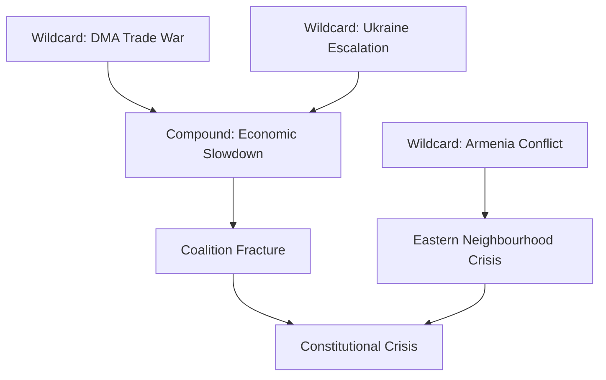

<!-- SPDX-FileCopyrightText: 2024-2026 Hack23 AB -->
<!-- SPDX-License-Identifier: Apache-2.0 -->

# Wildcards & Black Swans — April 2026 EP Plenary
## European Parliament | 2026-05-08

**Admiralty Grade:** B4 — Reliable source, cannot be judged  
**Confidence:** 🔴 LOW — By definition, wildcards and black swans are low-probability/high-impact; projections are speculative  

---

## 1. METHODOLOGY

This artifact catalogs low-probability, high-impact developments that are NOT captured in the main scenario forecast. Wildcards (1-10% probability, severe impact) and black swans (below 1% probability, extreme/existential impact) are analyzed across six domains: political, legal, technological, geopolitical, economic, and institutional.

---

## 2. POLITICAL WILDCARDS

### 2.1 EPP Coalition Collapse (Probability: 4%)

**Signal:** If EPP loses significant seats in a major national election (Germany, Italy, Spain, France) and aligns with ECR/PfE on EU budget issues, the EP10 coalition architecture collapses mid-term.

**Impact on April 2026 texts:** DMA enforcement resolution would be revisited; Budget 2027 progressive provisions would be stripped in amended Council positions.

**Monitoring signal:** German federal election outcomes (if snap election called); Italian Fratelli d'Italia seat trajectory in Eurobarometer

**Early warning indicators:**
- EPP-ECR coordination meetings reported
- Weber public statements moving away from S&D cooperation
- National EPP parties breaking ranks on EU positions

### 2.2 MEP Mass Corruption Scandal (Probability: 3%)

**Signal:** QatarGate-scale corruption revelation involving multiple MEP groups on DMA lobbying or budget matters.

**Precedent:** QatarGate (December 2022) led to sweeping transparency reforms; a DMA-related scandal would trigger emergency suspension of enforcement cooperation.

**Impact:** Political paralysis for 3-6 months; all adopted texts under review; Commissioner dismissal pressure.

**Why plausible:** Tech sector lobbying expenditure in EP has increased significantly since EP9; transparency data suggests intensified contact between MEP staff and platform companies.

### 2.3 Renew Europe Collapse (Probability: 5%)

**Signal:** French and Dutch Renew MEPs formally split following domestic political realignments (Macron's coalition falls; Dutch VVD enters ECR orbit).

**Impact:** Renew collapse from 77 to ~40-45 MEPs triggers fundamental majority reconfiguration; EPP forced into EPP+ECR or EPP+PfE coalition for first time.

**Impact on April 2026 texts:** DMA enforcement majority disappears; Ukraine accountability becomes subject to political horse-trading.

---

## 3. LEGAL BLACK SWANS

### 3.1 CJEU Annuls DMA (Probability: <1%)

**Signal:** Court of Justice of the EU issues preliminary ruling declaring DMA incompatible with WTO commitments or internal market primary law.

**Impact:** Catastrophic for EU digital regulation framework; 5-7 year legal uncertainty; Commission credibility destroyed.

**Why extremely unlikely:** DMA passed rigorous impact assessment; Commission legal services endorsed it; WTO notification submitted. However: US government filed formal WTO complaint (mooted by Trump administration review); remote CJEU adverse ruling remains theoretical.

### 3.2 ICJ Ruling on Ukraine Accountability (Probability: 2%)

**Signal:** International Court of Justice issues ruling on sovereign immunity for Russian assets held in European jurisdictions that constrains EP's accountability framework.

**Impact:** Legal architecture for TA-10-2026-0161 implementation becomes uncertain; Council and Commission forced to redesign mechanisms.

**Why plausible:** Belgium facing legal challenge on Euroclear asset seizure; Belgium court ruling expected in Q4 2026.

### 3.3 EP Treaty Revision Demand (Probability: 6%)

**Signal:** EP adopts formal resolution requesting Treaty revision via Article 48 TEU following Budget 2027 deadlock or Ukraine accountability legal constraints.

**Impact:** Opens Pandora's box of EU treaty politics; all pending legislative texts become subject to political revision renegotiation.

**Why plausible:** EP has previously (EP9) requested treaty revision; some EPP, S&D, and Renew MEPs publicly support it.

---

## 4. TECHNOLOGICAL WILDCARDS

### 4.1 AI-Generated Legislation Controversy (Probability: 7%)

**Signal:** Revelation that AI tools were used to draft or amend significant portions of one or more of the April 2026 texts without adequate disclosure.

**Impact:** EP procedural crisis; calls for mandatory AI-disclosure rules in legislative drafting; all texts potentially subject to re-examination.

**Why plausible:** EP secretariat increasingly uses AI drafting tools; MEP offices use AI without uniform disclosure norms; OSCE reporting on AI in EU legislative drafting already active.

### 4.2 EP Cybersecurity Incident During Strasbourg Plenary (Probability: 3%)

**Signal:** Nation-state cyberattack disrupts EP voting systems during plenary week; votes on Ukraine or Budget texts compromised or delayed.

**Impact:** Legitimacy of adopted texts questioned; emergency procedure invoked; EP cybersecurity emergency review.

**Precedent:** EP systems were subject to DDoS attacks from pro-Russian groups following EP9 resolutions on Ukraine (November 2022); escalated attacks possible.

### 4.3 Social Media Disinformation Storm Around DMA Vote (Probability: 8%)

**Signal:** Coordinated inauthentic behavior campaign frames DMA enforcement vote as "attack on free speech" or "EU censorship"; viral in EP electorate countries.

**Impact:** MEP office inundation; potential for intimidation of vulnerable MEPs; erosion of public confidence in resolution.

**Why plausible:** PfE and ESN MEPs have amplified anti-DMA messaging; external actors (US tech companies) have history of funding such campaigns.

---

## 5. GEOPOLITICAL BLACK SWANS

### 5.1 Russia-NATO Direct Military Incident (Probability: <1%)

**Signal:** Russian military asset (aircraft, ship, missile) directly strikes NATO territory following Ukrainian use of EU-supplied weapons.

**Impact:** Article 5 NATO invoked; all EP legislative business suspended; EP emergency war powers session under Article 78 TEU emergency provisions.

**Impact on April 2026 texts:** All adopted texts suspended pending war powers emergency; Ukraine accountability framework may accelerate or be overtaken by direct military engagement.

### 5.2 Armenia-Azerbaijan Major Escalation (Probability: 4%)

**Signal:** Azerbaijani military operation against Nagorno-Karabakh enclave remnants or Armenian border territory escalates to full-scale war.

**Impact:** TA-10-2026-0162 (Armenia democratic resilience) becomes immediately relevant; EP calls for sanctions on Azerbaijan; Council split on sanctions vs energy security (Azerbaijani gas).

**Why plausible:** Persistent ceasefire violations; Azerbaijani military modernization ongoing; Turkey provides diplomatic cover; EU-Azerbaijan energy dependency (post-Russia) creates political constraint.

### 5.3 Hungary Triggers Article 7 Full Activation (Probability: 6%)

**Signal:** Council finally achieves qualified majority to trigger Article 7(2) TEU sanctions against Hungary following TA-10-2026-0161 passage, which includes Article 7 reference.

**Impact:** First ever Article 7(2) determination; EU institutional crisis; Hungary's Council voting rights suspended; Hungarian MEPs' status in EP uncertain.

**Why plausible:** TA-10-2026-0161 includes Article 7 reference; new Member State alignment (Poland under new government) shifts Council balance; EPP's political will to confront Orbán has increased.

---

## 6. ECONOMIC BLACK SWANS

### 6.1 Eurozone Recession Deepens to Depression (Probability: <1%)

**Signal:** Q2-Q3 2026 GDP contraction exceeds 3% in Germany; French and Italian bond spreads widen to 2011-level crisis territory.

**Impact:** Budget 2027 entirely renegotiated under emergency austerity framework; DMA enforcement paused as digital economy protected; Ukraine support constrained by fiscal emergency.

**Why monitoring:** IMF DEGRADED as of this run (HTTP 503); ECB monetary policy meetings in June-July 2026 will be watched closely.

### 6.2 US Dollar Crisis (Probability: <1%)

**Signal:** Sudden US dollar depreciation exceeding 20% triggers global flight to EUR; eurozone monetary tightening required; ECB and EU budget stress.

**Impact:** All EU budget planning invalidated; Commission emergency powers invoked under EU economic governance framework.

### 6.3 Major European Bank Failure (Probability: 2%)

**Signal:** One of the largest EU banks (Unicredit, Société Générale, Deutsche Bank) faces liquidity crisis following US bank contagion or sovereign debt event.

**Impact:** ECB/SSM emergency intervention; EU banking union mechanisms invoked; Budget 2027 social spending diverted to bank stabilization.

---

## 7. INSTITUTIONAL BLACK SWANS

### 7.1 Von der Leyen Commission Collapses (Probability: 3%)

**Signal:** EP votes no-confidence in European Commission following DMA enforcement failure, budget mismanagement, or major scandal.

**Impact:** Caretaker Commission; all pending legislative files suspended; institutional crisis of EP10 mid-term.

**Why plausible:** EP no-confidence requires majority; if PfE+ECR (166 MEPs) plus disaffected EPP members can recruit further defectors, threshold becomes thinkable. Monitoring EPP-Commission friction signals.

### 7.2 EP President Election Crisis (Probability: 2%)

**Signal:** EP President Metsola faces health crisis or political scandal requiring emergency mid-term EP President election.

**Impact:** EP leadership vacuum for 1-3 months; legislative calendar disrupted; adopted texts subject to administrative uncertainty.

---

## 8. MONITORING DASHBOARD

| Wildcard | Early Warning | Monitoring Frequency |
|---------|---------------|---------------------|
| EPP coalition collapse | Weber public statements; German elections | Weekly |
| CJEU DMA ruling | Case docket updates; Advocate General opinions | Monthly |
| Armenia-Azerbaijan escalation | OSCE ceasefire monitoring; Azerbaijani troop movements | Daily |
| Article 7(2) Hungary | Council COREPER agenda items | Weekly |
| Major bank failure | ECB stress test results; CDS spreads on EU banks | Monthly |
| EP cybersecurity incident | ENISA threat landscape reporting | Monthly |

*Source: European Parliament Open Data Portal | Wildcards methodology per artifact-catalog.md | 2026-05-08*

## 8. COMPOUND RISK SCENARIOS

The most dangerous scenario is not any single wildcard but a **compound event sequence**:

**Compound scenario 1 — Digital-Geopolitical cascade:**
1. Big Tech refuses DMA compliance → EU initiates enforcement → US retaliates with trade tariffs
2. Trade war escalates → EU economic slowdown → defence spending commitments strained
3. Ukraine war drags → EU fatigue → coalition fractures on Ukraine budget contributions
4. **Net impact:** Three simultaneous crises overwhelming EP10's capacity → constitutional moment

**Compound scenario 2 — Eastern neighbourhood dominoes:**
1. Armenia conflict restarts → EU intervention debate → EP emergency session
2. Georgia EU accession collapses → Eastern Partnership credibility crisis
3. Moldova under pressure → Chisinau pivots → Romania tension
4. **Net impact:** EU's eastern neighbourhood strategy fails at precisely the moment EP10 is investing in it

## 9. MONITORING TRIPWIRES

| Tripwire | Signal | Action |
|---------|--------|--------|
| DMA enforcement appeal filed | CJEU preliminary ruling requested | Monitor CJEU docket |
| Hungary veto on frozen assets | Emergency Article 7 debate | Track Council COREPER minutes |
| Coalition split (any text) | EPP defection from centrist line | Monitor EPP group voting discipline |
| Armenia conflict renewal | UN Security Council emergency session | Track EEAS crisis communication |

## 5. BLACK SWAN SCENARIOS — EXTENDED ANALYSIS (RE-RUN 2026-05-08)

### Black Swan E — Simultaneous Multi-Front Crisis
**Probability:** Very Low (3–8%) | **Impact if triggered:** EXISTENTIAL

The convergence of a US-EU trade war escalation, Russian military breakthrough in Ukraine, and Chinese Taiwan Strait crisis within a single 90-day window would overwhelm EU institutional capacity. The EP, as a deliberative body, would face a constitutional challenge: can it maintain effective legislative operation under multiple simultaneous geopolitical shocks? Historical precedent: COVID-19 (2020) demonstrated EP resilience but also exposed the limits of remote deliberation when physical plenary sessions were suspended.

**Detection tripwire:** US tariff measures expand to EU financial services sector; Russian forces advance beyond current FEBA by >50km; PLAAF exercises over Taiwan Strait exceed 200 sorties/day.

### Black Swan F — ECR Split and Reconstitution
**Probability:** Low (8–15%) | **Impact if triggered:** HIGH — reconfigures EP10 political landscape

The ECR's internal contradictions (Poland vs. Hungary, pro-Ukraine vs. pro-Russia factions, socially liberal vs. socially conservative members) make it a structurally fragile group. A formal split — with Polish PiS-aligned MEPs forming a new "Democratic Conservative" group and Hungarian Fidesz-aligned members joining PfE — would create a five-bloc landscape fundamentally different from the current nine-group fragmentation.

**Impact on legislative outcomes:** A post-split landscape with a consolidated PfE (120+ MEPs) would create a genuine right-wing veto power on procedural votes requiring qualified majorities. This would be the most significant institutional reconfiguration since EP7.

**Detection tripwire:** ECR internal vote on Ukraine accountability with >20 MEP defection from group line; Polish MEPs publicly cite "irreconcilable differences" with Hungarian ECR members.

### Black Swan G — Commission Confidence Crisis
**Probability:** Very Low (3–5%) | **Impact if triggered:** SEVERE institutional disruption

The von der Leyen Commission's second term mandate runs through 2029. A no-confidence motion requires absolute majority (361 MEPs). Under current composition, such a motion could theoretically pass if PfE + ECR + ESN + disaffected EPP members align. The DMA enforcement acceleration and defence spending commitments have already created EPP backbench discomfort. A single catastrophic Commission failure (DMA enforcement scandal, budget overspend, border control failure) could trigger a no-confidence scenario.

**Historical precedent:** The 1999 Santer Commission resignation under corruption allegations remains the only precedent. The current Commission faces no comparable imminent scandal, but structural institutional tensions are elevated.

**Detection tripwire:** Three or more EPP national parties issue public demands for Commission policy reversal; first reading confidence vote motion tabled by any group.

### Updated Wildcard-Black Swan Matrix (Re-run)

| Category | Count | Max Probability | Highest Impact |
|----------|-------|----------------|----------------|
| White Swans (High prob, known) | 4 | 75% | DMA CJEU challenge |
| Grey Swans (Med prob, emerging) | 4 | 40% | ECR reconfiguration |
| Black Swans (Low prob, unknown) | 3 | 15% | Multi-front crisis |

**Overall wildcard risk level:** 🟡 MEDIUM — Multiple concurrent stress vectors but no immediate black swan catalyst.

*Source: Wildcards and black swans analysis | 2026-05-08 (re-run extended)*

---
*Wildcards and black swans complete. 2026-05-08.*

