<!-- SPDX-FileCopyrightText: 2024-2026 Hack23 AB -->
<!-- SPDX-License-Identifier: Apache-2.0 -->

# Workflow Audit — breaking-run | 2026-05-08
## European Parliament | 2026-05-08

**Purpose:** Record of MCP tool calls, bash commands, and agent actions during this run

---

## 1. STAGE A EXECUTION LOG

### 1.1 Environment Setup
```
TODAY=2026-05-08
RUN_ID=breaking-run373-1778202056
WORKFLOW_START_EPOCH=1778202056
ANALYSIS_DIR=analysis/daily/2026-05-08/breaking
```

### 1.2 MCP Tool Call Inventory — Stage A

| Tool | Status | Items | Notes |
|------|--------|-------|-------|
| `get_adopted_texts_feed` (today) | FRESHNESS_FALLBACK | 50 items | Used year=2026 fallback |
| `get_adopted_texts_feed` (one-week) | FRESHNESS_FALLBACK | 50 items | Same fallback behavior |
| `get_events_feed` (today) | ❌ unavailable | 0 items | status:unavailable |
| `get_procedures_feed` (one-week) | ✅ | 50 items | No date filter supported |
| `get_meps_feed` (one-week) | ✅ | 6 items | Recent MEP updates |
| `get_plenary_sessions` | ✅ | 50 items | Found April 28-30 sessions |
| `get_latest_votes` | ❌ empty | 0 items | Multi-week EP API delay |
| `get_voting_records` | ❌ empty | 0 items | Multi-week EP API delay |
| `get_parliamentary_questions` | ✅ | 50 items | Fixed-window feed |
| `generate_political_landscape` | ✅ | Full data | 719 MEPs, 9 groups |
| `analyze_coalition_dynamics` | ✅ | Full data | Seat-share proxy |
| `detect_voting_anomalies` | ✅ | Full data | Structural analysis |
| `early_warning_system` | ✅ | Full data | Structural analysis |
| `monitor_legislative_pipeline` | ✅ | Full data | Active procedures |
| IMF fetch_url probe | ❌ HTTP 503 | N/A | DEGRADED mode |

### 1.3 Direct EP API Lookups

| Lookup | Status | Notes |
|--------|--------|-------|
| `get_adopted_texts` (TA-10-2026-0160) | ❌ HTTP 404 | Indexed, content not yet available |
| `get_adopted_texts` (TA-10-2026-0161) | ❌ HTTP 404 | Indexed, content not yet available |
| `get_adopted_texts` (TA-10-2026-0162) | ❌ HTTP 404 | Indexed, content not yet available |

---

## 2. STAGE B EXECUTION LOG

### 2.1 Artifacts Created — Pass 1

| Artifact | Lines | Status |
|---------|-------|--------|
| `executive-brief.md` | ~180 | ✅ |
| `intelligence/synthesis-summary.md` | ~205 | ✅ |
| `intelligence/coalition-dynamics.md` | ~135 | ✅ |
| `intelligence/economic-context.md` | ~185 | ✅ |
| `intelligence/mcp-reliability-audit.md` | ~385 | ✅ |
| `intelligence/pestle-analysis.md` | ~250 | ✅ |
| `intelligence/stakeholder-map.md` | ~305 | ✅ |
| `intelligence/scenario-forecast.md` | ~280 | ✅ |
| `intelligence/wildcards-blackswans.md` | ~275 | ✅ |
| `intelligence/threat-model.md` | ~250 | ✅ |
| `intelligence/historical-baseline.md` | ~190 | ✅ |
| `intelligence/reference-analysis-quality.md` | ~190 | ✅ |

### 2.2 Context compaction event
- Compaction triggered during Stage B artifact creation
- Resumed from checkpoint with all prior artifacts preserved
- No artifacts lost; work continued from checkpoint state

---

## 3. DATA QUALITY FLAGS

- `IMF_DEGRADED`: IMF-unavailable protocol active (HTTP 503 at run start)
- `VOTE_DATA_UNAVAILABLE`: EP API multi-week delay; no April 28-30 data
- `EVENTS_FEED_UNAVAILABLE`: `get_events_feed` returned status:unavailable
- `ADOPTED_TEXT_CONTENT_UNAVAILABLE`: HTTP 404 on direct text lookups
- `FRESHNESS_FALLBACK_ACTIVE`: `get_adopted_texts_feed` used year=2026 fallback

---

## 4. SECURITY AND COMPLIANCE

- No secrets accessed or committed
- No external network requests outside sanctioned MCP tools
- EP Open Data Portal used for all EP data
- IMF SDMX used via fetch-proxy (unavailable this run)
- World Bank data not queried (not required for breaking analysis)
- All data is public open data from official EU sources

*Generated: 2026-05-08 | Breaking news run audit | Workflow: news-breaking.md*

## 5. STAGE COMPLIANCE MERMAID

```mermaid
gantt
    title Workflow Stage Compliance — breaking-run373
    dateFormat HH:mm
    section Stage A
    Data Collection :done, a1, 00:00, 5m
    section Stage B
    Pass 1 Analysis :done, b1, 00:05, 12m
    Pass 2 Rewrite :done, b2, 00:17, 10m
    section Stage C
    Gate Validation :active, c1, 00:27, 4m
    section Stage D
    Article Render :d1, 00:31, 2m
    section Stage E
    PR Creation :e1, 00:33, 2m
```



*Source: Workflow audit | 2026-05-08*
