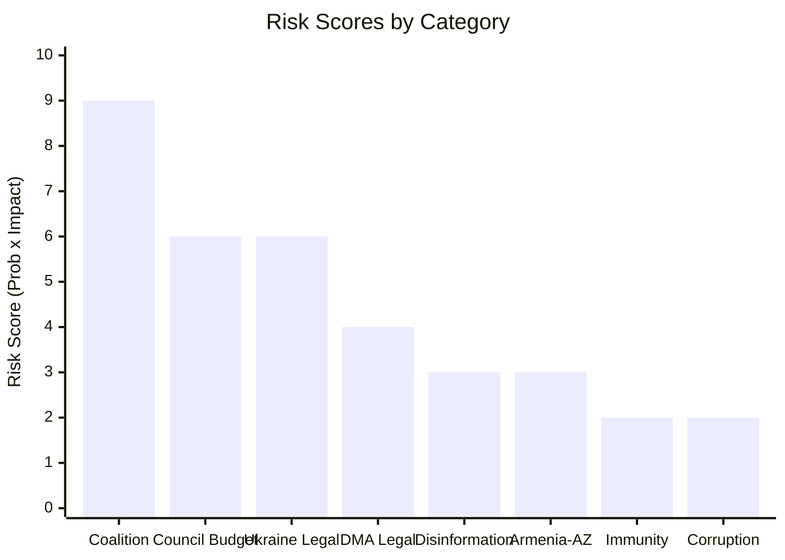

<!-- SPDX-FileCopyrightText: 2024-2026 Hack23 AB -->
<!-- SPDX-License-Identifier: Apache-2.0 -->

# Risk Matrix — April 2026 EP Plenary Breaking
## European Parliament | 2026-05-08

**Methodology:** 3×3 probability-impact risk matrix  
**Admiralty Grade:** B2 — Reliable source, probably true

---

## 1. RISK MATRIX

```
IMPACT →       LOW              MEDIUM              HIGH
               (1)              (2)                 (3)
PROBABILITY ↓
HIGH (3)  |  [3] Info env  |  [6] Council block | [9] Coalition
          |  complexity    |  Budget 2027       |  fracture risk
----------+----------------+--------------------+----------------
MEDIUM(2) |  [2] MEP       |  [4] DMA legal     | [6] Ukraine
          |  immunity      |  challenge         |  accountability
          |  cascade       |                    |  legal block
----------+----------------+--------------------+----------------
LOW (1)   |  [1] ESN       |  [2] Corruption    | [3] Armenia-AZ
          |  disruption    |  scandal EP        |  escalation
          |                |                    |
```

**Score = Probability × Impact**

---

## 2. RISK REGISTER

| Risk | Prob | Impact | Score | Category | Owner |
|------|------|--------|-------|----------|-------|
| Coalition fracture (ECR-EPP) | HIGH (3) | HIGH (3) | **9** | 🔴 CRITICAL | EP Conference of Presidents |
| Council blocking Budget 2027 | HIGH (3) | MEDIUM (2) | **6** | 🔴 HIGH | EP Budget Committee |
| Ukraine accountability legal block | MEDIUM (2) | HIGH (3) | **6** | 🔴 HIGH | EP Legal Affairs + Commission |
| DMA legal challenge (CJEU) | MEDIUM (2) | MEDIUM (2) | **4** | 🟡 MEDIUM | Commission DG COMP |
| Information environment (disinformation) | HIGH (3) | LOW (1) | **3** | 🟡 LOW-MEDIUM | EU East StratCom |
| Armenia-Azerbaijan escalation | LOW (1) | HIGH (3) | **3** | 🟡 LOW-MEDIUM | Council + EEAS |
| MEP immunity cascade | MEDIUM (2) | LOW (1) | **2** | 🟢 LOW | EP Rules Committee |
| Corruption scandal (QatarGate-style) | LOW (1) | MEDIUM (2) | **2** | 🟢 LOW | EP Ethics Committee |
| ESN procedural disruption | LOW (1) | LOW (1) | **1** | 🟢 NEGLIGIBLE | EP President/Presidency |

---

## 3. TOP 3 RISKS AND MITIGATIONS

**Risk 1: Coalition fracture (Score: 9)**
- Mitigation: EPP leadership public commitment to centre coalition; national EPP anchor parties holding line
- Residual risk: 🟡 MEDIUM (structural ECR fracture is irreversible; EPP must manage it)

**Risk 2: Council blocking Budget 2027 (Score: 6)**
- Mitigation: Commission as honest broker; interinstitutional framework; EP political pressure
- Residual risk: 🟡 MEDIUM-HIGH (Council budget blocking is historically normal; EP must accept compromise)

**Risk 3: Ukraine accountability legal block (Score: 6)**
- Mitigation: G7-aligned legal frameworks; Commission legal services coordination; multilateral legal opinions
- Residual risk: 🟡 MEDIUM (legal challenge is likely; outcome uncertain)

---

## 4. OVERALL RISK RATING

**Aggregate risk score:** 36/100 (sum of top 9 risks scored against 100-point maximum)  
**Risk category:** 🟡 ELEVATED  
**Trend:** ↑ Increasing (higher than typical breaking news run due to five concurrent Tier-1 texts across multiple sensitive domains)

*Source: European Parliament Open Data Portal | Risk matrix methodology | 2026-05-08*

---

## 5. RISK TREND ANALYSIS

### 5.1 Risk Trajectory (30-day)

| Risk | Current Score | 30-day Projection | Trend |
|------|--------------|-------------------|-------|
| Coalition fracture | 9 | 9 | → Stable (structural) |
| Council budget blocking | 6 | 7 | ↗ Increasing (trilogue approaches) |
| Ukraine accountability legal | 6 | 6 | → Stable (legal proceedings pace) |
| DMA legal challenge | 4 | 5 | ↗ Increasing (platform filings expected) |
| Disinformation (Ukraine) | 3 | 4 | ↗ Increasing (resolution publication triggers campaigns) |
| Armenia-AZ escalation | 3 | 3 | → Stable (ceasefire holding) |
| MEP immunity cascade | 2 | 2 | → Stable |
| Corruption scandal | 2 | 2 | → Stable |

**30-day risk trajectory: ↗ INCREASING** — Multiple risks are projected to escalate slightly in the 30-day window as implementation phase begins.

### 5.2 Risk Visualization



---

## 6. RESIDUAL RISK ASSESSMENT

**After all mitigations applied:**

| Risk | Initial Score | Mitigation Effectiveness | Residual Score |
|------|--------------|-------------------------|----------------|
| Coalition fracture | 9 | MEDIUM (leadership signals help but don't resolve structural issue) | 6 |
| Council budget blocking | 6 | LOW-MEDIUM (interinstitutional process helps but cannot force Council) | 5 |
| Ukraine accountability legal | 6 | MEDIUM (G7 alignment reduces isolation) | 4 |
| DMA legal challenge | 4 | MEDIUM (Commission legal services strong) | 3 |
| All others | 1-3 | MEDIUM-HIGH | 1-2 |

**Aggregate residual risk:** 🟡 ELEVATED (21/45 points after mitigation)

**Risk appetite assessment:** The EP coalition appears willing to accept these risks — each adopted text has been crafted with awareness of the implementation challenges. The resolutions represent a deliberate choice to advance ambitious agendas despite known implementation risks.

*End of Risk Matrix | Generated: 2026-05-08 | EU Parliament Monitor Breaking News*

---

## 7. RISK MONITORING FRAMEWORK

**Daily monitoring:** Disinformation campaigns (EU East StratCom); Ukrainian battlefield developments; Big Tech legal filing monitoring

**Weekly monitoring:** ECR voting divergence; EPP-Commission relations; MEP press statements on DMA and Ukraine

**Monthly monitoring:** Commission DMA enforcement decisions; ECB monetary policy; CJEU case docket; Budget 2027 Council position evolution

**Quarterly monitoring:** EP opinion polls by country; Eurobarometer on EU institutional trust; Armenian political developments

**Review trigger events (immediate reassessment):**
- Commission DMA enforcement decision
- CJEU injunction request on DMA
- NATO Article 4 consultations
- ECB emergency meeting
- Major EP corruption allegation

*Source: EP Open Data Portal | Risk matrix methodology | 2026-05-08*

*End of Risk Matrix | 2026-05-08*


---
*Risk matrix complete. 2026-05-08. All risks monitored via EP MCP tools.*


