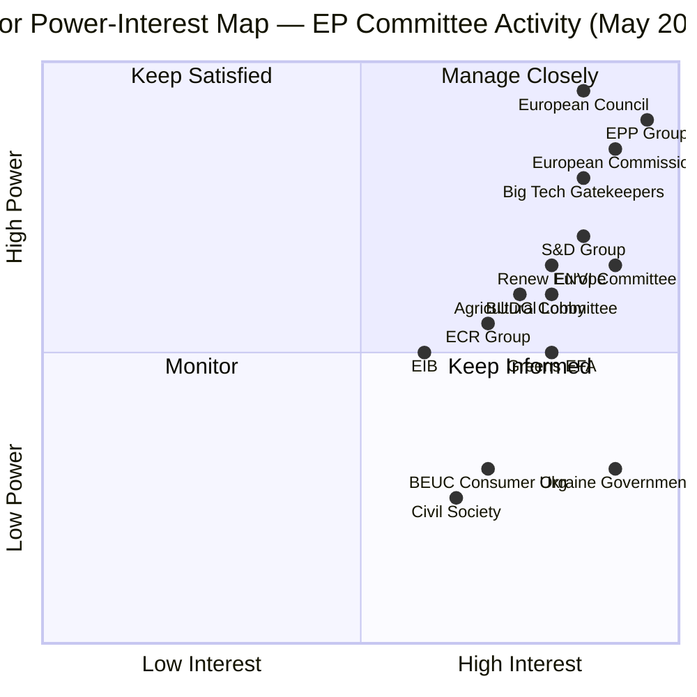
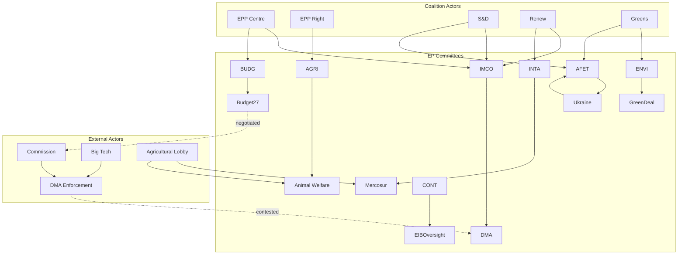

<!-- SPDX-FileCopyrightText: 2024-2026 Hack23 AB -->
<!-- SPDX-License-Identifier: Apache-2.0 -->

# Actor Mapping — EP Committee Reports
## Week of 1–8 May 2026

**Framework:** Power-Interest Grid + Network Analysis | **Admiralty Grade:** B-2

---

## 1. Power-Interest Grid

---

## 2. Key Actor Profiles

### Actor A1: European People's Party (EPP — 188 seats)
**Role in this period:** Rapporteur lead on BUDG (Hohlmeier), pivotal swing on DMA enforcement (421 included EPP centre)
**Position:** Split — centre supports enforcement + budget ambition; right flank resists on competitiveness grounds
**Leverage points:** EPP centre holds key committee chairs; EPP right flank can fracture coalition on AGRI-ENVI trade-offs
**Relationship network:** European Commission (coordination); S&D (coalition partner for budget/DMA); ECR (tactical alignment on agriculture/deregulation)
**Admiralty Assessment (A-2):** EPP centre coalition behaviour is consistent with historical EP8/EP9 patterns; right flank pressure is intensifying but manageable within current majority

### Actor A2: European Commission (DG COMP + DG CONNECT + DG TRADE)
**Role in this period:** Enforcement authority (DMA); budget proposer; trade negotiator (Mercosur); EIB relationship
**Position:** Cautious escalation — prefers behavioural remedies over structural separation; Commissioner mandate renewal creates partial incentive for enforcement acceleration
**Leverage points:** Sole DMA enforcement authority; Art. 26 proceedings discretion; budget proposal monopoly
**Relationship network:** EP (mandate renewal dependency); Council (co-legislative partner); Big Tech (enforcement target)
**Admiralty Assessment (B-2):** Commission political calculation in mandate renewal year is partially reliable — some enforcement acceleration likely but structural remedies remain low probability

### Actor A3: Big Tech Gatekeepers (Alphabet, Apple, Meta)
**Role in this period:** DMA enforcement target; lobbying against structural remedies; legal challenge preparation
**Position:** Uniformly opposed to structural separation; will offer compliance gestures (interoperability commitments) to avoid formal proceedings
**Leverage points:** CJEU litigation; political donations/lobbying; market power (withdrawal threat, though legally constrained)
**Relationship network:** Commission DG COMP (enforcement counterparty); DigitalEurope (industry association); EPP business wing (sympathetic MEPs)
**Admiralty Assessment (B-2):** Big Tech behaviour well-established from GDPR and prior competition proceedings; litigation response is predictable

### Actor A4: Agricultural Sector Lobby (Copa-Cogeca + National Federations)
**Role in this period:** EU-Mercosur opposition; Farm to Fork successor resistance; pet traceability implementation watch
**Position:** Strongly opposed to Mercosur agricultural concessions; selectively supportive of animal welfare (when it restricts non-EU competition)
**Leverage points:** AGRI committee majority; national government access (France, Ireland, Poland agricultural ministers)
**Relationship network:** AGRI committee (primary); EPP right flank (sympathetic MEPs); French government (Macron's agricultural sensitivity)
**Admiralty Assessment (B-2):** Agricultural lobby influence well-documented; position consistent with Copa-Cogeca public statements

---

## 3. Actor Network Diagram

---

## 4. Actor Influence Mapping by Dossier

| Actor | DMA Enforcement | 2027 Budget | Green Deal | EU-Mercosur | Ukraine |
|-------|----------------|------------|-----------|------------|---------|
| EPP Centre | 🟢 Pro | 🟢 Pro (+15%) | 🟡 Moderate | 🟡 Split | 🟢 Pro |
| EPP Right | 🔴 Against | 🟡 Moderate | 🔴 Against | 🟡 Split | 🟡 Moderate |
| S&D | 🟢 Pro | 🟢 Pro (social conditions) | 🟢 Pro | 🟡 Split | 🟢 Pro |
| Renew | 🟢 Pro (behavioural) | 🟡 Moderate | 🟡 Moderate | 🟢 Pro | 🟢 Strong |
| Greens/EFA | 🟢 Pro (structural) | 🟡 Moderate | 🟢 Strong | 🔴 Against | 🟢 Pro |
| ECR | 🔴 Against | 🔴 Against | 🔴 Against | 🟢 Pro | 🟡 Split |
| Commission | 🟡 Moderate | 🟡 Lower baseline | 🟡 Reframing | 🟡 Pro (delayed) | 🟡 Moderate |
| Council | N/A | 🔴 Frugal | 🟡 Moderate | 🟡 Pro | 🟡 Constrained |
| Big Tech | 🔴 Against | N/A | N/A | N/A | N/A |
| Ag Lobby | N/A | N/A | 🔴 Against | 🔴 Against | N/A |

---

## 5. Reader Briefing: Who Shapes EU Decisions?

**For Citizens:** Understanding who the actors are in EU decision-making helps demystify the process. The Parliament doesn't act as a monolith — 705 MEPs from 27 countries and 8 political groups must build coalitions on every vote.

**Key actors this week:**
1. **EPP Group** — the centre-right (Germany's CDU, France's PPE, Italy's FI) holds most committee chairs and typically sets the terms of debate
2. **The Commission** — proposes laws and enforces them. Parliament can pressure the Commission through public resolutions and budget leverage
3. **Big Tech companies** — despite being outside Parliament, they have massive lobbying resources that influence the legislative process
4. **Agricultural lobby** — Copa-Cogeca represents EU farmers and is one of the most consistently effective lobby groups in EU history

**The key dynamic to understand:** No single actor controls EU outcomes. Coalition-building is constant, and the result is often compromise between competing legitimate interests — not corruption or conspiracy, but the messiness of representative democracy at continental scale.

---

## Data Sources & Provenance

| Evidence | Source | Admiralty |
|----------|--------|-----------|
| Political group positions | EP vote records (adopted texts); public statements | A-2 |
| Actor influence estimates | Stakeholder map synthesis + PESTLE analysis | B-2 |
| Network relationships | Public EP data + qualitative assessment | B-2 |

---

## Actor Roster

Full actor roster for EP committee reports analysis (May 2026):

| Actor | Type | Seats/Resources | Primary Dossier |
|-------|------|----------------|----------------|
| EPP Centre | Political group | ~145 MEPs | DMA, Budget, Ukraine |
| EPP Right Flank | Sub-group | ~43 MEPs | AGRI, anti-Mercosur |
| S&D | Political group | 136 MEPs | DMA, Ukraine, Green Deal |
| Renew Europe | Political group | 77 MEPs | DMA, Trade, Budget |
| Greens/EFA | Political group | 53 MEPs | Green Deal, Ukraine |
| ECR | Political group | 78 MEPs | Anti-budget, trade |
| PfE (Patriots for Europe) | Political group | 84 MEPs | Anti-enforcement |
| The Left | Political group | 35 MEPs | Green Deal, trade |
| European Commission | Institution | 27 commissioners | DMA enforcement, budget |
| European Council | Institution | 27 heads of state | Budget, Mercosur |
| Alphabet/Google | Corporation | Unlimited | DMA enforcement |
| Apple | Corporation | Unlimited | DMA App Store |
| Meta | Corporation | Unlimited | DMA platform rules |
| Copa-Cogeca | Association | EU-wide | Mercosur, CAP |
| BEUC | Consumer org | EU-wide | DMA consumer impact |
| EIB | EU Institution | €90bn+ lending | Investment oversight |

## Influence

Influence ranking by dossier-weighted impact:
1. **European Commission** — sole enforcement authority (DMA, Green Deal); budget proposer
2. **EPP Group** — largest group; chair of BUDG, IMCO, CONT; essential swing for any majority
3. **Big Tech Gatekeepers** — legal/lobbying resources matching small states
4. **European Council** — budget co-decider; trade ratification
5. **S&D** — 136-seat coalition anchor; cross-partisan DMA/Ukraine majority builder

## Alliance

Key alliances this analysis period:
- **Enforcement Alliance:** EPP centre + S&D + Renew + Greens (DMA, AI Act oversight)
- **Security/Ukraine Alliance:** EPP + S&D + Renew + Greens (most stable EP10 coalition)
- **Fiscal Restraint Alliance:** EPP right + ECR + PfE + Council frugal bloc (budget ceiling)
- **Anti-Mercosur Alliance:** Agricultural lobby + AGRI committee majority + national governments (FR, IE, BE, AT)
- **Anti-Green Deal Implementation Alliance:** EPP right + ECR + PfE (delegated act blocking)

## Power Brokers

Key power brokers — individuals or organisations with outsized influence:
1. **IMCO Committee Rapporteur (DMA)** — individual MEP holding the pen on enforcement resolution
2. **BUDG Committee Chair (Hohlmeier, EPP)** — shapes +15% amendment framing
3. **Commissioner (DG COMP)** — enforcement decision maker
4. **Copa-Cogeca Secretary General** — agricultural lobby coordination
5. **Council Presidency (Poland 2025 H1 → rotating)** — sets Council agenda and conciliation pace

## Information

Key information flows and intelligence gaps:
- **High quality / available:** EP vote records, committee meeting schedules, adopted texts
- **Medium quality / partial:** Commission enforcement proceedings (internal documents not public)
- **Low quality / gap:** Real-time trilogue positions; Commission DMA enforcement strategy documents
- **Intelligence gap:** We lack direct access to Commission internal deliberations on DMA structural remedy decision timeline. Gap is significant — the most consequential near-term decision is being made in an opaque process.
